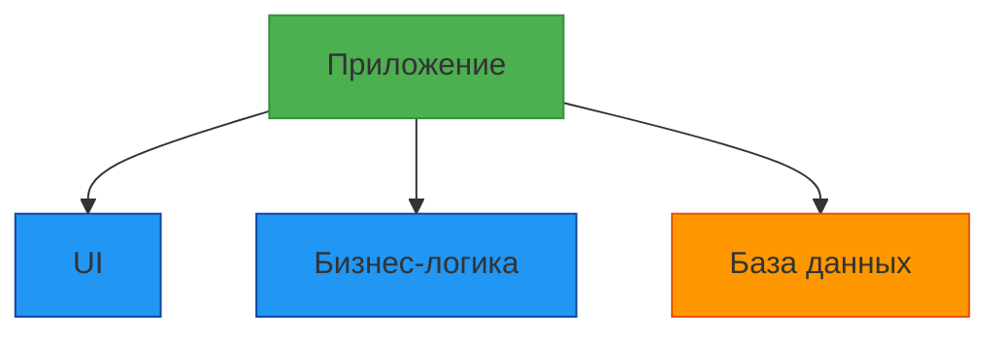
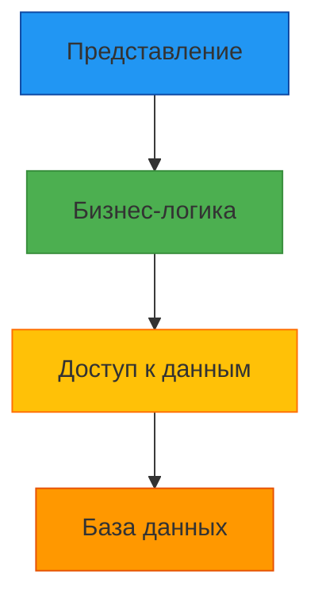
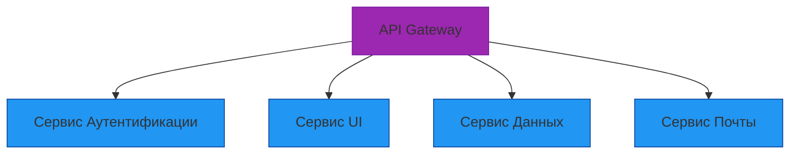

# Лекция 1: Введение в разработку приложений

## Обзор современных подходов к разработке приложений

### План лекции:
1. Жизненный цикл программного обеспечения (SDLC)
2. Архитектурные паттерны
3. Современные подходы к разработке
4. Инструменты разработки

---

## 1. Жизненный цикл программного обеспечения (SDLC)

### Что такое SDLC?

Software Development Life Cycle (SDLC) — это процесс, который определяет этапы и задачи, выполняемые на каждом этапе разработки программного обеспечения. Это структурированный подход к разработке программного обеспечения, который позволяет командам создавать высококачественное программное обеспечение в более короткие сроки.

### Основные этапы SDLC:

1. **Планирование и анализ требований**
   - Определение целей проекта
   - Анализ требований пользователей
   - Исследование возможностей проекта
   - Составление графика и бюджета

2. **Проектирование системы**
   - Проектирование архитектуры приложения
   - Выбор технологий и инструментов
   - Проектирование интерфейсов
   - Планирование тестирования

3. **Разработка**
   - Написание кода
   - Реализация функций
   - Интеграция компонентов

4. **Тестирование**
   - Поиск и устранение ошибок
   - Проверка соответствия требованиям
   - Тестирование производительности

5. **Развертывание**
   - Установка приложения в продакшен
   - Обучение пользователей
   - Поддержка и обслуживание

6. **Сопровождение**
   - Исправление ошибок
   - Обновление функций
   - Оптимизация производительности

---

## 2. Архитектурные паттерны

### Односторонняя архитектура (Monolithic Architecture)

- Вся система представляет собой единое целое
- Все компоненты связаны напрямую
- Простота разработки и деплоя
- Сложности с масштабированием и поддержкой

### Многоуровневая архитектура (Layered Architecture)

- Система разделена на логические уровни
- Каждый уровень имеет определенную ответственность
- Четкое разделение обязанностей

### Микросервисная архитектура

- Приложение разбито на небольшие автономные сервисы
- Каждый сервис решает конкретную бизнес-задачу
- Независимое масштабирование и развертывание
- Использование разных технологий для разных сервисов

---

## 3. Современные подходы к разработке

### Agile-методологии

- Итеративная разработка
- Гибкость и адаптивность
- Постоянное взаимодействие с заказчиком
- Работающие продукты важнее документации

### DevOps

- Интеграция разработки и эксплуатации
- Непрерывная интеграция и доставка (CI/CD)
- Автоматизация процессов
- Мониторинг и обратная связь

### Cloud-Native разработка

- Разработка приложений для облака
- Использование облачных сервисов
- Контейнеризация (Docker)
- Оркестрация (Kubernetes)

---

## 4. Инструменты разработки

### Среды разработки (IDE)

- **PyCharm** - профессиональная среда для Python
- **Visual Studio Code** - легковесный редактор с расширениями
- **Sublime Text** - быстрый и минималистичный редактор

### Системы контроля версий

- **Git** - распределенная система контроля версий
- **GitHub/GitLab** - платформы для хостинга репозиториев

### Сборка и управление зависимостями

- **pip** - менеджер пакетов Python
- **virtualenv** - изолированные окружения
- **requirements.txt** - список зависимостей

### Тестирование

- **unittest** - встроенный фреймворк для тестирования
- **pytest** - расширенный фреймворк для тестирования
- **mock** - инструмент для имитации объектов

---

## Заключение

Современная разработка приложений требует понимания не только языка программирования, но и архитектурных принципов, инструментов и методологий. Важно подходить к разработке комплексно, учитывая весь жизненный цикл приложения.

## Контрольные вопросы:
1. Какие этапы включает в себя SDLC?
2. В чем отличие монолитной и микросервисной архитектуры?
3. Какие преимущества Agile-методологий?
4. Какие инструменты используются для управления зависимостями в Python?
