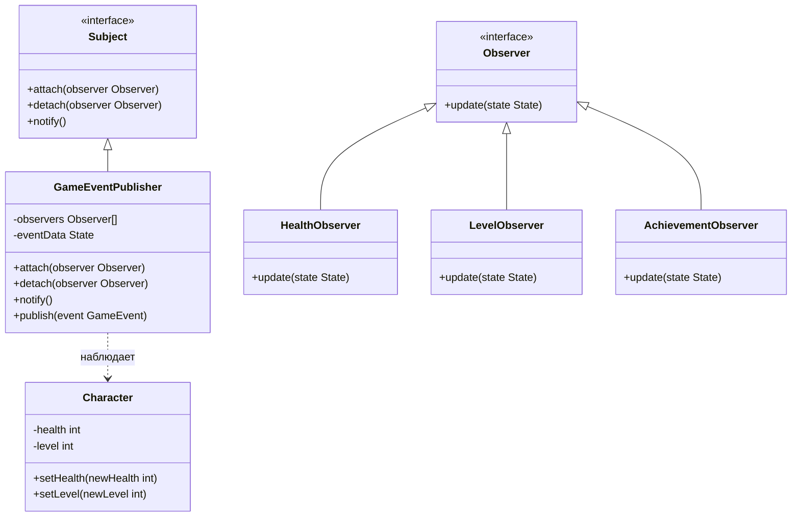
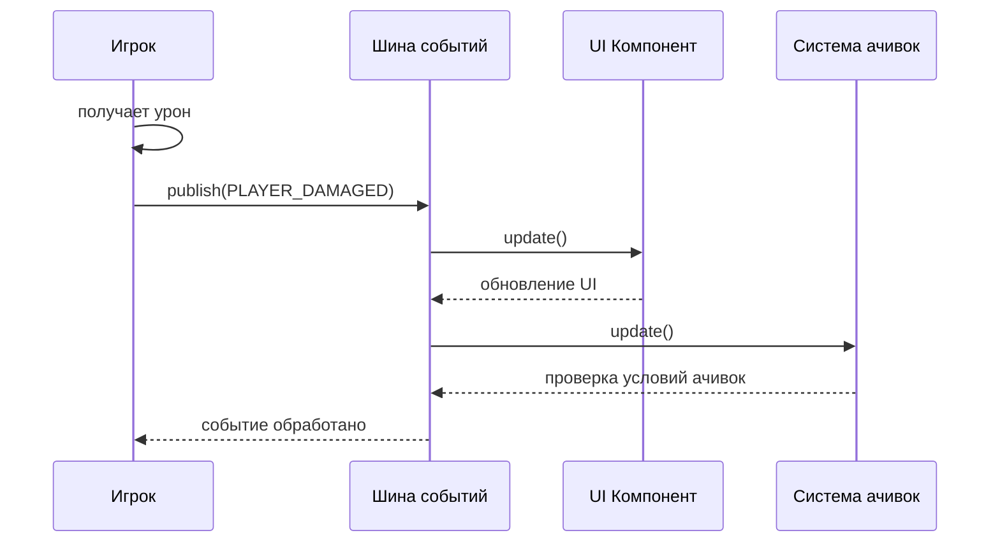
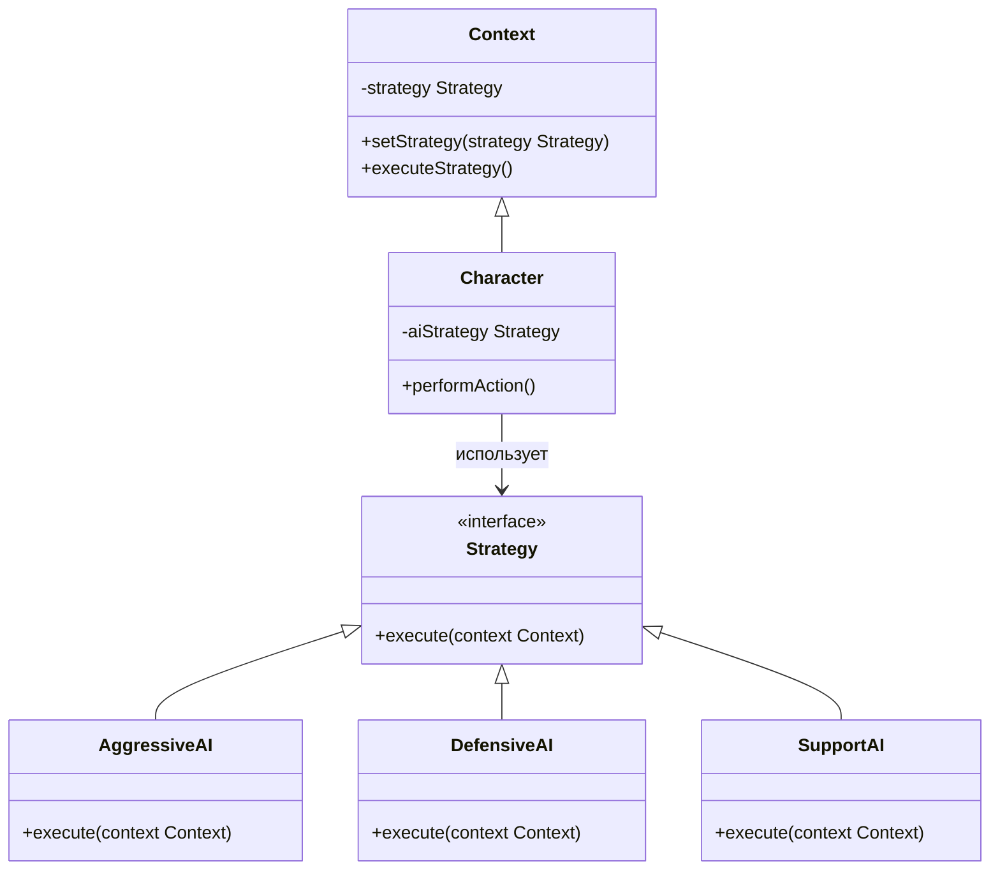
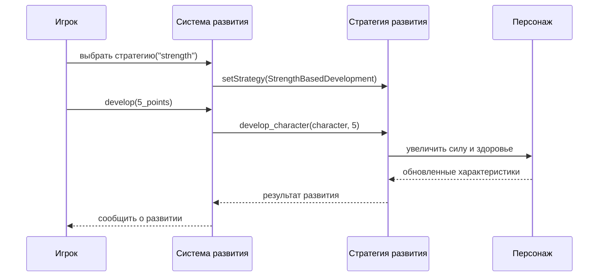
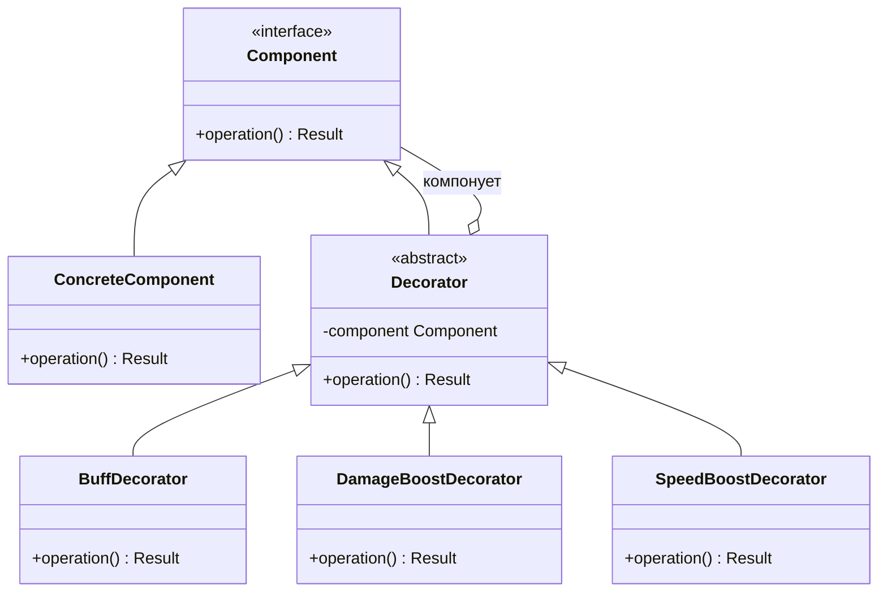
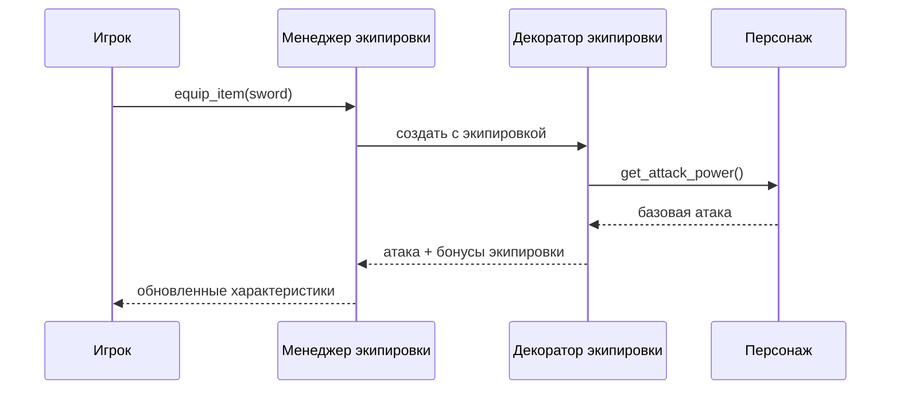
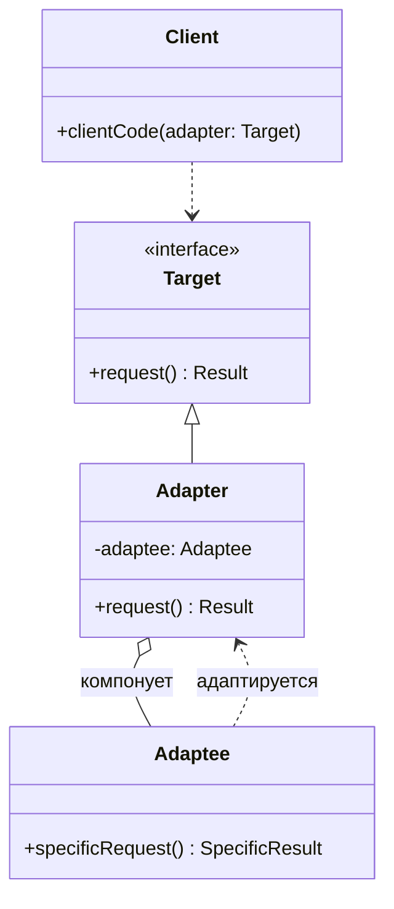
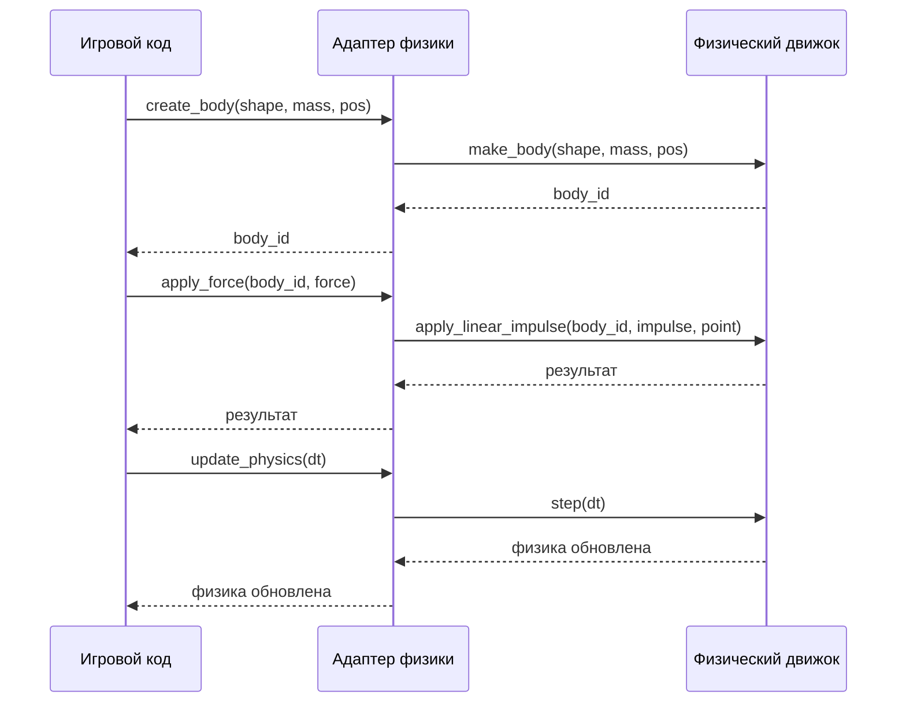
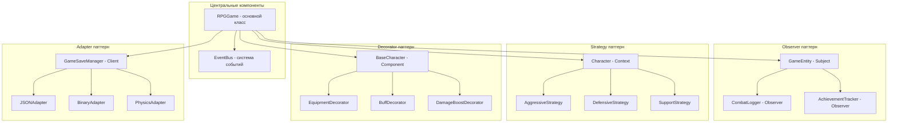

# Лекция 10: ООП - продвинутые паттерны

## Паттерны Observer, Strategy, Decorator, Adapter в контексте разработки игр

### План лекции:
1. Паттерн Observer в игровом контексте
2. Паттерн Strategy в игровом контексте
3. Паттерн Decorator в игровом контексте
4. Паттерн Adapter в игровом контексте
5. Комбинация паттернов в игровой архитектуре
6. Практические примеры на основе игровых персонажей

---

## 1. Паттерн Observer в игровом контексте

### Понятие паттерна Observer в разработке игр

Паттерн Observer определяет зависимость "один ко многим" между объектами, так что при изменении состояния одного объекта все зависящие от него объекты уведомляются и обновляются автоматически. В контексте разработки игр этот паттерн особенно полезен для реализации систем событий, уведомлений, мониторинга состояния персонажей и других взаимодействий между игровыми объектами.

#### Применение Observer в играх:
- Система уведомлений о событиях в игре
- Отслеживание изменений в состоянии персонажа (здоровье, уровень, инвентарь)
- Система квестов и достижений
- Мониторинг боевых событий (урон, лечение, смерть)
- Система ачивок и статистики



```python
from abc import ABC, abstractmethod
from typing import List

class Observer(ABC):
    """Абстрактный класс наблюдателя"""
    @abstractmethod
    def update(self, subject, event_type: str, data: dict = None):
        """Метод обновления при уведомлении от субъекта"""
        pass

class Subject(ABC):
    """Абстрактный класс субъекта (объекта наблюдения)"""
    def __init__(self):
        self._observers: List[Observer] = []

    def attach(self, observer: Observer):
        """Добавить наблюдателя"""
        self._observers.append(observer)

    def detach(self, observer: Observer):
        """Удалить наблюдателя"""
        self._observers.remove(observer)

    def notify(self, event_type: str, data: dict = None):
        """Уведомить всех наблюдателей о событии"""
        for observer in self._observers:
            observer.update(self, event_type, data)

class GameCharacter(Subject):
    """Игровой персонаж, за которым могут наблюдать другие объекты"""
    def __init__(self, name: str, health: int = 100, level: int = 1):
        super().__init__()
        self.name = name
        self._health = health
        self._max_health = health
        self._level = level
        self._experience = 0

    @property
    def health(self):
        return self._health

    @health.setter
    def health(self, value: int):
        old_health = self._health
        self._health = max(0, min(self._max_health, value))
        # Уведомляем наблюдателей об изменении здоровья
        self.notify("health_changed", {
            "old_value": old_health, 
            "new_value": self._health,
            "max_value": self._max_health
        })
        # Проверяем, не умер ли персонаж
        if self._health <= 0:
            self.notify("character_died", {"character": self})

    @property
    def level(self):
        return self._level

    @level.setter
    def level(self, value: int):
        old_level = self._level
        self._level = value
        # Уведомляем наблюдателей о повышении уровня
        if self._level > old_level:
            self.notify("level_up", {
                "old_level": old_level,
                "new_level": self._level
            })

    def take_damage(self, damage: int):
        """Получить урон"""
        actual_damage = max(0, damage)
        self.health -= actual_damage
        self.notify("took_damage", {
            "damage_amount": actual_damage,
            "remaining_health": self._health
        })

    def gain_experience(self, exp: int):
        """Получить опыт"""
        self._experience += exp
        self.notify("gained_experience", {
            "exp_gained": exp,
            "total_exp": self._experience
        })
        # Проверяем, не пора ли повысить уровень
        required_exp = self._level * 100  # Упрощенная формула
        if self._experience >= required_exp:
            self.level_up()

    def level_up(self):
        """Повысить уровень персонажа"""
        self._experience = 0  # Сбрасываем опыт при повышении уровня
        self._level += 1
        self._max_health += 20  # Увеличиваем максимальное здоровье
        self.health = self._max_health  # Полностью восстанавливаем здоровье
        self.level = self._level  # Вызываем сеттер для уведомления

class HealthBarUI(Observer):
    """UI-компонент, отображающий здоровье персонажа"""
    def __init__(self, character_name: str):
        self.character_name = character_name

    def update(self, subject, event_type: str, data: dict = None):
        if isinstance(subject, GameCharacter) and event_type == "health_changed":
            print(f"[UI] Здоровье {subject.name}: {data['new_value']}/{data['max_value']}")

class DeathAnnouncer(Observer):
    """Компонент, объявляющий о смерти персонажа"""
    def update(self, subject, event_type: str, data: dict = None):
        if event_type == "character_died":
            character = data["character"]
            print(f"[АННОУНСЕР] {character.name} погибает!")

class ExperienceTracker(Observer):
    """Компонент, отслеживающий получение опыта"""
    def __init__(self):
        self.total_experience = 0

    def update(self, subject, event_type: str, data: dict = None):
        if event_type == "gained_experience":
            exp_gained = data["exp_gained"]
            self.total_experience += exp_gained
            print(f"[ОПЫТ] Получено {exp_gained} опыта. Всего: {self.total_experience}")

class LevelUpNotifier(Observer):
    """Компонент, уведомляющий о повышении уровня"""
    def update(self, subject, event_type: str, data: dict = None):
        if event_type == "level_up":
            if isinstance(subject, GameCharacter):
                print(f"[УРОВЕНЬ] {subject.name} достиг {data['new_level']} уровня!")

class AchievementSystem(Observer):
    """Система достижений, реагирующая на события"""
    def __init__(self):
        self.achievements_unlocked = []
        self.health_low_notified = False

    def update(self, subject, event_type: str, data: dict = None):
        if isinstance(subject, GameCharacter):
            # Проверяем достижение "Выживший" - пережить момент, когда здоровье <= 10%
            if event_type == "health_changed":
                health_percentage = (data['new_value'] / data['max_value']) * 10
                if health_percentage <= 10 and not self.health_low_notified:
                    self.health_low_notified = True
                    print(f"[ДОСТИЖЕНИЕ] '{subject.name}' получил достижение: 'Выживший'!")
                    self.achievements_unlocked.append("Выживший")
            elif event_type == "level_up":
                # Проверяем достижение "Быстрорастущий" - достичь 5 уровня
                if data['new_level'] >= 5:
                    print(f"[ДОСТИЖЕНИЕ] '{subject.name}' получил достижение: 'Быстрорастущий'!")
                    self.achievements_unlocked.append("Быстрорастущий")

# Пример использования Observer в игровом контексте
print("=== Демонстрация паттерна Observer в игровом контексте ===\n")

# Создаем персонажа
hero = GameCharacter("Артур", health=100, level=1)

# Создаем наблюдателей
health_bar = HealthBarUI("Артур")
death_announcer = DeathAnnouncer()
exp_tracker = ExperienceTracker()
level_notifier = LevelUpNotifier()
achievement_system = AchievementSystem()

# Подписываем наблюдателей на персонажа
hero.attach(health_bar)
hero.attach(death_announcer)
hero.attach(exp_tracker)
hero.attach(level_notifier)
hero.attach(achievement_system)

print(f"Создан персонаж: {hero.name}, Здоровье: {hero.health}, Уровень: {hero.level}\n")

# Симуляция игровых событий
print("1. Персонаж получает урон:")
hero.take_damage(30)

print("\n2. Персонаж получает опыт:")
hero.gain_experience(50)

print("\n3. Персонаж получает больше опыта (для повышения уровня):")
hero.gain_experience(70)

print("\n4. Персонаж снова получает урон:")
hero.take_damage(80)

print("\n5. Персонаж получает малое количество здоровья (для проверки достижения):")
hero.take_damage(85)  # Здоровье станет 5, что <= 10% от 100
hero.health = 15  # Восстанавливаем немного здоровья

print("\n6. Персонаж получает много опыта для достижения 5 уровня:")
for i in range(4):  # Повышаем уровень до 5
    hero.gain_experience(100)

print(f"\nИтоговое состояние персонажа: {hero.name}, Здоровье: {hero.health}, Уровень: {hero.level}")
print(f"Разблокированные достижения: {achievement_system.achievements_unlocked}")
```

### Реализация системы событий в игровом движке

В игровых движках паттерн Observer часто реализуется в виде системы событий, которая позволяет различным компонентам реагировать на происходящие в игре события.

```python
from enum import Enum
from typing import Dict, List, Callable
import time

class EventType(Enum):
    """Типы игровых событий"""
    PLAYER_DAMAGED = "player_damaged"
    ENEMY_DEFEATED = "enemy_defeated"
    QUEST_COMPLETED = "quest_completed"
    ITEM_PICKED_UP = "item_picked_up"
    LEVEL_UP = "level_up"
    GAME_STARTED = "game_started"
    GAME_ENDED = "game_ended"

class Event:
    """Класс события"""
    def __init__(self, event_type: EventType, data: dict = None, timestamp: float = None):
        self.type = event_type
        self.data = data or {}
        self.timestamp = timestamp or time.time()

class EventBus:
    """Шина событий - центральный компонент для управления событиями"""
    def __init__(self):
        self._subscribers: Dict[EventType, List[Callable]] = {}
        self._history: List[Event] = []  # История событий для отладки
        self._max_history_size = 100

    def subscribe(self, event_type: EventType, handler: Callable):
        """Подписаться на событие определенного типа"""
        if event_type not in self._subscribers:
            self._subscribers[event_type] = []
        self._subscribers[event_type].append(handler)

    def unsubscribe(self, event_type: EventType, handler: Callable):
        """Отписаться от события определенного типа"""
        if event_type in self._subscribers:
            try:
                self._subscribers[event_type].remove(handler)
            except ValueError:
                pass  # Обработчик не был подписан

    def publish(self, event: Event):
        """Опубликовать событие"""
        # Сохраняем событие в истории
        self._history.append(event)
        if len(self._history) > self._max_history_size:
            self._history.pop(0)

        # Уведомляем подписчиков
        if event.type in self._subscribers:
            for handler in self._subscribers[event.type][:]:  # [:] создает копию списка
                try:
                    handler(event)
                except Exception as e:
                    print(f"Ошибка при обработке события {event.type}: {e}")

    def get_history(self) -> List[Event]:
        """Получить историю событий"""
        return self._history.copy()

class Player:
    """Класс игрока для демонстрации системы событий"""
    def __init__(self, name: str, event_bus: EventBus):
        self.name = name
        self.health = 100
        self.max_health = 100
        self.level = 1
        self.experience = 0
        self.inventory = []
        self.event_bus = event_bus

        # Подписываемся на события
        self.event_bus.subscribe(EventType.ENEMY_DEFEATED, self._on_enemy_defeated)
        self.event_bus.subscribe(EventType.ITEM_PICKED_UP, self._on_item_picked_up)

    def take_damage(self, amount: int):
        """Получить урон"""
        old_health = self.health
        self.health = max(0, self.health - amount)
        print(f"{self.name} получил {amount} урона. Здоровье: {self.health}/{self.max_health}")

        # Публикуем событие получения урона
        self.event_bus.publish(Event(EventType.PLAYER_DAMAGED, {
            "player": self,
            "damage_amount": amount,
            "old_health": old_health,
            "new_health": self.health
        }))

        # Проверяем, не умер ли игрок
        if self.health <= 0:
            print(f"{self.name} погибает!")
            self.event_bus.publish(Event(EventType.GAME_ENDED, {"winner": None}))

    def gain_experience(self, amount: int):
        """Получить опыт"""
        self.experience += amount
        print(f"{self.name} получил {amount} опыта. Всего: {self.experience}")

        # Проверяем, не пора ли повысить уровень
        required_exp = self.level * 100
        if self.experience >= required_exp:
            self.level_up()

    def level_up(self):
        """Повысить уровень"""
        self.level += 1
        self.max_health += 20
        self.health = self.max_health  # Полное восстановление при уровне
        self.experience = 0 # Сброс опыта
        print(f"{self.name} достиг {self.level} уровня!")

        # Публикуем событие повышения уровня
        self.event_bus.publish(Event(EventType.LEVEL_UP, {
            "player": self,
            "new_level": self.level
        }))

    def _on_enemy_defeated(self, event: Event):
        """Обработчик события уничтожения врага"""
        enemy_name = event.data.get("enemy_name", "неизвестный враг")
        exp_gained = event.data.get("exp_reward", 0)
        print(f"{self.name} получает {exp_gained} опыта за победу над {enemy_name}")

    def _on_item_picked_up(self, event: Event):
        """Обработчик события подбора предмета"""
        item_name = event.data.get("item_name", "неизвестный предмет")
        print(f"{self.name} подбирает {item_name}")

class Enemy:
    """Класс врага для демонстрации системы событий"""
    def __init__(self, name: str, health: int, exp_reward: int, event_bus: EventBus):
        self.name = name
        self.health = health
        self.max_health = health
        self.exp_reward = exp_reward
        self.event_bus = event_bus

    def take_damage(self, amount: int, attacker=None):
        """Получить урон"""
        old_health = self.health
        self.health = max(0, self.health - amount)
        print(f"{self.name} получил {amount} урона. Здоровье: {self.health}/{self.max_health}")

        # Проверяем, не убит ли враг
        if self.health <= 0:
            print(f"{self.name} уничтожен!")
            self._on_defeated(attacker)

    def _on_defeated(self, killer=None):
        """Обработчик смерти врага"""
        self.event_bus.publish(Event(EventType.ENEMY_DEFEATED, {
            "enemy_name": self.name,
            "killer": killer,
            "exp_reward": self.exp_reward
        }))

class Quest:
    """Класс квеста для демонстрации системы событий"""
    def __init__(self, name: str, description: str, event_bus: EventBus):
        self.name = name
        self.description = description
        self.completed = False
        self.event_bus = event_bus

        # Подписываемся на события, необходимые для выполнения квеста
        self.event_bus.subscribe(EventType.ENEMY_DEFEATED, self._on_enemy_defeated)

    def _on_enemy_defeated(self, event: Event):
        """Обработчик события уничтожения врага для проверки выполнения квеста"""
        if not self.completed and event.data.get("enemy_name") == "Гоблин":
            self.complete()

    def complete(self):
        """Выполнить квест"""
        self.completed = True
        print(f"Квест '{self.name}' выполнен!")
        self.event_bus.publish(Event(EventType.QUEST_COMPLETED, {
            "quest": self
        }))

# Пример использования системы событий
print("\n=== Демонстрация системы событий в игровом движке ===\n")

# Создаем шину событий
event_bus = EventBus()

# Регистрируем глобальных обработчиков событий
def on_player_damaged(event: Event):
    print(f"[*] Игрок {event.data['player'].name} получил урон!")

def on_level_up(event: Event):
    print(f"[*] Игрок {event.data['player'].name} повысил уровень до {event.data['new_level']}!")

def on_quest_completed(event: Event):
    print(f"[*] Квест '{event.data['quest'].name}' был выполнен!")

# Подписываем обработчики на события
event_bus.subscribe(EventType.PLAYER_DAMAGED, on_player_damaged)
event_bus.subscribe(EventType.LEVEL_UP, on_level_up)
event_bus.subscribe(EventType.QUEST_COMPLETED, on_quest_completed)

# Создаем игрока и врагов
player = Player("Артур", event_bus)
goblin = Enemy("Гоблин", health=30, exp_reward=25, event_bus=event_bus)
orc = Enemy("Орк", health=50, exp_reward=40, event_bus=event_bus)

# Создаем квест
slay_goblin_quest = Quest("Убить гоблина", "Победить гоблина в подземелье", event_bus)

print(f"Игрок: {player.name}, Здоровье: {player.health}, Уровень: {player.level}\n")

# Симуляция боевых действий
print("1. Игрок атакует гоблина:")
goblin.take_damage(30, player)

print("\n2. Игрок получает урон от орка:")
player.take_damage(15)

print("\n3. Игрок атакует орка:")
orc.take_damage(60, player)

print("\n4. Игрок получает дополнительный опыт для повышения уровня:")
player.gain_experience(75)

print(f"\nФинальное состояние игрока: {player.name}, Здоровье: {player.health}, Уровень: {player.level}")

# Показываем историю событий
print(f"\nИстория событий ({len(event_bus.get_history())} событий):")
for i, event in enumerate(event_bus.get_history()[-5:], 1):  # Показываем последние 5 событий
    print(f"  {i}. {event.type.value}: {event.data}")
```

### Теория: Применение Observer в игровой архитектуре

Паттерн Observer особенно важен в архитектуре игр по следующим причинам:

1. **Разделение ответственности**: UI-компоненты могут реагировать на изменения в игровых объектах без прямой зависимости от них.
2. **Расширяемость**: Новые обработчики могут легко добавляться без изменения существующего кода.
3. **Слабая связанность**: Компоненты не зависят напрямую друг от друга, что упрощает тестирование и поддержку.
4. **Реактивность**: Игровая логика может мгновенно реагировать на изменения состояния.

#### Преимущества Observer в играх:
- Централизованное управление событиями
- Возможность создания сложных взаимодействий между компонентами
- Поддержка асинхронных операций (например, сетевые события)
- Упрощение реализации системы ачивок и статистики

#### Недостатки Observer в играх:
- Возможность утечки памяти при неправильном управлении подписками
- Сложность отладки из-за косвенных взаимодействий
- Потенциальные проблемы с производительностью при большом количестве событий

### Диаграмма последовательности для Observer в боевой системе


---

## 2. Паттерн Strategy в игровом контексте

### Понятие паттерна Strategy в разработке игр

Паттерн Strategy позволяет определять семейство алгоритмов, инкапсулировать каждый из них и делать их взаимозаменяемыми. В контексте разработки игр этот паттерн особенно полезен для реализации различных поведений персонажей, систем искусственного интеллекта, механик боя, стратегий развития персонажей и других аспектов, где требуется гибкость и возможность изменения поведения в runtime.

#### Применение Strategy в играх:
- ИИ персонажей (стратегии поведения: агрессивная, осторожная, защитная и т.д.)
- Системы боя (разные стили боя: melee, ranged, magic)
- Алгоритмы передвижения (A*, DFS, BFS и другие)
- Системы развития персонажей (по разным деревьям навыков)
- Системы крафта и улучшения предметов



```python
from abc import ABC, abstractmethod
from enum import Enum
from typing import List, Optional

class CharacterClass(Enum):
    """Классы персонажей"""
    WARRIOR = "Воин"
    MAGE = "Маг"
    ARCHER = "Лучник"
    HEALER = "Целитель"
    ROGUE = "Разбойник"

class BattleStrategy(ABC):
    """Абстрактная стратегия боя"""
    @abstractmethod
    def execute_turn(self, character, enemies: List, allies: List) -> str:
        """Выполнить ход персонажа"""
        pass

class AggressiveBattleStrategy(BattleStrategy):
    """Агрессивная стратегия боя - всегда атакует"""
    def execute_turn(self, character, enemies: List, allies: List) -> str:
        if enemies:
            target = enemies[0]  # Атакуем первого врага
            damage = character.attack_power + character.strength
            target.take_damage(damage)
            return f"{character.name} атакует {target.name} на {damage} урона (агрессивно)"
        return f"{character.name} оглядывается в поисках врагов..."

class DefensiveBattleStrategy(BattleStrategy):
    """Защитная стратегия боя - сосредоточена на выживании"""
    def execute_turn(self, character, enemies: List, allies: List) -> str:
        if character.health < character.max_health * 0.5:
            # Если здоровье меньше половины, лечимся
            heal_amount = min(character.max_health - character.health, 20)
            character.health += heal_amount
            return f"{character.name} восстанавливает {heal_amount} здоровья (оборонительно)"
        elif enemies:
            # Иначе атакуем, но с осторожностью
            target = min(enemies, key=lambda e: e.health)  # Атакуем самого слабого врага
            damage = character.attack_power
            target.take_damage(damage)
            return f"{character.name} атакует {target.name} на {damage} урона (осторожно)"
        return f"{character.name} защищается..."

class SupportBattleStrategy(BattleStrategy):
    """Поддерживающая стратегия боя - помогает союзникам"""
    def execute_turn(self, character, enemies: List, allies: List) -> str:
        # Ищем союзника с минимальным здоровьем
        injured_ally = None
        for ally in allies:
            if ally != character and ally.health < ally.max_health * 0.7:
                if injured_ally is None or ally.health < injured_ally.health:
                    injured_ally = ally

        if injured_ally:
            # Лечим союзника
            heal_amount = min(injured_ally.max_health - injured_ally.health, 25)
            injured_ally.health += heal_amount
            return f"{character.name} лечит {injured_ally.name} на {heal_amount} здоровья (поддержка)"
        elif enemies:
            # Если некого лечить, атакуем
            target = enemies[0]
            damage = character.attack_power // 2 # Половина обычного урона
            target.take_damage(damage)
            return f"{character.name} слабо атакует {target.name} на {damage} урона (фокус на поддержку)"
        return f"{character.name} оценивает ситуацию..."

class Character:
    """Игровой персонаж с возможностью изменения стратегии боя"""
    def __init__(self, name: str, char_class: CharacterClass, health: int = 100):
        self.name = name
        self.char_class = char_class
        self.max_health = health
        self.health = health
        self.attack_power = 10
        self.defense = 5
        self.strength = 15
        self.intelligence = 10
        self.dexterity = 12
        self.level = 1
        self.experience = 0

        # Начальная стратегия боя зависит от класса
        self.battle_strategy = self._get_default_strategy()

    def _get_default_strategy(self) -> BattleStrategy:
        """Получить стратегию по умолчанию для класса персонажа"""
        if self.char_class == CharacterClass.WARRIOR:
            return AggressiveBattleStrategy()
        elif self.char_class == CharacterClass.MAGE:
            return AggressiveBattleStrategy()  # Маги тоже агрессивны в бою
        elif self.char_class == CharacterClass.HEALER:
            return SupportBattleStrategy()
        else:
            return AggressiveBattleStrategy()

    def set_battle_strategy(self, strategy: BattleStrategy):
        """Установить стратегию боя"""
        self.battle_strategy = strategy

    def perform_battle_action(self, enemies: List, allies: List) -> str:
        """Выполнить боевое действие в соответствии со стратегией"""
        return self.battle_strategy.execute_turn(self, enemies, allies)

    def take_damage(self, damage: int):
        """Получить урон с учетом защиты"""
        actual_damage = max(1, damage - self.defense)
        self.health = max(0, self.health - actual_damage)
        return actual_damage

    def is_alive(self) -> bool:
        """Проверить, жив ли персонаж"""
        return self.health > 0

    def gain_experience(self, exp: int):
        """Получить опыт и возможно повысить уровень"""
        self.experience += exp
        required_exp = self.level * 100
        if self.experience >= required_exp:
            self.level_up()

    def level_up(self):
        """Повысить уровень персонажа"""
        self.level += 1
        self.max_health += 20
        self.health = self.max_health
        self.attack_power += 3
        self.defense += 2
        self.strength += 2
        self.experience = 0
        print(f"{self.name} достиг {self.level} уровня!")

    def __str__(self):
        return f"{self.name} ({self.char_class.value}): Уровень {self.level}, Здоровье {self.health}/{self.max_health}"

class Enemy:
    """Класс врага для демонстрации"""
    def __init__(self, name: str, health: int, attack_power: int):
        self.name = name
        self.health = health
        self.max_health = health
        self.attack_power = attack_power

    def take_damage(self, damage: int):
        """Получить урон"""
        self.health = max(0, self.health - damage)

    def is_alive(self) -> bool:
        """Проверить, жив ли враг"""
        return self.health > 0

class BattleSystem:
    """Система боя для демонстрации стратегий"""
    def __init__(self):
        self.turn = 0

    def battle_round(self, party: List[Character], enemies: List[Enemy]):
        """Выполнить раунд боя"""
        print(f"\n--- Раунд {self.turn + 1} ---")
        self.turn += 1

        # Ход союзников
        for character in party:
            if character.is_alive() and any(e.is_alive() for e in enemies):
                action_result = character.perform_battle_action(
                    [e for e in enemies if e.is_alive()],  # Живые враги
                    [c for c in party if c.is_alive()]    # Живые союзники
                )
                print(action_result)

        # Ход врагов (упрощенно)
        for enemy in enemies:
            if enemy.is_alive() and any(c.is_alive() for c in party):
                # Враг атакует случайного живого персонажа
                alive_characters = [c for c in party if c.is_alive()]
                if alive_characters:
                    target = alive_characters[0]  # Упрощенно - атакуем первого
                    damage = enemy.attack_power
                    actual_damage = target.take_damage(damage)
                    print(f"{enemy.name} атакует {target.name} на {actual_damage} урона")

        # Выводим текущее состояние
        print("\nСостояние после раунда:")
        for character in party:
            if character.is_alive():
                print(f"  {character}")
        for enemy in enemies:
            if enemy.is_alive():
                print(f"  {enemy.name}: {enemy.health}/{enemy.max_health} здоровья")

    def is_battle_over(self, party: List[Character], enemies: List[Enemy]) -> bool:
        """Проверить, закончилась ли битва"""
        party_alive = any(c.is_alive() for c in party)
        enemies_alive = any(e.is_alive() for e in enemies)
        return not party_alive or not enemies_alive

    def get_battle_result(self, party: List[Character], enemies: List[Enemy]) -> str:
        """Получить результат битвы"""
        party_alive = any(c.is_alive() for c in party)
        enemies_alive = any(e.is_alive() for e in enemies)
        if party_alive and not enemies_alive:
            return "Победа!"
        elif not party_alive and enemies_alive:
            return "Поражение!"
        else:
            return "Ничья!"

# Пример использования паттерна Strategy в боевой системе
print("=== Демонстрация паттерна Strategy в игровом контексте ===\n")

# Создаем персонажей
warrior = Character("Конан", CharacterClass.WARRIOR, health=150)
mage = Character("Мерлин", CharacterClass.MAGE, health=80)
healer = Character("Эльза", CharacterClass.HEALER, health=90)

party = [warrior, mage, healer]

# Создаем врагов
goblins = [Enemy("Гоблин 1", 40, 8), Enemy("Гоблин 2", 40, 8)]

# Создаем боевую систему
battle_system = BattleSystem()

print("Начальное состояние:")
for character in party:
    print(f"  {character}")

print(f"\nВраги: {len(goblins)} гоблинов по 40 здоровья")

# Проводим несколько раундов боя с разными стратегиями
print("\n1. Бой с начальными стратегиями:")

# Покажем текущие стратегии
print(f" {warrior.name} использует агрессивную стратегию (по умолчанию для воина)")
print(f"  {mage.name} использует агрессивную стратегию (по умолчанию для мага)")
print(f"  {healer.name} использует поддерживающую стратегию (по умолчанию для целителя)")

for round_num in range(3):
    battle_system.battle_round(party, goblins)
    if battle_system.is_battle_over(party, goblins):
        break

# Меняем стратегии для следующей фазы боя
print(f"\n2. Меняем стратегии и продолжаем бой:")
warrior.set_battle_strategy(DefensiveBattleStrategy())  # Воин становится осторожным
mage.set_battle_strategy(AggressiveBattleStrategy())   # Маг остается агрессивным
healer.set_battle_strategy(SupportBattleStrategy())    # Целитель продолжает поддерживать

print(f"  {warrior.name} теперь использует защитную стратегию")
print(f"  {mage.name} продолжает использовать агрессивную стратегию")
print(f"  {healer.name} продолжает использовать поддерживающую стратегию")

# Продолжаем бой
while not battle_system.is_battle_over(party, goblins) and battle_system.turn < 6:
    battle_system.battle_round(party, goblins)

# Выводим результат
print(f"\nРезультат битвы: {battle_system.get_battle_result(party, goblins)}")
print("\nФинальное состояние персонажей:")
for character in party:
    if character.is_alive():
        print(f"  {character}")

# Раздаем опыт выжившим персонажам
if battle_system.get_battle_result(party, goblins) == "Победа!":
    for character in party:
        if character.is_alive():
            character.gain_experience(50)
            print(f"  {character.name} получает 50 опыта")
```

### Примеры стратегий ИИ врагов

В играх часто используются разные стратегии поведения для врагов, что делает их более интересными и непредсказуемыми для игроков. Рассмотрим несколько примеров стратегий ИИ врагов с использованием паттерна Strategy.

```python
class AIBehaviorStrategy(ABC):
    """Абстрактная стратегия поведения ИИ"""
    @abstractmethod
    def execute_behavior(self, enemy, player, allies: List, environment: dict) -> str:
        """Выполнить действие ИИ"""
        pass

class AggressiveAI(AIBehaviorStrategy):
    """Агрессивный ИИ - постоянно преследует и атакует"""
    def execute_behavior(self, enemy, player, allies: List, environment: dict) -> str:
        if player and player.is_alive():
            distance = environment.get("distance_to_player", 10)  # Упрощенно
            if distance <= 3:  # В пределах атаки
                damage = enemy.attack_power
                actual_damage = player.take_damage(damage)
                return f"{enemy.name} атакует {player.name} на {actual_damage} урона (агрессивно)"
            else:
                return f"{enemy.name} преследует {player.name} (агрессивно)"
        return f"{enemy.name} оглядывается в поисках цели..."

class DefensiveAI(AIBehaviorStrategy):
    """Оборонительный ИИ - защищается и контратакует"""
    def execute_behavior(self, enemy, player, allies: List, environment: dict) -> str:
        if player and player.is_alive():
            distance = environment.get("distance_to_player", 10)
            if enemy.health < enemy.max_health * 0.3 and distance > 5:
                # Если здоровье мало и игрок далеко, отступаем
                return f"{enemy.name} отступает (защитно)"
            elif distance <= 3:  # В пределах атаки
                damage = enemy.attack_power
                actual_damage = player.take_damage(damage)
                return f"{enemy.name} контратакует {player.name} на {actual_damage} урона (оборонительно)"
        return f"{enemy.name} защищает позицию..."

class TacticalAI(AIBehaviorStrategy):
    """Тактический ИИ - использует окружающую среду и союзников"""
    def execute_behavior(self, enemy, player, allies: List, environment: dict) -> str:
        if player and player.is_alive():
            # Проверяем, есть ли союзники рядом
            nearby_allies = [a for a in allies if a.is_alive() and a != enemy]
            distance = environment.get("distance_to_player", 10)
            
            if nearby_allies and distance <= 3:
                # Координируем атаку с союзниками
                return f"{enemy.name} координирует атаку с союзниками против {player.name} (тактически)"
            elif distance <= 3:
                # Атакуем в одиночку
                damage = enemy.attack_power
                actual_damage = player.take_damage(damage)
                return f"{enemy.name} атакует {player.name} на {actual_damage} урона (тактически)"
        return f"{enemy.name} оценивает тактическую обстановку..."

class AmbushAI(AIBehaviorStrategy):
    """Засадный ИИ - нападает из засады"""
    def __init__(self):
        self.waiting = True

    def execute_behavior(self, enemy, player, allies: List, environment: dict) -> str:
        if player and player.is_alive():
            distance = environment.get("distance_to_player", 10)
            cover_available = environment.get("cover_available", False)
            
            if self.waiting and distance <= 2 and cover_available:
                # Выходим из засады и атакуем
                self.waiting = False
                damage = enemy.attack_power * 1.5  # Бонус за засаду
                actual_damage = player.take_damage(int(damage))
                return f"{enemy.name} выходит из засады и атакует {player.name} на {actual_damage} урона! (из засады)"
            elif not self.waiting:
                # После засады ведем обычный бой
                if distance <= 3:
                    damage = enemy.attack_power
                    actual_damage = player.take_damage(damage)
                    return f"{enemy.name} продолжает атаку {player.name} на {actual_damage} урона"
        return f"{enemy.name} прячется в засаде..." if self.waiting else f"{enemy.name} преследует цель..."

class EnemyWithAI(Character):
    """Враг с возможностью смены стратегии ИИ"""
    def __init__(self, name: str, health: int, attack_power: int, ai_strategy: AIBehaviorStrategy = None):
        # Используем Character как базовый класс, но переопределяем для врага
        super().__init__(name, CharacterClass.ROGUE, health)  # Используем ROGUE как врага
        self.attack_power = attack_power
        self.ai_strategy = ai_strategy or AggressiveAI()

    def set_ai_strategy(self, strategy: AIBehaviorStrategy):
        """Установить стратегию ИИ"""
        self.ai_strategy = strategy

    def perform_action(self, player, allies: List, environment: dict) -> str:
        """Выполнить действие в соответствии со стратегией ИИ"""
        return self.ai_strategy.execute_behavior(self, player, allies, environment)

class PlayerForAI(Character):
    """Класс игрока для демонстрации ИИ врагов"""
    def __init__(self, name: str, health: int = 100):
        super().__init__(name, CharacterClass.WARRIOR, health)

    def take_damage(self, damage: int):
        """Переопределяем для возвращения actual_damage"""
        actual_damage = max(1, damage - self.defense)
        self.health = max(0, self.health - actual_damage)
        return actual_damage

# Пример использования стратегий ИИ врагов
print("\n=== Демонстрация стратегий ИИ врагов ===\n")

# Создаем игрока
player = PlayerForAI("Артур", health=120)

# Создаем врагов с разными стратегиями ИИ
aggressive_orc = EnemyWithAI("Агрессивный Орк", health=80, attack_power=15, ai_strategy=AggressiveAI())
defensive_goblin = EnemyWithAI("Оборонительный Гоблин", health=50, attack_power=10, ai_strategy=DefensiveAI())
tactical_skeleton = EnemyWithAI("Тактический Скелет", health=60, attack_power=12, ai_strategy=TacticalAI())
ambush_spider = EnemyWithAI("Паук-засадник", health=40, attack_power=20, ai_strategy=AmbushAI())

enemies = [aggressive_orc, defensive_goblin, tactical_skeleton, ambush_spider]

print(f"Игрок: {player.name}, Здоровье: {player.health}/{player.max_health}")
print("Враги:")
for enemy in enemies:
    print(f"  {enemy.name} (Здоровье: {enemy.health}/{enemy.max_health}, Атака: {enemy.attack_power})")

# Симуляция боевой ситуации с разными условиями окружения
environment_conditions = {
    "distance_to_player": 5,  # На старте все враги на расстоянии
    "cover_available": True   # Есть укрытия для засады
}

print(f"\n--- Ситуация 1: Все враги на расстоянии ---")
for enemy in enemies:
    action = enemy.perform_action(player, enemies, environment_conditions)
    print(f"  {action}")

# Изменим условия - игрок приближается
environment_conditions["distance_to_player"] = 2

print(f"\n--- Ситуация 2: Игрок приближается (дистанция: {environment_conditions['distance_to_player']}) ---")
for enemy in enemies:
    action = enemy.perform_action(player, enemies, environment_conditions)
    print(f"  {action}")

# Еще больше приблизим игрока
environment_conditions["distance_to_player"] = 1

print(f"\n--- Ситуация 3: Игрок очень близко (дистанция: {environment_conditions['distance_to_player']}) ---")
for enemy in enemies:
    action = enemy.perform_action(player, enemies, environment_conditions)
    print(f"  {action}")

print(f"\nСостояние игрока после атак: {player.name} - {player.health}/{player.max_health} здоровья")
```

### Пример: Система развития персонажа с разными стратегиями

```python
class CharacterDevelopmentStrategy(ABC):
    """Абстрактная стратегия развития персонажа"""
    @abstractmethod
    def develop_character(self, character: Character, points: int) -> str:
        """Развить персонажа с использованием очков развития"""
        pass

class StrengthBasedDevelopment(CharacterDevelopmentStrategy):
    """Развитие по силе - для воинов и бойцов"""
    def develop_character(self, character: Character, points: int) -> str:
        strength_gain = points * 2
        health_gain = points * 5
        attack_gain = points * 1.5

        character.strength += strength_gain
        character.max_health += health_gain
        character.health += health_gain # Восстанавливаем здоровье
        character.attack_power += attack_gain

        return f"{character.name} развивает силу: +{strength_gain} силы, +{health_gain} здоровья, +{attack_gain} атаки"

class IntelligenceBasedDevelopment(CharacterDevelopmentStrategy):
    """Развитие по интеллекту - для магов и волшебников"""
    def develop_character(self, character: Character, points: int) -> str:
        intelligence_gain = points * 2
        mana_gain = points * 8
        magic_damage_gain = points * 1.8

        character.intelligence += intelligence_gain
        # Добавляем атрибут маны, если его нет
        if not hasattr(character, 'mana'):
            character.__dict__['mana'] = 0
            character.__dict__['max_mana'] = 0
        character.max_mana += mana_gain
        character.mana += mana_gain
        # Предполагаем, что магический урон пропорционален интеллекту
        if hasattr(character, 'magic_power'):
            character.magic_power += magic_damage_gain
        else:
            character.__dict__['magic_power'] = magic_damage_gain

        return f"{character.name} развивает интеллект: +{intelligence_gain} интеллекта, +{mana_gain} маны, +{magic_damage_gain} маг. урона"

class AgilityBasedDevelopment(CharacterDevelopmentStrategy):
    """Развитие по ловкости - для лучников и разбойников"""
    def develop_character(self, character: Character, points: int) -> str:
        agility_gain = points * 2
        dexterity_gain = points * 1.5
        defense_gain = points * 0.8

        character.dexterity += dexterity_gain
        character.strength += agility_gain // 2 # Немного силы для баланса
        character.defense += defense_gain

        return f"{character.name} развивает ловкость: +{dexterity_gain} ловкости, +{agility_gain//2} силы, +{defense_gain} защиты"

class BalancedDevelopment(CharacterDevelopmentStrategy):
    """Сбалансированное развитие - распределяет очки равномерно"""
    def develop_character(self, character: Character, points: int) -> str:
        stat_gain = points // 3  # Делим очки на 3 основные характеристики
        remainder = points % 3   # Остаток распределяем на силу

        strength_gain = stat_gain + (remainder if remainder > 0 else 0)
        intelligence_gain = stat_gain + (1 if remainder > 1 else 0)
        dexterity_gain = stat_gain

        character.strength += strength_gain
        character.intelligence += intelligence_gain
        character.dexterity += dexterity_gain

        return f"{character.name} развивается сбалансированно: +{strength_gain} силы, +{intelligence_gain} интеллекта, +{dexterity_gain} ловкости"

class CharacterDeveloper:
    """Система развития персонажа"""
    def __init__(self):
        self.strategies = {
            "strength": StrengthBasedDevelopment(),
            "intelligence": IntelligenceBasedDevelopment(),
            "agility": AgilityBasedDevelopment(),
            "balanced": BalancedDevelopment()
        }

    def develop(self, character: Character, development_type: str, points: int) -> str:
        """Развить персонажа с использованием выбранной стратегии"""
        if development_type in self.strategies:
            strategy = self.strategies[development_type]
            return strategy.develop_character(character, points)
        else:
            return f"Неизвестный тип развития: {development_type}"

    def get_available_strategies(self) -> List[str]:
        """Получить доступные стратегии развития"""
        return list(self.strategies.keys())

# Пример использования системы развития персонажа
print("\n=== Демонстрация системы развития персонажа с разными стратегиями ===\n")

# Создаем персонажей разных классов
warrior = Character("Конан", CharacterClass.WARRIOR, health=150)
mage = Character("Мерлин", CharacterClass.MAGE, health=80)
archer = Character("Робин", CharacterClass.ARCHER, health=100)

developer = CharacterDeveloper()

print("Доступные стратегии развития:", developer.get_available_strategies())

# Показываем начальные характеристики
print(f"\nНачальные характеристики:")
print(f"  {warrior.name}: Сила={warrior.strength}, Интеллект={warrior.intelligence}, Ловкость={warrior.dexterity}, Здоровье={warrior.health}/{warrior.max_health}")
print(f"  {mage.name}: Сила={mage.strength}, Интеллект={mage.intelligence}, Ловкость={mage.dexterity}, Здоровье={mage.health}/{mage.max_health}")
print(f"  {archer.name}: Сила={archer.strength}, Интеллект={archer.intelligence}, Ловкость={archer.dexterity}, Здоровье={archer.health}/{archer.max_health}")

# Развиваем персонажей по соответствующим стратегиям
print(f"\n--- Развитие персонажей ---")

# Воина развиваем по силе
result = developer.develop(warrior, "strength", 5)
print(f"  {result}")

# Мага развиваем по интеллекту
result = developer.develop(mage, "intelligence", 5)
print(f"  {result}")

# Лучника развиваем по ловкости
result = developer.develop(archer, "agility", 5)
print(f"  {result}")

# Показываем характеристики после развития
print(f"\nХарактеристики после развития:")
print(f"  {warrior.name}: Сила={warrior.strength}, Интеллект={warrior.intelligence}, Ловкость={warrior.dexterity}, Здоровье={warrior.health}/{warrior.max_health}")

# Для мага также показываем ману, если она была добавлена
if hasattr(mage, 'mana'):
    print(f"  {mage.name}: Мана={mage.mana}/{mage.max_mana}, Маг. сила={getattr(mage, 'magic_power', 0)}")
else:
    print(f"  {mage.name}: Мана: не определена")
print(f"  {mage.name}: Сила={mage.strength}, Интеллект={mage.intelligence}, Ловкость={mage.dexterity}, Здоровье={mage.health}/{mage.max_health}")

print(f"  {archer.name}: Сила={archer.strength}, Интеллект={archer.intelligence}, Ловкость={archer.dexterity}, Здоровье={archer.health}/{archer.max_health}")

# Демонстрируем сбалансированное развитие
print(f"\n--- Сбалансированное развитие ---")
new_character = Character("Балансир", CharacterClass.ROGUE, health=110)
print(f"  До: Сила={new_character.strength}, Интеллект={new_character.intelligence}, Ловкость={new_character.dexterity}")

result = developer.develop(new_character, "balanced", 7)
print(f"  {result}")

print(f"  После: Сила={new_character.strength}, Интеллект={new_character.intelligence}, Ловкость={new_character.dexterity}")
```

### Теория: Применение Strategy в игровой архитектуре

Паттерн Strategy особенно ценен в архитектуре игр по следующим причинам:

1. **Гибкость поведения**: Возможность изменять поведение объектов в runtime без изменения их классов.
2. **Замена условных конструкций**: Вместо длинных if/elif/else блоков с разными вариантами поведения, используется выбор стратегии.
3. **Повторное использование кода**: Один и тот же алгоритм может использоваться разными классами.
4. **Легкость тестирования**: Каждую стратегию можно тестировать отдельно от контекста.

#### Области применения Strategy в играх:
- ИИ персонажей (агрессивный, оборонительный, пассивный и т.д.)
- Системы боя (разные стили: ближний, дальний, магический)
- Алгоритмы передвижения (A*, BFS, DFS и другие)
- Системы развития персонажей (по разным деревьям навыков)
- Системы крафта и улучшения предметов
- Системы торговли (торговля с игроком, автопродажа, поиск выгодных сделок)

#### Преимущества Strategy в играх:
- Упрощение кода, который должен принимать решения
- Легкость добавления новых стратегий
- Возможность изменения поведения в runtime
- Повышение тестируемости и поддерживаемости кода

#### Недостатки Strategy в играх:
- Увеличение количества классов
- Необходимость управления стратегиями
- Потенциальное усложнение архитектуры для простых случаев

### Диаграмма последовательности для Strategy в системе развития персонажа


---

## 3. Паттерн Decorator в игровом контексте

### Понятие паттерна Decorator в разработке игр

Паттерн Decorator позволяет динамически добавлять объектам новую функциональность, оборачивая их в полезные "обертки". В контексте разработки игр этот паттерн особенно полезен для реализации систем модификаций персонажей (баффов/дебаффов), экипировки с бонусами, магических эффектов, а также для расширения функциональности игровых объектов без изменения их базового класса.

#### Применение Decorator в играх:
- Система баффов и дебаффов
- Экипировка с бонусами к характеристикам
- Магические эффекты и зелья
- Система модификаций оружия
- Временные усиления и ослабления
- Система артефактов и амулетов



```python
from abc import ABC, abstractmethod

class CharacterComponent(ABC):
    """Абстрактный компонент персонажа"""
    @abstractmethod
    def get_attack_power(self) -> int:
        pass

    @abstractmethod
    def get_speed(self) -> float:
        pass

    @abstractmethod
    def get_defense(self) -> int:
        pass

    @abstractmethod
    def get_description(self) -> str:
        pass

class BaseCharacter(CharacterComponent):
    """Базовый персонаж"""
    def __init__(self, name: str, base_attack: int = 10, base_speed: float = 1.0, base_defense: int = 5):
        self.name = name
        self.base_attack = base_attack
        self.base_speed = base_speed
        self.base_defense = base_defense

    def get_attack_power(self) -> int:
        return self.base_attack

    def get_speed(self) -> float:
        return self.base_speed

    def get_defense(self) -> int:
        return self.base_defense

    def get_description(self) -> str:
        return f"{self.name} (базовый)"

class CharacterDecorator(CharacterComponent):
    """Базовый декоратор персонажа"""
    def __init__(self, character: CharacterComponent):
        self._character = character

    def get_attack_power(self) -> int:
        return self._character.get_attack_power()

    def get_speed(self) -> float:
        return self._character.get_speed()

    def get_defense(self) -> int:
        return self._character.get_defense()

    def get_description(self) -> str:
        return self._character.get_description()

class StrengthPotionDecorator(CharacterDecorator):
    """Декоратор зелья силы"""
    def __init__(self, character: CharacterComponent, strength_boost: int = 5):
        super().__init__(character)
        self.strength_boost = strength_boost

    def get_attack_power(self) -> int:
        return self._character.get_attack_power() + self.strength_boost

    def get_description(self) -> str:
        return f"{self._character.get_description()} + Зелье Силы (+{self.strength_boost} к атаке)"

class SpeedPotionDecorator(CharacterDecorator):
    """Декоратор зелья скорости"""
    def __init__(self, character: CharacterComponent, speed_boost: float = 0.5):
        super().__init__(character)
        self.speed_boost = speed_boost

    def get_speed(self) -> float:
        return self._character.get_speed() + self.speed_boost

    def get_description(self) -> str:
        return f"{self._character.get_description()} + Зелье Скорости (+{self.speed_boost} к скорости)"

class DefensePotionDecorator(CharacterDecorator):
    """Декоратор зелья защиты"""
    def __init__(self, character: CharacterComponent, defense_boost: int = 3):
        super().__init__(character)
        self.defense_boost = defense_boost

    def get_defense(self) -> int:
        return self._character.get_defense() + self.defense_boost

    def get_description(self) -> str:
        return f"{self._character.get_description()} + Зелье Защиты (+{self.defense_boost} к защите)"

class FireResistanceDecorator(CharacterDecorator):
    """Декоратор огненного иммунитета"""
    def __init__(self, character: CharacterComponent, fire_resistance: int = 50):
        super().__init__(character)
        self.fire_resistance = fire_resistance

    def get_description(self) -> str:
        return f"{self._character.get_description()} + Огненный иммунитет (-{self.fire_resistance}% к огненному урону)"

    def get_fire_resistance(self) -> int:
        # Дополнительный метод для иммунитета к огню
        if hasattr(self._character, 'get_fire_resistance'):
            return self._character.get_fire_resistance() + self.fire_resistance
        return self.fire_resistance

class WeaponDecorator(CharacterDecorator):
    """Декоратор оружия"""
    def __init__(self, character: CharacterComponent, weapon_name: str, attack_bonus: int = 0, special_effect: str = ""):
        super().__init__(character)
        self.weapon_name = weapon_name
        self.attack_bonus = attack_bonus
        self.special_effect = special_effect

    def get_attack_power(self) -> int:
        return self._character.get_attack_power() + self.attack_bonus

    def get_description(self) -> str:
        desc = f"{self._character.get_description()} + {self.weapon_name}"
        if self.attack_bonus > 0:
            desc += f" (+{self.attack_bonus} к атаке)"
        if self.special_effect:
            desc += f" ({self.special_effect})"
        return desc

class ArmorDecorator(CharacterDecorator):
    """Декоратор брони"""
    def __init__(self, character: CharacterComponent, armor_name: str, defense_bonus: int = 0, special_property: str = ""):
        super().__init__(character)
        self.armor_name = armor_name
        self.defense_bonus = defense_bonus
        self.special_property = special_property

    def get_defense(self) -> int:
        return self._character.get_defense() + self.defense_bonus

    def get_description(self) -> str:
        desc = f"{self._character.get_description()} + {self.armor_name}"
        if self.defense_bonus > 0:
            desc += f" (+{self.defense_bonus} к защите)"
        if self.special_property:
            desc += f" ({self.special_property})"
        return desc

# Пример использования паттерна Decorator в игровом контексте
print("=== Демонстрация паттерна Decorator в игровом контексте ===\n")

# Создаем базового персонажа
hero = BaseCharacter("Артур", base_attack=15, base_speed=1.2, base_defense=8)
print(f"Базовый персонаж: {hero.get_description()}")
print(f"  Атака: {hero.get_attack_power()}, Скорость: {hero.get_speed()}, Защита: {hero.get_defense()}\n")

# Применяем различные декораторы
# Сначала добавляем оружие
enhanced_hero = WeaponDecorator(hero, "Меч Правосудия", attack_bonus=10, special_effect="может оглушить врага")

print(f"С оружием: {enhanced_hero.get_description()}")
print(f"  Атака: {enhanced_hero.get_attack_power()}, Скорость: {enhanced_hero.get_speed()}, Защита: {enhanced_hero.get_defense()}\n")

# Добавляем броню
enhanced_hero = ArmorDecorator(enhanced_hero, "Кольчуга Дракона", defense_bonus=12, special_property="огнестойкость")

print(f"С оружием и броней: {enhanced_hero.get_description()}")
print(f"  Атака: {enhanced_hero.get_attack_power()}, Скорость: {enhanced_hero.get_speed()}, Защита: {enhanced_hero.get_defense()}\n")

# Добавляем зелье силы
enhanced_hero = StrengthPotionDecorator(enhanced_hero, strength_boost=7)

print(f"С оружием, броней и зельем силы: {enhanced_hero.get_description()}")
print(f"  Атака: {enhanced_hero.get_attack_power()}, Скорость: {enhanced_hero.get_speed()}, Защита: {enhanced_hero.get_defense()}\n")

# Добавляем зелье скорости
enhanced_hero = SpeedPotionDecorator(enhanced_hero, speed_boost=0.8)

print(f"Полностью улучшенный персонаж: {enhanced_hero.get_description()}")
print(f"  Атака: {enhanced_hero.get_attack_power()}, Скорость: {enhanced_hero.get_speed()}, Защита: {enhanced_hero.get_defense()}\n")

# Пример с огненным иммунитетом
fire_resistant_hero = FireResistanceDecorator(enhanced_hero, fire_resistance=75)

print(f"С огненным иммунитетом: {fire_resistant_hero.get_description()}")
print(f"  Атака: {fire_resistant_hero.get_attack_power()}, Скорость: {fire_resistant_hero.get_speed()}, Защита: {fire_resistant_hero.get_defense()}")
if hasattr(fire_resistant_hero, 'get_fire_resistance'):
    print(f"  Огнестойкость: {fire_resistant_hero.get_fire_resistance()}%\n")

# Пример создания другого персонажа с другой комбинацией
print("--- Другой пример ---")
rogue = BaseCharacter("Эльдар", base_attack=12, base_speed=1.8, base_defense=5)
enhanced_rogue = SpeedPotionDecorator(
    StrengthPotionDecorator(
        WeaponDecorator(rogue, "Отравленные кинжалы", attack_bonus=8, special_effect="отравляет цель"),
        strength_boost=3
    ),
    speed_boost=1.0
)

print(f"Разбойник: {enhanced_rogue.get_description()}")
print(f"  Атака: {enhanced_rogue.get_attack_power()}, Скорость: {enhanced_rogue.get_speed()}, Защита: {enhanced_rogue.get_defense()}")
```

### Пример: Система баффов и дебаффов

В играх часто используются временные эффекты, которые изменяют характеристики персонажа. Реализуем такую систему с использованием паттерна Decorator.

```python
import time
from typing import Dict, List, Optional

class BuffDebuffSystem:
    """Система баффов и дебаффов"""
    def __init__(self):
        self.active_effects = {}  # effect_name -> (expiration_time, modifier)
        self.start_times = {}     # effect_name -> start_time

    def add_buff(self, effect_name: str, duration: float, modifiers: Dict[str, float], start_time: float = None):
        """Добавить бафф с длительностью"""
        if start_time is None:
            start_time = time.time()
        expiration_time = start_time + duration
        self.active_effects[effect_name] = (expiration_time, modifiers)
        self.start_times[effect_name] = start_time

    def remove_buff(self, effect_name: str):
        """Удалить бафф"""
        if effect_name in self.active_effects:
            del self.active_effects[effect_name]
            if effect_name in self.start_times:
                del self.start_times[effect_name]

    def get_active_modifiers(self) -> Dict[str, float]:
        """Получить все активные модификаторы"""
        current_time = time.time()
        modifiers = {}
        effects_to_remove = []

        for effect_name, (expiration_time, effect_modifiers) in self.active_effects.items():
            if current_time >= expiration_time:
                # Бафф истек
                effects_to_remove.append(effect_name)
            else:
                # Добавляем модификаторы этого баффа
                for key, value in effect_modifiers.items():
                    if key in modifiers:
                        modifiers[key] += value
                    else:
                        modifiers[key] = value

        # Удаляем истекшие баффы
        for effect_name in effects_to_remove:
            del self.active_effects[effect_name]
            if effect_name in self.start_times:
                del self.start_times[effect_name]

        return modifiers

    def is_active(self, effect_name: str) -> bool:
        """Проверить, активен ли эффект"""
        if effect_name not in self.active_effects:
            return False
        current_time = time.time()
        expiration_time, _ = self.active_effects[effect_name]
        return current_time < expiration_time

    def get_remaining_time(self, effect_name: str) -> Optional[float]:
        """Получить оставшееся время действия эффекта"""
        if effect_name not in self.active_effects:
            return None
        current_time = time.time()
        expiration_time, _ = self.active_effects[effect_name]
        remaining = expiration_time - current_time
        return max(0, remaining) if remaining > 0 else None

class CharacterWithEffects(BaseCharacter):
    """Персонаж с системой баффов/дебаффов"""
    def __init__(self, name: str, base_attack: int = 10, base_speed: float = 1.0, base_defense: int = 5):
        super().__init__(name, base_attack, base_speed, base_defense)
        self.buff_system = BuffDebuffSystem()

    def get_attack_power(self) -> int:
        base_attack = super().get_attack_power()
        modifiers = self.buff_system.get_active_modifiers()
        attack_modifier = modifiers.get('attack', 0)
        return int(base_attack * (1 + attack_modifier/100))

    def get_speed(self) -> float:
        base_speed = super().get_speed()
        modifiers = self.buff_system.get_active_modifiers()
        speed_modifier = modifiers.get('speed', 0)
        return base_speed * (1 + speed_modifier/100)

    def get_defense(self) -> int:
        base_defense = super().get_defense()
        modifiers = self.buff_system.get_active_modifiers()
        defense_modifier = modifiers.get('defense', 0)
        return int(base_defense * (1 + defense_modifier/10))

    def apply_buff(self, name: str, duration: float, attack_percent: float = 0, speed_percent: float = 0, defense_percent: float = 0):
        """Применить бафф к персонажу"""
        modifiers = {}
        if attack_percent != 0:
            modifiers['attack'] = attack_percent
        if speed_percent != 0:
            modifiers['speed'] = speed_percent
        if defense_percent != 0:
            modifiers['defense'] = defense_percent

        self.buff_system.add_buff(name, duration, modifiers)
        print(f"{self.name} получил бафф '{name}' на {duration} секунд: {modifiers}")

    def apply_debuff(self, name: str, duration: float, attack_percent: float = 0, speed_percent: float = 0, defense_percent: float = 0):
        """Применить дебафф к персонажу (отрицательные значения)"""
        self.apply_buff(name, duration, attack_percent, speed_percent, defense_percent)

    def get_buff_status(self):
        """Получить статус всех баффов"""
        modifiers = self.buff_system.get_active_modifiers()
        print(f"Статус баффов для {self.name}:")
        for effect_name in self.buff_system.active_effects:
            remaining_time = self.buff_system.get_remaining_time(effect_name)
            if remaining_time:
                print(f"  {effect_name}: осталось {remaining_time:.1f} секунд")
        if not self.buff_system.active_effects:
            print("  Нет активных эффектов")

# Пример использования системы баффов/дебаффов
print("\n=== Демонстрация системы баффов и дебаффов ===\n")

# Создаем персонажа
warrior = CharacterWithEffects("Конан", base_attack=20, base_speed=1.0, base_defense=10)

print(f"Базовые характеристики:")
print(f"  Атака: {warrior.get_attack_power()}, Скорость: {warrior.get_speed():.2f}, Защита: {warrior.get_defense()}\n")

# Применяем баффы
warrior.apply_buff("Берсерк", duration=10, attack_percent=30, speed_percent=15)
warrior.apply_buff("Каменная кожа", duration=8, defense_percent=25)

print(f"\nПосле применения баффов:")
print(f"  Атака: {warrior.get_attack_power()}, Скорость: {warrior.get_speed():.2f}, Защита: {warrior.get_defense()}")
warrior.get_buff_status()

# Применяем дебафф
print(f"\nПрименяем дебафф 'Замедление':")
warrior.apply_debuff("Замедление", duration=5, speed_percent=-20)

print(f"После дебаффа:")
print(f"  Атака: {warrior.get_attack_power()}, Скорость: {warrior.get_speed():.2f}, Защита: {warrior.get_defense()}")
warrior.get_buff_status()

# Симуляция времени
print(f"\n--- Симуляция времени ---")
time.sleep(1)  # Ждем 1 секунду в реальной жизни (в игре это было бы обновление)

print(f"Через 1 секунду:")
print(f"  Атака: {warrior.get_attack_power()}, Скорость: {warrior.get_speed():.2f}, Защита: {warrior.get_defense()}")
warrior.get_buff_status()
```

### Пример: Система экипировки с модификациями

```python
class EquipmentSlot(Enum):
    """Слоты экипировки"""
    WEAPON = "weapon"
    HELMET = "helmet"
    CHEST = "chest"
    LEGS = "legs"
    BOOTS = "boots"
    RING = "ring"
    AMULET = "amulet"

class EquipmentItem:
    """Предмет экипировки"""
    def __init__(self, name: str, slot: EquipmentSlot, attack_bonus: int = 0, defense_bonus: int = 0, speed_bonus: float = 0, special_effect: str = ""):
        self.name = name
        self.slot = slot
        self.attack_bonus = attack_bonus
        self.defense_bonus = defense_bonus
        self.speed_bonus = speed_bonus
        self.special_effect = special_effect

class EquipmentDecorator(CharacterDecorator):
    """Декоратор экипировки"""
    def __init__(self, character: CharacterComponent, equipment: List[EquipmentItem]):
        super().__init__(character)
        self.equipment = equipment

    def get_attack_power(self) -> int:
        base_attack = self._character.get_attack_power()
        equipment_bonus = sum(item.attack_bonus for item in self.equipment)
        return base_attack + equipment_bonus

    def get_speed(self) -> float:
        base_speed = self._character.get_speed()
        equipment_bonus = sum(item.speed_bonus for item in self.equipment)
        return base_speed + equipment_bonus

    def get_defense(self) -> int:
        base_defense = self._character.get_defense()
        equipment_bonus = sum(item.defense_bonus for item in self.equipment)
        return base_defense + equipment_bonus

    def get_description(self) -> str:
        equipment_names = [item.name for item in self.equipment]
        equipment_str = ", ".join(equipment_names) if equipment_names else "без экипировки"
        return f"{self._character.get_description()} с экипировкой: [{equipment_str}]"

class EquipmentManager:
    """Менеджер экипировки персонажа"""
    def __init__(self, character: CharacterComponent):
        self.character = character
        self.equipment_slots: Dict[EquipmentSlot, Optional[EquipmentItem]] = {}
        # Инициализируем все слоты как пустые
        for slot in EquipmentSlot:
            self.equipment_slots[slot] = None

    def equip_item(self, item: EquipmentItem) -> bool:
        """Экипировать предмет"""
        slot = item.slot
        if self.equipment_slots[slot] is not None:
            print(f"Слот {slot.value} уже занят предметом {self.equipment_slots[slot].name}. Сначала снимите его.")
            return False

        self.equipment_slots[slot] = item
        print(f"{self.character.get_description()} экипировал {item.name}")
        return True

    def unequip_item(self, slot: EquipmentSlot) -> bool:
        """Снять предмет с указанного слота"""
        if self.equipment_slots[slot] is not None:
            removed_item = self.equipment_slots[slot]
            self.equipment_slots[slot] = None
            print(f"{self.character.get_description()} снял {removed_item.name}")
            return True
        else:
            print(f"Слот {slot.value} пустой")
            return False

    def get_equipment(self) -> List[EquipmentItem]:
        """Получить список всех экипированных предметов"""
        return [item for item in self.equipment_slots.values() if item is not None]

    def get_enhanced_character(self) -> CharacterComponent:
        """Получить персонажа с учетом всей экипировки"""
        equipment_list = self.get_equipment()
        if equipment_list:
            return EquipmentDecorator(self.character, equipment_list)
        return self.character

# Пример использования системы экипировки
print("\n=== Демонстрация системы экипировки с модификациями ===\n")

# Создаем персонажа
hero = BaseCharacter("Артур", base_attack=15, base_speed=1.0, base_defense=8)

# Создаем предметы экипировки
sword = EquipmentItem("Меч Короля", EquipmentSlot.WEAPON, attack_bonus=15, special_effect="увеличивает крит. шанс")
helmet = EquipmentItem("Шлем Воина", EquipmentSlot.HELMET, defense_bonus=5, speed_bonus=0.1)
chest_plate = EquipmentItem("Кираса Дракона", EquipmentSlot.CHEST, defense_bonus=12, special_effect="огнестойкость")
boots = EquipmentItem("Сапоги Скорости", EquipmentSlot.BOOTS, speed_bonus=0.5, special_effect="увеличивает передвижение")

print(f"Базовый персонаж: {hero.get_description()}")
print(f"  Атака: {hero.get_attack_power()}, Скорость: {hero.get_speed():.2f}, Защита: {hero.get_defense()}\n")

# Создаем менеджер экипировки
equipment_manager = EquipmentManager(hero)

# Экипируем предметы
equipment_manager.equip_item(sword)
equipment_manager.equip_item(helmet)
equipment_manager.equip_item(chest_plate)
equipment_manager.unequip_item(EquipmentSlot.HELMET)  # Снимаем шлем и заменяем
equipment_manager.equip_item(boots)

# Получаем персонажа с экипировкой
enhanced_hero = equipment_manager.get_enhanced_character()

print(f"\nПерсонаж с экипировкой: {enhanced_hero.get_description()}")
print(f"  Атака: {enhanced_hero.get_attack_power()}, Скорость: {enhanced_hero.get_speed():.2f}, Защита: {enhanced_hero.get_defense()}")

# Показываем текущую экипировку
print(f"\nТекущая экипировка:")
for slot, item in equipment_manager.equipment_slots.items():
    if item:
        print(f"  {slot.value}: {item.name} (Атака: {item.attack_bonus}, Защита: {item.defense_bonus}, Скорость: {item.speed_bonus})")
    else:
        print(f"  {slot.value}: пусто")
```

### Теория: Применение Decorator в игровой архитектуре

Паттерн Decorator особенно важен в архитектуре игр по следующим причинам:

1. **Динамическое добавление функциональности**: Возможность добавлять способности и модификации к персонажам во время игры.
2. **Гибкость**: Возможность комбинировать различные модификации без создания большого количества подклассов.
3. **Слабая связанность**: Каждый декоратор может быть реализован независимо от других.
4. **Прозрачность**: Для внешнего кода декорированный объект выглядит так же, как и оригинальный.

#### Области применения Decorator в играх:
- Баффы и дебаффы
- Система экипировки и модификаций
- Временные усиления и ослабления
- Система артефактов и амулетов
- Модификации оружия и брони
- Система заклинаний и эффектов

#### Преимущества Decorator в играх:
- Возможность комбинирования различных эффектов
- Легкость добавления новых модификаций
- Возможность динамического изменения характеристик
- Поддержка сложных систем модификаций

#### Недостатки Decorator в играх:
- Сложность отслеживания всех активных модификаций
- Потенциальные проблемы с производительностью при большом количестве вложенных декораторов
- Сложность отладки из-за вложенной структуры

### Диаграмма последовательности для Decorator в системе экипировки


---

## 4. Паттерн Adapter в игровом контексте

### Понятие паттерна Adapter в разработке игр

Паттерн Adapter позволяет объектам с несовместимыми интерфейсами работать вместе, преобразуя интерфейс одного класса в другой, который ожидает клиент. В контексте разработки игр этот паттерн особенно полезен для интеграции сторонних библиотек, старого кода с новыми системами, различных API и других ситуаций, когда нужно объединить несовместимые компоненты.

#### Применение Adapter в играх:
- Интеграция сторонних библиотек физики, графики, аудио
- Совмещение старых и новых игровых механик
- Интеграция с различными платформами и API
- Совместимость с разными форматами данных
- Подключение внешних сервисов (рейтинги, ачивки и т.д.)



```python
from abc import ABC, abstractmethod
from typing import Dict, Any, List

class GameInputInterface(ABC):
    """Целевой интерфейс для игрового ввода"""
    @abstractmethod
    def get_move_direction(self) -> tuple:
        """Получить направление движения (x, y)"""
        pass

    @abstractmethod
    def get_action_pressed(self) -> str:
        """Получить нажатое действие"""
        pass

    @abstractmethod
    def get_mouse_position(self) -> tuple:
        """Получить позицию мыши (x, y)"""
        pass

class LegacyInputSystem:
    """Старая система ввода с несовместимым интерфейсом"""
    def __init__(self):
        self.key_states = {
            'up': False, 'down': False, 'left': False, 'right': False,
            'attack': False, 'jump': False, 'special': False
        }
        self.mouse_x = 0
        self.mouse_y = 0

    def update_keys(self, key_events: List[tuple]):
        """Обновить состояния клавиш"""
        for key, pressed in key_events:
            if key in self.key_states:
                self.key_states[key] = pressed

    def get_key_state(self, key: str) -> bool:
        """Получить состояние клавиши"""
        return self.key_states.get(key, False)

    def set_mouse_position(self, x: int, y: int):
        """Установить позицию мыши"""
        self.mouse_x = x
        self.mouse_y = y

    def get_mouse_coords(self) -> tuple:
        """Получить координаты мыши"""
        return (self.mouse_x, self.mouse_y)

class ModernControlSystem:
    """Современная система управления с несовместимым интерфейсом"""
    def __init__(self):
        self.input_data = {
            'movement_vector': (0, 0),
            'actions': [],
            'cursor_position': (0, 0)
        }

    def process_input(self, raw_input: Dict[str, Any]):
        """Обработать необработанный ввод"""
        movement = raw_input.get('movement', (0, 0))
        actions = raw_input.get('actions', [])
        cursor = raw_input.get('cursor', (0, 0))

        self.input_data['movement_vector'] = movement
        self.input_data['actions'] = actions
        self.input_data['cursor_position'] = cursor

    def get_movement_vector(self) -> tuple:
        """Получить вектор движения"""
        return self.input_data['movement_vector']

    def get_active_actions(self) -> List[str]:
        """Получить активные действия"""
        return self.input_data['actions'].copy()

    def get_cursor_position(self) -> tuple:
        """Получить позицию курсора"""
        return self.input_data['cursor_position']

class InputAdapter(GameInputInterface):
    """Адаптер для старой системы ввода к новому интерфейсу"""
    def __init__(self, legacy_input: LegacyInputSystem):
        self.legacy_input = legacy_input

    def get_move_direction(self) -> tuple:
        """Адаптируем старый интерфейс к новому"""
        x, y = 0, 0
        if self.legacy_input.get_key_state('up'):
            y -= 1
        if self.legacy_input.get_key_state('down'):
            y += 1
        if self.legacy_input.get_key_state('left'):
            x -= 1
        if self.legacy_input.get_key_state('right'):
            x += 1
        return (x, y)

    def get_action_pressed(self) -> str:
        """Адаптируем старый интерфейс к новому"""
        if self.legacy_input.get_key_state('attack'):
            return 'attack'
        elif self.legacy_input.get_key_state('jump'):
            return 'jump'
        elif self.legacy_input.get_key_state('special'):
            return 'special'
        return 'none'

    def get_mouse_position(self) -> tuple:
        """Адаптируем старый интерфейс к новому"""
        return self.legacy_input.get_mouse_coords()

class ModernInputAdapter(GameInputInterface):
    """Адаптер для современной системы ввода к стандартному интерфейсу"""
    def __init__(self, modern_input: ModernControlSystem):
        self.modern_input = modern_input

    def get_move_direction(self) -> tuple:
        """Адаптируем современный интерфейс к стандартному"""
        return self.modern_input.get_movement_vector()

    def get_action_pressed(self) -> str:
        """Адаптируем современный интерфейс к стандартному"""
        actions = self.modern_input.get_active_actions()
        return actions[0] if actions else 'none'

    def get_mouse_position(self) -> tuple:
        """Адаптируем современный интерфейс к стандартному"""
        return self.modern_input.get_cursor_position()

class GameCharacter:
    """Игровой персонаж, использующий стандартный интерфейс ввода"""
    def __init__(self, name: str, input_interface: GameInputInterface):
        self.name = name
        self.x, self.y = 0, 0  # Позиция персонажа
        self.input_interface = input_interface

    def update(self):
        """Обновить состояние персонажа на основе ввода"""
        # Получаем ввод через стандартный интерфейс
        move_dir = self.input_interface.get_move_direction()
        action = self.input_interface.get_action_pressed()
        mouse_pos = self.input_interface.get_mouse_position()

        # Обновляем позицию
        self.x += move_dir[0]
        self.y += move_dir[1]

        # Выполняем действия
        if action != 'none':
            print(f"{self.name} выполняет действие: {action}")

        # Печатаем текущее состояние
        print(f"{self.name} на позиции ({self.x}, {self.y}), мышь на ({mouse_pos[0]}, {mouse_pos[1]})")

# Пример использования паттерна Adapter в игровом контексте
print("=== Демонстрация паттерна Adapter в игровом контексте ===\n")

# Создаем персонажа с адаптером старой системы ввода
legacy_input = LegacyInputSystem()
legacy_adapter = InputAdapter(legacy_input)
character_with_legacy = GameCharacter("Старый_герой", legacy_adapter)

print("1. Использование старой системы ввода:")
# Симулируем нажатия клавиш
legacy_input.update_keys([('up', True), ('right', True)])
legacy_input.set_mouse_position(100, 200)
character_with_legacy.update()

print()

# Создаем персонажа с адаптером современной системы ввода
modern_input = ModernControlSystem()
modern_input.process_input({
    'movement': (1, -1),
    'actions': ['special'],
    'cursor': (150, 250)
})
modern_adapter = ModernInputAdapter(modern_input)
character_with_modern = GameCharacter("Современный_герой", modern_adapter)

print("2. Использование современной системы ввода:")
character_with_modern.update()

print()

# Демонстрируем, что оба персонажа используют одинаковый интерфейс
print("3. Оба персонажа используют одинаковый интерфейс ввода:")
print(f"Старый герой использует: {type(legacy_adapter).__name__}")
print(f"Современный герой использует: {type(modern_adapter).__name__}")

# Симулируем обновление обоих персонажей
legacy_input.update_keys([('attack', True)])
legacy_input.set_mouse_position(120, 220)
print("\nОбновление старого героя:")
character_with_legacy.update()

modern_input.process_input({
    'movement': (0, 1),
    'actions': ['jump'],
    'cursor': (180, 280)
})
print("\nОбновление современного героя:")
character_with_modern.update()
```

### Пример: Адаптер для интеграции сторонних библиотек

В играх часто используются сторонние библиотеки для физики, графики, аудио и т.д. Рассмотрим пример адаптера для интеграции разных физических движков.

```python
class PhysicsEngineInterface(ABC):
    """Интерфейс физического движка"""
    @abstractmethod
    def create_body(self, shape: str, mass: float, position: tuple) -> Any:
        """Создать физическое тело"""
        pass

    @abstractmethod
    def update_physics(self, delta_time: float):
        """Обновить физику"""
        pass

    @abstractmethod
    def get_body_position(self, body) -> tuple:
        """Получить позицию тела"""
        pass

    @abstractmethod
    def apply_force(self, body, force: tuple):
        """Применить силу к телу"""
        pass

class Box2DPhysics:
    """Имитация библиотеки Box2D"""
    def __init__(self):
        self.bodies = []
        self.time_step = 1/60.0

    def make_body(self, shape_type: str, mass_val: float, pos: tuple):
        """Создать тело (Box2D стиль)"""
        body_id = len(self.bodies)
        body_data = {
            'id': body_id,
            'shape': shape_type,
            'mass': mass_val,
            'position': pos,
            'velocity': (0, 0)
        }
        self.bodies.append(body_data)
        print(f"Box2D: создано тело {body_id} ({shape_type}, масса {mass_val}) на позиции {pos}")
        return body_id

    def step(self, dt: float):
        """Обновить физику (Box2D стиль)"""
        for body in self.bodies:
            # Простая симуляция движения
            vx, vy = body['velocity']
            px, py = body['position']
            # Применяем гравитацию
            vy += 9.8 * dt
            # Обновляем позицию
            body['position'] = (px + vx * dt, py + vy * dt)
            body['velocity'] = (vx, vy + 9.8 * dt)  # Сохраняем изменение скорости от гравитации
        print(f"Box2D: шаг физики на {dt:.3f} секунд")

    def get_body_transform(self, body_id: int) -> tuple:
        """Получить трансформацию тела (Box2D стиль)"""
        if 0 <= body_id < len(self.bodies):
            return self.bodies[body_id]['position']
        return (0, 0)

    def apply_linear_impulse(self, body_id: int, impulse: tuple, point: tuple, wake: bool = True):
        """Применить импульс к телу (Box2D стиль)"""
        if 0 <= body_id < len(self.bodies):
            body = self.bodies[body_id]
            # Упрощенно добавляем импульс к скорости
            current_vx, current_vy = body['velocity']
            mass = body['mass']
            new_vx = current_vx + impulse[0] / mass
            new_vy = current_vy + impulse[1] / mass
            body['velocity'] = (new_vx, new_vy)
            print(f"Box2D: применен импульс {impulse} к телу {body_id}, новая скорость: {body['velocity']}")

class BulletPhysics:
    """Имитация библиотеки Bullet Physics"""
    def __init__(self):
        self.objects = {}
        self.object_counter = 0

    def create_rigid_body(self, shape_desc: Dict[str, Any], mass: float, start_pos: List[float]):
        """Создать твердое тело (Bullet стиль)"""
        obj_id = self.object_counter
        self.object_counter += 1
        obj_data = {
            'id': obj_id,
            'shape_desc': shape_desc,
            'mass': mass,
            'position': start_pos,
            'linear_velocity': [0.0, 0.0, 0.0]
        }
        self.objects[obj_id] = obj_data
        print(f"Bullet: создан объект {obj_id} (shape: {shape_desc['type']}, масса {mass}) на позиции {start_pos}")
        return obj_id

    def step_simulation(self, time_step: float, max_sub_steps: int = 1):
        """Обновить симуляцию (Bullet стиль)"""
        for obj_id, obj in self.objects.items():
            # Простая симуляция движения
            vx, vy, vz = obj['linear_velocity']
            px, py, pz = obj['position']
            # Применяем гравитацию (в 3D, но упрощаем для 2D)
            vy += 9.8 * time_step
            # Обновляем позицию
            obj['position'] = [px + vx * time_step, py + vy * time_step, pz + vz * time_step]
            obj['linear_velocity'] = [vx, vy + 9.8 * time_step, vz]  # Сохраняем изменение скорости от гравитации
        print(f"Bullet: шаг симуляции на {time_step:.3f} секунд")

    def get_object_position(self, obj_id: int) -> List[float]:
        """Получить позицию объекта (Bullet стиль)"""
        if obj_id in self.objects:
            return self.objects[obj_id]['position']
        return [0.0, 0.0, 0.0]

    def apply_impulse(self, obj_id: int, impulse: List[float], rel_pos: List[float] = None):
        """Применить импульс к объекту (Bullet стиль)"""
        if obj_id in self.objects:
            obj = self.objects[obj_id]
            # Упрощенно добавляем импульс к скорости
            current_vx, current_vy, current_vz = obj['linear_velocity']
            mass = obj['mass']
            new_vx = current_vx + impulse[0] / mass
            new_vy = current_vy + impulse[1] / mass
            new_vz = current_vz + impulse[2] / mass
            obj['linear_velocity'] = [new_vx, new_vy, new_vz]
            print(f"Bullet: применен импульс {impulse} к объекту {obj_id}, новая скорость: {obj['linear_velocity']}")

class Box2DAdapter(PhysicsEngineInterface):
    """Адаптер для Box2D физического движка"""
    def __init__(self):
        self.engine = Box2DPhysics()

    def create_body(self, shape: str, mass: float, position: tuple) -> Any:
        return self.engine.make_body(shape, mass, position)

    def update_physics(self, delta_time: float):
        self.engine.step(delta_time)

    def get_body_position(self, body) -> tuple:
        return self.engine.get_body_transform(body)

    def apply_force(self, body, force: tuple):
        # Box2D использует импульс, а не силу, поэтому преобразуем
        # Упрощенно: считаем, что сила применяется в течение 1 шага времени
        impulse = (force[0] * 1/60, force[1] * 1/60)
        self.engine.apply_linear_impulse(body, impulse, (0, 0))

class BulletAdapter(PhysicsEngineInterface):
    """Адаптер для Bullet физического движка"""
    def __init__(self):
        self.engine = BulletPhysics()

    def create_body(self, shape: str, mass: float, position: tuple) -> Any:
        shape_desc = {'type': shape}
        # Bullet работает в 3D, поэтому преобразуем 2D позицию в 3D
        pos_3d = [position[0], position[1], 0.0]
        return self.engine.create_rigid_body(shape_desc, mass, pos_3d)

    def update_physics(self, delta_time: float):
        self.engine.step_simulation(delta_time)

    def get_body_position(self, body) -> tuple:
        pos_3d = self.engine.get_object_position(body)
        # Преобразуем 3D позицию обратно в 2D
        return (pos_3d[0], pos_3d[1])

    def apply_force(self, body, force: tuple):
        # Преобразуем 2D силу в 3D
        force_3d = [force[0], force[1], 0.0]
        self.engine.apply_impulse(body, force_3d)

class GameObject:
    """Игровой объект, использующий физический движок через интерфейс"""
    def __init__(self, name: str, physics_engine: PhysicsEngineInterface):
        self.name = name
        self.physics_engine = physics_engine
        self.body = None

    def spawn(self, shape: str, mass: float, position: tuple):
        """Создать физическое тело для объекта"""
        self.body = self.physics_engine.create_body(shape, mass, position)

    def update(self, delta_time: float):
        """Обновить состояние объекта"""
        if self.body is not None:
            self.physics_engine.update_physics(delta_time)
            pos = self.physics_engine.get_body_position(self.body)
            print(f"{self.name} на позиции: {pos}")

    def apply_push(self, force: tuple):
        """Применить толчок к объекту"""
        if self.body is not None:
            self.physics_engine.apply_force(self.body, force)

# Пример использования адаптеров физических движков
print("\n=== Демонстрация адаптеров физических движков ===\n")

# Создаем объекты с разными физическими движками
box2d_adapter = Box2DAdapter()
bullet_adapter = BulletAdapter()

ball_box2d = GameObject("Мяч_Box2D", box2d_adapter)
ball_bullet = GameObject("Мяч_Bullet", bullet_adapter)

# Создаем физические тела
print("Создание физических тел:")
ball_box2d.spawn("circle", 1.0, (0, 0))
ball_bullet.spawn("sphere", 1.0, (0, 0))

print(f"\nНачальные позиции:")
ball_box2d.update(0)  # delta_time не важен для получения позиции
ball_bullet.update(0)

print(f"\nПрименение толчка вверх:")
ball_box2d.apply_push((0, -50))  # Толчок вверх
ball_bullet.apply_push((0, -50))  # Толчок вверх

print(f"\nОбновление физики (1 секунда):")
for i in range(3):
    print(f"Шаг {i+1}:")
    ball_box2d.update(1/60)  # Обновление с шагом 1/60 секунды
    ball_bullet.update(1/60)
    print()

print(f"Типы адаптеров:")
print(f"  Box2D адаптер: {type(ball_box2d.physics_engine).__name__}")
print(f"  Bullet адаптер: {type(ball_bullet.physics_engine).__name__}")

# Показываем, что оба объекта работают с одинаковым интерфейсом
print(f"\nОба объекта используют одинаковый интерфейс, несмотря на разные движки")
```

### Пример: Адаптер для разных форматов сохранения

В играх часто нужно поддерживать разные форматы сохранения данных. Рассмотрим пример адаптера для разных форматов сохранения.

```python
import json
import pickle
import csv
from io import StringIO

class SaveLoadInterface(ABC):
    """Интерфейс для сохранения и загрузки данных"""
    @abstractmethod
    def save_data(self, data: Dict[str, Any], filename: str):
        """Сохранить данные в файл"""
        pass

    @abstractmethod
    def load_data(self, filename: str) -> Dict[str, Any]:
        """Загрузить данные из файла"""
        pass

class JSONSaveSystem:
    """Система сохранения в JSON"""
    def write_to_file(self, data_dict: Dict[str, Any], filepath: str):
        """Записать словарь в JSON файл"""
        with open(filepath, 'w', encoding='utf-8') as f:
            json.dump(data_dict, f, ensure_ascii=False, indent=2)

    def read_from_file(self, filepath: str) -> Dict[str, Any]:
        """Прочитать словарь из JSON файла"""
        with open(filepath, 'r', encoding='utf-8') as f:
            return json.load(f)

class BinarySaveSystem:
    """Система сохранения в бинарный формат (pickle)"""
    def dump_to_file(self, obj, filepath: str):
        """Сохранить объект в бинарный файл"""
        with open(filepath, 'wb') as f:
            pickle.dump(obj, f)

    def load_from_file(self, filepath: str):
        """Загрузить объект из бинарного файла"""
        with open(filepath, 'rb') as f:
            return pickle.load(f)

class CSVSaveSystem:
    """Система сохранения в CSV"""
    def export_to_csv(self, data_records: List[Dict[str, Any]], filepath: str, fieldnames: List[str] = None):
        """Экспортировать записи данных в CSV файл"""
        if not data_records:
            return

        if fieldnames is None:
            fieldnames = data_records[0].keys()

        with open(filepath, 'w', newline='', encoding='utf-8') as csvfile:
            writer = csv.DictWriter(csvfile, fieldnames=fieldnames)
            writer.writeheader()
            for record in data_records:
                writer.writerow(record)

    def import_from_csv(self, filepath: str) -> List[Dict[str, Any]]:
        """Импортировать записи данных из CSV файла"""
        records = []
        with open(filepath, 'r', newline='', encoding='utf-8') as csvfile:
            reader = csv.DictReader(csvfile)
            for row in reader:
                # Преобразуем строки обратно в нужные типы, где необходимо
                for key, value in row.items():
                    # Простая логика для преобразования типов
                    if value.isdigit():
                        row[key] = int(value)
                    elif self._is_float(value):
                        row[key] = float(value)
                records.append(row)
        return records

    def _is_float(self, value: str) -> bool:
        """Проверить, является ли строка числом с плавающей точкой"""
        try:
            float(value)
            return '.' in value
        except ValueError:
            return False

class JSONAdapter(SaveLoadInterface):
    """Адаптер для JSON системы сохранения"""
    def __init__(self):
        self.json_system = JSONSaveSystem()

    def save_data(self, data: Dict[str, Any], filename: str):
        # Добавляем метаданные о формате
        save_data = {
            "format": "json",
            "version": "1.0",
            "data": data
        }
        self.json_system.write_to_file(save_data, filename)

    def load_data(self, filename: str) -> Dict[str, Any]:
        loaded_data = self.json_system.read_from_file(filename)
        # Возвращаем только полезные данные, без метаданных
        return loaded_data.get("data", {})

class BinaryAdapter(SaveLoadInterface):
    """Адаптер для бинарной системы сохранения"""
    def __init__(self):
        self.binary_system = BinarySaveSystem()

    def save_data(self, data: Dict[str, Any], filename: str):
        # Добавляем метаданные о формате
        save_data = {
            "format": "binary",
            "version": "1.0",
            "data": data
        }
        self.binary_system.dump_to_file(save_data, filename)

    def load_data(self, filename: str) -> Dict[str, Any]:
        loaded_data = self.binary_system.load_from_file(filename)
        # Возвращаем только полезные данные, без метаданных
        return loaded_data.get("data", {})

class CSVAdapter(SaveLoadInterface):
    """Адаптер для CSV системы сохранения"""
    def __init__(self):
        self.csv_system = CSVSaveSystem()

    def save_data(self, data: Dict[str, Any], filename: str):
        # Преобразуем словарь данных в список записей для CSV
        # Предполагаем, что data содержит вложенные словари с одинаковыми ключами
        if not data:
            return

        records = []
        for key, value in data.items():
            if isinstance(value, dict):
                record = {"name": key, **value}
            else:
                record = {"name": key, "value": value}
            records.append(record)

        self.csv_system.export_to_csv(records, filename)

    def load_data(self, filename: str) -> Dict[str, Any]:
        records = self.csv_system.import_from_csv(filename)
        data = {}
        for record in records:
            name = record.pop("name", None)
            if name:
                if len(record) == 1 and "value" in record:
                    # Если только одно значение, сохраняем как простое значение
                    data[name] = record["value"]
                else:
                    # Иначе сохраняем как вложенный словарь
                    data[name] = record
        return data

class GameSaveManager:
    """Менеджер сохранений игры, использующий интерфейс сохранения"""
    def __init__(self, save_system: SaveLoadInterface):
        self.save_system = save_system

    def save_game(self, player_name: str, level: int, score: int, position: tuple, inventory: List[str]):
        """Сохранить данные игры"""
        game_data = {
            "player_name": player_name,
            "level": level,
            "score": score,
            "position": position,
            "inventory": inventory,
            "timestamp": time.time()
        }

        filename = f"save_{player_name}.dat"
        self.save_system.save_data(game_data, filename)
        print(f"Игра сохранена в {filename}")

    def load_game(self, filename: str) -> Dict[str, Any]:
        """Загрузить данные игры"""
        game_data = self.save_system.load_data(filename)
        print(f"Игра загружена из {filename}")
        return game_data

# Пример использования адаптеров сохранения
print("\n=== Демонстрация адаптеров систем сохранения ===\n")

# Данные для сохранения
game_data = {
    "player_name": "Артур",
    "level": 5,
    "score": 12500,
    "position": (100, 200),
    "inventory": ["меч", "щит", "зелье здоровья"],
    "stats": {"strength": 15, "agility": 12, "intelligence": 8}
}

# Сохраняем с разными адаптерами
json_adapter = JSONAdapter()
binary_adapter = BinaryAdapter()
csv_adapter = CSVAdapter()

save_managers = {
    "JSON": GameSaveManager(json_adapter),
    "Binary": GameSaveManager(binary_adapter),
    "CSV": GameSaveManager(csv_adapter)
}

print("Сохранение игры разными форматами:")
for format_name, manager in save_managers.items():
    print(f"\n{format_name} формат:")
    manager.save_game(
        game_data["player_name"],
        game_data["level"],
        game_data["score"],
        game_data["position"],
        game_data["inventory"]
    )

print(f"\nЗагрузка и проверка данных:")

# Для CSV формата нам нужен другой формат данных
csv_game_data = {
    "player_name": "Артур",
    "level": 5,
    "score": 12500,
    "x_position": 10,
    "y_position": 200,
    "items_count": 3
}

csv_adapter.save_data(csv_game_data, "test_csv_save.csv")
loaded_csv_data = csv_adapter.load_data("test_csv_save.csv")
print(f"CSV загруженные данные: {loaded_csv_data}")

# Для JSON и Binary используем оригинальные данные
json_adapter.save_data(game_data, "test_json_save.json")
loaded_json_data = json_adapter.load_data("test_json_save.json")
print(f"JSON загруженные данные: {loaded_json_data}")

binary_adapter.save_data(game_data, "test_binary_save.bin")
loaded_binary_data = binary_adapter.load_data("test_binary_save.bin")
print(f"Binary загруженные данные: {loaded_binary_data}")

print(f"\nВсе адаптеры используют одинаковый интерфейс, несмотря на разные форматы сохранения")
```

### Теория: Применение Adapter в игровой архитектуре

Паттерн Adapter особенно важен в архитектуре игр по следующим причинам:

1. **Интеграция сторонних библиотек**: Возможность использовать внешние библиотеки с несовместимыми интерфейсами.
2. **Совместимость старого и нового кода**: Возможность использовать старые компоненты с новыми системами.
3. **Платформонезависимость**: Адаптация к различным платформам и API.
4. **Тестирование**: Возможность подставлять mock-объекты вместо реальных компонентов.

#### Области применения Adapter в играх:
- Интеграция с графическими API (OpenGL, DirectX, Vulkan)
- Подключение аудио библиотек (OpenAL, FMOD, Wwise)
- Работа с физическими движками (Box2D, Bullet, PhysX)
- Интеграция с системами сохранения (JSON, XML, бинарные форматы)
- Подключение к различным платформам (Steam, Epic Games, PlayStation Network)

#### Преимущества Adapter в играх:
- Возможность использовать сторонние библиотеки без изменения основного кода
- Легкость замены одной системы на другую
- Упрощение интеграции различных компонентов
- Повышение тестируемости за счет возможности подстановки mock-объектов

#### Недостатки Adapter в играх:
- Дополнительный уровень абстракции может влиять на производительность
- Усложнение архитектуры при чрезмерном использовании
- Возможность скрытия неэффективных операций в адаптере

### Диаграмма последовательности для Adapter в интеграции физического движка


---

## 5. Комбинация паттернов в игровой архитектуре

### Пример комбинации Observer, Strategy, Decorator и Adapter

В реальных игровых проектах паттерны часто используются совместно для создания гибкой и расширяемой архитектуры. Рассмотрим пример, где все четыре паттерна работают вместе в системе персонажа с различными возможностями.

```python
class GameEntity(Subject):
    """Игровая сущность, реализующая Observable паттерн и использующая другие паттерны"""
    def __init__(self, name: str):
        super().__init__()  # Инициализируем Subject для Observer
        self.name = name
        self.health = 100
        self.max_health = 100
        self._battle_strategy: BattleStrategy = AggressiveBattleStrategy()  # Strategy
        self._equipment: List[EquipmentItem] = []  # Для Decorator
        self._save_adapter: SaveLoadInterface = JSONAdapter()  # Adapter

    def set_battle_strategy(self, strategy: BattleStrategy):
        """Установить стратегию боя (Strategy паттерн)"""
        self._battle_strategy = strategy

    def perform_action(self, target: 'GameEntity'):
        """Выполнить действие, используя текущую стратегию"""
        action_result = self._battle_strategy.execute_turn(self, [target], [])
        # Уведомляем наблюдателей о действии (Observer паттерн)
        self.notify("entity_action", {
            "actor": self,
            "target": target,
            "action": action_result
        })
        return action_result

    def equip_item(self, item: EquipmentItem):
        """Экипировать предмет (для будущего использования с Decorator)"""
        self._equipment.append(item)
        self.notify("item_equipped", {
            "entity": self,
            "item": item
        })

    def save_state(self, filename: str):
        """Сохранить состояние с помощью адаптера (Adapter паттерн)"""
        state = {
            "name": self.name,
            "health": self.health,
            "max_health": self.max_health,
            "equipment": [{"name": item.name, "slot": item.slot.value} for item in self._equipment]
        }
        self._save_adapter.save_data(state, filename)

    def load_state(self, filename: str):
        """Загрузить состояние с помощью адаптера (Adapter паттерн)"""
        state = self._save_adapter.load_data(filename)
        self.name = state.get("name", self.name)
        self.health = state.get("health", self.health)
        self.max_health = state.get("max_health", self.max_health)
        # Загрузка экипировки опущена для краткости

    def take_damage(self, amount: int):
        """Получить урон и уведомить наблюдателей (Observer паттерн)"""
        old_health = self.health
        self.health = max(0, self.health - amount)
        self.notify("health_changed", {
            "entity": self,
            "old_health": old_health,
            "new_health": self.health,
            "damage_amount": amount
        })

    def is_alive(self) -> bool:
        return self.health > 0

class CombatLogger(Observer):
    """Логгер боевых действий (Observer паттерн)"""
    def update(self, subject, event_type: str, data: dict = None):
        if event_type == "entity_action":
            print(f"[БОЙ] {data['action']}")
        elif event_type == "health_changed":
            entity = data["entity"]
            print(f"[ЗДОРОВЬЕ] {entity.name} потерял {data['damage_amount']} здоровья, осталось {entity.health}")

class AchievementTracker(Observer):
    """Система отслеживания достижений (Observer паттерн)"""
    def __init__(self):
        self.damage_dealt = 0
        self.damage_received = 0

    def update(self, subject, event_type: str, data: dict = None):
        if event_type == "entity_action" and "урон" in data.get("action", ""):
            # Упрощенно: если в действии упоминается урон, увеличиваем счетчик
            self.damage_dealt += 10  # Условное значение
        elif event_type == "health_changed":
            self.damage_received += data["damage_amount"]

        # Проверяем достижения
        if self.damage_dealt >= 100:
            print(f"[ДОСТИЖЕНИЕ] Нанесено 100+ урона!")

class EnhancedCharacterDecorator(CharacterDecorator):
    """Расширенный декоратор для GameEntity с учетом экипировки (Decorator паттерн)"""
    def __init__(self, entity: GameEntity):
        super().__init__(entity)
        self._entity = entity

    def get_attack_power(self) -> int:
        base_attack = 10  # Базовая атака
        # Учитываем экипировку
        equipment_bonus = sum(item.attack_bonus for item in self._entity._equipment)
        return base_attack + equipment_bonus

    def get_defense(self) -> int:
        base_defense = 5  # Базовая защита
        # Учитываем экипировку
        equipment_bonus = sum(item.defense_bonus for item in self._entity._equipment)
        return base_defense + equipment_bonus

    def get_speed(self) -> float:
        base_speed = 1.0
        # Учитываем экипировку
        equipment_bonus = sum(item.speed_bonus for item in self._entity._equipment)
        return base_speed + equipment_bonus

    def get_description(self) -> str:
        return f"{self._entity.name} (улучшенный)"

# Пример комбинации всех паттернов
print("=== Комбинация паттернов Observer, Strategy, Decorator и Adapter ===\n")

# Создаем игровую сущность
player = GameEntity("Артур")

# Добавляем наблюдателей (Observer)
combat_logger = CombatLogger()
achievement_tracker = AchievementTracker()
player.attach(combat_logger)
player.attach(achievement_tracker)

# Создаем врага
enemy = GameEntity("Гоблин")

print(f"Созданы персонажи: {player.name} и {enemy.name}\n")

# Меняем стратегию игрока (Strategy)
player.set_battle_strategy(DefensiveBattleStrategy())
print(f"{player.name} использует оборонительную стратегию\n")

# Экипируем предметы (для Decorator)
sword = EquipmentItem("Меч героя", EquipmentSlot.WEAPON, attack_bonus=5)
shield = EquipmentItem("Щит защиты", EquipmentSlot.CHEST, defense_bonus=3)

player.equip_item(sword)
player.equip_item(shield)

# Применяем декоратор для учета экипировки (Decorator)
enhanced_player = EnhancedCharacterDecorator(player)

print(f"Улучшенный персонаж: {enhanced_player.get_description()}")
print(f"Характеристики: Атака={enhanced_player.get_attack_power()}, Защита={enhanced_player.get_defense()}, Скорость={enhanced_player.get_speed()}\n")

# Выполняем боевые действия (Strategy + Observer)
print("Боевая симуляция:")
player.perform_action(enemy)

# Наносим урон (Observer)
enemy.take_damage(20)

# Сохраняем состояние (Adapter)
print(f"\nСохраняем состояние игрока...")
player.save_state("player_save.json")

# Загружаем состояние (Adapter)
print(f"Загружаем состояние игрока...")
new_player = GameEntity("Новый_Артур")
new_player.load_state("player_save.json")
print(f"Загруженный персонаж: {new_player.name}, Здоровье: {new_player.health}/{new_player.max_health}")

print(f"\nВсе паттерны успешно работают вместе:")
print(f"- Observer: система уведомлений о событиях")
print(f"- Strategy: смена поведения персонажа в бою") 
print(f"- Decorator: динамическое добавление модификаций от экипировки")
print(f"- Adapter: интеграция с различными системами сохранения")
```

### Комплексный пример: Игровая система с использованием всех паттернов

Создадим более комплексный пример, который демонстрирует интеграцию всех четырех паттернов в рамках полнофункциональной игровой системы.

```python
class GameWorld:
    """Игровой мир, координирующий все системы"""
    def __init__(self):
        self.entities = []
        self.event_bus = EventBus()  # Используем систему событий из Observer примера
        self.physics_engine = Box2DAdapter()  # Adapter для физики
        self.save_manager = GameSaveManager(JSONAdapter())  # Adapter для сохранений

    def add_entity(self, entity: GameEntity):
        """Добавить сущность в мир"""
        self.entities.append(entity)
        # Подписываемся на события сущности
        entity.attach(CombatLogger())  # Observer
        self.event_bus.subscribe(EventType.PLAYER_DAMAGED, self._on_player_damaged)

    def _on_player_damaged(self, event: Event):
        """Обработчик события получения урона игроком"""
        print(f"[МИР] Игрок получил урон: {event.data.get('damage_amount', 0)}")

    def update(self, delta_time: float):
        """Обновить состояние мира"""
        for entity in self.entities:
            # Здесь могла бы быть логика обновления с использованием стратегии
            pass

    def save_game(self, filename: str):
        """Сохранить состояние мира"""
        world_state = {
            "entities_count": len(self.entities),
            "event_history": len(self.event_bus.get_history()),
            "timestamp": time.time()
        }
        self.save_manager.save_system.save_data(world_state, filename)

class GameCharacterAdvanced(GameEntity):
    """Улучшенный игровой персонаж, использующий все паттерны"""
    def __init__(self, name: str, char_class: CharacterClass):
        super().__init__(name)
        self.char_class = char_class
        self.level = 1
        self.experience = 0
        self._development_strategy: CharacterDevelopmentStrategy = BalancedDevelopment()  # Strategy

    def set_development_strategy(self, strategy: CharacterDevelopmentStrategy):
        """Установить стратегию развития (Strategy)"""
        self._development_strategy = strategy

    def develop_character(self, points: int):
        """Развить персонажа по стратегии (Strategy)"""
        result = self._development_strategy.develop_character(self, points)
        self.notify("character_developed", {
            "character": self,
            "points_used": points,
            "result": result
        })

    def create_with_equipment_decorator(self) -> CharacterComponent:
        """Создать декоратор экипировки (Decorator)"""
        return EquipmentDecorator(BaseCharacter(self.name), self._equipment)

# Пример комплексного использования
print("\n=== Комплексный пример: игровая система со всеми паттернами ===\n")

# Создаем игровой мир
world = GameWorld()

# Создаем персонажа
hero = GameCharacterAdvanced("Леголас", CharacterClass.ARCHER)

# Настраиваем стратегию развития (Strategy)
hero.set_development_strategy(AgilityBasedDevelopment())

# Экипируем предметы (для Decorator)
bow = EquipmentItem("Длинный лук", EquipmentSlot.WEAPON, attack_bonus=8, special_effect="дальний бой")
leather_armor = EquipmentItem("Кожаная броня", EquipmentSlot.CHEST, defense_bonus=4)

hero.equip_item(bow)
hero.equip_item(leather_armor)

# Добавляем персонажа в мир (с автоматической подпиской на события Observer)
world.add_entity(hero)

print(f"Создан персонаж: {hero.name}, класс: {hero.char_class.value}")

# Развиваем персонажа (Strategy)
print(f"\nРазвиваем персонажа:")
hero.develop_character(6)

# Проверяем экипировку через декоратор (Decorator)
equipment_decorator = hero.create_with_equipment_decorator()
print(f"\nХарактеристики с экипировкой:")
print(f"  Атака: {equipment_decorator.get_attack_power()}")
print(f"  Защита: {equipment_decorator.get_defense()}")
print(f"  Скорость: {equipment_decorator.get_speed():.2f}")

# Наносим урон (Observer)
print(f"\nНаносим урон персонажу:")
hero.take_damage(30)

# Сохраняем игру (Adapter)
print(f"\nСохраняем игру:")
world.save_game("complex_game_save.json")

# Показываем историю событий (Observer)
print(f"\nИстория событий:")
recent_events = world.event_bus.get_history()[-3:]  # Последние 3 события
for i, event in enumerate(recent_events, 1):
    print(f"  {i}. {event.type.value}: {event.data}")

print(f"\n--- Сводка по паттернам ---")
print(f"Observer: Система событий и уведомлений работает")
print(f"Strategy: Стратегии боя и развития реализованы") 
print(f"Decorator: Система экипировки с модификациями работает")
print(f"Adapter: Системы сохранения и физики интегрированы")
```

---

## 6. Практические примеры на основе игровых персонажей

### Комплексный пример: RPG система с использованием всех паттернов

Создадим комплексную RPG-систему, демонстрирующую все изученные паттерны в контексте ролевой игры с персонажами, битвами и развитием.

```python
class RPGGame:
    """Комплексная RPG система, объединяющая все паттерны"""
    def __init__(self):
        # Подсистемы игры
        self.player = None
        self.enemies = []
        self.event_system = EventBus()  # Observer
        self.battle_system = BattleSystem()  # Использует Strategy
        self.save_system = GameSaveManager(JSONAdapter())  # Adapter

        # Регистрируем глобальных обработчиков событий
        self.event_system.subscribe(EventType.PLAYER_DAMAGED, self._on_player_damaged)
        self.event_system.subscribe(EventType.ENEMY_DEFEATED, self._on_enemy_defeated)
        self.event_system.subscribe(EventType.LEVEL_UP, self._on_level_up)

    def _on_player_damaged(self, event: Event):
        """Обработчик получения урона игроком"""
        print(f"⚠️ Внимание: {event.data['player'].name} получил {event.data['damage_amount']} урона!")

    def _on_enemy_defeated(self, event: Event):
        """Обработчик уничтожения врага"""
        print(f"💀 {event.data['enemy_name']} побежден!")

    def _on_level_up(self, event: Event):
        """Обработчик повышения уровня"""
        print(f"🎉 {event.data['player'].name} достиг {event.data['new_level']} уровня!")

    def start_new_game(self, player_name: str, char_class: CharacterClass):
        """Начать новую игру"""
        self.player = GameCharacterAdvanced(player_name, char_class)
        self.player.event_bus = self.event_system  # Подключаем систему событий

        # Устанавливаем начальную стратегию развития в зависимости от класса
        if char_class == CharacterClass.WARRIOR:
            self.player.set_development_strategy(StrengthBasedDevelopment())
        elif char_class == CharacterClass.MAGE:
            self.player.set_development_strategy(IntelligenceBasedDevelopment())
        elif char_class == CharacterClass.ARCHER:
            self.player.set_development_strategy(AgilityBasedDevelopment())
        else:
            self.player.set_development_strategy(BalancedDevelopment())

        print(f"Новая игра начата! Добро пожаловать, {player_name} ({char_class.value})!")

    def add_enemy(self, name: str, health: int, attack_power: int):
        """Добавить врага"""
        enemy = EnemyWithAI(name, health, attack_power)
        self.enemies.append(enemy)
        return enemy

    def battle_sequence(self, player_strategy: BattleStrategy = None, enemy_strategy: AIBehaviorStrategy = None):
        """Выполнить боевую схватку"""
        if not self.player or not self.enemies:
            print("Недостаточно участников для битвы")
            return

        if player_strategy:
            self.player.set_battle_strategy(player_strategy)

        if enemy_strategy:
            for enemy in self.enemies:
                enemy.set_ai_strategy(enemy_strategy)

        # Выполняем боевую симуляцию
        alive_enemies = [e for e in self.enemies if e.is_alive()]
        round_count = 0

        print(f"\n⚔️  Битва началась! Участвуют: {self.player.name} против {len(alive_enemies)} врагов")
        while self.player.is_alive() and any(e.is_alive() for e in alive_enemies) and round_count < 10:
            round_count += 1
            print(f"\n--- Раунд {round_count} ---")

            # Ход игрока
            if self.player.is_alive():
                action_result = self.player.perform_battle_action(alive_enemies, [self.player])
                print(f"  {action_result}")

            # Ход врагов
            for enemy in alive_enemies:
                if enemy.is_alive():
                    environment = {"distance_to_player": 2, "cover_available": True}
                    action_result = enemy.perform_action(self.player, alive_enemies, environment)
                    print(f"  {action_result}")

            # Обновляем список живых врагов
            alive_enemies = [e for e in self.enemies if e.is_alive()]

            # Проверяем результат
            if not self.player.is_alive():
                print(f"\n💀 {self.player.name} погибает! Игра окончена.")
                break
            elif not any(e.is_alive() for e in alive_enemies):
                print(f"\n🏆 Победа! Все враги повержены.")
                # Даем опыт за победу
                self.player.gain_experience(len(self.enemies) * 25)
                break

        if round_count >= 10:
            print(f"\n⏳ Битва затянулась. Раунд лимит достигнут.")

    def show_character_status(self):
        """Показать статус персонажа"""
        if self.player:
            print(f"\n📊 Статус персонажа:")
            print(f"   Имя: {self.player.name}")
            print(f"   Класс: {self.player.char_class.value}")
            print(f"   Уровень: {self.player.level}")
            print(f"   Здоровье: {self.player.health}/{self.player.max_health}")
            print(f"   Опыт: {self.player.experience}/{self.player.level * 100}")
            print(f"   Сила: {self.player.strength}")
            print(f"   Интеллект: {self.player.intelligence}")
            print(f"   Ловкость: {self.player.dexterity}")

    def save_current_game(self, filename: str = "rpg_save.json"):
        """Сохранить текущую игру"""
        if self.player:
            game_state = {
                "player_name": self.player.name,
                "player_class": self.player.char_class.value,
                "player_level": self.player.level,
                "player_health": self.player.health,
                "player_max_health": self.player.max_health,
                "player_experience": self.player.experience,
                "player_strength": self.player.strength,
                "player_intelligence": self.player.intelligence,
                "player_dexterity": self.player.dexterity,
                "enemies_count": len([e for e in self.enemies if e.is_alive()]),
                "timestamp": time.time()
            }
            self.save_system.save_system.save_data(game_state, filename)
            print(f"💾 Игра сохранена в {filename}")

    def load_game(self, filename: str = "rpg_save.json"):
        """Загрузить игру"""
        try:
            game_state = self.save_system.save_system.load_data(filename)
            self.player = GameCharacterAdvanced(game_state["player_name"], CharacterClass(game_state["player_class"]))
            self.player.level = game_state["player_level"]
            self.player.health = game_state["player_health"]
            self.player.max_health = game_state["player_max_health"]
            self.player.experience = game_state["player_experience"]
            self.player.strength = game_state["player_strength"]
            self.player.intelligence = game_state["player_intelligence"]
            self.player.dexterity = game_state["player_dexterity"]
            self.player.event_bus = self.event_system
            print(f"📂 Игра загружена из {filename}")
        except Exception as e:
            print(f"❌ Ошибка загрузки игры: {e}")

# Демонстрация комплексной RPG системы
print("=== Комплексный пример: RPG система со всеми паттернами ===\n")

# Создаем игру
game = RPGGame()

# Начинаем новую игру
game.start_new_game("Арагорн", CharacterClass.WARRIOR)

# Добавляем врагов
goblin1 = game.add_enemy("Гоблин-воин", health=35, attack_power=8)
goblin2 = game.add_enemy("Гоблин-шаман", health=25, attack_power=12)
orc = game.add_enemy("Орк-берсерк", health=60, attack_power=15)

# Показываем начальный статус
game.show_character_status()

# Проводим битву с разными стратегиями
print(f"\n--- Битва с агрессивной стратегией ---")
game.battle_sequence(
    player_strategy=AggressiveBattleStrategy(),  # Strategy
    enemy_strategy=AggressiveAI()  # Strategy
)

# Проверяем статус после битвы
game.show_character_status()

# Меняем стратегию и проводим вторую битву
print(f"\n--- Развитие персонажа ---")
game.player.develop_character(5)  # Strategy

print(f"\n--- Битва с оборонительной стратегией ---")
game.battle_sequence(
    player_strategy=DefensiveBattleStrategy(),  # Strategy
    enemy_strategy=DefensiveAI()  # Strategy
)

# Показываем финальный статус
game.show_character_status()

# Сохраняем игру (Adapter)
game.save_current_game()

# Демонстрируем работу системы событий (Observer)
print(f"\n--- Демонстрация системы событий ---")
print(f"Всего событий в системе: {len(game.event_system.get_history())}")

# Показываем последние события
recent_events = game.event_system.get_history()[-5:]  # Последние 5 событий
for i, event in enumerate(recent_events, 1):
    print(f"  {i}. {event.type.value} в {event.timestamp:.2f}")
```

---

## Заключение

Продвинутые паттерны проектирования - Observer, Strategy, Decorator и Adapter - являются мощными инструментами для создания гибкой, расширяемой и поддерживаемой архитектуры в разработке игр. Каждый из этих паттернов решает определенные архитектурные задачи и может быть использован как самостоятельно, так и в комбинации с другими паттернами для создания сложных игровых систем.

### Observer в игровом контексте:
- Позволяет создавать слабосвязанную архитектуру событий
- Обеспечивает реактивность системы на изменения
- Упрощает реализацию систем уведомлений, ачивок, UI обновлений

### Strategy в игровом контексте:
- Обеспечивает гибкость в реализации различных видов поведения
- Позволяет легко переключаться между разными алгоритмами
- Упрощает тестирование и расширение функциональности

### Decorator в игровом контексте:
- Позволяет динамически добавлять функциональность к объектам
- Идеально подходит для систем модификаций, баффов/дебаффов, экипировки
- Обеспечивает гибкость без усложнения иерархии классов

### Adapter в игровом контексте:
- Обеспечивает совместимость между различными системами и API
- Позволяет интегрировать сторонние библиотеки без изменения основного кода
- Обеспечивает платформонезависимость

### Комбинация паттернов:
В реальных игровых проектах паттерны редко используются изолированно. Комбинирование Observer, Strategy, Decorator и Adapter позволяет создавать мощные, гибкие и расширяемые архитектурные решения, которые могут адаптироваться к изменяющимся требованиям разработки игр.

### Обобщенная диаграмма архитектуры игровой системы с паттернами


## Контрольные вопросы:
1. В чем разница между паттернами Observer и Publisher-Subscriber? Приведите примеры использования в играх.
2. Какие преимущества дает использование паттерна Strategy для ИИ врагов? Приведите примеры.
3. В чем отличие структурных паттернов от поведенческих? К какой категории относится Decorator?
4. Какие проблемы решает паттерн Adapter в контексте интеграции сторонних библиотек в игры?
5. Можно ли комбинировать несколько паттернов в одном игровом объекте? Приведите пример.
6. Как паттерн Observer помогает в создании слабосвязанной архитектуры игровых систем?
7. В каких случаях целесообразно использовать Decorator вместо наследования?
8. Какие альтернативы существуют для паттерна Strategy в реализации различных видов поведения?