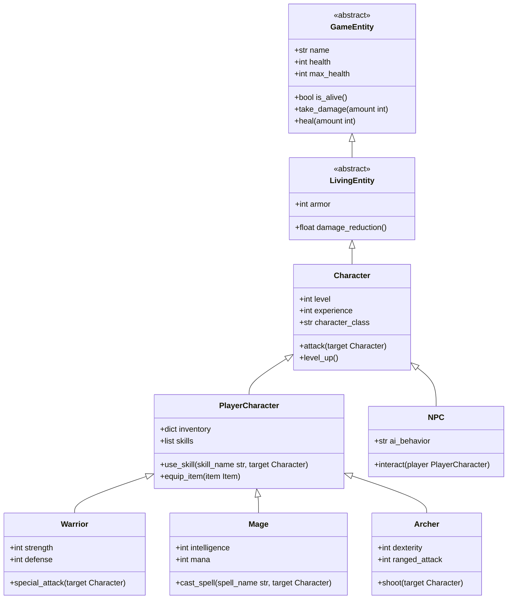
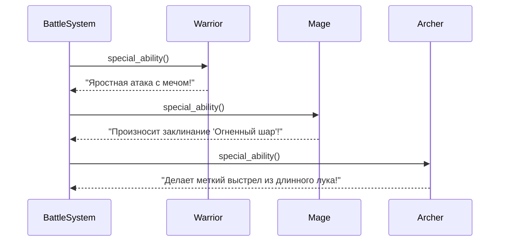
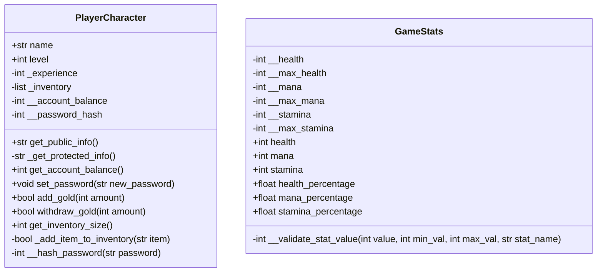
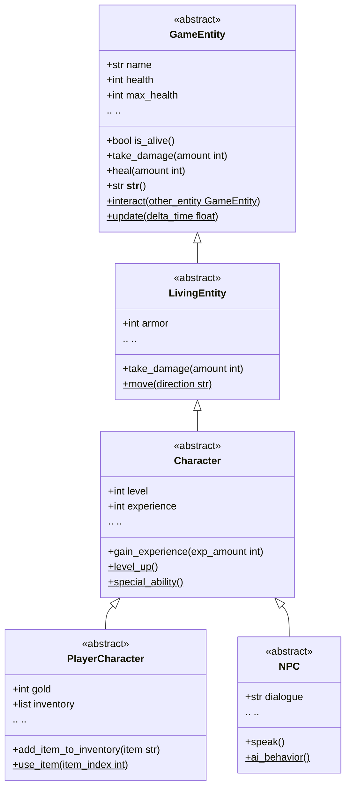
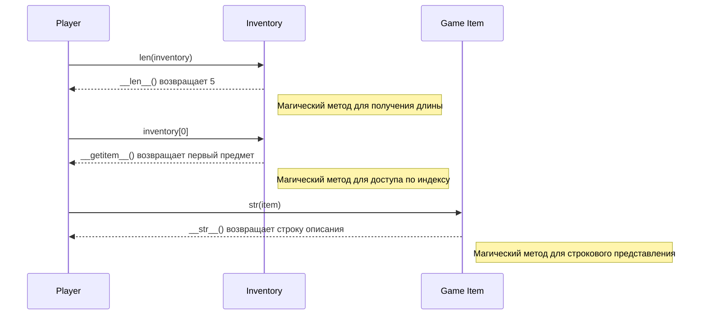
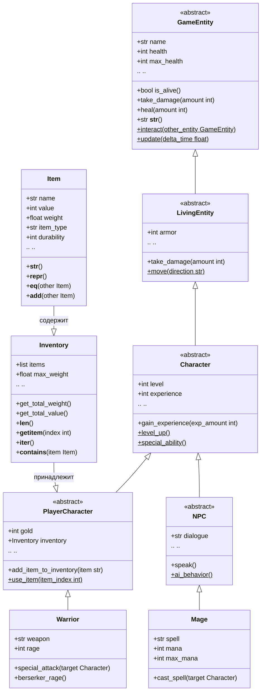
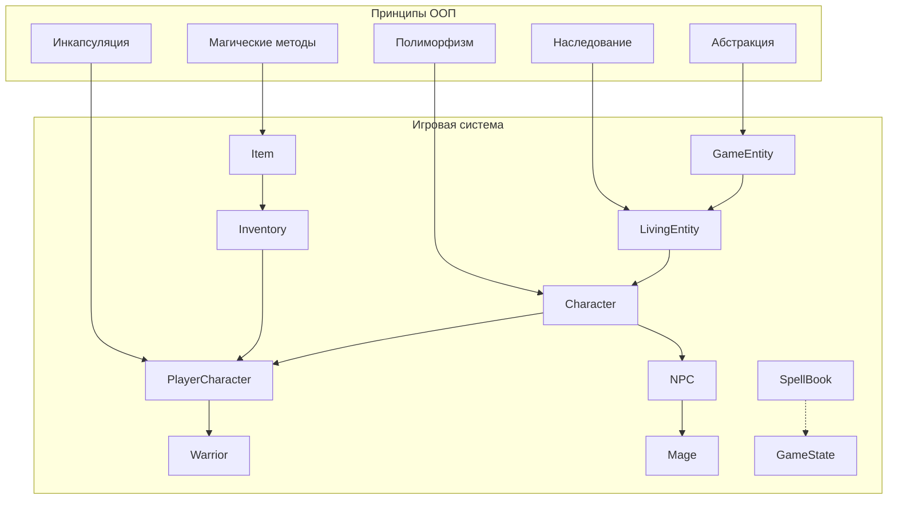

# Лекция 8: ООП - продвинутые концепции

## Наследование, полиморфизм, инкапсуляция, абстрактные классы, магические методы в контексте разработки игр

### План лекции:
1. Продвинутые аспекты наследования
2. Полиморфизм в Python
3. Инкапсуляция и уровни доступа
4. Абстрактные классы
5. Магические методы (dunder-методы)
6. Практические примеры на основе игровых персонажей

---

## 1. Продвинутые аспекты наследования

### Базовая иерархия игровых персонажей

В разработке игр наследование играет ключевую роль для создания различных типов персонажей. Рассмотрим, как можно организовать иерархию классов игровых персонажей с помощью наследования, полиморфизма, инкапсуляции и абстрактных классов.



### Множественное наследование

В Python класс может наследоваться от нескольких родительских классов. Это особенно полезно в игровых проектах, где персонаж может обладать характеристиками нескольких различных типов сущностей. Например, мы можем создать специального персонажа, который сочетает в себе черты воина и мага (так называемый "маг-воин").

```python
class GameEntity:
    """Абстрактная базовая сущность в игре"""
    def __init__(self, name, health=100):
        self.name = name
        self.health = health
        self.max_health = health

    def is_alive(self):
        return self.health > 0

    def take_damage(self, amount):
        self.health -= amount
        if self.health < 0:
            self.health = 0

    def heal(self, amount):
        self.health += amount
        if self.health > self.max_health:
            self.health = self.max_health

    def __str__(self):
        return f"{self.__class__.__name__}: {self.name} (Здоровье: {self.health}/{self.max_health})"


class Movable:
    """Класс, предоставляющий возможность перемещения"""
    def __init__(self, speed=1.0, *args, **kwargs):
        super().__init__(*args, **kwargs)
        self.speed = speed
        self.position = (0, 0)

    def move(self, x, y):
        """Переместить персонажа в новую позицию"""
        old_pos = self.position
        self.position = (x, y)
        print(f"{self.name} переместился из {old_pos} в {self.position} со скоростью {self.speed}")


class Attackable:
    """Класс, предоставляющий возможность атаки"""
    def __init__(self, attack_power=10, *args, **kwargs):
        super().__init__(*args, **kwargs)
        self.attack_power = attack_power

    def attack(self, target):
        """Атаковать цель"""
        if isinstance(target, GameEntity) and target.is_alive():
            print(f"{self.name} атакует {target.name} силой {self.attack_power}")
            target.take_damage(self.attack_power)
            return True
        else:
            print(f"{self.name} не может атаковать {target.name}, цель недействительна")
            return False


class Warrior(GameEntity, Movable, Attackable):
    """Класс воина, сочетающий возможности перемещения и атаки"""
    def __init__(self, name, weapon="Меч", *args, **kwargs):
        super().__init__(name, *args, **kwargs)
        self.weapon = weapon
        # Устанавливаем параметры для Movable и Attackable
        kwargs['speed'] = kwargs.get('speed', 2.0)
        kwargs['attack_power'] = kwargs.get('attack_power', 25)
        Movable.__init__(self, *args, **kwargs)
        Attackable.__init__(self, *args, **kwargs)

    def special_attack(self, target):
        """Особая атака воина"""
        if isinstance(target, GameEntity) and target.is_alive():
            damage = self.attack_power * 1.5
            print(f"{self.name} выполняет специальную атаку '{self.weapon}' по {target.name} с силой {damage}")
            target.take_damage(int(damage))
            return True
        else:
            print(f"{self.name} не может атаковать {target.name}, цель недействительна")
            return False

# Пример использования
warrior = Warrior("Артур", health=150, attack_power=30)
enemy = GameEntity("Гоблин", health=50)

print(warrior)
warrior.move(10, 5)
warrior.attack(enemy)
warrior.special_attack(enemy)

print(f"\n{enemy}")  # Показывает здоровье врага после атаки
```

### MRO (Method Resolution Order)

Python использует алгоритм C3 linearization для определения порядка разрешения методов. Это особенно важно при множественном наследовании, чтобы избежать конфликтов при вызове методов. Рассмотрим, как работает MRO на примере игровых классов:

```python
class LivingEntity(GameEntity):
    """Живая сущность с дополнительными характеристиками"""
    def __init__(self, name, health=100, armor=0):
        super().__init__(name, health)
        self.armor = armor

    def take_damage(self, amount):
        # Учет брони при получении урона
        reduced_damage = max(1, amount - self.armor)  # Минимум 1 урон
        print(f"{self.name} заблокировал {amount - reduced_damage} урона с помощью брони")
        super().take_damage(reduced_damage)


class MagicUser:
    """Класс, предоставляющий магические способности"""
    def __init__(self, magic_power=10, mana=50, *args, **kwargs):
        super().__init__(*args, **kwargs)
        self.mana = mana
        self.max_mana = mana
        self.magic_power = magic_power

    def cast_spell(self, spell_name, target=None):
        """Произнести заклинание"""
        if self.mana >= 10:
            self.mana -= 10
            print(f"{self.name} произносит заклинание '{spell_name}'")
            if target:
                print(f"Цель: {target.name}")
            return True
        else:
            print(f"Недостаточно маны для заклинания '{spell_name}'. Требуется 10, доступно {self.mana}")
            return False

    def restore_mana(self, amount):
        """Восстановить ману"""
        self.mana += amount
        if self.mana > self.max_mana:
            self.mana = self.max_mana
        print(f"{self.name} восстановил {amount} маны")


class Paladin(LivingEntity, Movable, Attackable, MagicUser):
    """Паладин - воин со священными заклинаниями"""
    def __init__(self, name, weapon="Святой меч", *args, **kwargs):
        # Устанавливаем значения по умолчанию
        kwargs.setdefault('health', 180)
        kwargs.setdefault('armor', 15)
        kwargs.setdefault('attack_power', 20)
        kwargs.setdefault('magic_power', 15)
        kwargs.setdefault('mana', 80)
        kwargs.setdefault('speed', 1.5)
        super().__init__(name, *args, **kwargs)
        self.weapon = weapon

    def holy_smite(self, target):
        """Святое поражение - комбинация физической атаки и магии"""
        if isinstance(target, GameEntity) and target.is_alive():
            physical_damage = self.attack_power
            magical_damage = self.magic_power
            total_damage = physical_damage + magical_damage
            
            print(f"{self.name} применяет Святое Поражение по {target.name}!")
            print(f"Физический урон: {physical_damage}, Магический урон: {magical_damage}")
            
            # Сначала магическая атака
            self.cast_spell("Святое Поражение", target)
            # Затем физическая атака
            target.take_damage(total_damage)
            return True
        else:
            print(f"{self.name} не может применить Святое Поражение к {target.name}, цель недействительна")
            return False


# Проверка порядка разрешения методов
print("Порядок разрешения методов для класса Paladin:")
for cls in Paladin.__mro__:
    print(f"  - {cls.__name__}")

paladin = Paladin("Сэр Ланселот")
print(f"\n{paladin}")
print(f"Мана: {paladin.mana}/{paladin.max_mana}")

# Пример использования способностей паладина
goblin = LivingEntity("Злобный гоблин", health=70, armor=3)
print(f"\n{goblin}")

paladin.holy_smite(goblin)
print(f"\n{goblin} после атаки")
print(f"Мана паладина: {paladin.mana}/{paladin.max_mana}")
```

### super() и его использование

Функция `super()` позволяет вызывать методы родительского класса, что особенно важно при множественном наследовании. Она обеспечивает правильное разрешение цепочки вызовов методов (MRO).

Рассмотрим пример с различными классами персонажей, где каждый класс добавляет свои особенности, используя `super()` для корректного вызова конструкторов родительских классов:


```python
class Character:
    """Базовый класс персонажа с уровнями и опытом"""
    def __init__(self, name, level=1, experience=0, *args, **kwargs):
        super().__init__(*args, **kwargs)  # Вызов родительского конструктора
        self.name = name
        self.level = level
        self.experience = experience
        self.exp_for_next_level = self.level * 100 # Для упрощения

    def gain_experience(self, exp_amount):
        """Получить опыт и повысить уровень при необходимости"""
        self.experience += exp_amount
        print(f"{self.name} получил {exp_amount} опыта. Всего: {self.experience}/{self.exp_for_next_level}")
        
        # Проверяем, достиг ли персонаж следующего уровня
        while self.experience >= self.exp_for_next_level:
            self.level_up()
    
    def level_up(self):
        """Повышение уровня персонажа"""
        self.level += 1
        self.experience -= self.exp_for_next_level
        self.exp_for_next_level = self.level * 100
        
        # Увеличиваем характеристики при повышении уровня
        self.max_health += 10
        self.health = self.max_health  # Полное восстановление здоровья при повышении уровня
        
        print(f"{self.name} достиг {self.level} уровня! Здоровье увеличено до {self.max_health}.")


class Inventory:
    """Класс инвентаря персонажа"""
    def __init__(self, max_capacity=10, *args, **kwargs):
        super().__init__(*args, **kwargs)  # Вызов родительского конструктора
        self.inventory = []
        self.max_capacity = max_capacity

    def add_item(self, item):
        """Добавить предмет в инвентарь"""
        if len(self.inventory) < self.max_capacity:
            self.inventory.append(item)
            print(f"Предмет '{item}' добавлен в инвентарь {self.name}.")
            return True
        else:
            print(f"Инвентарь {self.name} полон. Не удалось добавить '{item}'.")
            return False

    def remove_item(self, item):
        """Удалить предмет из инвентаря"""
        if item in self.inventory:
            self.inventory.remove(item)
            print(f"Предмет '{item}' удален из инвентаря {self.name}.")
            return True
        else:
            print(f"Предмет '{item}' не найден в инвентаре {self.name}.")
            return False

    def show_inventory(self):
        """Показать содержимое инвентаря"""
        print(f"Инвентарь {self.name}: {', '.join(self.inventory) if self.inventory else 'пуст'}")


class AdvancedWarrior(Character, LivingEntity, Movable, Attackable, Inventory):
    """Улучшенный воин с возможностью получения опыта и управления инвентарем"""
    def __init__(self, name, weapon="Меч героя", *args, **kwargs):
        # Устанавливаем значения по умолчанию
        kwargs.setdefault('health', 200)
        kwargs.setdefault('armor', 20)
        kwargs.setdefault('attack_power', 35)
        kwargs.setdefault('speed', 1.8)
        kwargs.setdefault('max_capacity', 15)
        super().__init__(name, *args, **kwargs)
        self.weapon = weapon
        self.class_type = "Воин"


# Создаем улучшенного воина
hero = AdvancedWarrior("Герой", weapon="Экскалибур", level=3, experience=250)
print(hero)
hero.show_inventory()

# Добавляем предметы в инвентарь
hero.add_item("Зелье здоровья")
hero.add_item("Щит")
hero.add_item("Кольчуга")
hero.show_inventory()

# Получаем опыт и повышаем уровень
hero.gain_experience(150)
print(f"Уровень: {hero.level}, Здоровье: {hero.health}/{hero.max_health}")

# Атакуем противника
enemy = LivingEntity("Тролль", health=100, armor=5)
print(f"\n{enemy}")
hero.attack(enemy)
print(f"\n{enemy} после атаки")
```

### Теория: Как работает super()

Функция `super()` возвращает прокси-объект, который делегирует вызовы методов классу следующим в цепочке MRO. При использовании `super()` с аргументами (`super(class, instance)`), она возвращает прокси для указанного класса. В Python 3 можно использовать просто `super()` без аргументов, что эквивалентно `super(CurrentClass, self)`.

Когда используется множественное наследование, `super()` гарантирует, что каждый метод в цепочке будет вызван ровно один раз, в правильном порядке, определяемом алгоритмом C3 linearization. Это особенно важно в сложных иерархиях классов, таких как игровые персонажи с множественными возможностями (движение, атака, магия, инвентарь и т.д.).

---

## 2. Полиморфизм в Python

### Понятие полиморфизма в контексте игровых персонажей

Полиморфизм позволяет использовать объекты разных классов через общий интерфейс. В контексте разработки игр это означает, что мы можем обрабатывать различных персонажей (воинов, магов, лучников) единообразно, даже если каждый из них реализует действия по-своему. Это делает код более гибким и расширяемым, позволяя легко добавлять новых персонажей без изменения основной логики игры.

```python
# Теория: Полиморфизм позволяет объектам разных классов отвечать на одни и те же сообщения (вызовы методов) по-своему.
# Это достигается за счет переопределения методов в дочерних классах.
# В играх полиморфизм позволяет обрабатывать различных персонажей одинаково, 
# не заботясь о конкретном типе каждого из них.
```

```python
class Character:
    """Базовый класс персонажа"""
    def __init__(self, name, health=100):
        self.name = name
        self.health = health
        self.max_health = health

    def is_alive(self):
        return self.health > 0

    def take_damage(self, amount):
        self.health -= amount
        if self.health < 0:
            self.health = 0

    def special_ability(self):
        """Абстрактный метод специальной способности"""
        raise NotImplementedError("Каждый персонаж должен реализовать свою специальную способность")


class Warrior(Character):
    """Класс воина"""
    def __init__(self, name, weapon="Меч"):
        super().__init__(name, health=150)
        self.weapon = weapon

    def special_ability(self):
        """Специальная способность воина - яростная атака"""
        return f"{self.name} использует яростную атаку с {self.weapon}!"


class Mage(Character):
    """Класс мага"""
    def __init__(self, name, spell="Огненный шар"):
        super().__init__(name, health=80)
        self.spell = spell
        self.mana = 100
        self.max_mana = 100

    def special_ability(self):
        """Специальная способность мага - заклинание"""
        if self.mana >= 20:
            self.mana -= 20
            return f"{self.name} произносит заклинание '{self.spell}'! Осталось маны: {self.mana}"
        else:
            return f"{self.name} не хватает маны для заклинания"


class Archer(Character):
    """Класс лучника"""
    def __init__(self, name, bow="Длинный лук"):
        super().__init__(name, health=100)
        self.bow = bow
        self.arrows = 20

    def special_ability(self):
        """Специальная способность лучника - меткий выстрел"""
        if self.arrows > 0:
            self.arrows -= 1
            return f"{self.name} делает меткий выстрел из {self.bow}! Осталось стрел: {self.arrows}"
        else:
            return f"{self.name} закончились стрелы!"


class Healer(Character):
    """Класс целителя"""
    def __init__(self, name, healing_spell="Лечение"):
        super().__init__(name, health=90)
        self.healing_spell = healing_spell
        self.mana = 120
        self.max_mana = 120

    def special_ability(self):
        """Специальная способность целителя - лечение"""
        if self.mana >= 15:
            self.mana -= 15
            return f"{self.name} применяет '{self.healing_spell}'! Осталось маны: {self.mana}"
        else:
            return f"{self.name} не хватает маны для лечения"


# Полиморфное использование - все персонажи вызывают один и тот же метод, но по-разному
characters = [
    Warrior("Артур"),
    Mage("Мерлин"),
    Archer("Робин"),
    Healer("Эльза")
]

print("Демонстрация полиморфизма:")
for char in characters:
    print(char.special_ability())
    print(f"Здоровье {char.name}: {char.health}/{char.max_health}")
    print("-" * 40)
```

### Практическое применение полиморфизма в боевой системе

В боевой системе игры полиморфизм особенно важен, так как позволяет обрабатывать атаки, защиту и другие действия всех персонажей единообразно, даже если каждый из них реализует эти действия по-своему.


```python
class BattleSystem:
    """Система боя, использующая полиморфизм"""
    def __init__(self):
        self.characters = []

    def add_character(self, character):
        """Добавить персонажа в бой"""
        self.characters.append(character)

    def battle_round(self):
        """Выполнить раунд боя"""
        print("=== Раунд боя начат ===")
        for character in self.characters:
            if character.is_alive():
                # Каждый персонаж использует свою специальную способность
                # благодаря полиморфизму - вызываем одинаковый метод, получаем разные результаты
                ability_result = character.special_ability()
                print(ability_result)
            else:
                print(f"{character.name} мертв и пропускает ход")
        print("=== Раунд боя завершен ===\n")


# Создаем боевую систему и добавляем персонажей
battle = BattleSystem()

warrior = Warrior("Конан")
mage = Mage("Гэндальф")
archer = Archer("Леголас")
healer = Healer("Ариэль")

battle.add_character(warrior)
battle.add_character(mage)
battle.add_character(archer)
battle.add_character(healer)

# Выполняем несколько раундов боя
for round_num in range(3):
    print(f"РАУНД {round_num + 1}")
    battle.battle_round()
```

### Duck Typing в игровом контексте

Duck typing ("если выглядит как утка, плавает как утка и крякает как утка — значит это утка") позволяет использовать объекты без явной проверки их типа, если они поддерживают нужный интерфейс. В игровом контексте это позволяет создавать универсальные системы, которые работают с любыми объектами, имеющими нужные методы или атрибуты.


```python
class Potion:
    """Зелье, которое можно использовать"""
    def __init__(self, name, effect="лечит 50 здоровья"):
        self.name = name
        self.effect = effect

    def use(self, target):
        """Использовать зелье на цели"""
        if hasattr(target, 'health') and hasattr(target, 'max_health'):
            old_health = target.health
            target.health = min(target.health + 50, target.max_health)
            healed = target.health - old_health
            print(f"{target.name} выпил {self.name} и восстановил {healed} здоровья")
        else:
            print(f"Невозможно использовать {self.name} на {target} - объект не имеет здоровья")


class Weapon:
    """Оружие, которое можно использовать"""
    def __init__(self, name, damage=20):
        self.name = name
        self.damage = damage

    def use(self, target):
        """Использовать оружие на цели"""
        if hasattr(target, 'take_damage'):
            print(f"Используется {self.name}, наносит {self.damage} урона")
            target.take_damage(self.damage)
        else:
            print(f"Невозможно атаковать {target} с помощью {self.name} - цель не может получать урон")


class Spell:
    """Заклинание, которое можно использовать"""
    def __init__(self, name, effect="магический урон 30"):
        self.name = name
        self.effect = effect

    def use(self, target):
        """Произнести заклинание на цели"""
        if hasattr(target, 'take_damage'):
            print(f"{self.name} поражает {target.name} магическим уроном 30")
            target.take_damage(30)
        else:
            print(f"Невозможно применить {self.name} к {target} - цель не может получать урон")


def use_item_on_target(item, target):
    """Универсальная функция использования предмета на цели"""
    # Duck typing: не проверяем тип item, просто проверяем наличие метода use
    if hasattr(item, 'use') and callable(getattr(item, 'use')):
        print(f"Используем {item.name} на {target.name}")
        item.use(target)
    else:
        print(f"Невозможно использовать {item} - объект не поддерживает метод use")


# Пример использования duck typing
player = Warrior("Герой")
enemy = Mage("Злодей")

items = [
    Potion("Зелье исцеления"),
    Weapon("Меч правосудия"),
    Spell("Молния")
]

print("Демонстрация Duck Typing:")
for item in items:
    # Мы можем использовать все предметы одинаково, несмотря на разные классы
    use_item_on_target(item, player)  # Игрок получает эффекты
    print()
    use_item_on_target(item, enemy)  # Враг также получает эффекты
    print("-" * 40)
```

### Теория: Принципы полиморфизма

Полиморфизм — это один из ключевых принципов объектно-ориентированного программирования, который позволяет объектам разных классов обрабатывать одинаковые сообщения (вызовы методов) по-своему. Это достигается за счет переопределения методов в дочерних классах. 

В Python полиморфизм реализуется естественным образом благодаря динамической типизации и тому, что все методы являются виртуальными (в терминологии других языков). Это означает, что при вызове метода у объекта будет вызвана наиболее специфичная реализация этого метода, определенная в классе объекта или его предках.

### Пример диаграммы последовательности для полиморфизма в боевой системе


---

## 3. Инкапсуляция и уровни доступа

### Уровни доступа в Python в контексте игровых объектов

Инкапсуляция в объектно-ориентированном программировании — это принцип, согласно которому внутренние данные объекта скрываются от внешнего мира, и доступ к ним осуществляется только через специально определенные методы. В Python уровни доступа реализованы по соглашению, но обеспечивают важную защиту данных и логики класса.


```python
class PlayerCharacter:
    """Класс игрока с различными уровнями доступа к данным"""
    def __init__(self, name, level=1, gold=0):
        # Публичный атрибут - доступен извне напрямую
        self.name = name
        self.level = level

        # Защищенный атрибут (начинается с одного подчеркивания)
        # По соглашению не должен использоваться за пределами класса и его потомков
        self._experience = 0
        self._inventory = []  # Инвентарь игрока

        # Приватный атрибут (начинается с двух подчеркиваний)
        # Использует механизм name mangling для "сокрытия" атрибута
        self.__account_balance = gold  # Баланс аккаунта игрока (в игровой валюте)
        self.__password_hash = self.__hash_password("default_password")  # Хеш пароля

    def get_public_info(self):
        """Публичный метод - возвращает общедоступную информацию"""
        return f"Игрок: {self.name}, Уровень: {self.level}, Опыт: {self._experience}"

    def _get_protected_info(self):
        """Защищенный метод - используется внутри класса и его потомков"""
        return f"Инвентарь: {self._inventory}, Опыт: {self._experience}"

    def __hash_password(self, password):
        """Приватный метод - внутреннее использование, не должен вызываться извне"""
        # В реальном приложении использовался бы надежный алгоритм хеширования
        return sum(ord(c) for c in password) % 10000

    def get_account_balance(self):
        """Публичный метод для безопасного доступа к приватному атрибуту"""
        return self.__account_balance

    def set_password(self, new_password):
        """Публичный метод для изменения пароля"""
        self.__password_hash = self.__hash_password(new_password)
        print("Пароль успешно изменен")

    def add_gold(self, amount):
        """Публичный метод для добавления золота с проверкой"""
        if amount > 0:
            self.__account_balance += amount
            print(f"Добавлено {amount} золота. Всего: {self.__account_balance}")
        else:
            print("Невозможно добавить отрицательное количество золота")

    def withdraw_gold(self, amount):
        """Публичный метод для снятия золота с проверкой"""
        if 0 < amount <= self.__account_balance:
            self.__account_balance -= amount
            print(f"Снято {amount} золота. Осталось: {self.__account_balance}")
            return True
        else:
            print("Недостаточно средств или неверная сумма")
            return False

    def get_inventory_size(self):
        """Публичный метод для получения размера инвентаря"""
        return len(self._inventory)

    def _add_item_to_inventory(self, item):
        """Защищенный метод для добавления предмета в инвентарь"""
        if len(self._inventory) < 20:  # Максимальный размер инвентаря
            self._inventory.append(item)
            print(f"Предмет '{item}' добавлен в инвентарь")
            return True
        else:
            print("Инвентарь полон")
            return False

    def __str__(self):
        return f"Игрок {self.name}: уровень {self.level}, {self.__account_balance} золота"


# Пример использования
player = PlayerCharacter("Алекс", gold=100)

# Публичные атрибуты и методы - можно использовать напрямую
print(player.name)  # Алекс
print(player.get_public_info())  # Общедоступная информация

# Защищенные атрибуты - технически доступны, но по соглашению не должны использоваться
print(player._experience)  # 0 - можно получить, но не рекомендуется
print(player._get_protected_info())  # Можно вызвать, но не рекомендуется

# Приватные атрибуты - скрыты через name mangling
try:
    print(player.__account_balance)  # Ошибка AttributeError
except AttributeError as e:
    print(f"Ошибка доступа к приватному атрибуту: {e}")

# Но можно получить через name mangling (не рекомендуется делать так на практике)
print(f"Баланс через name mangling: {player._PlayerCharacter__account_balance}")

# Правильный способ работы с приватными данными - через публичные методы
print(f"Баланс: {player.get_account_balance()}")
player.add_gold(50)
player.withdraw_gold(30)

print(player)  # Игрок Алекс: уровень 1, 120 золота
```

### Свойства (properties) для контроля доступа

Свойства позволяют создавать "виртуальные" атрибуты, которые при обращении к ним вызывают методы getter, setter и deleter. Это мощный инструмент для контроля доступа к данным с выполнением дополнительной логики.


```python
class GameStats:
    """Класс игровой статистики с контролем значений"""
    def __init__(self, name, health=100, mana=50, stamina=100):
        self.name = name
        # Используем приватные атрибуты для хранения значений
        self.__health = self.__validate_stat_value(health, 1, 999, "здоровье")
        self.__max_health = self.__health
        self.__mana = self.__validate_stat_value(mana, 0, 999, "мана")
        self.__max_mana = self.__mana
        self.__stamina = self.__validate_stat_value(stamina, 0, 999, "выносливость")
        self.__max_stamina = self.__stamina

    def __validate_stat_value(self, value, min_val, max_val, stat_name):
        """Валидация значений статистики"""
        if not isinstance(value, (int, float)):
            raise TypeError(f"{stat_name} должно быть числом")
        if value < min_val or value > max_val:
            print(f"Предупреждение: {stat_name} выходит за допустимые пределы [{min_val}, {max_val}], установлено в ближайшее значение")
            return max(min_val, min(max_val, value))
        return value

    @property
    def health(self):
        """Свойство для получения здоровья"""
        return self.__health

    @health.setter
    def health(self, value):
        """Свойство для установки здоровья с проверкой"""
        validated_value = self.__validate_stat_value(value, 0, self.__max_health, "здоровье")
        self.__health = validated_value
        if self.__health == 0:
            print(f"{self.name} погибает!")

    @property
    def mana(self):
        """Свойство для получения маны"""
        return self.__mana

    @mana.setter
    def mana(self, value):
        """Свойство для установки маны с проверкой"""
        self.__mana = self.__validate_stat_value(value, 0, self.__max_mana, "мана")

    @property
    def stamina(self):
        """Свойство для получения выносливости"""
        return self.__stamina

    @stamina.setter
    def stamina(self, value):
        """Свойство для установки выносливости с проверкой"""
        self.__stamina = self.__validate_stat_value(value, 0, self.__max_stamina, "выносливость")

    @property
    def health_percentage(self):
        """Свойство только для чтения - процент здоровья"""
        return (self.__health / self.__max_health) * 100 if self.__max_health > 0 else 0

    @property
    def mana_percentage(self):
        """Свойство только для чтения - процент маны"""
        return (self.__mana / self.__max_mana) * 100 if self.__max_mana > 0 else 0

    @property
    def stamina_percentage(self):
        """Свойство только для чтения - процент выносливости"""
        return (self.__stamina / self.__max_stamina) * 100 if self.__max_stamina > 0 else 0

    def rest(self):
        """Метод для отдыха и восстановления ресурсов"""
        self.__health = self.__max_health
        self.__mana = self.__max_mana
        self.__stamina = self.__max_stamina
        print(f"{self.name} полностью восстановил все ресурсы")


class Player:
    """Класс игрока с использованием свойств для контроля статистики"""
    def __init__(self, name, character_class="Воин"):
        self.name = name
        self.character_class = character_class
        self.stats = GameStats(name, health=120, mana=80, stamina=100)

    def __str__(self):
        return (f"{self.name} ({self.character_class}): "
                f"Здоровье: {self.stats.health}/{self.stats.max_health} "
                f"({self.stats.health_percentage:.1f}%), "
                f"Мана: {self.stats.mana}/{self.stats.max_mana} "
                f"({self.stats.mana_percentage:.1f}%), "
                f"Выносливость: {self.stats.stamina}/{self.stats.max_stamina} "
                f"({self.stats.stamina_percentage:.1f}%)" )


# Пример использования свойств
player = Player("Артур", "Маг")

print(player)
print(f"Процент здоровья: {player.stats.health_percentage:.1f}%")

# Изменение здоровья через свойство с автоматической проверкой
player.stats.health = 150  # Будет ограничено максимальным значением
print(f"Здоровье после установки 150: {player.stats.health}")

player.stats.health = -10  # Будет установлено в 0
print(f"Здоровье после установки -10: {player.stats.health}")

# Попытка изменить процент здоровья (только для чтения) - вызовет ошибку
try:
    player.stats.health_percentage = 50  # Ошибка - свойство только для чтения
except AttributeError as e:
    print(f"Ошибка: {e}")

# Восстановление ресурсов
player.stats.rest()
print(f"После отдыха: {player}")
```

### Теория: Инкапсуляция в ООП

Инкапсуляция — это один из основных принципов объектно-ориентированного программирования, который заключается в сокрытии внутренней реализации объекта от внешнего мира. Цель инкапсуляции — уменьшить связанность компонентов программы и обеспечить целостность данных.

### Диаграмма классов для инкапсуляции в игровых объектах


Инкапсуляция в Python реализована через соглашения об именовании:

1. **Публичные атрибуты и методы** (например, `name`) — доступны извне класса напрямую.
2. **Защищенные атрибуты и методы** (например, `_experience`) — по соглашению не должны использоваться за пределами класса и его потомков.
3. **Приватные атрибуты и методы** (например, `__account_balance`) — используют механизм name mangling для сокрытия атрибута от прямого доступа.

Свойства (`@property`) позволяют контролировать доступ к атрибутам, выполняя дополнительную логику при чтении, записи или удалении значений. Это особенно полезно для валидации данных и поддержания целостности состояния объекта.

---

## 4. Абстрактные классы

### Создание абстрактных классов для игровых сущностей

Абстрактные классы позволяют определять общий интерфейс для группы связанных классов, при этом запрещая создание экземпляров самого абстрактного класса. В контексте разработки игр абстрактные классы идеально подходят для определения базовых характеристик, которые должны быть реализованы всеми персонажами или объектами определенного типа.


```python
from abc import ABC, abstractmethod

class GameEntity(ABC):
    """Абстрактный класс игровой сущности"""
    def __init__(self, name, health=100):
        self.name = name
        self.health = health
        self.max_health = health

    @abstractmethod
    def interact(self, other_entity):
        """Абстрактный метод взаимодействия с другой сущностью"""
        pass

    @abstractmethod
    def update(self, delta_time):
        """Абстрактный метод обновления состояния сущности"""
        pass

    def is_alive(self):
        """Метод проверки, жива ли сущность"""
        return self.health > 0

    def take_damage(self, amount):
        """Метод получения урона"""
        self.health -= amount
        if self.health < 0:
            self.health = 0

    def heal(self, amount):
        """Метод восстановления здоровья"""
        self.health += amount
        if self.health > self.max_health:
            self.health = self.max_health

    def __str__(self):
        return f"{self.__class__.__name__}: {self.name} (Здоровье: {self.health}/{self.max_health})"


class LivingEntity(GameEntity):
    """Абстрактный класс живой сущности"""
    def __init__(self, name, health=100, armor=0):
        super().__init__(name, health)
        self.armor = armor

    @abstractmethod
    def move(self, direction):
        """Абстрактный метод движения"""
        pass

    def take_damage(self, amount):
        """Переопределение метода получения урона с учетом брони"""
        # Учет брони при получении урона
        reduced_damage = max(1, amount - self.armor)  # Минимум 1 урон
        print(f"{self.name} заблокировал {amount - reduced_damage} урона с помощью брони")
        super().take_damage(reduced_damage)


class Character(LivingEntity):
    """Абстрактный класс персонажа"""
    def __init__(self, name, health=100, armor=0, level=1):
        super().__init__(name, health, armor)
        self.level = level
        self.experience = 0

    @abstractmethod
    def level_up(self):
        """Абстрактный метод повышения уровня"""
        pass

    @abstractmethod
    def special_ability(self):
        """Абстрактный метод специальной способности"""
        pass

    def gain_experience(self, exp_amount):
        """Метод получения опыта"""
        self.experience += exp_amount
        print(f"{self.name} получил {exp_amount} опыта. Всего: {self.experience}")


class PlayerCharacter(Character):
    """Абстрактный класс игроком управляемого персонажа"""
    def __init__(self, name, health=100, armor=0, level=1, gold=0):
        super().__init__(name, health, armor, level)
        self.gold = gold  # Количество золота у игрока
        self.inventory = []  # Инвентарь игрока

    @abstractmethod
    def use_item(self, item_index):
        """Абстрактный метод использования предмета из инвентаря"""
        pass

    def add_item_to_inventory(self, item):
        """Метод добавления предмета в инвентарь"""
        if len(self.inventory) < 20:  # Ограничение размера инвентаря
            self.inventory.append(item)
            print(f"Предмет '{item}' добавлен в инвентарь {self.name}")
        else:
            print(f"Инвентарь {self.name} полон!")


class NPC(Character):
    """Абстрактный класс неигрового персонажа"""
    def __init__(self, name, health=100, armor=0, level=1, dialogue="Привет, путешественник!"):
        super().__init__(name, health, armor, level)
        self.dialogue = dialogue # Реплика НИПа

    @abstractmethod
    def ai_behavior(self):
        """Абстрактный метод поведения ИИ"""
        pass

    def speak(self):
        """Метод, с помощью которого НИП говорит"""
        print(f"{self.name}: {self.dialogue}")


# Попытка создания экземпляра абстрактного класса приведет к ошибке
try:
    entity = GameEntity("Тестовая сущность")  # Ошибка: нельзя создать экземпляр абстрактного класса
except TypeError as e:
    print(f"Ошибка при создании GameEntity: {e}")


# Реализация конкретных классов
class Warrior(PlayerCharacter):
    """Класс воина - конкретная реализация"""
    def __init__(self, name, weapon="Меч"):
        super().__init__(name, health=150, armor=15, level=1)
        self.weapon = weapon
        self.rage = 0  # Ярость воина

    def interact(self, other_entity):
        """Реализация взаимодействия"""
        if isinstance(other_entity, NPC):
            print(f"{self.name} говорит: 'Привет, {other_entity.name}!'")
            other_entity.speak()
        elif isinstance(other_entity, GameEntity) and other_entity.is_alive():
            print(f"{self.name} атакует {other_entity.name} с {self.weapon}!")
            other_entity.take_damage(25)
        else:
            print(f"{self.name} осматривается вокруг.")

    def update(self, delta_time):
        """Обновление состояния воина"""
        # Постепенное восстановление ярости
        self.rage = min(100, self.rage + delta_time * 2)
        if self.rage > 95:
            print(f"Ярость {self.name} почти максимальна: {self.rage:.1f}%")

    def move(self, direction):
        """Реализация движения"""
        print(f"{self.name} движется в направлении {direction}")

    def level_up(self):
        """Реализация повышения уровня"""
        self.level += 1
        self.max_health += 20
        self.health = self.max_health  # Полное восстановление при повышении уровня
        print(f"{self.name} достиг {self.level} уровня! Здоровье увеличено до {self.max_health}")

    def special_ability(self):
        """Реализация специальной способности"""
        if self.rage >= 30:
            self.rage -= 30
            damage = 40
            print(f"{self.name} использует 'Яростную атаку' и наносит {damage} урона!")
            return damage
        else:
            print(f"Недостаточно ярости для 'Яростной атаки'. Требуется 30, доступно {self.rage:.1f}")
            return 0

    def use_item(self, item_index):
        """Реализация использования предмета"""
        if 0 <= item_index < len(self.inventory):
            item = self.inventory[item_index]
            print(f"{self.name} использует предмет: {item}")
            # Удаляем использованный предмет
            del self.inventory[item_index]
        else:
            print(f"Неверный индекс предмета: {item_index}")

    def berserker_rage(self):
        """Специальная способность воина - берсерк"""
        if self.rage >= 50:
            self.rage -= 50
            self.health = min(self.max_health, self.health + 30)  # Лечение
            print(f"{self.name} впадает в ярость берсерка! Восстанавливает 30 здоровья.")
        else:
            print(f"Недостаточно ярости для 'Берсерка'. Требуется 50, доступно {self.rage:.1f}")


class Mage(NPC):
    """Класс мага - конкретная реализация НИПа"""
    def __init__(self, name, spell="Огненный шар"):
        super().__init__(name, health=80, armor=5, level=2, dialogue="Я чувствую магическую энергию воздухе...")
        self.spell = spell
        self.mana = 100
        self.max_mana = 100

    def interact(self, other_entity):
        """Реализация взаимодействия"""
        if isinstance(other_entity, PlayerCharacter):
            print(f"{self.name} замечает {other_entity.name} и говорит: 'О, путник! Ищу помощника в исследовании древних рун.'")
            self.speak()
        elif isinstance(other_entity, GameEntity) and other_entity.is_alive():
            print(f"{self.name} атакует {other_entity.name} магией!")
            self.cast_spell(other_entity)
        else:
            print(f"{self.name} читает древние тексты.")

    def update(self, delta_time):
        """Обновление состояния мага"""
        # Постепенное восстановление маны
        self.mana = min(self.max_mana, self.mana + delta_time * 5)
        if self.mana == self.max_mana:
            print(f"Мана {self.name} полностью восстановлена.")

    def move(self, direction):
        """Реализация движения"""
        print(f"{self.name} телепортируется в направлении {direction}")

    def level_up(self):
        """Реализация повышения уровня"""
        self.level += 1
        self.max_health += 10
        self.max_mana += 15
        self.health = self.max_health
        self.mana = self.max_mana
        print(f"{self.name} достиг {self.level} уровня! Здоровье: {self.max_health}, Мана: {self.max_mana}")

    def special_ability(self):
        """Реализация специальной способности"""
        return self.cast_spell(None)

    def ai_behavior(self):
        """Реализация поведения ИИ"""
        print(f"{self.name} изучает магические руны или готовит зелья.")

    def cast_spell(self, target=None):
        """Метод произнесения заклинания"""
        if self.mana >= 20:
            self.mana -= 20
            if target:
                target.take_damage(25)
                print(f"{self.name} произносит '{self.spell}' и наносит 25 урона {target.name}!")
            else:
                print(f"{self.name} практикует '{self.spell}', расходуя ману.")
            return True
        else:
            print(f"{self.name} не хватает маны для заклинания.")
            return False


# Пример использования
print("Создание персонажей:")
warrior = Warrior("Артур", weapon="Экскалибур")
mage = Mage("Мерлин")

print(f"\n{warrior}")
print(f"{mage}")

print(f"\nЯрость воина: {warrior.rage}")
warrior.special_ability()  # Не хватит ярости

# Повышение ярости искусственно для демонстрации
warrior.rage = 40
print(f"Ярость воина после восстановления: {warrior.rage}")
warrior.special_ability()  # Теперь способность сработает

print(f"\nМана мага: {mage.mana}/{mage.max_mana}")
mage.cast_spell(warrior)

print(f"\nЗдоровье воина после атаки: {warrior.health}/{warrior.max_health}")

# Взаимодействие между персонажами
print("\n--- Взаимодействие ---")
warrior.interact(mage)
print()
mage.interact(warrior)

# Использование инвентаря
print("\n--- Использование инвентаря ---")
warrior.add_item_to_inventory("Зелье здоровья")
warrior.add_item_to_inventory("Магический кристалл")
warrior.use_item(0)  # Используем первое зелье
print(f"Инвентарь воина: {warrior.inventory}")
```

### Абстрактные классы и интерфейсы в игровой архитектуре

Абстрактные классы особенно полезны при создании архитектуры игры, где разные типы сущностей должны реализовывать определенные методы. Это обеспечивает согласованность API и помогает избежать ошибок при разработке.

### Диаграмма классов для иерархии абстрактных классов


В этом примере:

- `GameEntity` определяет базовые характеристики всех игровых сущностей
- `LivingEntity` добавляет функциональность для живых сущностей
- `Character` задает общие свойства персонажей
- `PlayerCharacter` и `NPC` определяют специфические требования для игроком управляемых и неигровых персонажей соответственно

Каждый абстрактный метод помечен символом `$`, указывающим, что он должен быть реализован в дочернем классе.

---

## 5. Магические методы (dunder-методы)

### Основные магические методы в контексте игровых объектов

Магические методы (или dunder-методы, от "double underscore") позволяют классам в Python "взаимодействовать" с встроенными операциями языка, такими как арифметика, сравнение, доступ к элементам и другие. В контексте разработки игр они особенно полезны для создания интуитивно понятного интерфейса взаимодействия с игровыми объектами.


```python
class Item:
    """Класс игрового предмета"""
    def __init__(self, name, value=0, weight=1.0, item_type="обычный"):
        self.name = name
        self.value = value  # Стоимость предмета
        self.weight = weight  # Вес предмета
        self.item_type = item_type  # Тип предмета
        self.durability = 100  # Прочность предмета

    def __repr__(self):
        """Строковое представление объекта для отладки"""
        return f"Item('{self.name}', {self.value}, {self.weight}, '{self.item_type}')"

    def __str__(self):
        """Строковое представление объекта для пользователя"""
        return f"{self.name} ({self.item_type}) - стоимость: {self.value}, вес: {self.weight}, прочность: {self.durability}"

    def __eq__(self, other):
        """Определение равенства двух предметов"""
        if not isinstance(other, Item):
            return NotImplemented
        return (self.name == other.name and 
                self.value == other.value and 
                self.weight == other.weight)

    def __lt__(self, other):
        """Определение операции 'меньше чем' для сортировки по стоимости"""
        if not isinstance(other, Item):
            return NotImplemented
        return self.value < other.value

    def __add__(self, other):
        """Сложение предметов (например, объединение стопок)"""
        if isinstance(other, Item) and self.name == other.name:
            # Объединяем стопки одинаковых предметов
            combined_weight = self.weight + other.weight
            combined_value = self.value + other.value
            return Item(f"{self.name} (стопка)", combined_value, combined_weight, self.item_type)
        return NotImplemented

    def __bool__(self):
        """Определение истинности объекта (предмет действителен, если его прочность > 0)"""
        return self.durability > 0

    def __hash__(self):
        """Определение хеша для использования в множествах и словарях"""
        return hash((self.name, self.value, self.weight))


class Inventory:
    """Класс инвентаря игрока"""
    def __init__(self, max_weight=100.0):
        self.items = []  # Список предметов
        self.max_weight = max_weight  # Максимальный вес, который можно нести

    def __len__(self):
        """Возвращает количество предметов в инвентаре"""
        return len(self.items)

    def __getitem__(self, index):
        """Позволяет получать доступ к предмету по индексу"""
        return self.items[index]

    def __setitem__(self, index, item):
        """Позволяет устанавливать предмет по индексу"""
        if self.get_total_weight() - self.items[index].weight + item.weight <= self.max_weight:
            self.items[index] = item
        else:
            raise ValueError("Превышен максимальный вес инвентаря")

    def __delitem__(self, index):
        """Позволяет удалять предмет по индексу"""
        del self.items[index]

    def __iter__(self):
        """Позволяет итерироваться по инвентарю"""
        return iter(self.items)

    def __contains__(self, item):
        """Проверяет, содержится ли предмет в инвентаре"""
        return item in self.items

    def __iadd__(self, item):
        """Реализация операции += для добавления предмета"""
        self.add_item(item)
        return self

    def __isub__(self, item):
        """Реализация операции -= для удаления предмета"""
        self.remove_item(item)
        return self

    def add_item(self, item):
        """Добавить предмет в инвентарь"""
        if self.get_total_weight() + item.weight <= self.max_weight:
            self.items.append(item)
            print(f"Предмет '{item.name}' добавлен в инвентарь")
        else:
            print(f"Невозможно добавить '{item.name}': превышен максимальный вес инвентаря")

    def remove_item(self, item):
        """Удалить предмет из инвентаря"""
        if item in self.items:
            self.items.remove(item)
            print(f"Предмет '{item.name}' удален из инвентаря")
        else:
            print(f"Предмет '{item.name}' не найден в инвентаре")

    def get_total_weight(self):
        """Получить общий вес всех предметов"""
        return sum(item.weight for item in self.items)

    def get_total_value(self):
        """Получить общую стоимость всех предметов"""
        return sum(item.value for item in self.items)

    def __str__(self):
        """Строковое представление инвентаря"""
        if not self.items:
            return "Инвентарь пуст"
        item_list = "\n ".join(str(item) for item in self.items)
        return f"Инвентарь ({self.get_total_weight():.1f}/{self.max_weight} веса):\n  {item_list}"

    def __repr__(self):
        """Представление инвентаря для отладки"""
        return f"Inventory(items={self.items}, max_weight={self.max_weight})"


# Пример использования магических методов
print("=== Демонстрация магических методов для игровых предметов ===")

# Создание предметов
sword = Item("Меч героя", value=150, weight=5.0, item_type="оружие")
shield = Item("Деревянный щит", value=50, weight=3.0, item_type="защита")
potion = Item("Зелье здоровья", value=25, weight=0.5, item_type="расходуемый")
another_sword = Item("Меч героя", value=150, weight=5.0, item_type="оружие")

print("Предметы созданы:")
print(sword)  # Использует __str__
print(repr(shield))  # Использует __repr__
print(f"Равны ли sword и another_sword? {sword == another_sword}")  # Использует __eq__
print(f"Предмет sword истинен? {bool(sword)}")  # Использует __bool__

# Создание инвентаря и добавление предметов
inventory = Inventory(max_weight=20.0)

# Использование операций += и =
inventory += sword
inventory += shield
inventory += potion

print(f"\n{inventory}")

print(f"\nКоличество предметов в инвентаре: {len(inventory)}")  # Использует __len__

print("\nИтерация по инвентарю:")
for i, item in enumerate(inventory):  # Использует __iter__
    print(f"{i}: {item.name}")

print(f"\nСодержится ли sword в инвентаре? {sword in inventory}")  # Использует __contains__

# Доступ к предмету по индексу
first_item = inventory[0]  # Использует __getitem__
print(f"\nПервый предмет: {first_item}")

# Объединение одинаковых предметов
potion_stack = Item("Зелье здоровья", value=25, weight=0.5, item_type="расходуемый")
combined_potions = potion + potion_stack  # Использует __add__
print(f"\nОбъединенные зелья: {combined_potions}")

# Сортировка предметов по стоимости (__lt__)
items_list = [sword, shield, potion]
sorted_items = sorted(items_list)  # Использует __lt__
print(f"\nПредметы, отсортированные по стоимости: {[item.name for item in sorted_items]}")
```

### Контекстные менеджеры в игровом окружении

Контекстные менеджеры позволяют автоматически управлять ресурсами и состоянием объектов. В играх они могут использоваться для временных изменений состояния персонажа, управления сессиями и другими задачами.


```python
class TemporaryBuff:
    """Контекстный менеджер для временного усиления персонажа"""
    def __init__(self, character, attribute, boost_value, duration=10):
        self.character = character
        self.attribute = attribute
        self.boost_value = boost_value
        self.duration = duration
        self.original_value = getattr(character, attribute, 0)

    def __enter__(self):
        """Вызывается при входе в блок with"""
        # Увеличиваем характеристику на время действия баффа
        setattr(self.character, self.attribute, self.original_value + self.boost_value)
        print(f"{self.character.name} получает бафф: +{self.boost_value} к {self.attribute} на {self.duration} секунд")
        return self.character

    def __exit__(self, exc_type, exc_val, exc_tb):
        """Вызывается при выходе из блока with"""
        # Восстанавливаем оригинальное значение характеристики
        setattr(self.character, self.attribute, self.original_value)
        print(f"{self.character.name} теряет бафф: восстановлено {self.attribute} = {self.original_value}")


class Character:
    """Класс игрового персонажа"""
    def __init__(self, name, strength=10, agility=10, intelligence=10):
        self.name = name
        self.strength = strength
        self.agility = agility
        self.intelligence = intelligence

    def __str__(self):
        return f"{self.name}: Сила={self.strength}, Ловкость={self.agility}, Интеллект={self.intelligence}"


class CombatLog:
    """Контекстный менеджер для ведения боевого лога"""
    def __init__(self, filename="combat_log.txt"):
        self.filename = filename
        self.log_entries = []

    def __enter__(self):
        """Начинаем запись лога"""
        print(f"Открытие боевого лога: {self.filename}")
        self.log_entries.append(f"=== НАЧАЛО БОЯ ===")
        return self

    def __exit__(self, exc_type, exc_val, exc_tb):
        """Завершаем запись лога"""
        self.log_entries.append(f"=== КОНЕЦ БОЯ ===")
        # Записываем лог в файл (в реальном приложении)
        log_content = "\n".join(self.log_entries)
        print(f"Боевой лог:\n{log_content}")
        print(f"Боевой лог сохранен в {self.filename}")

    def record(self, event):
        """Записать событие в лог"""
        self.log_entries.append(f"[ЛОГ]: {event}")


# Пример использования контекстных менеджеров
hero = Character("Артур", strength=15, agility=12, intelligence=8)
print(f"До баффа: {hero}")

# Использование контекстного менеджера для временного усиления
with TemporaryBuff(hero, 'strength', 5, 10) as buffed_hero:
    print(f"Во время баффа: {buffed_hero}")
    print("Герой совершает подвиг силы...")

print(f"После баффа: {hero}")

print("\n" + "="*50 + "\n")

# Использование контекстного менеджера для боевого лога
with CombatLog("битва_с_драконом.txt") as combat_log:
    combat_log.record("Герой встречает дракона")
    combat_log.record("Герой атакует дракона")
    combat_log.record("Дракон отвечает огненным дыханием")
    combat_log.record("Герой использует щит для защиты")
    combat_log.record("Герой побеждает дракона!")
```

### Дополнительные магические методы в игровом контексте

Существует множество других магических методов, которые могут быть полезны в игровом контексте. Рассмотрим несколько примеров:


```python
class SpellBook:
    """Класс книги заклинаний с дополнительными магическими методами"""
    def __init__(self, owner_name):
        self.owner_name = owner_name
        self.spells = {}  # Словарь заклинаний: имя -> уровень
        self.read_only = False  # Режим только для чтения

    def __call__(self, spell_name, target=None):
        """Позволяет 'вызывать' книгу заклинаний как функцию для применения заклинания"""
        if self.read_only:
            print(f"Книга заклинаний {self.owner_name} находится в режиме 'только для чтения'")
            return False

        if spell_name in self.spells:
            level = self.spells[spell_name]
            print(f"{self.owner_name} произносит заклинание '{spell_name}' (уровень {level})")
            if target:
                print(f"Цель: {target}")
            return True
        else:
            print(f"Заклинание '{spell_name}' не найдено в книге")
            return False

    def __getattr__(self, attr_name):
        """Вызывается при обращении к несуществующему атрибуту"""
        if attr_name.startswith("can_cast_"):
            spell_name = attr_name.replace("can_cast_", "")
            return spell_name in self.spells
        raise AttributeError(f"'{type(self).__name__}' object has no attribute '{attr_name}'")

    def __setattr__(self, name, value):
        """Вызывается при установке атрибута"""
        # Разрешаем установку атрибутов read_only и owner_name, но не других в режиме "только для чтения"
        if hasattr(self, 'read_only') and self.read_only and name != 'read_only':
            raise AttributeError(f"Невозможно изменить атрибут '{name}' в режиме 'только для чтения'")
        super().__setattr__(name, value)

    def __len__(self):
        """Возвращает количество заклинаний в книге"""
        return len(self.spells)

    def __getitem__(self, key):
        """Позволяет получать уровень заклинания по имени"""
        return self.spells[key]

    def __setitem__(self, key, value):
        """Позволяет устанавливать уровень заклинания по имени"""
        if self.read_only:
            raise AttributeError("Невозможно изменить заклинание в режиме 'только для чтения'")
        self.spells[key] = value

    def __delitem__(self, key):
        """Позволяет удалять заклинание по имени"""
        if self.read_only:
            raise AttributeError("Невозможно удалить заклинание в режиме 'только для чтения'")
        del self.spells[key]

    def __iter__(self):
        """Позволяет итерироваться по заклинаниям"""
        return iter(self.spells.items())

    def __reversed__(self):
        """Позволяет итерироваться по заклинаниям в обратном порядке"""
        return reversed(list(self.spells.items()))

    def __contains__(self, item):
        """Проверяет, содержится ли заклинание в книге"""
        return item in self.spells

    def __str__(self):
        """Строковое представление книги заклинаний"""
        if not self.spells:
            return f"Книга заклинаний {self.owner_name} пуста"
        spells_list = ", ".join([f"{name}(уровень {level})" for name, level in self.spells.items()])
        return f"Книга заклинаний {self.owner_name}: {spells_list}"

    def add_spell(self, name, level):
        """Добавить заклинание в книгу"""
        self.spells[name] = level
        print(f"Заклинание '{name}' (уровень {level}) добавлено в книгу {self.owner_name}")


class GameState:
    """Класс состояния игры с магическими методами для управления"""
    def __init__(self):
        self.players = {}
        self.current_turn = 0
        self.game_over = False

    def __enter__(self):
        """Контекстный менеджер начала хода"""
        print(f"Начало хода игрока {self.current_turn + 1}")
        return self

    def __exit__(self, exc_type, exc_val, exc_tb):
        """Контекстный менеджер конца хода"""
        print(f"Конец хода игрока {self.current_turn + 1}")
        self.next_turn()

    def next_turn(self):
        """Переход к следующему игроку"""
        self.current_turn = (self.current_turn + 1) % len(self.players) if self.players else 0

    def add_player(self, name, player_obj):
        """Добавить игрока в игру"""
        self.players[name] = player_obj

    def __format__(self, format_spec):
        """Позволяет форматировать состояние игры"""
        if format_spec == "short":
            return f"Игра с {len(self.players)} игроками, ход {self.current_turn + 1}"
        elif format_spec == "long":
            player_names = ", ".join(self.players.keys())
            return f"Игра с игроками: {player_names}, текущий ход: {self.current_turn + 1}, игра {'окончена' if self.game_over else 'продолжается'}"
        else:
            return str(self)

    def __bool__(self):
        """Определяет, продолжается ли игра"""
        return not self.game_over and bool(self.players)


# Пример использования расширенных магических методов
print("=== Демонстрация дополнительных магических методов ===")

# Создание книги заклинаний
spellbook = SpellBook("Мерлина")
spellbook.add_spell("Огненный шар", 3)
spellbook.add_spell("Ледяная стрела", 2)
spellbook.add_spell("Целительное прикосновение", 4)

print(spellbook)
print(f"Количество заклинаний: {len(spellbook)}")

# Проверка наличия заклинания
print(f"Содержится ли 'Огненный шар'? {'Огненный шар' in spellbook}")

# Применение заклинания через __call__
spellbook("Огненный шар", "дракон")

# Использование методов, созданных через __getattr__
print(f"Можно ли колдовать 'Огненный шар'? {spellbook.can_cast_огненный_шар}")

# Итерация по заклинаниям
print("\nВсе заклинания в книге:")
for name, level in spellbook:
    print(f"  {name}: уровень {level}")

# Работа с состоянием игры
game_state = GameState()
game_state.add_player("Артур", {"hp": 10})
game_state.add_player("Ланселот", {"hp": 90})

print(f"\nКраткое состояние игры: {game_state:short}")
print(f"Подробное состояние игры: {game_state:long}")

# Использование контекстного менеджера для хода игрока
with game_state:
    print("  Игрок делает ход...")
    print("  Атакует противника...")

print(f"Текущий ход после завершения: {game_state.current_turn + 1}")
```

### Теория: Применение магических методов в разработке игр

Магические методы (dunder-методы) в Python предоставляют мощный механизм для "перегрузки операторов" и интеграции пользовательских классов с встроенными возможностями языка. В контексте разработки игр они позволяют создавать интуитивно понятные и элегантные API для взаимодействия с игровыми объектами.

### Диаграмма последовательности для использования магических методов


Вот несколько ключевых областей применения магических методов в разработке игр:

1. **Физические взаимодействия**: Использование `__add__`, `__sub__`, `__mul__` и других арифметических методов для моделирования взаимодействий между игровыми объектами (например, объединение стопок предметов, вычисление урона).

2. **Сравнения и сортировка**: Методы `__eq__`, `__lt__`, `__gt__` и другие позволяют сравнивать игровые объекты по различным критериям (например, по уровню, стоимости, силе).

3. **Контейнеры и коллекции**: Методы `__len__`, `__getitem__`, `__setitem__`, `__iter__`, `__contains__` позволяют создавать инвентари, списки заклинаний, команды персонажей и другие коллекции, которые работают как встроенные типы данных.

4. **Контекстные менеджеры**: Методы `__enter__` и `__exit__` позволяют создавать области действия для временных эффектов, управления ресурсами и ведения логов.

5. **Удобство использования**: Методы `__str__`, `__repr__`, `__call__` делают работу с игровыми объектами более интуитивной и удобной для отладки и разработки.

---

## 6. Практические примеры на основе игровых персонажей

### Комплексный пример: Игровая система с использованием всех концепций

Теперь объединим все изученные концепции в комплексном примере игровой системы, демонстрирующей наследование, полиморфизм, инкапсуляцию, абстрактные классы и магические методы.

### Диаграмма классов для комплексной игровой системы


```python
from abc import ABC, abstractmethod

class GameEntity(ABC):
    """Абстрактный класс игровой сущности"""
    def __init__(self, name, health=100):
        self.name = name
        self.health = health
        self.max_health = health

    @abstractmethod
    def interact(self, other_entity):
        """Абстрактный метод взаимодействия с другой сущностью"""
        pass

    @abstractmethod
    def update(self, delta_time):
        """Абстрактный метод обновления состояния сущности"""
        pass

    def is_alive(self):
        """Метод проверки, жива ли сущность"""
        return self.health > 0

    def take_damage(self, amount):
        """Метод получения урона"""
        self.health -= amount
        if self.health < 0:
            self.health = 0

    def heal(self, amount):
        """Метод восстановления здоровья"""
        self.health += amount
        if self.health > self.max_health:
            self.health = self.max_health

    def __str__(self):
        return f"{self.__class__.__name__}: {self.name} (Здоровье: {self.health}/{self.max_health})"


class LivingEntity(GameEntity):
    """Абстрактный класс живой сущности"""
    def __init__(self, name, health=100, armor=0):
        super().__init__(name, health)
        self.armor = armor

    @abstractmethod
    def move(self, direction):
        """Абстрактный метод движения"""
        pass

    def take_damage(self, amount):
        """Переопределение метода получения урона с учетом брони"""
        # Учет брони при получении урона
        reduced_damage = max(1, amount - self.armor)  # Минимум 1 урон
        print(f"{self.name} заблокировал {amount - reduced_damage} урона с помощью брони")
        super().take_damage(reduced_damage)


class Character(LivingEntity):
    """Абстрактный класс персонажа"""
    def __init__(self, name, health=100, armor=0, level=1):
        super().__init__(name, health, armor)
        self.level = level
        self.experience = 0

    @abstractmethod
    def level_up(self):
        """Абстрактный метод повышения уровня"""
        pass

    @abstractmethod
    def special_ability(self):
        """Абстрактный метод специальной способности"""
        pass

    def gain_experience(self, exp_amount):
        """Метод получения опыта"""
        self.experience += exp_amount
        print(f"{self.name} получил {exp_amount} опыта. Всего: {self.experience}")


class PlayerCharacter(Character):
    """Абстрактный класс игроком управляемого персонажа"""
    def __init__(self, name, health=100, armor=0, level=1, gold=0):
        super().__init__(name, health, armor, level)
        self.gold = gold  # Количество золота у игрока
        self.inventory = Inventory(50.0)  # Инвентарь игрока с максимальным весом

    @abstractmethod
    def use_item(self, item_index):
        """Абстрактный метод использования предмета из инвентаря"""
        pass

    def add_item_to_inventory(self, item):
        """Метод добавления предмета в инвентарь"""
        self.inventory.add_item(item)


class NPC(Character):
    """Абстрактный класс неигрового персонажа"""
    def __init__(self, name, health=100, armor=0, level=1, dialogue="Привет, путешественник!"):
        super().__init__(name, health, armor, level)
        self.dialogue = dialogue  # Реплика НИПа

    @abstractmethod
    def ai_behavior(self):
        """Абстрактный метод поведения ИИ"""
        pass

    def speak(self):
        """Метод, с помощью которого НИП говорит"""
        print(f"{self.name}: {self.dialogue}")


class Item:
    """Класс игрового предмета"""
    def __init__(self, name, value=0, weight=1.0, item_type="обычный"):
        self.name = name
        self.value = value  # Стоимость предмета
        self.weight = weight  # Вес предмета
        self.item_type = item_type  # Тип предмета
        self.durability = 100  # Прочность предмета

    def __repr__(self):
        """Строковое представление объекта для отладки"""
        return f"Item('{self.name}', {self.value}, {self.weight}, '{self.item_type}')"

    def __str__(self):
        """Строковое представление объекта для пользователя"""
        return f"{self.name} ({self.item_type}) - стоимость: {self.value}, вес: {self.weight}, прочность: {self.durability}"

    def __eq__(self, other):
        """Определение равенства двух предметов"""
        if not isinstance(other, Item):
            return NotImplemented
        return (self.name == other.name and 
                self.value == other.value and 
                self.weight == other.weight)

    def __lt__(self, other):
        """Определение операции 'меньше чем' для сортировки по стоимости"""
        if not isinstance(other, Item):
            return NotImplemented
        return self.value < other.value

    def __add__(self, other):
        """Сложение предметов (например, объединение стопок)"""
        if isinstance(other, Item) and self.name == other.name:
            # Объединяем стопки одинаковых предметов
            combined_weight = self.weight + other.weight
            combined_value = self.value + other.value
            return Item(f"{self.name} (стопка)", combined_value, combined_weight, self.item_type)
        return NotImplemented

    def __bool__(self):
        """Определение истинности объекта (предмет действителен, если его прочность > 0)"""
        return self.durability > 0

    def __hash__(self):
        """Определение хеша для использования в множествах и словарях"""
        return hash((self.name, self.value, self.weight))


class Inventory:
    """Класс инвентаря игрока"""
    def __init__(self, max_weight=100.0):
        self.items = []  # Список предметов
        self.max_weight = max_weight  # Максимальный вес, который можно нести

    def __len__(self):
        """Возвращает количество предметов в инвентаре"""
        return len(self.items)

    def __getitem__(self, index):
        """Позволяет получать доступ к предмету по индексу"""
        return self.items[index]

    def __setitem__(self, index, item):
        """Позволяет устанавливать предмет по индексу"""
        if self.get_total_weight() - self.items[index].weight + item.weight <= self.max_weight:
            self.items[index] = item
        else:
            raise ValueError("Превышен максимальный вес инвентаря")

    def __delitem__(self, index):
        """Позволяет удалять предмет по индексу"""
        del self.items[index]

    def __iter__(self):
        """Позволяет итерироваться по инвентарю"""
        return iter(self.items)

    def __contains__(self, item):
        """Проверяет, содержится ли предмет в инвентаре"""
        return item in self.items

    def __iadd__(self, item):
        """Реализация операции += для добавления предмета"""
        self.add_item(item)
        return self

    def __isub__(self, item):
        """Реализация операции -= для удаления предмета"""
        self.remove_item(item)
        return self

    def add_item(self, item):
        """Добавить предмет в инвентарь"""
        if self.get_total_weight() + item.weight <= self.max_weight:
            self.items.append(item)
            print(f"Предмет '{item.name}' добавлен в инвентарь")
        else:
            print(f"Невозможно добавить '{item.name}': превышен максимальный вес инвентаря")

    def remove_item(self, item):
        """Удалить предмет из инвентаря"""
        if item in self.items:
            self.items.remove(item)
            print(f"Предмет '{item.name}' удален из инвентаря")
        else:
            print(f"Предмет '{item.name}' не найден в инвентаре")

    def get_total_weight(self):
        """Получить общий вес всех предметов"""
        return sum(item.weight for item in self.items)

    def get_total_value(self):
        """Получить общую стоимость всех предметов"""
        return sum(item.value for item in self.items)

    def __str__(self):
        """Строковое представление инвентаря"""
        if not self.items:
            return "Инвентарь пуст"
        item_list = "\n  ".join(str(item) for item in self.items)
        return f"Инвентарь ({self.get_total_weight():.1f}/{self.max_weight} веса):\n  {item_list}"

    def __repr__(self):
        """Представление инвентаря для отладки"""
        return f"Inventory(items={self.items}, max_weight={self.max_weight})"


class Warrior(PlayerCharacter):
    """Класс воина - конкретная реализация"""
    def __init__(self, name, weapon="Меч"):
        super().__init__(name, health=150, armor=15, level=1)
        self.weapon = weapon
        self.rage = 0  # Ярость воина

    def interact(self, other_entity):
        """Реализация взаимодействия"""
        if isinstance(other_entity, NPC):
            print(f"{self.name} говорит: 'Привет, {other_entity.name}!'")
            other_entity.speak()
        elif isinstance(other_entity, GameEntity) and other_entity.is_alive():
            print(f"{self.name} атакует {other_entity.name} с {self.weapon}!")
            other_entity.take_damage(25)
        else:
            print(f"{self.name} осматривается вокруг.")

    def update(self, delta_time):
        """Обновление состояния воина"""
        # Постепенное восстановление ярости
        self.rage = min(100, self.rage + delta_time * 2)
        if self.rage > 95:
            print(f"Ярость {self.name} почти максимальна: {self.rage:.1f}%")

    def move(self, direction):
        """Реализация движения"""
        print(f"{self.name} движется в направлении {direction}")

    def level_up(self):
        """Реализация повышения уровня"""
        self.level += 1
        self.max_health += 20
        self.health = self.max_health  # Полное восстановление при повышении уровня
        print(f"{self.name} достиг {self.level} уровня! Здоровье увеличено до {self.max_health}")

    def special_ability(self):
        """Реализация специальной способности"""
        if self.rage >= 30:
            self.rage -= 30
            damage = 40
            print(f"{self.name} использует 'Яростную атаку' и наносит {damage} урона!")
            return damage
        else:
            print(f"Недостаточно ярости для 'Яростной атаки'. Требуется 30, доступно {self.rage:.1f}")
            return 0

    def use_item(self, item_index):
        """Реализация использования предмета"""
        if 0 <= item_index < len(self.inventory):
            item = self.inventory[item_index]
            print(f"{self.name} использует предмет: {item.name}")
            # Применяем эффект предмета (в данном случае просто лечение)
            if "здоровья" in item.name.lower():
                heal_amount = 30
                self.heal(heal_amount)
                print(f"{self.name} восстановил {heal_amount} здоровья")
            # Удаляем использованный предмет
            del self.inventory[item_index]
        else:
            print(f"Неверный индекс предмета: {item_index}")

    def berserker_rage(self):
        """Специальная способность воина - берсерк"""
        if self.rage >= 50:
            self.rage -= 50
            self.health = min(self.max_health, self.health + 30)  # Лечение
            print(f"{self.name} впадает в ярость берсерка! Восстанавливает 30 здоровья.")
        else:
            print(f"Недостаточно ярости для 'Берсерка'. Требуется 50, доступно {self.rage:.1f}")


class Mage(NPC):
    """Класс мага - конкретная реализация НИПа"""
    def __init__(self, name, spell="Огненный шар"):
        super().__init__(name, health=80, armor=5, level=2, dialogue="Я чувствую магическую энергию в воздухе...")
        self.spell = spell
        self.mana = 100
        self.max_mana = 100

    def interact(self, other_entity):
        """Реализация взаимодействия"""
        if isinstance(other_entity, PlayerCharacter):
            print(f"{self.name} замечает {other_entity.name} и говорит: 'О, путник! Ищу помощника в исследовании древних рун.'")
            self.speak()
        elif isinstance(other_entity, GameEntity) and other_entity.is_alive():
            print(f"{self.name} атакует {other_entity.name} магией!")
            self.cast_spell(other_entity)
        else:
            print(f"{self.name} читает древние тексты.")

    def update(self, delta_time):
        """Обновление состояния мага"""
        # Постепенное восстановление маны
        self.mana = min(self.max_mana, self.mana + delta_time * 5)
        if self.mana == self.max_mana:
            print(f"Мана {self.name} полностью восстановлена.")

    def move(self, direction):
        """Реализация движения"""
        print(f"{self.name} телепортируется в направлении {direction}")

    def level_up(self):
        """Реализация повышения уровня"""
        self.level += 1
        self.max_health += 10
        self.max_mana += 15
        self.health = self.max_health
        self.mana = self.max_mana
        print(f"{self.name} достиг {self.level} уровня! Здоровье: {self.max_health}, Мана: {self.max_mana}")

    def special_ability(self):
        """Реализация специальной способности"""
        return self.cast_spell(None)

    def ai_behavior(self):
        """Реализация поведения ИИ"""
        print(f"{self.name} изучает магические руны или готовит зелья.")

    def cast_spell(self, target=None):
        """Метод произнесения заклинания"""
        if self.mana >= 20:
            self.mana -= 20
            if target:
                target.take_damage(25)
                print(f"{self.name} произносит '{self.spell}' и наносит 25 урона {target.name}!")
            else:
                print(f"{self.name} практикует '{self.spell}', расходуя ману.")
            return True
        else:
            print(f"{self.name} не хватает маны для заклинания.")
            return False


# Демонстрация работы всей системы
print("=== Демонстрация комплексной игровой системы ===\n")

# Создание персонажей
warrior = Warrior("Артур", weapon="Экскалибур")
mage = Mage("Мерлин")

print("Созданные персонажи:")
print(warrior)
print(mage)
print()

# Добавление предметов в инвентарь воина
health_potion = Item("Зелье здоровья", value=25, weight=0.5, item_type="расходуемый")
sword = Item("Стальной меч", value=100, weight=8.0, item_type="оружие")
shield = Item("Кожаный щит", value=60, weight=4.0, item_type="защита")

warrior.add_item_to_inventory(health_potion)
warrior.add_item_to_inventory(sword)
warrior.add_item_to_inventory(shield)

print(f"\nИнвентарь {warrior.name}:")
print(warrior.inventory)

# Демонстрация магических методов
print(f"\nКоличество предметов в инвентаре: {len(warrior.inventory)}")
print(f"Содержится ли зелье в инвентаре? {health_potion in warrior.inventory}")

first_item = warrior.inventory[0]
print(f"Первый предмет: {first_item}")

# Использование полиморфизма - вызов методов у разных типов персонажей
print(f"\n--- Демонстрация полиморфизма ---")
characters = [warrior, mage]

for char in characters:
    print(f"\nОбновление состояния {char.name}:")
    char.update(1.0)  # Обновляем состояние с дельтой времени 1.0
    
    print(f"Специальная способность {char.name}:")
    char.special_ability()

# Взаимодействие между персонажами
print(f"\n--- Взаимодействие между персонажами ---")
warrior.interact(mage)
print()
mage.interact(warrior)

# Использование предмета из инвентаря
print(f"\n--- Использование предмета ---")
print(f"Здоровье {warrior.name} до использования зелья: {warrior.health}/{warrior.max_health}")
warrior.use_item(0)  # Используем зелье здоровья (индекс 0)
print(f"Здоровье {warrior.name} после использования зелья: {warrior.health}/{warrior.max_health}")

# Повышение уровня
print(f"\n--- Повышение уровня ---")
print(f"Уровень {warrior.name} до получения опыта: {warrior.level}")
warrior.gain_experience(150)
warrior.level_up()
print(f"Уровень {warrior.name} после повышения: {warrior.level}")

print(f"\n--- Итоговое состояние ---")
print(warrior)
print(mage)
print(f"Инвентарь {warrior.name}:")
print(warrior.inventory)
```

---

## Заключение

Продвинутые концепции ООП в Python позволяют создавать гибкие и масштабируемые архитектуры приложений. Понимание наследования, полиморфизма, инкапсуляции, абстрактных классов и магических методов критически важно для разработки качественного кода, особенно в контексте разработки игр, где требуется моделировать сложные взаимодействия между различными типами игровых сущностей.

### Обобщенная диаграмма архитектуры игровой системы


В этой лекции мы рассмотрели, как каждая из этих концепций может быть применена в контексте разработки игр. Использование наследования позволяет создавать иерархии персонажей с общими и специфичными свойствами. Полиморфизм обеспечивает гибкость при взаимодействии с различными типами персонажей. Инкапсуляция защищает внутреннее состояние объектов. Абстрактные классы обеспечивают общий интерфейс для групп связанных классов. Магические методы позволяют создавать интуитивно понятные и элегантные API для взаимодействия с игровыми объектами.

## Контрольные вопросы:
1. Как работает множественное наследование в Python и какие проблемы оно может создать?
2. Что такое MRO и как его можно проверить? Приведите пример из игрового контекста.
3. Какие уровни доступа к атрибутам существуют в Python и как они обозначаются?
4. Что такое абстрактные классы и для чего они используются в игровой архитектуре?
5. Какие магические методы вы знаете и для чего они применяются в игровом контексте?
6. Как обеспечить полиморфное поведение в системе игровых персонажей?
7. Как использовать свойства (properties) для контроля доступа к данным персонажа?
8. Какие преимущества дают контекстные менеджеры в разработке игр?
