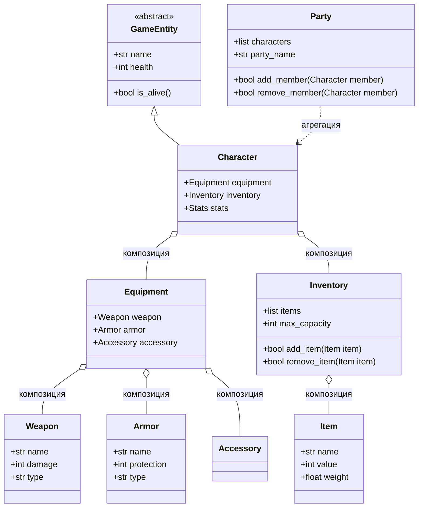
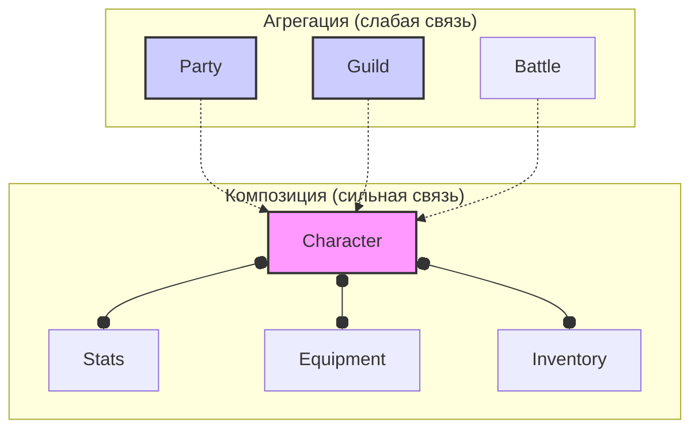
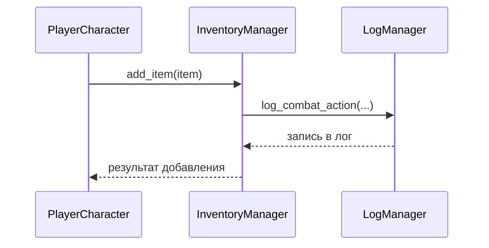
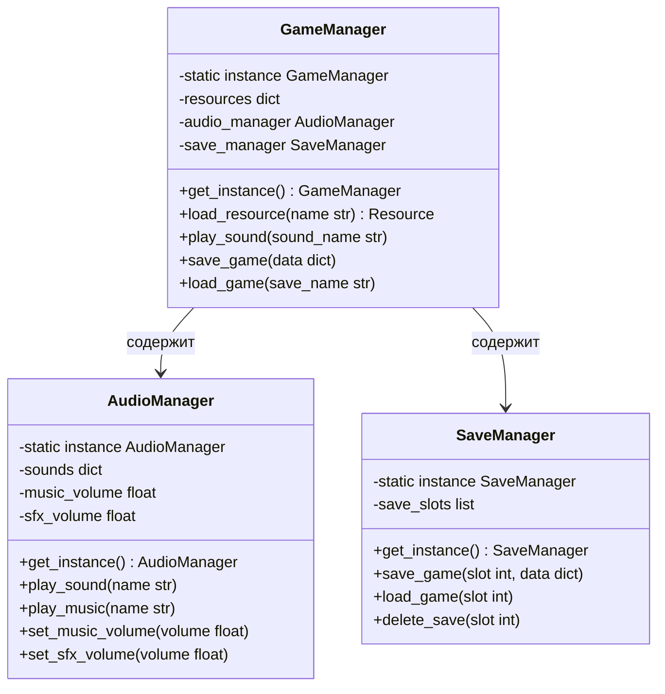
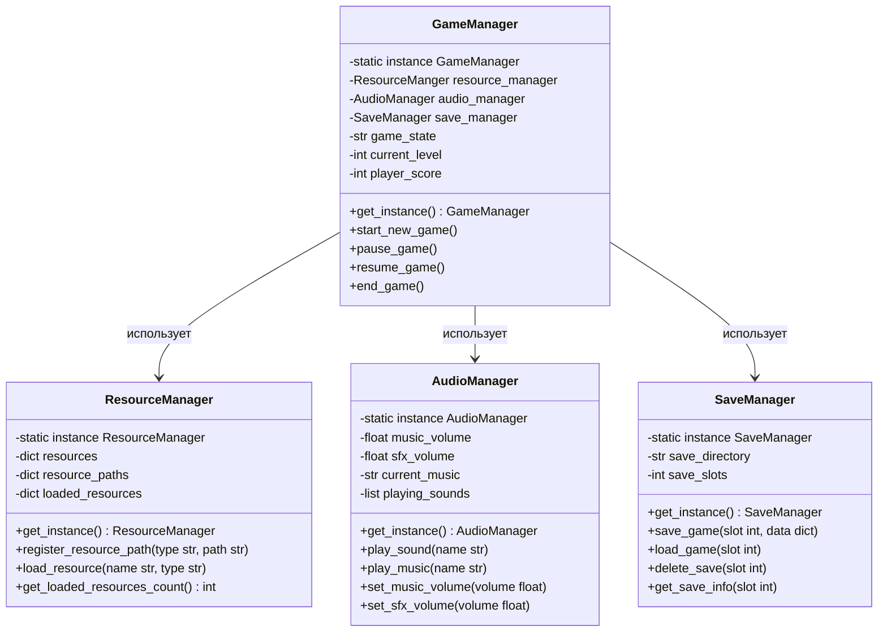
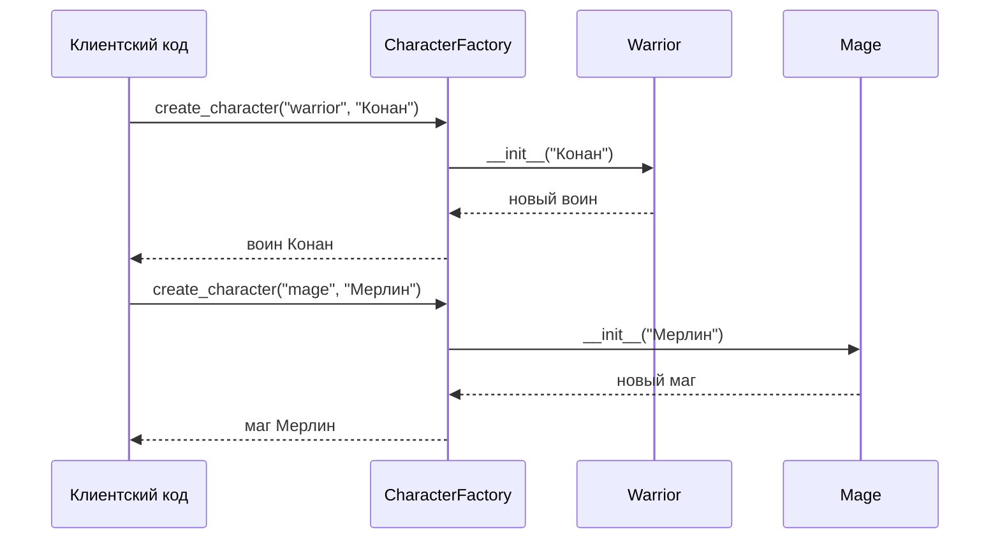
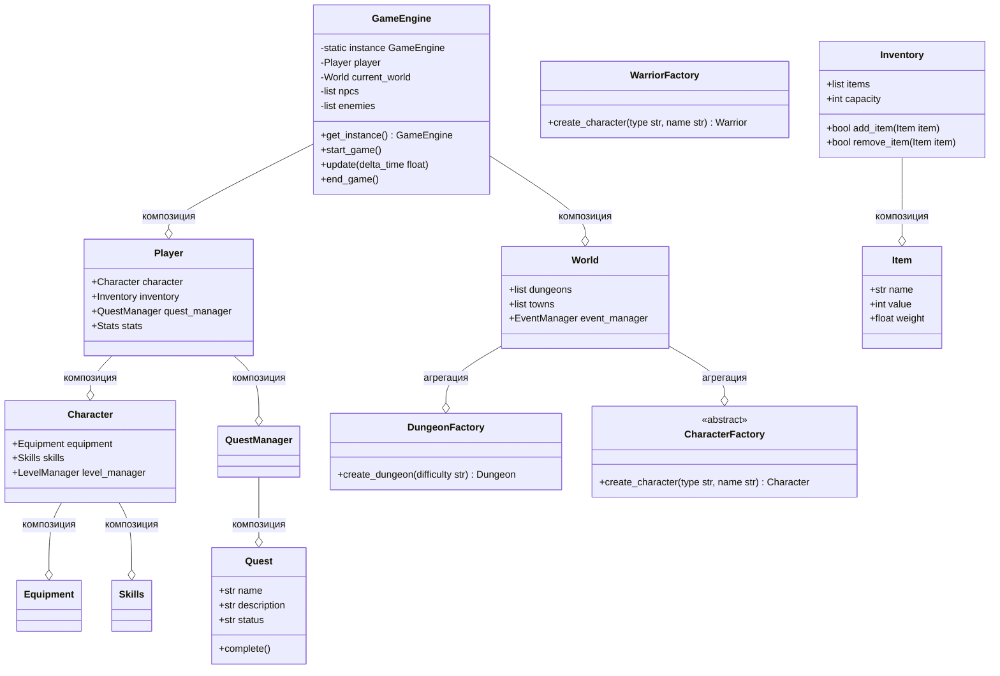
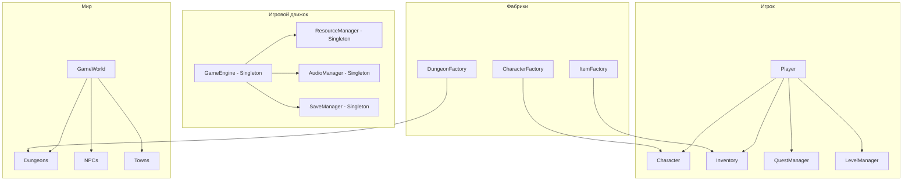

# Лекция 9: ООП - продолжение

## Композиция, агрегация, делегирование, паттерны проектирования (Singleton, Factory) в контексте разработки игр

### План лекции:
1. Композиция и агрегация в игровых системах
2. Делегирование в игровом программировании
3. Паттерн Singleton в играх
4. Паттерн Factory в игровом контексте
5. Практические примеры на основе игровых персонажей

---

## 1. Композиция и агрегация в игровых системах

### Понятие композиции и агрегации в контексте разработки игр

Композиция и агрегация - это отношения между классами, которые позволяют создавать более сложные игровые структуры и системы. Эти концепции особенно важны в разработке игр, где персонажи, предметы и системы часто имеют сложные связи между собой.

**Композиция** - это отношение "часть-целое", где часть не может существовать отдельно от целого. В игровом контексте это означает, что компонент уничтожается вместе с объектом, которому он принадлежит.

**Агрегация** - это отношение "часть-целое", где часть может существовать отдельно от целого. В играх это позволяет создавать более гибкие структуры, где компоненты могут переходить от одного объекта к другому.



### Композиция в игровых персонажах

В разработке игр композиция часто используется для создания сложных персонажей с различными компонентами, которые не могут существовать отдельно от персонажа. Например, статистика персонажа, его снаряжение и инвентарь обычно создаются и уничтожаются вместе с персонажем.

```python
class Stats:
    """Класс статистики персонажа - компонент, который существует только с персонажем"""
    def __init__(self, strength=10, agility=10, intelligence=10, vitality=10):
        self.strength = strength
        self.agility = agility
        self.intelligence = intelligence
        self.vitality = vitality
        self.base_health = 100 + (self.vitality * 5)
        self.health = self.base_health

    def update_health(self):
        """Обновить здоровье на основе выносливости"""
        self.base_health = 100 + (self.vitality * 5)
        self.health = min(self.health, self.base_health)

    def level_up(self):
        """Повышение характеристик при уровне"""
        self.strength += 2
        self.agility += 2
        self.intelligence += 2
        self.vitality += 2
        self.update_health()

    def __str__(self):
        return f"Сила:{self.strength}, Ловкость:{self.agility}, Интеллект:{self.intelligence}, Живучесть:{self.vitality}"


class Equipment:
    """Класс снаряжения персонажа - компонент, который существует только с персонажем"""
    def __init__(self):
        self.weapon = None
        self.armor = None
        self.accessories = []

    def equip_weapon(self, weapon):
        """Надеть оружие"""
        old_weapon = self.weapon
        self.weapon = weapon
        return old_weapon

    def equip_armor(self, armor):
        """Надеть броню"""
        old_armor = self.armor
        self.armor = armor
        return old_armor

    def add_accessory(self, accessory):
        """Добавить аксессуар (до 3 штук)"""
        if len(self.accessories) < 3:
            self.accessories.append(accessory)
            return True
        return False

    def unequip_weapon(self):
        """Снять оружие"""
        weapon = self.weapon
        self.weapon = None
        return weapon

    def unequip_armor(self):
        """Снять броню"""
        armor = self.armor
        self.armor = None
        return armor

    def get_total_damage_bonus(self):
        """Получить общий бонус к урону"""
        bonus = 0
        if self.weapon:
            bonus += self.weapon.damage_bonus
        for accessory in self.accessories:
            bonus += accessory.damage_bonus
        return bonus

    def get_total_protection_bonus(self):
        """Получить общий бонус к защите"""
        bonus = 0
        if self.armor:
            bonus += self.armor.protection_bonus
        for accessory in self.accessories:
            bonus += accessory.protection_bonus
        return bonus


class Inventory:
    """Класс инвентаря персонажа - компонент, который существует только с персонажем"""
    def __init__(self, max_capacity=20):
        self.items = []
        self.max_capacity = max_capacity

    def add_item(self, item):
        """Добавить предмет в инвентарь"""
        if len(self.items) < self.max_capacity:
            self.items.append(item)
            return True
        return False

    def remove_item(self, item):
        """Удалить предмет из инвентаря"""
        if item in self.items:
            self.items.remove(item)
            return True
        return False

    def get_item_by_name(self, name):
        """Получить предмет по имени"""
        for item in self.items:
            if item.name == name:
                return item
        return None

    def get_total_weight(self):
        """Получить общий вес предметов"""
        return sum(item.weight for item in self.items)

    def __len__(self):
        """Количество предметов в инвентаре"""
        return len(self.items)

    def __iter__(self):
        """Итерация по инвентарю"""
        return iter(self.items)


class Character:
    """Класс персонажа - использует композицию для статистики, снаряжения и инвентаря"""
    def __init__(self, name, char_class="Воин"):
        self.name = name
        self.char_class = char_class
        self.level = 1
        
        # Композиция: компоненты создаются и уничтожаются вместе с персонажем
        self.stats = Stats()
        self.equipment = Equipment()
        self.inventory = Inventory()

    def get_total_damage(self):
        """Получить общий урон персонажа"""
        base_damage = self.stats.strength * 2
        equipment_bonus = self.equipment.get_total_damage_bonus()
        return base_damage + equipment_bonus

    def get_total_protection(self):
        """Получить общую защиту персонажа"""
        base_protection = self.stats.vitality
        equipment_bonus = self.equipment.get_total_protection_bonus()
        return base_protection + equipment_bonus

    def take_damage(self, damage):
        """Получить урон"""
        protection = self.get_total_protection()
        actual_damage = max(1, damage - protection)
        self.stats.health -= actual_damage
        if self.stats.health < 0:
            self.stats.health = 0
        return actual_damage

    def level_up(self):
        """Повысить уровень персонажа"""
        self.level += 1
        self.stats.level_up()
        print(f"{self.name} достиг {self.level} уровня!")

    def __str__(self):
        return f"{self.name} ({self.char_class}): Уровень {self.level}, Здоровье: {self.stats.health}/{self.stats.base_health}"


# Пример использования композиции
print("=== Демонстрация композиции в игровых персонажах ===")

# Создание персонажа (компоненты создаются автоматически)
hero = Character("Артур", "Воин")
print(hero)

print(f"\nСтатистика: {hero.stats}")
print(f"Урон: {hero.get_total_damage()}, Защита: {hero.get_total_protection()}")

# Создание предметов
class WeaponItem:
    def __init__(self, name, damage_bonus):
        self.name = name
        self.damage_bonus = damage_bonus

class ArmorItem:
    def __init__(self, name, protection_bonus):
        self.name = name
        self.protection_bonus = protection_bonus

class AccessoryItem:
    def __init__(self, name, damage_bonus=0, protection_bonus=0):
        self.name = name
        self.damage_bonus = damage_bonus
        self.protection_bonus = protection_bonus

# Экипировка персонажа
sword = WeaponItem("Экскалибур", 15)
shield = ArmorItem("Щит короля Артура", 10)
ring = AccessoryItem("Кольцо силы", damage_bonus=5)

hero.equipment.equip_weapon(sword)
hero.equipment.equip_armor(shield)
hero.equipment.add_accessory(ring)

print(f"\nПосле экипировки:")
print(f"Урон: {hero.get_total_damage()}, Защита: {hero.get_total_protection()}")

# Добавление предметов в инвентарь
potion = {"name": "Зелье здоровья", "type": "consumable", "effect": "heal_50"}
hero.inventory.add_item(potion)

print(f"\nИнвентарь: {len(hero.inventory)} предметов")
```

### Агрегация в игровых системах

Агрегация позволяет создавать более гибкие структуры, где компоненты могут существовать независимо от содержащего их объекта. В играх это часто используется для создания отрядов, гильдий, команд и других группировок персонажей.

```python
class Party:
    """Класс отряда - использует агрегацию для хранения персонажей"""
    def __init__(self, name="Отряд приключений"):
        self.name = name
        self.members = []  # Агрегация: персонажи могут существовать без отряда
        self.leader = None

    def add_member(self, character):
        """Добавить персонажа в отряд"""
        if character not in self.members:
            self.members.append(character)
            if len(self.members) == 1:
                self.leader = character
            return True
        return False

    def remove_member(self, character):
        """Удалить персонажа из отряда"""
        if character in self.members:
            self.members.remove(character)
            # Если удаляем лидера, выбираем нового
            if character == self.leader and self.members:
                self.leader = self.members[0]
            elif character == self.leader:
                self.leader = None
            return True
        return False

    def set_leader(self, character):
        """Установить лидера отряда"""
        if character in self.members:
            self.leader = character
            return True
        return False

    def get_total_level(self):
        """Получить суммарный уровень отряда"""
        return sum(member.level for member in self.members)

    def get_average_stats(self):
        """Получить среднюю статистику отряда"""
        if not self.members:
            return None
        total_strength = sum(member.stats.strength for member in self.members)
        total_agility = sum(member.stats.agility for member in self.members)
        total_intelligence = sum(member.stats.intelligence for member in self.members)
        
        count = len(self.members)
        return {
            'strength': total_strength // count,
            'agility': total_agility // count,
            'intelligence': total_intelligence // count
        }

    def battle_ready(self):
        """Проверить, готов ли отряд к битве"""
        return len(self.members) > 0 and all(member.stats.health > 0 for member in self.members)

    def __len__(self):
        """Количество членов отряда"""
        return len(self.members)

    def __iter__(self):
        """Итерация по членам отряда"""
        return iter(self.members)

    def __str__(self):
        members_str = ", ".join(member.name for member in self.members)
        return f"Отряд '{self.name}': [{members_str}] (Лидер: {self.leader.name if self.leader else 'нет'})"


class Guild:
    """Класс гильдии - еще один пример агрегации"""
    def __init__(self, name, guild_master):
        self.name = name
        self.guild_master = guild_master  # Гильдмастер может быть персонажем
        self.members = []  # Агрегация: персонажи могут покинуть гильдию
        self.funds = 0

    def recruit(self, character):
        """Нанять персонажа в гильдию"""
        if character not in self.members:
            self.members.append(character)
            return True
        return False

    def dismiss(self, character):
        """Уволить персонажа из гильдии"""
        if character in self.members:
            self.members.remove(character)
            return True
        return False

    def contribute_funds(self, character, amount):
        """Внести средства в казну гильдии"""
        # Предполагаем, что у персонажа есть деньги
        if hasattr(character, 'gold') and character.gold >= amount:
            character.gold -= amount
            self.funds += amount
            return True
        return False

    def __str__(self):
        return f"Гильдия '{self.name}' во главе с {self.guild_master.name}, членов: {len(self.members)}, казна: {self.funds}"


# Пример использования агрегации
print("\n=== Демонстрация агрегации в игровых системах ===")

# Создание персонажей
warrior = Character("Конан", "Воин")
mage = Character("Мерлин", "Маг")
archer = Character("Робин", "Лучник")

# Создание отряда (агрегация)
adventurers_party = Party("Храбрые искатели")
adventurers_party.add_member(warrior)
adventurers_party.add_member(mage)
adventurers_party.add_member(archer)

print(adventurers_party)
print(f"Суммарный уровень отряда: {adventurers_party.get_total_level()}")
print(f"Средняя статистика: {adventurers_party.get_average_stats()}")
print(f"Готовность к битве: {adventurers_party.battle_ready()}")

# Создание гильдии (агрегация)
guild = Guild("Бродячие псы", warrior)
guild.recruit(warrior)
guild.recruit(mage)

# У персонажей добавим немного денег для примера
warrior.gold = 100
mage.gold = 50

guild.contribute_funds(warrior, 30)
guild.contribute_funds(mage, 20)

print(f"\n{guild}")

# Демонстрация независимости персонажей
print(f"\nПерсонажи существуют независимо от групп:")
print(f"Воин: {warrior}")
print(f"Маг: {mage}")
print(f"Лучник: {archer}")

# Персонаж может покинуть отряд
adventurers_party.remove_member(archer)
print(f"\nПосле того как лучник покинул отряд: {adventurers_party}")
print(f"Лучник по-прежнему существует: {archer}")
```

### Теория: Различие между композицией и агрегацией

В объектно-ориентированном программировании композиция и агрегация являются двумя формами ассоциации между классами, которые моделируют отношения "часть-целое". Однако между ними есть важные различия:

**Композиция** (Composition):
- Отношение "владеет" и "жизненный цикл"
- Часть не может существовать без целого
- При уничтожении целого уничтожаются и части
- Строгая зависимость между объектами
- Пример: сердце человека (не может существовать отдельно от человека)

**Агрегация** (Aggregation):
- Отношение "использует" 
- Часть может существовать без целого
- При уничтожении целого части остаются
- Слабая зависимость между объектами
- Пример: студент и университет (студент может учиться в другом университете или прекратить учебу)

В контексте разработки игр:
- Композиция: статистика персонажа, инвентарь, снаряжение (не могут существовать без персонажа)
- Агрегация: отряды, гильдии, команды (персонажи могут покинуть группу и продолжить существование)

### Диаграмма отношений композиции и агрегации в игровой системе


---

## 2. Делегирование в игровом программировании

### Понятие делегирования в контексте разработки игр

Делегирование - это паттерн проектирования, при котором объект передает выполнение некоторых операций другому объекту. В разработке игр делегирование позволяет создавать гибкие архитектуры, где различные компоненты могут обрабатывать специфическую логику, а основной объект просто делегирует им выполнение соответствующих задач.

```python
class BattleLogger:
    """Компонент для ведения боевого лога"""
    def __init__(self):
        self.logs = []

    def log_combat_action(self, actor, action, target=None):
        log_entry = f"{actor.name} {action}"
        if target:
            log_entry += f" -> {target.name}"
        self.logs.append(log_entry)
        print(f"[БОЙ] {log_entry}")

    def log_special_ability(self, actor, ability_name, target=None):
        log_entry = f"{actor.name} использует способность '{ability_name}'"
        if target:
            log_entry += f" на {target.name}"
        self.logs.append(log_entry)
        print(f"[СПОСОБНОСТЬ] {log_entry}")

    def get_battle_report(self):
        return "\n".join(self.logs)


class EffectManager:
    """Компонент для управления эффектами"""
    def __init__(self):
        self.active_effects = {}

    def apply_effect(self, target, effect_name, duration, magnitude):
        if target not in self.active_effects:
            self.active_effects[target] = {}
        
        self.active_effects[target][effect_name] = {
            'duration': duration,
            'magnitude': magnitude,
            'remaining': duration
        }
        print(f"Эффект '{effect_name}' применен к {target.name} на {duration} ходов (сила: {magnitude})")

    def update_effects(self):
        """Обновить все активные эффекты"""
        targets_to_remove = []
        for target, effects in self.active_effects.items():
            effects_to_remove = []
            for effect_name, effect_data in effects.items():
                effect_data['remaining'] -= 1
                if effect_data['remaining'] <= 0:
                    effects_to_remove.append(effect_name)
                    print(f"Эффект '{effect_name}' закончился для {target.name}")
            
            for effect_name in effects_to_remove:
                del effects[effect_name]
            
            if not effects:
                targets_to_remove.append(target)
        
        for target in targets_to_remove:
            del self.active_effects[target]

    def get_effect_modifier(self, target, effect_type):
        """Получить модификатор от эффектов определенного типа"""
        modifier = 0
        if target in self.active_effects:
            for effect_name, effect_data in self.active_effects[target].items():
                if effect_type in effect_name.lower():
                    modifier += effect_data['magnitude']
        return modifier


class Character:
    """Базовый класс персонажа с делегированием"""
    def __init__(self, name, char_class="Воин"):
        self.name = name
        self.char_class = char_class
        self.level = 1
        self.health = 100
        self.max_health = 100
        self.mana = 50
        self.max_mana = 50
        
        # Компоненты, которым делегируется выполнение специфической логики
        self.logger = BattleLogger()
        self.effects = EffectManager()

    def delegate_log_combat_action(self, action, target=None):
        """Делегировать логирование боевого действия"""
        self.logger.log_combat_action(self, action, target)

    def delegate_log_special_ability(self, ability_name, target=None):
        """Делегировать логирование специальной способности"""
        self.logger.log_special_ability(self, ability_name, target)

    def delegate_apply_effect(self, target, effect_name, duration, magnitude):
        """Делегировать применение эффекта"""
        self.effects.apply_effect(target, effect_name, duration, magnitude)

    def delegate_update_effects(self):
        """Делегировать обновление эффектов"""
        self.effects.update_effects()

    def delegate_get_effect_modifier(self, effect_type):
        """Делегировать получение модификатора эффекта"""
        return self.effects.get_effect_modifier(self, effect_type)

    def attack(self, target):
        """Атака с делегированием логирования"""
        damage = 10 + self.delegate_get_effect_modifier("power")
        self.delegate_log_combat_action(f"атакует на {damage} урона", target)
        target.take_damage(damage)
        return damage

    def take_damage(self, damage):
        """Получение урона"""
        actual_damage = max(1, damage - self.delegate_get_effect_modifier("protection"))
        self.health -= actual_damage
        if self.health < 0:
            self.health = 0
        return actual_damage

    def is_alive(self):
        """Проверка, жив ли персонаж"""
        return self.health > 0

    def __str__(self):
        return f"{self.name} ({self.char_class}): Здоровье {self.health}/{self.max_health}, Мана {self.mana}/{self.max_mana}"


class Warrior(Character):
    """Класс воина с делегированием специфичной логики"""
    def __init__(self, name):
        super().__init__(name, "Воин")
        self.rage = 0
        self.max_rage = 100

    def special_attack(self, target):
        """Специальная атака с делегированием"""
        if self.rage >= 30:
            self.rage -= 30
            bonus_damage = 15 + self.delegate_get_effect_modifier("rage")
            damage = 20 + bonus_damage
            self.delegate_log_special_ability("Яростная атака", target)
            self.delegate_log_combat_action(f"наносит {damage} урона", target)
            target.take_damage(damage)
            return damage
        else:
            print(f"{self.name} недостаточно ярости для специальной атаки")
            return 0

    def battle_cry(self, allies):
        """Боевой клич, усиливающий союзников"""
        self.delegate_log_special_ability("Боевой клич")
        for ally in allies:
            self.delegate_apply_effect(ally, "боевой дух", 3, 5)
            print(f"{ally.name} воодушевлен боевым кличем!")

    def take_damage(self, damage):
        """Переопределение получения урона с делегированием"""
        # Воин может использовать ярость для снижения урона
        rage_protection = min(self.rage, damage // 2)
        self.rage -= rage_protection
        damage -= rage_protection
        
        actual_damage = max(1, damage - self.delegate_get_effect_modifier("protection"))
        self.health -= actual_damage
        if self.health < 0:
            self.health = 0
            
        # Получение ярости при получении урона
        self.rage = min(self.max_rage, self.rage + actual_damage)
        
        return actual_damage


class Mage(Character):
    """Класс мага с делегированием специфичной логики"""
    def __init__(self, name):
        super().__init__(name, "Маг")
        self.mana_cost_multiplier = 1.0

    def cast_spell(self, spell_name, target=None):
        """Произнесение заклинания с делегированием"""
        base_mana_cost = 10
        mana_cost = int(base_mana_cost * self.mana_cost_multiplier)
        
        if self.mana >= mana_cost:
            self.mana -= mana_cost
            self.delegate_log_special_ability(f"произносит '{spell_name}'", target)
            
            if spell_name.lower() == "огненный шар":
                damage = 25 + self.delegate_get_effect_modifier("fire")
                if target:
                    target.take_damage(damage)
                    print(f"{target.name} получает {damage} огненного урона")
                return damage
            elif spell_name.lower() == "лечение":
                heal_amount = 30 + self.delegate_get_effect_modifier("heal")
                if target:
                    target.health = min(target.max_health, target.health + heal_amount)
                    print(f"{target.name} восстанавливает {heal_amount} здоровья")
                return heal_amount
            else:
                print(f"Неизвестное заклинание: {spell_name}")
                return 0
        else:
            print(f"{self.name} недостаточно маны для заклинания")
            return 0

    def take_damage(self, damage):
        """Переопределение получения урона с делегированием"""
        actual_damage = max(1, damage - self.delegate_get_effect_modifier("magic_resist"))
        self.health -= actual_damage
        if self.health < 0:
            self.health = 0
        return actual_damage


# Пример использования делегирования
print("=== Демонстрация делегирования в игровом программировании ===")

warrior = Warrior("Конан")
mage = Mage("Мерлин")
enemy = Character("Гоблин")

print(f"Состояние персонажей:")
print(warrior)
print(mage)
print(enemy)

print(f"\n--- Боевая сцена ---")

# Атака с делегированием логирования
warrior.attack(enemy)

# Применение эффекта с делегированием
warrior.delegate_apply_effect(mage, "огненная мощь", 3, 10)

# Специальная атака воина
warrior.rage = 50  # Искусственно увеличиваем ярость
warrior.special_attack(enemy)

# Заклинание мага
mage.cast_spell("огненный шар", enemy)

# Боевой клич воина
warrior.battle_cry([mage])

# Обновление эффектов с делегированием
warrior.delegate_update_effects()

print(f"\nСостояние после боя:")
print(warrior)
print(mage)
print(enemy)

print(f"\n--- Боевой отчет ---")
print(warrior.logger.get_battle_report())
```

### Использование __getattr__ для делегирования в игровом контексте

Метод __getattr__ позволяет реализовать гибкое делегирование, когда неопределенные атрибуты или методы автоматически передаются другому объекту.

```python
class InventoryManager:
    """Класс управления инвентарем"""
    def __init__(self):
        self.items = []
        self.capacity = 10
        self.logger = BattleLogger()

    def add_item(self, item):
        if len(self.items) < self.capacity:
            self.items.append(item)
            self.logger.log_combat_action(f"добавил предмет '{item.name}' в инвентарь")
            return True
        else:
            print("Инвентарь полон!")
            return False

    def remove_item(self, item):
        if item in self.items:
            self.items.remove(item)
            self.logger.log_combat_action(f"удалил предмет '{item.name}' из инвентаря")
            return True
        return False

    def get_item_count(self):
        return len(self.items)

    def get_total_weight(self):
        return sum(getattr(item, 'weight', 0) for item in self.items)

    def use_item(self, item_name, target):
        for item in self.items:
            if item.name == item_name:
                if hasattr(item, 'use'):
                    return item.use(target)
                else:
                    print(f"Предмет '{item_name}' нельзя использовать")
                    return False
        print(f"Предмет '{item_name}' не найден")
        return False


class Item:
    """Класс предмета"""
    def __init__(self, name, item_type="обычный", weight=1.0):
        self.name = name
        self.item_type = item_type
        self.weight = weight

    def __str__(self):
        return f"{self.name} ({self.item_type}), вес: {self.weight}"


class Consumable(Item):
    """Класс расходуемого предмета"""
    def __init__(self, name, effect_type, effect_value, weight=0.5):
        super().__init__(name, "расходуемый", weight)
        self.effect_type = effect_type
        self.effect_value = effect_value

    def use(self, target):
        if self.effect_type == "heal":
            target.health = min(target.max_health, target.health + self.effect_value)
            print(f"{target.name} восстановил {self.effect_value} здоровья")
        elif self.effect_type == "mana":
            target.mana = min(target.max_mana, target.mana + self.effect_value)
            print(f"{target.name} восстановил {self.effect_value} маны")
        return True


class Equipable(Item):
    """Класс экипируемого предмета"""
    def __init__(self, name, stat_bonus_type, stat_bonus_value, weight=2.0):
        super().__init__(name, "экипировка", weight)
        self.stat_bonus_type = stat_bonus_type
        self.stat_bonus_value = stat_bonus_value

    def equip(self, character):
        print(f"{character.name} экипировал {self.name}, получив +{self.stat_bonus_value} к {self.stat_bonus_type}")


class SmartCharacter:
    """Класс персонажа с делегированием через __getattr__"""
    def __init__(self, name):
        self.name = name
        self.health = 10
        self.max_health = 100
        self.mana = 50
        self.max_mana = 50
        
        # Компонент инвентаря, которому будут делегированы некоторые методы
        self.inventory_manager = InventoryManager()

    def __getattr__(self, name):
        """
        Автоматически делегировать неопределенные атрибуты/методы 
        компоненту управления инвентарем
        """
        if hasattr(self.inventory_manager, name):
            attr = getattr(self.inventory_manager, name)
            if callable(attr):
                # Если это метод, вызвать его
                return attr
            else:
                # Если это атрибут, вернуть его значение
                return attr
        else:
            # Если атрибут не найден ни у персонажа, ни у компонента
            raise AttributeError(f"'{type(self).__name__}' object has no attribute '{name}'")

    def __str__(self):
        return f"{self.name}: Здоровье {self.health}/{self.max_health}, Мана {self.mana}/{self.max_mana}, Инвентарь: {self.get_item_count()}/{self.capacity}"


# Пример использования делегирования через __getattr__
print("\n=== Демонстрация делегирования через __getattr__ ===")

player = SmartCharacter("Артур")
print(player)

# Создание предметов
health_potion = Consumable("Зелье здоровья", "heal", 30)
mana_potion = Consumable("Зелье маны", "mana", 25)
strength_gloves = Equipable("Перчатки силы", "сила", 5)

# Добавление предметов в инвентарь (метод делегируется из inventory_manager)
player.add_item(health_potion)
player.add_item(mana_potion)
player.add_item(strength_gloves)

print(f"\nПосле добавления предметов: {player}")
print(f"Общий вес инвентаря: {player.get_total_weight()}")

# Использование предмета (метод делегируется из inventory_manager)
print(f"\nИспользование зелья здоровья:")
player.use_item("Зелье здоровья", player)
print(f"Состояние после использования: {player}")

# Получение количества предметов (метод делегируется из inventory_manager)
print(f"\nКоличество предметов в инвентаре: {player.get_item_count()}")

# Экипировка предмета
print(f"\nЭкипировка:")
strength_gloves.equip(player)
```

### Теория: Применение делегирования в разработке игр

Делегирование - важный паттерн проектирования, который позволяет создавать гибкие и поддерживаемые архитектуры в разработке игр. Вот основные области его применения:

1. **Компонентная архитектура**: Вместо создания монолитных классов персонажей, можно использовать компоненты, каждый из которых отвечает за свою область функциональности (например, физика, графика, логика ИИ).

2. **Система логирования**: Отделение логики ведения логов от основной игровой логики.

3. **Управление эффектами**: Вынесение логики применения и управления временными эффектами в отдельный компонент.

4. **Система событий**: Делегирование обработки игровых событий соответствующим слушателям.

5. **Управление ресурсами**: Делегирование загрузки и выгрузки ресурсов специализированному менеджеру.

Преимущества делегирования:
- Упрощение сложных классов
- Повторное использование кода
- Улучшенная тестируемость
- Легкость модификации поведения

### Диаграмма последовательности для делегирования в игровой системе


---

## 3. Паттерн Singleton в играх

### Понятие Singleton в контексте разработки игр

Singleton - это порождающий паттерн проектирования, который гарантирует, что у класса есть только один экземпляр, и предоставляет глобальную точку доступа к нему. В разработке игр Singleton особенно полезен для объектов, которые должны существовать в единственном экземпляре, таких как менеджеры ресурсов, аудио, сохранений, настроек и т.д.



### Реализация Singleton для игровых менеджеров

```python
import json
import os
import threading
from datetime import datetime

class ResourceManager:
    """Менеджер ресурсов -.Singleton для загрузки и управления игровыми ресурсами"""
    _instance = None
    _lock = threading.Lock()

    def __new__(cls):
        if cls._instance is None:
            with cls._lock:
                if cls._instance is None:
                    cls._instance = super().__new__(cls)
        return cls._instance

    def __init__(self):
        if not hasattr(self, 'initialized'):
            self.resources = {}
            self.resource_paths = {}
            self.loaded_resources = {}
            self.initialized = True
            print("Менеджер ресурсов инициализирован")

    def register_resource_path(self, resource_type, path):
        """Зарегистрировать путь к ресурсам определенного типа"""
        self.resource_paths[resource_type] = path

    def load_resource(self, resource_name, resource_type):
        """Загрузить ресурс, если он еще не загружен"""
        resource_key = f"{resource_type}:{resource_name}"
        
        if resource_key in self.loaded_resources:
            print(f"Ресурс {resource_key} уже загружен, возвращаем из кэша")
            return self.loaded_resources[resource_key]
        
        # В реальной игре здесь была бы фактическая загрузка файла
        # Для примера создадим фиктивный ресурс
        resource_path = self.resource_paths.get(resource_type, "")
        full_path = os.path.join(resource_path, resource_name)
        
        # Имитация загрузки ресурса
        resource_data = {
            "name": resource_name,
            "type": resource_type,
            "path": full_path,
            "loaded_at": str(datetime.now()),
            "size": 1024 # условный размер
        }
        
        self.loaded_resources[resource_key] = resource_data
        print(f"Загружен ресурс: {resource_key}")
        return resource_data

    def get_loaded_resources_count(self):
        """Получить количество загруженных ресурсов"""
        return len(self.loaded_resources)

    def clear_cache(self):
        """Очистить кэш загруженных ресурсов"""
        self.loaded_resources.clear()
        print("Кэш ресурсов очищен")


class AudioManager:
    """Менеджер аудио - Singleton для управления звуком в игре"""
    _instance = None
    _lock = threading.Lock()

    def __new__(cls):
        if cls._instance is None:
            with cls._lock:
                if cls._instance is None:
                    cls._instance = super().__new__(cls)
        return cls._instance

    def __init__(self):
        if not hasattr(self, 'initialized'):
            self.music_volume = 0.8
            self.sfx_volume = 1.0
            self.current_music = None
            self.playing_sounds = []
            self.audio_enabled = True
            self.initialized = True
            print("Менеджер аудио инициализирован")

    def play_sound(self, sound_name):
        """Воспроизвести звуковой эффект"""
        if not self.audio_enabled:
            print("Аудио отключено, звук не воспроизводится")
            return False
            
        if self.sfx_volume > 0:
            print(f"Воспроизводится звук: {sound_name} (громкость: {self.sfx_volume})")
            self.playing_sounds.append(sound_name)
            return True
        else:
            print(f"Звук {sound_name} не воспроизводится - SFX выключен")
            return False

    def play_music(self, music_name):
        """Воспроизвести музыку"""
        if not self.audio_enabled:
            print("Аудио отключено, музыка не воспроизводится")
            return False
            
        if self.music_volume > 0:
            if self.current_music:
                print(f"Останавливается музыка: {self.current_music}")
            self.current_music = music_name
            print(f"Воспроизводится музыка: {music_name} (громкость: {self.music_volume})")
            return True
        else:
            print(f"Музыка {music_name} не воспроизводится - музыка выключена")
            return False

    def stop_music(self):
        """Остановить текущую музыку"""
        if self.current_music:
            print(f"Музыка остановлена: {self.current_music}")
            self.current_music = None

    def set_music_volume(self, volume):
        """Установить громкость музыки"""
        self.music_volume = max(0.0, min(1.0, volume))
        print(f"Громкость музыки установлена: {self.music_volume}")

    def set_sfx_volume(self, volume):
        """Установить громкость звуковых эффектов"""
        self.sfx_volume = max(0.0, min(1.0, volume))
        print(f"Громкость SFX установлена: {self.sfx_volume}")

    def toggle_audio(self):
        """Включить/выключить аудио"""
        self.audio_enabled = not self.audio_enabled
        status = "включено" if self.audio_enabled else "отключено"
        print(f"Аудио {status}")


class SaveManager:
    """Менеджер сохранений - Singleton для управления сохранением и загрузкой игры"""
    _instance = None
    _lock = threading.Lock()

    def __new__(cls):
        if cls._instance is None:
            with cls._lock:
                if cls._instance is None:
                    cls._instance = super().__new__(cls)
        return cls._instance

    def __init__(self):
        if not hasattr(self, 'initialized'):
            self.save_directory = "saves"
            self.save_slots = 3
            self.autosave_enabled = True
            self.last_save_time = None
            self.initialized = True
            print("Менеджер сохранений инициализирован")

    def save_game(self, slot, game_data):
        """Сохранить игру в указанный слот"""
        if 0 <= slot < self.save_slots:
            # Создаем директорию для сохранений, если её нет
            os.makedirs(self.save_directory, exist_ok=True)
            
            save_filename = os.path.join(self.save_directory, f"save_{slot}.json")
            
            save_data = {
                "timestamp": str(datetime.now()),
                "slot": slot,
                "game_data": game_data
            }
            
            with open(save_filename, 'w', encoding='utf-8') as f:
                json.dump(save_data, f, indent=2, ensure_ascii=False)
            
            self.last_save_time = datetime.now()
            print(f"Игра сохранена в слот {slot}")
            return True
        else:
            print(f"Неверный номер слота: {slot}. Допустимые значения: 0-{self.save_slots-1}")
            return False

    def load_game(self, slot):
        """Загрузить игру из указанного слота"""
        if 0 <= slot < self.save_slots:
            save_filename = os.path.join(self.save_directory, f"save_{slot}.json")
            
            if os.path.exists(save_filename):
                with open(save_filename, 'r', encoding='utf-8') as f:
                    save_data = json.load(f)
                
                print(f"Игра загружена из слота {slot}")
                return save_data["game_data"]
            else:
                print(f"Слот {slot} пустой или файл не существует")
                return None
        else:
            print(f"Неверный номер слота: {slot}. Допустимые значения: 0-{self.save_slots-1}")
            return None

    def delete_save(self, slot):
        """Удалить сохранение из указанного слота"""
        if 0 <= slot < self.save_slots:
            save_filename = os.path.join(self.save_directory, f"save_{slot}.json")
            
            if os.path.exists(save_filename):
                os.remove(save_filename)
                print(f"Сохранение в слоте {slot} удалено")
                return True
            else:
                print(f"Слот {slot} пустой или файл не существует")
                return False
        else:
            print(f"Неверный номер слота: {slot}. Допустимые значения: 0-{self.save_slots-1}")
            return False

    def get_save_info(self, slot):
        """Получить информацию о сохранении"""
        if 0 <= slot < self.save_slots:
            save_filename = os.path.join(self.save_directory, f"save_{slot}.json")
            
            if os.path.exists(save_filename):
                with open(save_filename, 'r', encoding='utf-8') as f:
                    save_data = json.load(f)
                
                return {
                    "exists": True,
                    "timestamp": save_data["timestamp"],
                    "slot": slot
                }
            else:
                return {
                    "exists": False,
                    "timestamp": None,
                    "slot": slot
                }
        else:
            print(f"Неверный номер слота: {slot}. Допустимые значения: 0-{self.save_slots-1}")
            return None


class GameManager:
    """Главный менеджер игры - использует другие singleton-менеджеры"""
    _instance = None
    _lock = threading.Lock()

    def __new__(cls):
        if cls._instance is None:
            with cls._lock:
                if cls._instance is None:
                    cls._instance = super().__new__(cls)
        return cls._instance

    def __init__(self):
        if not hasattr(self, 'initialized'):
            self.game_state = "menu"  # menu, playing, paused, game_over
            self.current_level = 1
            self.player_score = 0
            self.paused = False
            self.initialized = True
            
            # Используем другие singleton-менеджеры
            self.resource_manager = ResourceManager()
            self.audio_manager = AudioManager()
            self.save_manager = SaveManager()
            
            print("Менеджер игры инициализирован")

    def start_new_game(self):
        """Начать новую игру"""
        self.game_state = "playing"
        self.current_level = 1
        self.player_score = 0
        self.audio_manager.play_music("main_theme")
        print("Новая игра началась")

    def pause_game(self):
        """Приостановить игру"""
        self.paused = True
        self.game_state = "paused"
        self.audio_manager.play_sound("pause_sound")
        print("Игра приостановлена")

    def resume_game(self):
        """Возобновить игру"""
        self.paused = False
        self.game_state = "playing"
        print("Игра возобновлена")

    def end_game(self):
        """Завершить игру"""
        self.game_state = "game_over"
        self.audio_manager.stop_music()
        print("Игра завершена")

    def get_game_status(self):
        """Получить статус игры"""
        return {
            "state": self.game_state,
            "level": self.current_level,
            "score": self.player_score,
            "paused": self.paused
        }


# Пример использования Singleton-менеджеров
print("=== Демонстрация Singleton в игровых менеджерах ===")

# Создание экземпляров менеджеров
game_manager1 = GameManager()
game_manager2 = GameManager()

# Проверка, что это один и тот же объект
print(f"GameManager - одинаковые экземпляры: {game_manager1 is game_manager2}")

# Создание экземпляров других менеджеров
resource_manager1 = ResourceManager()
resource_manager2 = ResourceManager()
audio_manager1 = AudioManager()
audio_manager2 = AudioManager()
save_manager1 = SaveManager()
save_manager2 = SaveManager()

print(f"ResourceManager - одинаковые экземпляры: {resource_manager1 is resource_manager2}")
print(f"AudioManager - одинаковые экземпляры: {audio_manager1 is audio_manager2}")
print(f"SaveManager - одинаковые экземпляры: {save_manager1 is save_manager2}")

# Работа с игровыми менеджерами
print(f"\n--- Работа с менеджерами ---")

# Регистрация путей к ресурсам
resource_manager1.register_resource_path("textures", "./assets/textures")
resource_manager1.register_resource_path("sounds", "./assets/sounds")
resource_manager1.register_resource_path("models", "./assets/models")

# Загрузка ресурсов
texture1 = resource_manager1.load_resource("player.png", "textures")
sound1 = resource_manager1.load_resource("jump.wav", "sounds")

print(f"Загружено ресурсов: {resource_manager1.get_loaded_resources_count()}")

# Работа с аудио
audio_manager1.play_sound("jump.wav")
audio_manager1.play_music("battle_theme.mp3")
audio_manager1.set_music_volume(0.5)

# Работа с сохранениями
game_data = {
    "level": 3,
    "score": 1500,
    "player_position": {"x": 100, "y": 200},
    "inventory": ["key", "potion", "sword"]
}

save_manager1.save_game(0, game_data)
loaded_data = save_manager1.load_game(0)
if loaded_data:
    print(f"Загружены данные уровня: {loaded_data['level']}")

# Работа с главным менеджером игры
game_manager1.start_new_game()
print(f"Статус игры: {game_manager1.get_game_status()}")

game_manager1.pause_game()
print(f"Статус игры после паузы: {game_manager1.get_game_status()}")

game_manager1.resume_game()
game_manager1.current_level = 2
game_manager1.player_score = 500
print(f"Статус игры после прогресса: {game_manager1.get_game_status()}")
```

### Потокобезопасный Singleton для многопоточных игр

В многопоточных играх важно обеспечить потокобезопасность Singleton-менеджеров:

```python
import threading
import time
from concurrent.futures import ThreadPoolExecutor

class ThreadSafeSettingsManager:
    """Потокобезопасный менеджер настроек"""
    _instance = None
    _lock = threading.Lock()
    _data_lock = threading.RLock()  # Рекурсивный lock для безопасности при работе с данными

    def __new__(cls):
        if cls._instance is None:
            with cls._lock:
                if cls._instance is None:
                    cls._instance = super().__new__(cls)
        return cls._instance

    def __init__(self):
        if not hasattr(self, 'initialized'):
            self.settings = {}
            self.config_file = "game_settings.json"
            self._load_settings()
            self.initialized = True

    def _load_settings(self):
        """Загрузить настройки из файла"""
        default_settings = {
            "graphics": {
                "resolution": "1920x1080",
                "quality": "high",
                "vsync": True
            },
            "audio": {
                "master_volume": 0.8,
                "music_volume": 0.7,
                "sfx_volume": 0.9
            },
            "controls": {
                "mouse_sensitivity": 5.0,
                "invert_mouse": False
            }
        }
        self.settings = default_settings

    def get_setting(self, category, key):
        """Потокобезопасное получение настройки"""
        with self._data_lock:
            if category in self.settings and key in self.settings[category]:
                return self.settings[category][key]
            return None

    def set_setting(self, category, key, value):
        """Потокобезопасное изменение настройки"""
        with self._data_lock:
            if category not in self.settings:
                self.settings[category] = {}
            self.settings[category][key] = value
            print(f"Настройка изменена: {category}.{key} = {value}")

    def save_settings(self):
        """Сохранить настройки в файл"""
        with self._data_lock:
            # В реальной игре здесь была бы запись в файл
            print("Настройки сохранены")


def simulate_game_thread(thread_id, iterations=5):
    """Симуляция игрового потока, работающего с менеджером настроек"""
    settings_manager = ThreadSafeSettingsManager()
    
    for i in range(iterations):
        # Чтение настроек
        resolution = settings_manager.get_setting("graphics", "resolution")
        volume = settings_manager.get_setting("audio", "master_volume")
        print(f"Поток {thread_id}, итерация {i+1}: разрешение={resolution}, громкость={volume}")
        
        # Изменение настроек
        if i % 2 == 0:
            settings_manager.set_setting("graphics", "resolution", f"1280x720")
        else:
            settings_manager.set_setting("audio", "master_volume", 0.5)
        
        time.sleep(0.1)  # Имитация работы


# Пример многопоточного использования
print("\n=== Потокобезопасный Singleton ===")

# Запуск нескольких потоков, работающих с одним экземпляром
with ThreadPoolExecutor(max_workers=3) as executor:
    futures = [executor.submit(simulate_game_thread, i, 3) for i in range(3)]
    
    # Ждем завершения всех потоков
    for future in futures:
        future.result()

# Проверяем финальное состояние
settings_manager = ThreadSafeSettingsManager()
print(f"\nФинальные настройки графики: {settings_manager.settings['graphics']}")
print(f"Финальные настройки аудио: {settings_manager.settings['audio']}")
```

### Теория: Когда использовать Singleton в играх

Singleton особенно полезен в следующих случаях:

1. **Менеджеры ресурсов** - для централизованного управления загрузкой и кэшированием ресурсов
2. **Менеджеры аудио** - для управления воспроизведением музыки и звуковых эффектов
3. **Менеджеры сохранений** - для управления сохранением и загрузкой игры
4. **Менеджеры ввода** - для централизованной обработки ввода от пользователя
5. **Менеджеры сетевых подключений** - для управления сетевыми соединениями
6. **Менеджеры физики** - для централизованного управления физическими расчетами

### Диаграмма классов для системы Singleton-менеджеров в игре


---

## 4. Паттерн Factory в игровом контексте

### Понятие Factory в контексте разработки игр

Паттерн Factory (Фабрика) - это порождающий паттерн проектирования, который предоставляет интерфейс для создания объектов в суперклассе, позволяя подклассам изменять тип создаваемых объектов. В разработке игр Factory особенно полезен для создания разнообразных игровых объектов, таких как персонажи, предметы, враги, эффекты и т.д.

```mermaid
classDiagram
    class CharacterFactory {
        <<abstract>>
        +create_character(name str) Character
    }

    class WarriorFactory {
        +create_character(name str) Warrior
    }

    class MageFactory {
        +create_character(name str) Mage
    }

    class ArcherFactory {
        +create_character(name str) Archer
    }

    class ItemFactory {
        <<abstract>>
        +create_item(type str, name str) Item
    }

    class WeaponFactory {
        +create_item(type str, name str) Weapon
    }

    class PotionFactory {
        +create_item(type str, name str) Potion
    }

    class Character {
        <<abstract>>
        +str name
        +int health
        +int level
        +attack(target Character)
    }

    class Warrior {
        +int strength
        +special_attack(target Character)
    }

    class Mage {
        +int intelligence
        +int mana
        +cast_spell(spell_name str, target Character)
    }

    class Archer {
        +int dexterity
        +ranged_attack(target Character)
    }

    class Item {
        <<abstract>>
        +str name
        +int value
        +use(target Character)
    }

    class Weapon {
        +int damage
        +str weapon_type
    }

    class Potion {
        +str effect_type
        +int effect_value
    }

    CharacterFactory <|-- WarriorFactory
    CharacterFactory <|-- MageFactory
    CharacterFactory <|-- ArcherFactory
    ItemFactory <|-- WeaponFactory
    ItemFactory <|-- PotionFactory
    Character <|-- Warrior
    Character <|-- Mage
    Character <|-- Archer
    Item <|-- Weapon
    Item <|-- Potion
```



### Простая фабрика для создания игровых персонажей

```python
from abc import ABC, abstractmethod

class Character(ABC):
    """Абстрактный класс игрового персонажа"""
    def __init__(self, name, health=100, level=1):
        self.name = name
        self.health = health
        self.max_health = health
        self.level = level
        self.experience = 0

    @abstractmethod
    def special_ability(self):
        """Абстрактный метод специальной способности"""
        pass

    def take_damage(self, damage):
        """Получить урон"""
        self.health -= damage
        if self.health < 0:
            self.health = 0

    def is_alive(self):
        """Проверить, жив ли персонаж"""
        return self.health > 0

    def __str__(self):
        return f"{self.__class__.__name__} {self.name}: Уровень {self.level}, Здоровье {self.health}/{self.max_health}"


class Warrior(Character):
    """Класс воина"""
    def __init__(self, name):
        super().__init__(name, health=150, level=1)
        self.strength = 20
        self.armor = 10

    def special_ability(self):
        """Специальная способность воина - яростная атака"""
        damage = self.strength * 2
        print(f"{self.name} использует яростную атаку и наносит {damage} урона!")
        return damage


class Mage(Character):
    """Класс мага"""
    def __init__(self, name):
        super().__init__(name, health=80, level=1)
        self.intelligence = 25
        self.mana = 100
        self.max_mana = 100

    def special_ability(self):
        """Специальная способность мага - огненный шар"""
        if self.mana >= 20:
            self.mana -= 20
            damage = self.intelligence * 1.5
            print(f"{self.name} произносит заклинание огненного шара и наносит {damage} урона!")
            print(f"Осталось маны: {self.mana}/{self.max_mana}")
            return damage
        else:
            print(f"{self.name} недостаточно маны для заклинания!")
            return 0


class Archer(Character):
    """Класс лучника"""
    def __init__(self, name):
        super().__init__(name, health=100, level=1)
        self.dexterity = 22
        self.arrows = 30

    def special_ability(self):
        """Специальная способность лучника - меткий выстрел"""
        if self.arrows > 0:
            self.arrows -= 1
            damage = self.dexterity * 1.8
            print(f"{self.name} делает меткий выстрел и наносит {damage} урона! Осталось стрел: {self.arrows}")
            return damage
        else:
            print(f"У {self.name} закончились стрелы!")
            return 0


class Enemy(Character):
    """Класс врага"""
    def __init__(self, name, health=50, level=1, enemy_type="common"):
        super().__init__(name, health, level)
        self.enemy_type = enemy_type
        self.attack_power = 10 + (level * 2)

    def special_ability(self):
        """Способность врага"""
        damage = self.attack_power
        print(f"{self.name} атакует и наносит {damage} урона!")
        return damage


class CharacterFactory:
    """Простая фабрика для создания персонажей"""
    @staticmethod
    def create_character(char_type, name):
        """Создать персонажа по типу"""
        if char_type.lower() == "warrior":
            return Warrior(name)
        elif char_type.lower() == "mage":
            return Mage(name)
        elif char_type.lower() == "archer":
            return Archer(name)
        elif char_type.lower() == "enemy":
            return Enemy(name)
        else:
            raise ValueError(f"Неизвестный тип персонажа: {char_type}")


# Пример использования простой фабрики
print("=== Простая фабрика для создания персонажей ===")

# Создание персонажей через фабрику
warrior = CharacterFactory.create_character("warrior", "Конан")
mage = CharacterFactory.create_character("mage", "Мерлин")
archer = CharacterFactory.create_character("archer", "Робин")
goblin = CharacterFactory.create_character("enemy", "Гоблин")

characters = [warrior, mage, archer, goblin]

for char in characters:
    print(char)
    char.special_ability()
    print()
```

### Фабричный метод для создания игровых предметов

```python
class Item(ABC):
    """Абстрактный класс предмета"""
    def __init__(self, name, value=0, weight=1.0):
        self.name = name
        self.value = value
        self.weight = weight

    @abstractmethod
    def use(self, target):
        """Абстрактный метод использования предмета"""
        pass


class Weapon(Item):
    """Класс оружия"""
    def __init__(self, name, value, weight, damage, weapon_type="обычное"):
        super().__init__(name, value, weight)
        self.damage = damage
        self.weapon_type = weapon_type

    def use(self, target):
        """Использование оружия (не применимо в прямом смысле, но для совместимости)"""
        print(f"{self.name} - оружие уроном {self.damage} типа {self.weapon_type}")
        return self.damage


class Potion(Item):
    """Класс зелья"""
    def __init__(self, name, value, weight, effect_type, effect_value):
        super().__init__(name, value, weight)
        self.effect_type = effect_type
        self.effect_value = effect_value

    def use(self, target):
        """Использование зелья на цели"""
        if self.effect_type == "heal":
            old_health = target.health
            target.health = min(target.max_health, target.health + self.effect_value)
            healed = target.health - old_health
            print(f"{target.name} восстановил {healed} здоровья с помощью {self.name}")
            return healed
        elif self.effect_type == "mana":
            if hasattr(target, 'mana'):
                old_mana = target.mana
                target.mana = min(target.max_mana, target.mana + self.effect_value)
                restored = target.mana - old_mana
                print(f"{target.name} восстановил {restored} маны с помощью {self.name}")
                return restored
        return 0


class Armor(Item):
    """Класс брони"""
    def __init__(self, name, value, weight, protection, armor_type="обычная"):
        super().__init__(name, value, weight)
        self.protection = protection
        self.armor_type = armor_type

    def use(self, target):
        """Использование брони (экипировка)"""
        print(f"{target.name} экипировал {self.name}, получив {self.protection} защиты")
        return self.protection


class ItemFactory(ABC):
    """Абстрактная фабрика для создания предметов"""
    @abstractmethod
    def create_item(self, name, **kwargs):
        pass


class WeaponFactory(ItemFactory):
    """Фабрика для создания оружия"""
    def create_item(self, name, **kwargs):
        damage = kwargs.get('damage', 10)
        weapon_type = kwargs.get('weapon_type', 'обычное')
        value = kwargs.get('value', 50)
        weight = kwargs.get('weight', 3.0)
        return Weapon(name, value, weight, damage, weapon_type)


class PotionFactory(ItemFactory):
    """Фабрика для создания зелий"""
    def create_item(self, name, **kwargs):
        effect_type = kwargs.get('effect_type', 'heal')
        effect_value = kwargs.get('effect_value', 20)
        value = kwargs.get('value', 25)
        weight = kwargs.get('weight', 0.5)
        return Potion(name, value, weight, effect_type, effect_value)


class ArmorFactory(ItemFactory):
    """Фабрика для создания брони"""
    def create_item(self, name, **kwargs):
        protection = kwargs.get('protection', 5)
        armor_type = kwargs.get('armor_type', 'обычная')
        value = kwargs.get('value', 40)
        weight = kwargs.get('weight', 5.0)
        return Armor(name, value, weight, protection, armor_type)


class GameItemFactory:
    """Фабрика фабрик - позволяет создавать разные типы фабрик"""
    @staticmethod
    def get_factory(factory_type):
        if factory_type.lower() == "weapon":
            return WeaponFactory()
        elif factory_type.lower() == "potion":
            return PotionFactory()
        elif factory_type.lower() == "armor":
            return ArmorFactory()
        else:
            raise ValueError(f"Неизвестный тип фабрики: {factory_type}")


# Пример использования фабричного метода
print("\n=== Фабричный метод для создания предметов ===")

# Создание фабрик
weapon_factory = GameItemFactory.get_factory("weapon")
potion_factory = GameItemFactory.get_factory("potion")
armor_factory = GameItemFactory.get_factory("armor")

# Создание предметов через фабрики
sword = weapon_factory.create_item(
    "Экскалибур", 
    damage=35, 
    weapon_type="меч", 
    value=200, 
    weight=4.5
)

health_potion = potion_factory.create_item(
    "Зелье здоровья", 
    effect_type="heal", 
    effect_value=50, 
    value=30, 
    weight=0.3
)

dragon_armor = armor_factory.create_item(
    "Драконья броня", 
    protection=25, 
    armor_type="эпическая", 
    value=500, 
    weight=15.0
)

items = [sword, health_potion, dragon_armor]

for item in items:
    print(f"Предмет: {item.name}, Тип: {type(item).__name__}, Вес: {item.weight}, Стоимость: {item.value}")
```

### Абстрактная фабрика для игровых миров

```python
class World(ABC):
    """Абстрактный класс игрового мира"""
    def __init__(self, name):
        self.name = name
        self.enemies = []
        self.items = []
        self.npcs = []

    @abstractmethod
    def create_enemy(self, name):
        pass

    @abstractmethod
    def create_item(self, name):
        pass

    @abstractmethod
    def create_npc(self, name):
        pass


class MedievalWorld(World):
    """Мир средневековья"""
    def create_enemy(self, name):
        enemies = {
            "goblin": lambda n: Enemy(n, health=40, level=1, enemy_type="goblin"),
            "orc": lambda n: Enemy(n, health=80, level=3, enemy_type="orc"),
            "dragon": lambda n: Enemy(n, health=300, level=10, enemy_type="dragon")
        }
        enemy_type = name.split()[0].lower() if " " in name else name.lower()
        return enemies.get(enemy_type, enemies["goblin"])(name)

    def create_item(self, name):
        items = {
            "sword": lambda n: Weapon(n, value=100, weight=3.0, damage=25, weapon_type="меч"),
            "potion": lambda n: Potion(n, value=20, weight=0.5, effect_type="heal", effect_value=30),
            "armor": lambda n: Armor(n, value=150, weight=10.0, protection=15, armor_type="броня")
        }
        item_type = name.split()[0].lower() if " " in name else name.lower()
        return items.get(item_type, items["potion"])(name)

    def create_npc(self, name):
        return CharacterFactory.create_character("warrior", name)  # Для примера


class SciFiWorld(World):
    """Мир научной фантастики"""
    def create_enemy(self, name):
        enemies = {
            "robot": lambda n: Enemy(n, health=60, level=2, enemy_type="робот"),
            "alien": lambda n: Enemy(n, health=120, level=5, enemy_type="пришелец"),
            "cyborg": lambda n: Enemy(n, health=200, level=8, enemy_type="киборг")
        }
        enemy_type = name.split()[0].lower() if " " in name else name.lower()
        return enemies.get(enemy_type, enemies["robot"])(name)

    def create_item(self, name):
        items = {
            "laser": lambda n: Weapon(n, value=150, weight=2.0, damage=40, weapon_type="лазер"),
            "nanokit": lambda n: Potion(n, value=50, weight=0.2, effect_type="heal", effect_value=70),
            "shield": lambda n: Armor(n, value=200, weight=5.0, protection=20, armor_type="энергетический")
        }
        item_type = name.split()[0].lower() if " " in name else name.lower()
        return items.get(item_type, items["nanokit"])(name)

    def create_npc(self, name):
        return CharacterFactory.create_character("mage", name) # Для примера


class WorldFactory(ABC):
    """Абстрактная фабрика для создания миров"""
    @abstractmethod
    def create_world(self, name):
        pass

    @abstractmethod
    def create_enemy(self, world, name):
        pass

    @abstractmethod
    def create_item(self, world, name):
        pass

    @abstractmethod
    def create_npc(self, world, name):
        pass


class MedievalWorldFactory(WorldFactory):
    """Фабрика для создания средневекового мира"""
    def create_world(self, name):
        return MedievalWorld(name)

    def create_enemy(self, world, name):
        return world.create_enemy(name)

    def create_item(self, world, name):
        return world.create_item(name)

    def create_npc(self, world, name):
        return world.create_npc(name)


class SciFiWorldFactory(WorldFactory):
    """Фабрика для создания научно-фантастического мира"""
    def create_world(self, name):
        return SciFiWorld(name)

    def create_enemy(self, world, name):
        return world.create_enemy(name)

    def create_item(self, world, name):
        return world.create_item(name)

    def create_npc(self, world, name):
        return world.create_npc(name)


def create_game_scenario(factory, world_name):
    """Функция для создания игровой сценарий с использованием фабрики"""
    world = factory.create_world(world_name)
    
    # Создание объектов для мира
    knight = factory.create_npc(world, "Рыцарь Артур")
    dragon = factory.create_enemy(world, "Огненный Дракон")
    sword = factory.create_item(world, "Меч Света")
    potion = factory.create_item(world, "Зелье Могущества")
    
    print(f"\n--- Создан мир: {world.name} ---")
    print(f"NPC: {knight}")
    print(f"Враг: {dragon}")
    print(f"Предметы: {sword.name}, {potion.name}")
    
    return world, knight, dragon, sword, potion


# Пример использования абстрактной фабрики
print("\n=== Абстрактная фабрика для игровых миров ===")

medieval_factory = MedievalWorldFactory()
scifi_factory = SciFiWorldFactory()

# Создание сценариев для разных миров
medieval_world_data = create_game_scenario(medieval_factory, "Королевство Вальдара")
scifi_world_data = create_game_scenario(scifi_factory, "Космическая станция Орион")
```

### Практический пример: Фабрика для генерации случайных подземелий

```python
import random

class DungeonRoom:
    """Класс комнаты подземелья"""
    def __init__(self, room_type, description=""):
        self.room_type = room_type
        self.description = description
        self.enemies = []
        self.treasures = []
        self.connections = []  # Соединения с другими комнатами

    def add_enemy(self, enemy):
        self.enemies.append(enemy)

    def add_treasure(self, treasure):
        self.treasures.append(treasure)

    def connect_to(self, other_room):
        if other_room not in self.connections:
            self.connections.append(other_room)
            other_room.connections.append(self)

    def __str__(self):
        return f"Комната типа '{self.room_type}': {self.description}"


class DungeonFactory:
    """Фабрика для создания подземелий"""
    def __init__(self):
        self.room_types = [
            "тронный зал", "казармы", "кладовая", "библиотека", 
            "алхимическая лаборатория", "зал с сокровищами", 
            "темница", "храм", "оружейная", "трапезная"
        ]
        
        self.enemy_types = ["goblin", "orc", "skeleton", "zombie", "spider", "troll"]
        self.treasure_types = ["золото", "драгоценности", "редкое оружие", "магическая книга", "эликсир"]

    def create_room(self, room_type=None):
        """Создать комнату подземелья"""
        if room_type is None:
            room_type = random.choice(self.room_types)
        
        descriptions = {
            "тронный зал": "Величественный зал с золотыми украшениями",
            "казармы": "Комната с многочисленными кроватями",
            "кладовая": "Пыльное помещение с полками",
            "библиотека": "Зал, заполненный древними томами",
            "алхимическая лаборатория": "Место, где кипят странные процессы",
            "зал с сокровищами": "Комната, полная блестящих сокровищ",
            "темница": "Мрачное место с железными решётками",
            "храм": "Святое место с алтарём",
            "оружейная": "Комната с оружием и доспехами",
            "трапезная": "Зал с большим столом"
        }
        
        description = descriptions.get(room_type, f"Таинственная комната типа {room_type}")
        return DungeonRoom(room_type, description)

    def create_random_enemy(self):
        """Создать случайного врага"""
        enemy_name = f"{random.choice(self.enemy_types).capitalize()} #{random.randint(1, 100)}"
        return CharacterFactory.create_character("enemy", enemy_name)

    def create_random_treasure(self):
        """Создать случайное сокровище"""
        treasure_type = random.choice(self.treasure_types)
        if treasure_type == "золото":
            value = random.randint(10, 100)
            return Item(f"Мешок с {value} золотом", value=value, weight=value/10)
        elif treasure_type == "драгоценности":
            value = random.randint(50, 200)
            return Item(f"Драгоценный камень", value=value, weight=0.2)
        elif treasure_type == "редкое оружие":
            weapon_factory = GameItemFactory.get_factory("weapon")
            return weapon_factory.create_item(
                f"Редкое оружие", 
                damage=random.randint(20, 50), 
                value=random.randint(100, 500)
            )
        elif treasure_type == "магическая книга":
            value = random.randint(30, 150)
            return Item(f"Магическая книга", value=value, weight=1.0)
        else:  # эликсир
            potion_factory = GameItemFactory.get_factory("potion")
            return potion_factory.create_item(
                "Эликсир", 
                effect_type="heal" if random.random() > 0.5 else "mana", 
                effect_value=random.randint(20, 60), 
                value=random.randint(15, 50)
            )

    def create_dungeon(self, num_rooms=5):
        """Создать подземелье с заданным количеством комнат"""
        dungeon_name = f"Подземелье #{random.randint(100, 999)}"
        print(f"\n--- Создается {dungeon_name} ---")
        
        rooms = []
        for i in range(num_rooms):
            room = self.create_room()
            rooms.append(room)
            
            # Добавляем врагов и сокровища с определенной вероятностью
            if random.random() > 0.4:  # 60% шанс встретить врага
                room.add_enemy(self.create_random_enemy())
            
            if random.random() > 0.6:  # 40% шанс найти сокровище
                room.add_treasure(self.create_random_treasure())
        
        # Создаем соединения между комнатами
        for i in range(len(rooms) - 1):
            rooms[i].connect_to(rooms[i + 1])
        
        # Дополнительно создаем несколько случайных соединений
        for _ in range(random.randint(1, num_rooms // 2)):
            room1 = random.choice(rooms)
            room2 = random.choice(rooms)
            if room1 != room2 and room2 not in room1.connections:
                room1.connect_to(room2)
        
        return {
            "name": dungeon_name,
            "rooms": rooms,
            "entry_point": rooms[0],
            "treasure_rooms": [r for r in rooms if r.treasures],
            "dangerous_rooms": [r for r in rooms if r.enemies]
        }


# Пример использования фабрики подземелий
print("\n=== Фабрика для генерации случайных подземелий ===")

dungeon_factory = DungeonFactory()
dungeon = dungeon_factory.create_dungeon(6)

print(f"Подземелье: {dungeon['name']}")
print(f"Количество комнат: {len(dungeon['rooms'])}")
print(f"Комнат с сокровищами: {len(dungeon['treasure_rooms'])}")
print(f"Опасных комнат: {len(dungeon['dangerous_rooms'])}")

print(f"\n--- Обзор комнат ---")
for i, room in enumerate(dungeon['rooms']):
    print(f"{i+1}. {room}")
    print(f"   Враги: {len(room.enemies)}, Сокровища: {len(room.treasures)}")
    print(f"   Соединений: {len(room.connections)}")
```

### Теория: Применение паттерна Factory в разработке игр

Паттерн Factory особенно полезен в разработке игр по следующим причинам:

1. **Централизованное создание объектов**: Позволяет избежать дублирования кода создания объектов в разных частях игры.

2. **Гибкость и расширяемость**: Легко добавлять новые типы объектов без изменения клиентского кода.

3. **Консистентность объектов**: Гарантирует, что создаваемые объекты всегда находятся в корректном состоянии.

4. **Снижение связанности**: Клиентский код зависит от абстракций, а не от конкретных реализаций.

5. **Поддержка разных конфигураций**: Можно создавать объекты с разными свойствами в зависимости от игрового контекста.

Виды применения Factory в играх:
- Создание персонажей разных классов
- Создание разнообразных предметов
- Генерация врагов для разных уровней
- Создание эффектов и анимаций
- Загрузка ресурсов из разных источников

### Диаграмма последовательности для фабрики игровых объектов


---

## 5. Практические примеры на основе игровых персонажей

### Комплексный пример: Игровая система с использованием всех концепций

Теперь объединим все изученные концепции в комплексном примере игровой системы, демонстрирующей композицию, агрегацию, делегирование, Singleton и Factory.

### Диаграмма классов для комплексной игровой системы


```python
from abc import ABC, abstractmethod
import random
import time

# Используем ранее определенные классы и менеджеры

class Quest:
    """Класс квеста"""
    def __init__(self, name, description, reward_xp=50, reward_gold=100):
        self.name = name
        self.description = description
        self.reward_xp = reward_xp
        self.reward_gold = reward_gold
        self.status = "available"  # available, in_progress, completed
        self.target = None
        self.progress = 0
        self.required_progress = 1

    def start(self, target=None):
        """Начать выполнение квеста"""
        self.status = "in_progress"
        self.target = target
        print(f"Квест '{self.name}' начат: {self.description}")

    def update_progress(self, amount=1):
        """Обновить прогресс выполнения квеста"""
        if self.status == "in_progress":
            self.progress = min(self.required_progress, self.progress + amount)
            print(f"Прогресс квеста '{self.name}': {self.progress}/{self.required_progress}")
            if self.progress >= self.required_progress:
                self.complete()

    def complete(self):
        """Завершить квест"""
        if self.status == "in_progress":
            self.status = "completed"
            print(f"Квест '{self.name}' выполнен! Награда: {self.reward_xp} XP, {self.reward_gold} золота")

    def __str__(self):
        return f"Квест '{self.name}' ({self.status}): {self.description}"


class QuestManager:
    """Менеджер квестов - компонент игрока"""
    def __init__(self):
        self.available_quests = []
        self.active_quests = []
        self.completed_quests = []

    def add_quest(self, quest):
        """Добавить квест в список доступных"""
        self.available_quests.append(quest)

    def start_quest(self, quest_name, target=None):
        """Начать выполнение квеста"""
        for quest in self.available_quests:
            if quest.name == quest_name:
                quest.start(target)
                self.available_quests.remove(quest)
                self.active_quests.append(quest)
                return True
        return False

    def update_quest_progress(self, quest_name, amount=1):
        """Обновить прогресс квеста"""
        for quest in self.active_quests:
            if quest.name == quest_name:
                quest.update_progress(amount)
                if quest.status == "completed":
                    self.active_quests.remove(quest)
                    self.completed_quests.append(quest)
                return True
        return False

    def get_active_quests(self):
        """Получить активные квесты"""
        return self.active_quests

    def get_completed_quests_count(self):
        """Получить количество выполненных квестов"""
        return len(self.completed_quests)


class LevelManager:
    """Менеджер уровней - компонент персонажа"""
    def __init__(self):
        self.level = 1
        self.experience = 0
        self.exp_to_next_level = 100

    def add_experience(self, amount):
        """Добавить опыт"""
        self.experience += amount
        print(f"Получено {amount} опыта. Всего: {self.experience}/{self.exp_to_next_level}")
        
        # Проверяем, достиг ли персонаж следующего уровня
        while self.experience >= self.exp_to_next_level:
            self.level_up()

    def level_up(self):
        """Повысить уровень"""
        self.experience -= self.exp_to_next_level
        self.level += 1
        self.exp_to_next_level = int(self.exp_to_next_level * 1.5)  # Увеличиваем требуемый опыт
        
        print(f"Поздравляем! {self.level}-й уровень достигнут!")
        return True


class Player:
    """Класс игрока - использует композицию для различных компонентов"""
    def __init__(self, name, character_class="warrior"):
        self.name = name
        
        # Композиция: компоненты, которые существуют только с игроком
        self.character = CharacterFactory.create_character(character_class, name)
        self.inventory = InventoryManager()  # Используем наш менеджер инвентаря
        self.quest_manager = QuestManager()
        self.level_manager = LevelManager()
        self.gold = 100  # Добавим немного золота для начала

    def add_gold(self, amount):
        """Добавить золото"""
        self.gold += amount
        print(f"Получено {amount} золота. Всего: {self.gold}")

    def spend_gold(self, amount):
        """Потратить золото"""
        if self.gold >= amount:
            self.gold -= amount
            print(f"Потрачено {amount} золота. Осталось: {self.gold}")
            return True
        else:
            print(f"Недостаточно золота. Требуется {amount}, доступно {self.gold}")
            return False

    def complete_quest_and_get_reward(self, quest_name):
        """Завершить квест и получить награду"""
        for quest in self.quest_manager.active_quests:
            if quest.name == quest_name and quest.status == "completed":
                self.level_manager.add_experience(quest.reward_xp)
                self.add_gold(quest.reward_gold)
                return True
        return False

    def __str__(self):
        return f"Игрок {self.name}: Уровень {self.level_manager.level}, Золото {self.gold}, Здоровье {self.character.health}/{self.character.max_health}"


class BattleSystem:
    """Система боя - использует делегирование и агрегацию"""
    def __init__(self):
        self.logger = BattleLogger()  # Компонент для логирования
        self.effects = EffectManager()  # Компонент для управления эффектами

    def fight(self, attacker, defender):
        """Бой между двумя участниками"""
        if not hasattr(attacker, 'special_ability') or not hasattr(defender, 'take_damage'):
            print("Невозможно провести бой - участники не подходят")
            return False

        self.logger.log_combat_action(attacker, f"атакует {defender.name}")
        
        # Основной урон
        base_damage = 10
        if hasattr(attacker, 'strength'):
            base_damage += attacker.strength // 2
        elif hasattr(attacker, 'intelligence'):
            base_damage += attacker.intelligence // 2
        elif hasattr(attacker, 'dexterity'):
            base_damage += attacker.dexterity // 2

        # Применение модификаторов от эффектов
        damage_modifier = self.effects.get_effect_modifier(attacker, "power")
        protection_modifier = self.effects.get_effect_modifier(defender, "protection")
        
        actual_damage = max(1, base_damage + damage_modifier - protection_modifier)
        
        damage_taken = defender.take_damage(actual_damage)
        self.logger.log_combat_action(defender, f"получает {damage_taken} урона")
        
        print(f"{defender.name} получает {damage_taken} урона. Здоровье: {defender.health}/{defender.max_health}")
        
        return damage_taken > 0


class GameWorld:
    """Игровой мир - использует агрегацию для хранения различных объектов"""
    def __init__(self, name):
        self.name = name
        self.dungeons = []
        self.towns = []
        self.npcs = []
        self.players = []
        self.global_events = []
        self.dungeon_factory = DungeonFactory()

    def add_player(self, player):
        """Добавить игрока в мир (агрегация)"""
        self.players.append(player)
        print(f"Игрок {player.name} вошел в мир {self.name}")

    def generate_dungeon(self, difficulty="normal"):
        """Сгенерировать подземелье"""
        dungeon = self.dungeon_factory.create_dungeon(4)  # 4 комнаты
        self.dungeons.append(dungeon)
        print(f"Создано подземелье: {dungeon['name']}")
        return dungeon

    def add_npc(self, npc):
        """Добавить НИП в мир (агрегация)"""
        self.npcs.append(npc)
        print(f"НИП {npc.name} добавлен в мир {self.name}")

    def trigger_global_event(self, event_name):
        """Запустить глобальное событие"""
        event = f"Глобальное событие '{event_name}' произошло в мире {self.name}"
        self.global_events.append(event)
        print(event)


class GameEngine:
    """Главный игровой движок - Singleton"""
    _instance = None
    _lock = threading.Lock()

    def __new__(cls):
        if cls._instance is None:
            with cls._lock:
                if cls._instance is None:
                    cls._instance = super().__new__(cls)
        return cls._instance

    def __init__(self):
        if not hasattr(self, 'initialized'):
            self.world = None
            self.player = None
            self.battle_system = BattleSystem()
            self.game_state = "menu"
            self.running = False
            self.initialized = True
            print("Игровой движок инициализирован")

    def start_game(self, player_name, character_class="warrior"):
        """Начать игру"""
        self.player = Player(player_name, character_class)
        self.world = GameWorld("Мир Приключений")
        self.world.add_player(self.player)
        self.game_state = "playing"
        self.running = True
        print(f"Игра началась! Добро пожаловать, {player_name}!")

    def create_quests(self):
        """Создать начальные квесты"""
        if self.player:
            # Добавляем несколько начальных квестов
            tutorial_quest = Quest("Обучение", "Победите 3 врагов в тренировочном подземелье", 30, 50)
            tutorial_quest.required_progress = 3
            
            self.player.quest_manager.add_quest(tutorial_quest)
            print("Начальные квесты добавлены")

    def simulate_game_session(self, num_turns=5):
        """Симуляция игровой сессии"""
        if not self.running:
            print("Игра не запущена. Сначала вызовите start_game().")
            return

        print(f"\n--- Начало игровой сессии ({num_turns} ходов) ---")
        
        # Создаем начальные квесты
        self.create_quests()
        
        # Принимаем первый квест
        self.player.quest_manager.start_quest("Обучение")
        
        for turn in range(num_turns):
            print(f"\n=== Ход {turn + 1} ===")
            
            # Генерируем подземелье
            dungeon = self.world.generate_dungeon()
            
            # Создаем врагов для боя
            enemies = [self.world.dungeon_factory.create_random_enemy() for _ in range(2)]
            
            # Бой с врагами
            for enemy in enemies:
                print(f"\nБой начинается: {self.player.character.name} vs {enemy.name}")
                battle_won = False
                
                # Простая боевая система - атаки по очереди
                while self.player.character.is_alive() and enemy.is_alive():
                    # Игрок атакует врага
                    self.battle_system.fight(self.player.character, enemy)
                    
                    if not enemy.is_alive():
                        print(f"{enemy.name} побежден!")
                        # Обновляем прогресс квеста
                        self.player.quest_manager.update_quest_progress("Обучение")
                        break
                    
                    # Враг атакует игрока
                    self.battle_system.fight(enemy, self.player.character)
                    
                    if not self.player.character.is_alive():
                        print(f"{self.player.character.name} побежден!")
                        break
                
                if not self.player.character.is_alive():
                    print("Игра окончена - персонаж погиб!")
                    self.running = False
                    break
            
            if not self.running:
                break
            
            # Проверяем, не выполнены ли квесты
            for quest in self.player.quest_manager.get_active_quests():
                if quest.status == "completed":
                    self.player.complete_quest_and_get_reward(quest.name)
            
            # Показываем статус игрока
            print(f"\nСтатус игрока: {self.player}")
            print(f"Уровень: {self.player.level_manager.level}, Опыт: {self.player.level_manager.experience}/{self.player.level_manager.exp_to_next_level}")
            print(f"Активные квесты: {len(self.player.quest_manager.get_active_quests())}")
        
        print(f"\n--- Игровая сессия завершена ---")
        print(f"Выполнено квестов: {self.player.quest_manager.get_completed_quests_count()}")


# Демонстрация комплексной игровой системы
print("=== Комплексный пример: Игровая система с использованием всех концепций ===")

# Создаем экземпляр игрового движка (Singleton)
game_engine1 = GameEngine()
game_engine2 = GameEngine()

print(f"Одинаковые экземпляры игрового движка: {game_engine1 is game_engine2}")

# Запускаем игру
game_engine1.start_game("Артур", "warrior")

# Запускаем симуляцию игровой сессии
game_engine1.simulate_game_session(3)

# Проверяем финальное состояние игрока
print(f"\n--- Финальное состояние игрока ---")
print(game_engine1.player)
print(f"Завершенные квесты: {game_engine1.player.quest_manager.get_completed_quests_count()}")
print(f"Активные квесты: {len(game_engine1.player.quest_manager.get_active_quests())}")

# Проверяем работу других Singleton-менеджеров
print(f"\n--- Работа с другими менеджерами ---")
resource_manager = ResourceManager()
audio_manager = AudioManager()
save_manager = SaveManager()

print(f"Загружено ресурсов: {resource_manager.get_loaded_resources_count()}")
audio_manager.play_sound("victory_fanfare")
save_manager.save_game(0, {"player": game_engine1.player.name, "level": game_engine1.player.level_manager.level})
```

---

## Заключение

Композиция, агрегация, делегирование и паттерны проектирования (Singleton, Factory) позволяют создавать гибкие и поддерживаемые архитектуры в разработке игр. Эти концепции особенно важны при создании сложных игровых систем, где необходимо эффективно управлять различными компонентами и объектами.

Понимание этих концепций критически важно для разработки масштабируемых и качественных игр:

- **Композиция** позволяет создавать сложные объекты из более простых компонентов, которые управляются как единое целое
- **Агрегация** обеспечивает гибкость в создании отношений между объектами, позволяя им существовать независимо
- **Делегирование** позволяет распределять ответственность между объектами, делая код более модульным
- **Singleton** гарантирует уникальность важных игровых сервисов, таких как менеджеры ресурсов, аудио и сохранений
- **Factory** обеспечивает гибкость при создании разнообразных игровых объектов, скрывая сложность их инициализации

Все эти концепции работают вместе, создавая надежную основу для разработки сложных и интересных игровых систем.

### Обобщенная диаграмма архитектуры игровой системы


## Контрольные вопросы:
1. В чем разница между композицией и агрегацией? Приведите примеры из игрового контекста.
2. Как реализовать потокобезопасный Singleton? Зачем он нужен в многопоточных играх?
3. Какие проблемы решает паттерн Factory в разработке игр?
4. В чем преимущества использования делегирования в игровом программировании?
5. Какие игровые системы лучше всего подходят для реализации в виде Singleton?
6. В чем разница между простой фабрикой, фабричным методом и абстрактной фабрикой?
7. Как композиция и агрегация влияют на жизненный цикл игровых объектов?
8. Какие преимущества дает использование фабрик при генерации игровых миров?