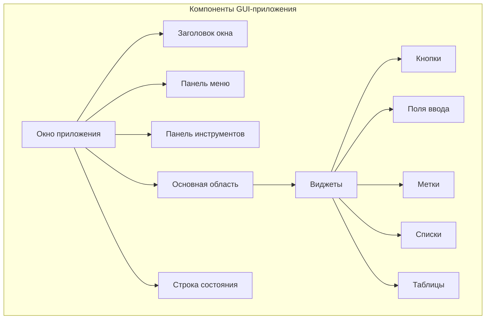
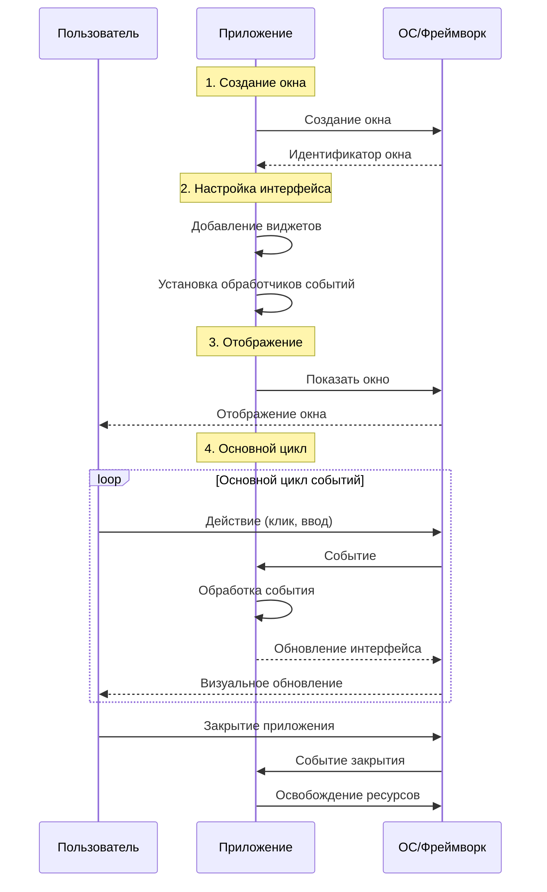
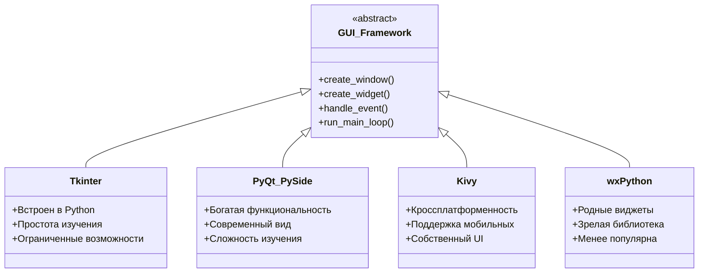
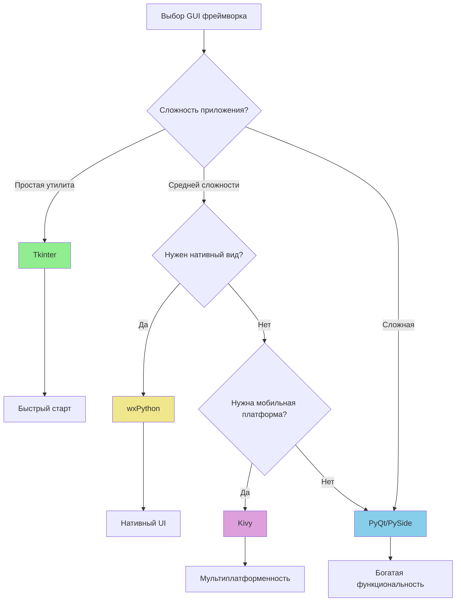
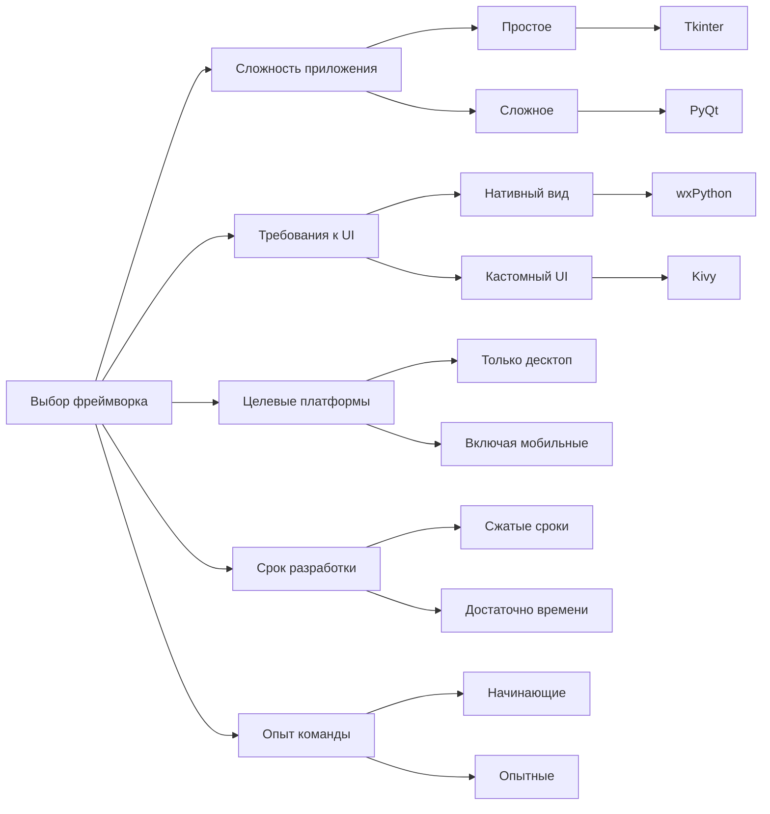
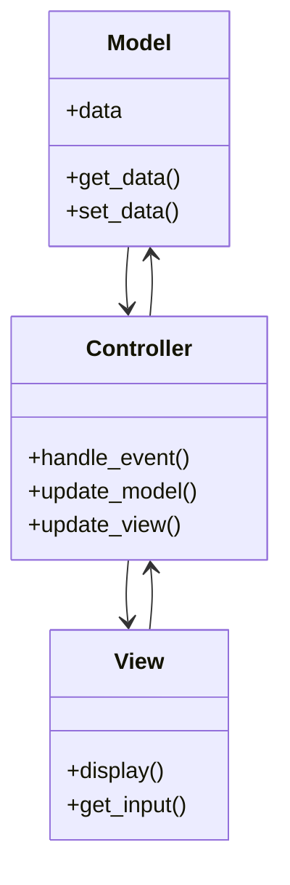

# Лекция 11: Введение в GUI-программирование

## Обзор возможностей для создания графических интерфейсов

### Цель лекции:
- Познакомиться с основными концепциями GUI-программирования
- Изучить различные фреймворки для создания графических интерфейсов
- Сравнить возможности Tkinter, PyQt, Kivy и wxPython
- Выбрать подходящий инструмент для проекта

### План лекции:
1. Основные понятия GUI-программирования
2. Обзор GUI-фреймворков в Python
3. Сравнение возможностей различных фреймворков
4. Выбор подходящего инструмента для проекта
5. Архитектура GUI-приложений
6. Практические рекомендации

---

## 1. Основные понятия GUI-программирования

### Что такое графический пользовательский интерфейс (GUI)?

Графический пользовательский интерфейс (GUI - Graphical User Interface) — это способ взаимодействия пользователя с программой через визуальные элементы: окна, кнопки, меню, поля ввода и другие компоненты. В отличие от текстового интерфейса командной строки, GUI позволяет пользователям взаимодействовать с приложением интуитивно понятным способом, используя мышь, клавиатуру и другие устройства ввода.

### Основные компоненты GUI-приложений



Каждое GUI-приложение состоит из следующих основных компонентов:

- **Окно (Window)** — основной контейнер для всех элементов интерфейса. Окно может быть главным (основным) или диалоговым (вспомогательным).

- **Виджеты (Widgets)** — отдельные элементы интерфейса, такие как кнопки, поля ввода, метки, списки и другие. Виджеты могут быть контейнерами (способными содержать другие виджеты) или простыми (не содержащими других элементов).

- **События (Events)** — действия пользователя или системы, на которые приложение должно реагировать: нажатие кнопки, движение мыши, изменение размера окна и другие.

- **Обработчики событий (Event Handlers)** — функции, которые выполняются при возникновении определенных событий.

- **Менеджеры размещения (Layout Managers)** — механизмы, определяющие положение и размеры виджетов в окне.

### Жизненный цикл GUI-приложения



---

## 2. Обзор GUI-фреймворков в Python

### Сравнение популярных фреймворков

Python предоставляет несколько вариантов для создания графических интерфейсов. Каждый из них имеет свои преимущества и недостатки:



### Подробное рассмотрение фреймворков

#### Tkinter

**Описание:** Tkinter — это стандартный интерфейс Python к библиотеке Tcl/Tk. Он входит в стандартную библиотеку Python, что делает его наиболее доступным вариантом для создания GUI-приложений.

**Преимущества:**
- Встроен в Python — не требует дополнительной установки
- Простой и понятный синтаксис
- Быстрый старт для начинающих
- Хорошая документация на русском и английском языках
- Маленький размер приложений

**Недостатки:**
- Ограниченные возможности кастомизации
- Устаревший внешний вид по умолчанию
- Не подходит для сложных приложений
- Ограниченная поддержка сложных виджетов

**Когда использовать:**
- Простые утилиты и инструменты
- Учебные примеры
- Быстрое прототипирование
- Небольшие административные скрипты

**Пример простейшего приложения:**
```python
import tkinter as tk

root = tk.Tk()
root.title("Мое первое приложение")
root.geometry("400x300")

label = tk.Label(root, text="Привет, мир!")
label.pack(pady=20)

button = tk.Button(root, text="Нажми меня", command=lambda: print("Нажато!"))
button.pack(pady=10)

root.mainloop()
```

#### PyQt/PySide

**Описание:** PyQt (от Riverbank Computing) и PySide (от Qt Company) — это Python-привязки к мощной кроссплатформенной библиотеке Qt. Qt предоставляет богатый набор инструментов для создания современных приложений.

**Преимущества:**
- Богатый набор виджетов и компонентов
- Современный и профессиональный внешний вид
- Мощная система сигналов и слотов
- Поддержка сложных интерфейсов
- Интеграция с Qt Designer для визуального проектирования
- Активное сообщество и хорошая документация

**Недостатки:**
- Более сложный для изучения синтаксис
- Требует установки дополнительных библиотек
- Лицензионные ограничения (GPL для PyQt)
- Больший размер приложений

**Когда использовать:**
- Профессиональные приложения
- Сложные интерфейсы с таблицами, деревьями
- Приложения с базами данных
- Кроссплатформенные приложения

**Пример приложения на PyQt:**
```python
from PyQt5.QtWidgets import QApplication, QMainWindow, QLabel, QPushButton, QVBoxLayout, QWidget

class MainWindow(QMainWindow):
    def __init__(self):
        super().__init__()
        self.setWindowTitle("PyQt приложение")
        self.setGeometry(100, 100, 400, 300)
        
        central_widget = QWidget()
        self.setCentralWidget(central_widget)
        
        layout = QVBoxLayout(central_widget)
        
        label = QLabel("Привет от PyQt!")
        layout.addWidget(label)
        
        button = QPushButton("Нажми меня")
        button.clicked.connect(lambda: print("Нажато!"))
        layout.addWidget(button)

app = QApplication([])
window = MainWindow()
window.show()
app.exec_()
```

#### Kivy

**Описание:** Kivy — это открытая библиотека для создания кроссплатформенных приложений с поддержкой мультитач. Особенно хороша для создания приложений для мобильных устройств.

**Преимущества:**
- Кроссплатформенность (Windows, macOS, Linux, Android, iOS)
- Поддержка мультитач-жестов
- Современный движок графики
- Собственный язык разметки KV

**Недостатки:**
- Собственный UI, отличающийся от нативного
- Более крутая кривая обучения
- Меньше готовых компонентов

**Когда использовать:**
- Мобильные приложения
- Приложения с мультитач
- Нестандартные интерфейсы

#### wxPython

**Описание:** wxPython — это привязка к библиотеке wxWidgets, которая использует родные виджеты операционной системы.

**Преимущества:**
- Использует нативные виджеты ОС
- Профессиональный внешний вид
- Зрелая и стабильная библиотека

**Недостатки:**
- Менее популярен, меньше документации
- Ограниченная поддержка на некоторых платформах

---

## 3. Сравнение возможностей фреймворков

### Таблица сравнения характеристик

| Характеристика | Tkinter | PyQt/PySide | Kivy | wxPython |
|---------------|---------|-------------|------|----------|
| **Простота** | Высокая | Средняя | Средняя | Средняя |
| **Функциональность** | Низкая-Средняя | Высокая | Высокая | Средняя |
| **Внешний вид** | Стандартный | Современный | Кастомный | Нативный |
| **Мобильные платформы** | Нет | Нет | Да | Нет |
| **Документация** | Хорошая | Отличная | Хорошая | Средняя |
| **Размер сообщества** | Большое | Большое | Среднее | Среднее |
| **Встроен в Python** | Да | Нет | Нет | Нет |

### Диаграмма областей применения



### Рекомендации по выбору фреймворка

**Выбирайте Tkinter, если:**
- Вы начинающий изучать GUI-программирование
- Нужно создать простую утилиту
- Важно минимальное количество зависимостей
- Приложение будет работать только на десктопе

**Выбирайте PyQt/PySide, если:**
- Нужен профессиональный внешний вид
- Приложение требует сложных виджетов (таблицы, деревья)
- Важна кроссплатформенность
- Есть время на изучение

**Выбирайте Kivy, если:**
- Нужно создать мобильное приложение
- Требуется поддержка мультитач
- Приложение имеет нестандартный интерфейс

**Выбирайте wxPython, если:**
- Нужен полностью нативный интерфейс
- Важна стабильность и зрелость библиотеки

---

## 4. Выбор подходящего инструмента для проекта

### Критерии выбора фреймворка

При выборе GUI-фреймворка для своего проекта необходимо учитывать следующие факторы:



### Алгоритм принятия решения

1. **Определите целевые платформы**
   - Только десктоп (Windows, macOS, Linux)
   - Включая мобильные (Android, iOS)

2. **Оцените сложность интерфейса**
   - Несколько кнопок и полей ввода
   - Сложные компоненты (таблицы, деревья, графики)

3. **Учтите временные ограничения**
   - Быстрая разработка важнее функциональности
   - Есть время на изучение более сложного фреймворка

4. **Оцените требования к внешнему виду**
   - Достаточно стандартного вида
   - Нужен современный профессиональный UI

---

## 5. Архитектура GUI-приложений

### Основные архитектурные паттерны

При создании GUI-приложений важно правильно организовать структуру кода. Рассмотрим основные архитектурные паттерны:



### Паттерн MVC (Model-View-Controller)

MVC — это классический паттерн, разделяющий приложение на три компонента:

- **Model (Модель)** — отвечает за данные и бизнес-логику
- **View (Представление)** — отвечает за отображение данных пользователю
- **Controller (Контроллер)** — обрабатывает действия пользователя и координирует взаимодействие между Model и View

### Паттерн MVP (Model-View-Presenter)

MVP — это эволюция MVC, где Presenter играет более активную роль:

- **Model (Модель)** — работает с данными
- **View (Представление)** — пассивный компонент отображения
- **Presenter** — содержит всю логику представления

### Паттерн MVVM (Model-View-ViewModel)

MVVM широко используется в современных фреймворках:

- **Model (Модель)** — данные и бизнес-логика
- **View (Представление)** — пользовательский интерфейс
- **ViewModel** — преобразует данные для отображения и обрабатывает команды

---

## 6. Практические рекомендации

### Рекомендации по изучению GUI-программирования

1. **Начните с Tkinter**
   - Изучите основные виджеты: Label, Button, Entry, Text
   - Освойте менеджеры размещения: pack, grid, place
   - Поймите принципы обработки событий

2. **Переходите к более сложным фреймворкам**
   - После освоения Tkinter изучите PyQt
   - Познакомьтесь с сигналами и слотами
   - Изучите Qt Designer для визуального проектирования

3. **Следуйте принципам архитектуры**
   - Разделяйте логику и представление
   - Используйте паттерны проектирования
   - Пишите модульный и переиспользуемый код

### Структура GUI-проекта

```
my_gui_app/
├── main.py              # Точка входа
├── models/              # Модели данных
│   └── __init__.py
├── views/               # Представления
│   └── __init__.py
├── controllers/         # Контроллеры
│   └── __init__.py
├── utils/              # Утилиты
│   └── __init__.py
└── resources/          # Ресурсы
    ├── icons/
    └── styles/
```

---

## Заключение

Выбор GUI-фреймворка зависит от конкретных требований проекта. Для начинающих рекомендуется Tkinter как простейший способ создать графический интерфейс. Для профессиональных приложений с современным внешним видом лучше выбрать PyQt или PySide. Для мобильных приложений подойдет Kivy.

Понимание основных концепций GUI-программирования — виджетов, событий, менеджеров размещения — является фундаментом для работы с любым из этих фреймворков.

---

## Контрольные вопросы:

1. **Что такое GUI и чем оно отличается от CLI (интерфейса командной строки)?**
   - GUI использует визуальные элементы для взаимодействия с пользователем, в то время как CLI основан на текстовых командах.

2. **Какие основные компоненты входят в состав GUI-приложения?**
   - Окно, виджеты, события, обработчики событий, менеджеры размещения.

3. **В чем главное преимущество Tkinter перед другими фреймворками?**
   - Tkinter встроен в Python и не требует дополнительной установки.

4. **Какой фреймворк лучше выбрать для создания мобильного приложения на Python?**
   - Для мобильных приложений рекомендуется Kivy.

5. **Что такое паттерн MVC и какие компоненты он включает?**
   - MVC включает Model (данные), View (отображение) и Controller (управление).

6. **Какой фреймворк следует выбрать для создания профессионального десктопного приложения с современным интерфейсом?**
   - PyQt или PySide.

7. **Какие менеджеры размещения доступны в Tkinter?**
   - pack, grid и place.

8. **Что такое событие в контексте GUI-программирования?**
   - Событие — это действие пользователя или системы, на которое приложение должно реагировать (клик, ввод текста, движение мыши).