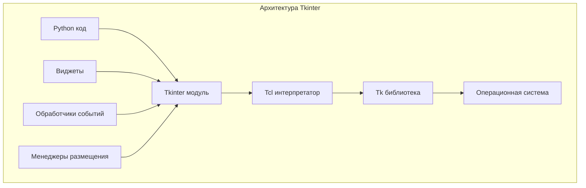
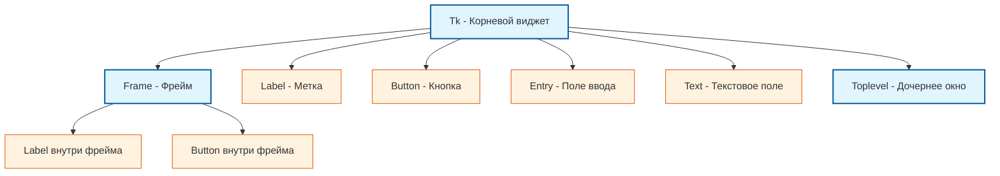
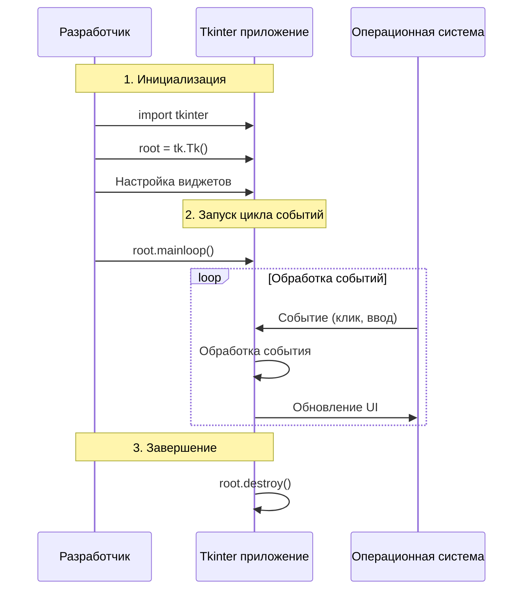
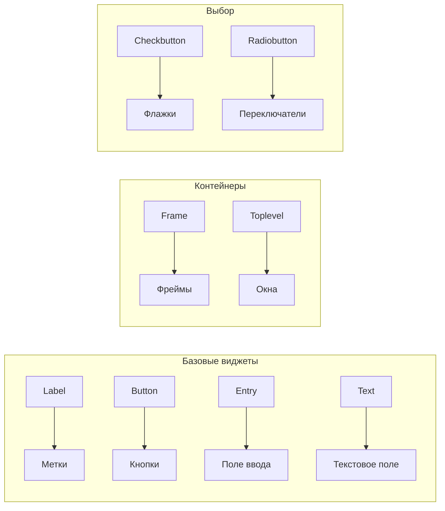
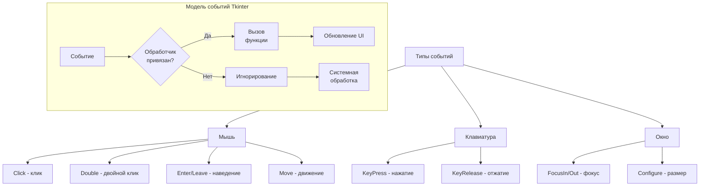
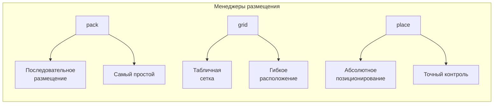

# Лекция 12: Tkinter - основы

## Создание окон, виджеты, события, размещение элементов

### Цель лекции:
- Изучить основы работы с библиотекой Tkinter
- Освоить создание и настройку окон
- Познакомиться с основными виджетами Tkinter
- Изучить принципы обработки событий
- Освоить три менеджера размещения: pack, grid, place

### План лекции:
1. Введение в Tkinter
2. Создание окон
3. Основные виджеты Tkinter
4. События и обработчики
5. Размещение элементов (geometry managers)
6. Практические примеры

---

## 1. Введение в Tkinter

### Что такое Tkinter?

Tkinter — это стандартный интерфейс Python к библиотеке Tcl/Tk, которая используется для создания графических пользовательских интерфейсов. Tkinter входит в стандартную библиотеку Python, что делает его наиболее доступным вариантом для создания GUI-приложений.

### Архитектура Tkinter



### Иерархия виджетов в Tkinter



### Основные понятия Tkinter

- **Widget (виджет)** — графический элемент интерфейса (кнопка, метка, поле ввода и т.д.)
- **Master/Parent widget** — родительский виджет, в котором размещаются другие виджеты
- **Event loop** — цикл событий, который обрабатывает действия пользователя
- **Geometry manager** — менеджер размещения, который определяет, где размещать виджеты

### Простейшее приложение Tkinter

```python
import tkinter as tk

# Создание главного окна
root = tk.Tk()
root.title("Мое первое приложение")
root.geometry("400x300")

# Запуск главного цикла событий
root.mainloop()
```

---

## 2. Создание окон

### Основное окно (Root Window)

Окно в Tkinter создается с помощью класса `Tk`. Это главное окно приложения, которое содержит все остальные виджеты.

```python
import tkinter as tk

class MainApplication:
    def __init__(self):
        # Создание основного окна
        self.root = tk.Tk()
        self.root.title("Главное окно приложения")
        self.root.geometry("600x400")
        
        # Настройки окна
        self.root.resizable(True, True)  # Разрешить изменение размера
        self.root.minsize(400, 300)      # Минимальный размер
        self.root.configure(bg="#f0f0f0")  # Цвет фона
        
        # Центрирование окна на экране
        self.center_window()
        
        # Добавление содержимого
        self.create_widgets()
    
    def center_window(self):
        """Центрирование окна на экране"""
        self.root.update_idletasks()  # Обновление окна перед расчетом
        
        width = self.root.winfo_width()
        height = self.root.winfo_height()
        x = (self.root.winfo_screenwidth() // 2) - (width // 2)
        y = (self.root.winfo_screenheight() // 2) - (height // 2)
        
        self.root.geometry(f"{width}x{height}+{x}+{y}")
    
    def create_widgets(self):
        """Создание виджетов приложения"""
        # Метка с приветствием
        label = tk.Label(self.root, text="Добро пожаловать в приложение!", 
                        font=("Arial", 16), fg="blue", bg="#f0f0f0")
        label.pack(pady=20)
    
    def run(self):
        """Запуск приложения"""
        self.root.mainloop()

# Запуск приложения
if __name__ == "__main__":
    app = MainApplication()
    app.run()
```

### Жизненный цикл Tkinter-приложения



### Дочерние окна (Toplevel)

Для создания дополнительных окон используется виджет `Toplevel`. Это позволяет создавать модальные диалоговые окна или многооконные приложения.

```python
import tkinter as tk
from tkinter import messagebox

class ApplicationWithDialogs:
    def __init__(self):
        self.root = tk.Tk()
        self.root.title("Приложение с диалогами")
        self.root.geometry("400x300")
        
        self.create_main_widgets()
    
    def create_main_widgets(self):
        # Кнопка для открытия дочернего окна
        dialog_btn = tk.Button(self.root, text="Открыть диалог", 
                              command=self.open_dialog)
        dialog_btn.pack(pady=20)
        
        # Кнопка для открытия сообщения
        msg_btn = tk.Button(self.root, text="Показать сообщение", 
                           command=self.show_message)
        msg_btn.pack(pady=10)
    
    def open_dialog(self):
        """Открытие дочернего окна"""
        dialog = tk.Toplevel(self.root)
        dialog.title("Диалоговое окно")
        dialog.geometry("300x200")
        dialog.transient(self.root)  # Окно поверх основного
        dialog.grab_set()  # Блокировка основного окна
        
        # Содержимое диалога
        label = tk.Label(dialog, text="Это дочернее окно")
        label.pack(pady=20)
        
        close_btn = tk.Button(dialog, text="Закрыть", 
                             command=dialog.destroy)
        close_btn.pack(pady=10)
    
    def show_message(self):
        """Показать диалоговое сообщение"""
        messagebox.showinfo("Информация", "Это информационное сообщение!")
    
    def run(self):
        self.root.mainloop()

# Запуск приложения
if __name__ == "__main__":
    app = ApplicationWithDialogs()
    app.run()
```

---

## 3. Основные виджеты Tkinter

### Обзор основных виджетов



### Метки (Label)

Метки используются для отображения текста или изображений. Они не реагируют на действия пользователя.

```python
import tkinter as tk

root = tk.Tk()
root.title("Метки в Tkinter")
root.geometry("500x400")

# Простая метка
simple_label = tk.Label(root, text="Простая метка")
simple_label.pack(pady=5)

# Метка с настройками
styled_label = tk.Label(
    root,
    text="Стилизованная метка",
    font=("Arial", 14, "bold"),
    fg="white",
    bg="navy",
    padx=20,
    pady=10
)
styled_label.pack(pady=5)

# Многострочная метка
multiline_label = tk.Label(
    root,
    text="Это многострочная\nметка с переносом\nтекста",
    justify=tk.LEFT,
    relief=tk.RAISED,
    bd=2
)
multiline_label.pack(pady=5)

root.mainloop()
```

### Кнопки (Button)

Кнопки — это интерактивные элементы, которые реагируют на нажатия. При создании кнопки необходимо указать функцию-обработчик через параметр `command`.

```python
import tkinter as tk

root = tk.Tk()
root.title("Кнопки в Tkinter")
root.geometry("500x400")

# Простая кнопка с обработчиком
def simple_callback():
    print("Кнопка нажата!")

simple_btn = tk.Button(root, text="Простая кнопка", command=simple_callback)
simple_btn.pack(pady=5)

# Стилизованная кнопка
styled_btn = tk.Button(
    root,
    text="Стилизованная кнопка",
    font=("Arial", 12, "italic"),
    fg="white",
    bg="red",
    activebackground="darkred",
    activeforeground="white",
    padx=20,
    pady=10
)
styled_btn.pack(pady=5)

# Кнопка-переключатель
state = True
def toggle_button():
    global state
    state = not state
    toggle_btn.config(text="Вкл" if state else "Выкл")

toggle_btn = tk.Button(root, text="Выкл", width=10, command=toggle_button)
toggle_btn.pack(pady=5)

# Кнопка с подсказкой
def show_tooltip(event):
    tooltip = tk.Toplevel()
    tooltip.wm_overrideredirect(True)
    tooltip.geometry(f"+{event.x_root+10}+{event.y_root+10}")
    label = tk.Label(tooltip, text="Это подсказка", bg="yellow", relief="solid")
    label.pack()
    
    def hide_tooltip(event):
        tooltip.destroy()
    
    toggle_btn.bind("<Leave>", hide_tooltip)

toggle_btn.bind("<Enter>", show_tooltip)

root.mainloop()
```

### Поля ввода (Entry и Text)

Поле `Entry` используется для ввода одной строки текста, а `Text` — для многострочного ввода.

```python
import tkinter as tk

root = tk.Tk()
root.title("Поля ввода в Tkinter")
root.geometry("600x500")

# Поле ввода одной строки (Entry)
tk.Label(root, text="Поле ввода (Entry):").pack(anchor="w", padx=10, pady=5)
entry = tk.Entry(root, width=30)
entry.pack(padx=10, pady=5)

# Поле ввода с маской (для паролей)
tk.Label(root, text="Поле ввода пароля:").pack(anchor="w", padx=10, pady=5)
password_entry = tk.Entry(root, width=30, show="*")
password_entry.pack(padx=10, pady=5)

# Текстовое поле (Text) - многострочный ввод
tk.Label(root, text="Текстовое поле (Text):").pack(anchor="w", padx=10, pady=5)
text_area = tk.Text(root, height=8, width=50)
text_area.pack(padx=10, pady=5)

# Кнопки для работы с текстом
button_frame = tk.Frame(root)
button_frame.pack(pady=10)

def get_text():
    content = text_area.get("1.0", tk.END)
    print("Содержимое текстового поля:")
    print(content)

def insert_text():
    text_area.insert(tk.END, "\nДобавленный текст")

def clear_text():
    text_area.delete("1.0", tk.END)

tk.Button(button_frame, text="Получить текст", command=get_text).pack(side=tk.LEFT, padx=5)
tk.Button(button_frame, text="Вставить текст", command=insert_text).pack(side=tk.LEFT, padx=5)
tk.Button(button_frame, text="Очистить", command=clear_text).pack(side=tk.LEFT, padx=5)

# Поле ввода с прокруткой
tk.Label(root, text="Текстовое поле с прокруткой:").pack(anchor="w", padx=10, pady=5)

text_frame = tk.Frame(root)
text_frame.pack(padx=10, pady=5, fill=tk.BOTH, expand=True)

scrollable_text = tk.Text(text_frame, height=6, wrap=tk.WORD)
scrollbar = tk.Scrollbar(text_frame, orient=tk.VERTICAL, command=scrollable_text.yview)
scrollable_text.configure(yscrollcommand=scrollbar.set)

scrollable_text.pack(side=tk.LEFT, fill=tk.BOTH, expand=True)
scrollbar.pack(side=tk.RIGHT, fill=tk.Y)

root.mainloop()
```

### Валидация ввода

Валидация ввода — важная часть любого GUI-приложения. Tkinter предоставляет несколько способов проверки данных, вводимых пользователем.

#### Валидация в виджете Entry

Виджет `Entry` поддерживает валидацию через параметр `validatecommand`. Это позволяет проверять ввод в реальном времени и отклонять недопустимые символы.

```python
import tkinter as tk
from tkinter import messagebox

class ValidationDemo:
    def __init__(self):
        self.root = tk.Tk()
        self.root.title("Валидация ввода")
        self.root.geometry("500x400")
        
        self.create_validated_inputs()
    
    def create_validated_inputs(self):
        # Проверка только цифр (для телефона)
        phone_frame = tk.Frame(self.root)
        phone_frame.pack(pady=10, padx=10, anchor="w")
        
        tk.Label(phone_frame, text="Телефон:").pack(side="left")
        
        self.phone_var = tk.StringVar()
        self.phone_entry = tk.Entry(phone_frame, textvariable=self.phone_var, width=20)
        self.phone_entry.pack(side="left", padx=5)
        
        # Валидатор
        vcmd = (self.root.register(self.validate_phone), '%P')
        self.phone_entry.config(validate="key", validatecommand=vcmd)
        
        # Проверка email
        email_frame = tk.Frame(self.root)
        email_frame.pack(pady=10, padx=10, anchor="w")
        
        tk.Label(email_frame, text="Email:").pack(side="left")
        
        self.email_var = tk.StringVar()
        self.email_entry = tk.Entry(email_frame, textvariable=self.email_var, width=20)
        self.email_entry.pack(side="left", padx=5)
        
        # Валидация при потере фокуса
        vcmd_email = (self.root.register(self.validate_email), '%P')
        self.email_entry.config(validate="focusout", validatecommand=vcmd_email)
        
        # Проверка возраста (числа в диапазоне)
        age_frame = tk.Frame(self.root)
        age_frame.pack(pady=10, padx=10, anchor="w")
        
        tk.Label(age_frame, text="Возраст:").pack(side="left")
        
        self.age_var = tk.IntVar()
        self.age_entry = tk.Entry(age_frame, textvariable=self.age_var, width=10)
        self.age_entry.pack(side="left", padx=5)
        
        vcmd_age = (self.root.register(self.validate_age), '%P')
        self.age_entry.config(validate="key", validatecommand=vcmd_age)
        
        # Кнопка проверки всей формы
        tk.Button(self.root, text="Проверить форму", 
                 command=self.validate_form).pack(pady=20)
        
        # Метка для отображения ошибок
        self.error_label = tk.Label(self.root, text="", fg="red")
        self.error_label.pack(pady=10)
    
    def validate_phone(self, new_value):
        """Валидация номера телефона - только цифры, +, - и пробелы"""
        if new_value == "":
            return True
        # Разрешаем только цифры и некоторые символы
        allowed = set("0123456789+ -()")
        return all(c in allowed for c in new_value)
    
    def validate_email(self, new_value):
        """Валидация email - базовая проверка формата"""
        if new_value == "":
            return True
        # Простая проверка: должен содержать @ и .
        if '@' not in new_value or '.' not in new_value:
            self.error_label.config(text="Некорректный email!")
            return False
        self.error_label.config(text="")
        return True
    
    def validate_age(self, new_value):
        """Валидация возраста - только цифры от 1 до 150"""
        if new_value == "":
            return True
        if not new_value.isdigit():
            return False
        age = int(new_value)
        return 1 <= age <= 150
    
    def validate_form(self):
        """Проверка всей формы"""
        errors = []
        
        phone = self.phone_var.get()
        if not phone:
            errors.append("Телефон обязателен")
        
        email = self.email_var.get()
        if not email or '@' not in email or '.' not in email:
            errors.append("Некорректный email")
        
        try:
            age = self.age_var.get()
            if age < 1 or age > 150:
                errors.append("Возраст должен быть от 1 до 150")
        except tk.TclError:
            errors.append("Некорректный возраст")
        
        if errors:
            messagebox.showerror("Ошибки валидации", "\n".join(errors))
        else:
            messagebox.showinfo("Успех", "Форма заполнена корректно!")
    
    def run(self):
        self.root.mainloop()

if __name__ == "__main__":
    app = ValidationDemo()
    app.run()
```

#### Ограничение на количество символов

```python
import tkinter as tk

class LengthValidationDemo:
    def __init__(self):
        self.root = tk.Tk()
        self.root.title("Ограничение длины ввода")
        
        # Поле с ограничением длины
        tk.Label(self.root, text="Имя пользователя (макс. 20 символов):").pack(pady=5)
        
        self.name_var = tk.StringVar()
        name_entry = tk.Entry(self.root, textvariable=self.name_var, width=25)
        name_entry.pack(pady=5)
        
        # Ограничение через обработку событий
        def limit_length(*args):
            if len(self.name_var.get()) > 20:
                self.name_var.set(self.name_var.get()[:20])
        
        self.name_var.trace("w", limit_length)
        
        # Поле для пароля
        tk.Label(self.root, text="Пароль (8-20 символов):").pack(pady=(20, 5))
        
        self.password_var = tk.StringVar()
        password_entry = tk.Entry(self.root, textvariable=self.password_var, show="*", width=25)
        password_entry.pack(pady=5)
        
        # Индикатор надежности пароля
        self.strength_label = tk.Label(self.root, text="", fg="gray")
        self.strength_label.pack(pady=5)
        
        self.password_var.trace("w", self.check_password_strength)
        
        self.root.mainloop()
    
    def check_password_strength(self, *args):
        password = self.password_var.get()
        length = len(password)
        
        if length == 0:
            self.strength_label.config(text="", fg="gray")
        elif length < 8:
            self.strength_label.config(text="Слишком короткий", fg="red")
        elif length < 12:
            self.strength_label.config(text="Средний", fg="orange")
        else:
            self.strength_label.config(text="Надежный", fg="green")

if __name__ == "__main__":
    app = LengthValidationDemo()
```

#### Визуальная индикация ошибок

```python
import tkinter as tk
from tkinter import ttk

class VisualValidationDemo:
    def __init__(self):
        self.root = tk.Tk()
        self.root.title("Визуальная валидация")
        
        self.create_form()
    
    def create_form(self):
        form_frame = tk.Frame(self.root, padx=20, pady=20)
        form_frame.pack()
        
        # Имя пользователя
        tk.Label(form_frame, text="Имя:").grid(row=0, column=0, sticky="w", pady=5)
        
        self.name_entry = tk.Entry(form_frame, width=25)
        self.name_entry.grid(row=0, column=1, pady=5, padx=5)
        
        self.name_error = tk.Label(form_frame, text="", fg="red", font=("Arial", 8))
        self.name_error.grid(row=1, column=1, sticky="w")
        
        # Email
        tk.Label(form_frame, text="Email:").grid(row=2, column=0, sticky="w", pady=5)
        
        self.email_entry = tk.Entry(form_frame, width=25)
        self.email_entry.grid(row=2, column=1, pady=5, padx=5)
        
        self.email_error = tk.Label(form_frame, text="", fg="red", font=("Arial", 8))
        self.email_error.grid(row=3, column=1, sticky="w")
        
        # Привязка событий валидации
        self.name_entry.bind("<FocusOut>", lambda e: self.validate_name())
        self.email_entry.bind("<FocusOut>", lambda e: self.validate_email())
        
        # Кнопка отправки
        tk.Button(form_frame, text="Отправить", 
                 command=self.submit_form).grid(row=4, column=0, columnspan=2, pady=20)
    
    def validate_name(self):
        name = self.name_entry.get().strip()
        
        if not name:
            self.name_entry.config(bg="#ffcccc")
            self.name_error.config(text="Имя обязательно")
            return False
        elif len(name) < 2:
            self.name_entry.config(bg="#ffcccc")
            self.name_error.config(text="Минимум 2 символа")
            return False
        else:
            self.name_entry.config(bg="white")
            self.name_error.config(text="")
            return True
    
    def validate_email(self):
        email = self.email_entry.get().strip()
        
        if not email:
            self.email_entry.config(bg="#ffcccc")
            self.email_error.config(text="Email обязателен")
            return False
        elif '@' not in email or '.' not in email:
            self.email_entry.config(bg="#ffcccc")
            self.email_error.config(text="Некорректный формат")
            return False
        else:
            self.email_entry.config(bg="white")
            self.email_error.config(text="")
            return True
    
    def submit_form(self):
        name_valid = self.validate_name()
        email_valid = self.validate_email()
        
        if name_valid and email_valid:
            from tkinter import messagebox
            messagebox.showinfo("Успех", "Форма успешно отправлена!")
    
    def run(self):
        self.root.mainloop()

if __name__ == "__main__":
    app = VisualValidationDemo()
    app.run()
```

#### Регулярные выражения для валидации

```python
import tkinter as tk
import re

class RegexValidationDemo:
    def __init__(self):
        self.root = tk.Tk()
        self.root.title("Валидация с регулярными выражениями")
        
        # Шаблоны для проверки
        self.patterns = {
            'email': r'^[a-zA-Z0-9._%+-]+@[a-zA-Z0-9.-]+\.[a-zA-Z]{2,}$',
            'phone': r'^\+?[0-9]{10,15}$',
            'url': r'^https?://[a-zA-Z0-9.-]+\.[a-zA-Z]{2,}(/.*)?$',
            'ip': r'^((25[0-5]|2[0-4][0-9]|[01]?[0-9][0-9]?)\.){3}(25[0-5]|2[0-4][0-9]|[01]?[0-9][0-9]?)$'
        }
        
        self.create_validators()
    
    def create_validators(self):
        # Email
        self.create_validator_row("Email", "email", "example@domain.com")
        
        # Телефон
        self.create_validator_row("Телефон", "phone", "+79001234567")
        
        # URL
        self.create_validator_row("URL", "url", "https://example.com")
        
        # IP адрес
        self.create_validator_row("IP адрес", "ip", "192.168.1.1")
    
    def create_validator_row(self, label, pattern_key, placeholder):
        frame = tk.Frame(self.root)
        frame.pack(pady=5, padx=10, anchor="w")
        
        tk.Label(frame, text=f"{label}:", width=12, anchor="w").pack(side="left")
        
        var = tk.StringVar()
        entry = tk.Entry(frame, textvariable=var, width=30)
        entry.pack(side="left", padx=5)
        entry.insert(0, placeholder)
        
        result_label = tk.Label(frame, text="", width=15)
        result_label.pack(side="left", padx=5)
        
        # Валидация при изменении
        def validate(*args):
            value = var.get()
            pattern = self.patterns[pattern_key]
            
            if re.match(pattern, value):
                result_label.config(text="✓ Валидно", fg="green")
            else:
                result_label.config(text="✗ Невалидно", fg="red")
        
        var.trace("w", validate)
        validate()  # Initial check
    
    def run(self):
        self.root.mainloop()

if __name__ == "__main__":
    app = RegexValidationDemo()
    app.run()
```

#### Типы валидации в Entry

| Тип | Описание | Когда вызывается |
|-----|----------|-----------------|
| `'focusin'` | При получении фокуса | При клике на поле |
| `'focusout'` | При потере фокуса | При уходе с поля |
| `'key'` | При изменении текста | При каждом нажатии клавиши |
| `'all'` | При любом изменении | Во всех случаях |

---

## 4. События и обработчики

### Флажки и переключатели (Checkbutton, Radiobutton)

Флажки (`Checkbutton`) позволяют выбирать несколько вариантов, а переключатели (`Radiobutton`) — только один из группы.

```python
import tkinter as tk

root = tk.Tk()
root.title("Флажки и переключатели")
root.geometry("600x400")

# Фрейм для флажков
check_frame = tk.LabelFrame(root, text="Флажки (Checkbuttons)", padx=10, pady=10)
check_frame.pack(fill="x", padx=10, pady=10)

# Переменные для флажков
var1 = tk.BooleanVar()
var2 = tk.BooleanVar()
var3 = tk.IntVar()

tk.Checkbutton(check_frame, text="Первый вариант", variable=var1).pack(anchor="w")
tk.Checkbutton(check_frame, text="Второй вариант", variable=var2).pack(anchor="w")
tk.Checkbutton(check_frame, text="Третий вариант", variable=var3, onvalue=1, offvalue=0).pack(anchor="w")

# Фрейм для переключателей
radio_frame = tk.LabelFrame(root, text="Переключатели (Radiobuttons)", padx=10, pady=10)
radio_frame.pack(fill="x", padx=10, pady=10)

# Переменная для группы переключателей
selected_option = tk.StringVar(value="option1")

tk.Radiobutton(radio_frame, text="Вариант 1", variable=selected_option, value="option1").pack(anchor="w")
tk.Radiobutton(radio_frame, text="Вариант 2", variable=selected_option, value="option2").pack(anchor="w")
tk.Radiobutton(radio_frame, text="Вариант 3", variable=selected_option, value="option3").pack(anchor="w")

# Кнопка для получения значений
def get_values():
    print(f"Флажки: {var1.get()}, {var2.get()}, {var3.get()}")
    print(f"Переключатель: {selected_option.get()}")

tk.Button(root, text="Получить значения", command=get_values).pack(pady=20)

root.mainloop()
```

### Модель событий в Tkinter



### Обработка событий мыши и клавиатуры

```python
import tkinter as tk

class EventHandlingDemo:
    def __init__(self):
        self.root = tk.Tk()
        self.root.title("Обработка событий")
        self.root.geometry("600x500")
        
        # Метка для отображения событий
        self.event_label = tk.Label(self.root, text="События будут отображаться здесь", 
                                   bg="lightgray", height=5)
        self.event_label.pack(fill="x", padx=10, pady=10)
        
        # Холст для рисования
        self.canvas = tk.Canvas(self.root, bg="white", width=500, height=300)
        self.canvas.pack(padx=10, pady=10)
        
        # Привязка событий
        self.bind_events()
        
        # Кнопка для демонстрации горячих клавиш
        self.shortcut_btn = tk.Button(self.root, text="Кнопка (Ctrl+B)", 
                                     command=self.button_clicked)
        self.shortcut_btn.pack(pady=10)
        
        # Поле ввода для демонстрации событий клавиатуры
        self.entry = tk.Entry(self.root, width=50)
        self.entry.pack(pady=5)
        self.entry.bind("<KeyRelease>", self.on_key_release)
    
    def bind_events(self):
        # События мыши
        self.canvas.bind("<Button-1>", self.left_click)
        self.canvas.bind("<Button-3>", self.right_click)
        self.canvas.bind("<Motion>", self.mouse_move)
        self.canvas.bind("<Double-Button-1>", self.double_click)
        
        # События клавиатуры
        self.root.bind("<KeyPress>", self.key_press)
        self.root.bind("<Control-b>", self.ctrl_b_pressed)
        
        # События окна
        self.root.bind("<FocusIn>", self.focus_in)
        self.root.bind("<FocusOut>", self.focus_out)
    
    def left_click(self, event):
        self.event_label.config(text=f"Левый клик: ({event.x}, {event.y})")
        self.canvas.create_oval(event.x-5, event.y-5, event.x+5, event.y+5, 
                               fill="red", outline="black")
    
    def right_click(self, event):
        self.event_label.config(text=f"Правый клик: ({event.x}, {event.y})")
        self.canvas.create_rectangle(event.x-10, event.y-10, event.x+10, event.y+10, 
                                    fill="blue", outline="black")
    
    def mouse_move(self, event):
        if event.x % 5 == 0 and event.y % 5 == 0:
            self.event_label.config(text=f"Позиция мыши: ({event.x}, {event.y})")
    
    def double_click(self, event):
        self.event_label.config(text=f"Двойной клик: ({event.x}, {event.y})")
        self.canvas.delete("all")
    
    def key_press(self, event):
        self.event_label.config(text=f"Клавиша: {event.keysym}, Код: {event.keycode}")
    
    def ctrl_b_pressed(self, event):
        self.event_label.config(text="Нажата комбинация Ctrl+B")
        self.shortcut_btn.config(bg="yellow")
        self.root.after(500, lambda: self.shortcut_btn.config(bg="SystemButtonFace"))
        return "break"
    
    def button_clicked(self):
        self.event_label.config(text="Кнопка нажата")
    
    def on_key_release(self, event):
        self.event_label.config(text=f"Отпущена клавиша: {event.keysym}")
    
    def focus_in(self, event):
        self.event_label.config(text="Окно получило фокус")
    
    def focus_out(self, event):
        self.event_label.config(text="Окно потеряло фокус")
    
    def run(self):
        self.root.mainloop()

if __name__ == "__main__":
    app = EventHandlingDemo()
    app.run()
```

### Основные события Tkinter

| Событие | Описание |
|---------|----------|
| `<Button-1>` | Нажатие левой кнопки мыши |
| `<Button-3>` | Нажатие правой кнопки мыши |
| `<Double-Button-1>` | Двойной клик левой кнопкой |
| `<Motion>` | Движение мыши |
| `<Enter>` | Курсор вошёл на виджет |
| `<Leave>` | Курсор покинул виджет |
| `<KeyPress>` | Нажатие клавиши |
| `<FocusIn>` | Получение фокуса |
| `<FocusOut>` | Потеря фокуса |
| `<Configure>` | Изменение размера/положения |

### Контекстное меню

```python
import tkinter as tk

class ContextMenuDemo:
    def __init__(self):
        self.root = tk.Tk()
        self.root.title("Контекстное меню")
        self.root.geometry("500x400")
        
        # Создание контекстного меню
        self.context_menu = tk.Menu(self.root, tearoff=0)
        self.context_menu.add_command(label="Копировать", command=self.copy_text)
        self.context_menu.add_command(label="Вставить", command=self.paste_text)
        self.context_menu.add_separator()
        self.context_menu.add_command(label="Очистить", command=self.clear_text)
        
        # Текстовое поле
        self.text_area = tk.Text(self.root, height=15, width=60)
        self.text_area.pack(padx=10, pady=10)
        
        # Привязка правой кнопки мыши
        self.text_area.bind("<Button-3>", self.show_context_menu)
        self.text_area.bind("<Control-Button-1>", self.show_context_menu)
    
    def show_context_menu(self, event):
        try:
            self.context_menu.tk_popup(event.x_root, event.y_root)
        finally:
            self.context_menu.grab_release()
    
    def copy_text(self):
        try:
            selected_text = self.text_area.get(tk.SEL_FIRST, tk.SEL_LAST)
            self.root.clipboard_clear()
            self.root.clipboard_append(selected_text)
        except tk.TclError:
            pass
    
    def paste_text(self):
        try:
            clipboard_text = self.root.clipboard_get()
            self.text_area.insert(tk.INSERT, clipboard_text)
        except tk.TclError:
            pass
    
    def clear_text(self):
        self.text_area.delete(1.0, tk.END)
    
    def run(self):
        self.root.mainloop()

if __name__ == "__main__":
    app = ContextMenuDemo()
    app.run()
```

---

## 5. Размещение элементов (Geometry Managers)

### Обзор менеджеров размещения



### Pack Manager

Менеджер `pack` размещает виджеты последовательно, один за другим. Это самый простой менеджер.

```python
import tkinter as tk

root = tk.Tk()
root.title("Pack Manager")
root.geometry("500x400")

# Пример 1: Простое размещение
tk.Label(root, text="Label 1", bg="red", fg="white").pack()
tk.Label(root, text="Label 2", bg="green", fg="white").pack()
tk.Label(root, text="Label 3", bg="blue", fg="white").pack()

# Пример 2: Размещение с параметрами
frame1 = tk.Frame(root, bg="lightgray", height=100)
frame1.pack(fill="x", padx=10, pady=5)

tk.Label(frame1, text="Слева", bg="yellow").pack(side="left", padx=5)
tk.Label(frame1, text="По центру", bg="orange").pack(side="left", padx=5)
tk.Label(frame1, text="Справа", bg="purple", fg="white").pack(side="right", padx=5)

# Пример 3: Заполнение пространства
frame2 = tk.Frame(root, bg="lightblue", height=150)
frame2.pack(fill="both", expand=True, padx=10, pady=5)

tk.Label(frame2, text="Растянутый Label", bg="pink").pack(fill="both", expand=True, padx=10, pady=10)

root.mainloop()
```

**Основные параметры pack:**

| Параметр | Описание |
|----------|----------|
| `side` | Сторона размещения: `tk.TOP`, `tk.BOTTOM`, `tk.LEFT`, `tk.RIGHT` |
| `fill` | Заполнение: `tk.NONE`, `tk.X`, `tk.Y`, `tk.BOTH` |
| `expand` | Расширение на доступное пространство |
| `padx`, `pady` | Внешние отступы |
| `ipadx`, `ipady` | Внутренние отступы |
| `anchor` | Позиционирование внутри контейнера |

### Grid Manager

Менеджер `grid` размещает виджеты в табличной сетке. Это наиболее гибкий менеджер для создания форм.

```python
import tkinter as tk

root = tk.Tk()
root.title("Grid Manager")
root.geometry("600x500")

# Создание формы входа
tk.Label(root, text="Форма входа", font=("Arial", 16, "bold")).grid(row=0, column=0, columnspan=2, pady=20)

# Поля ввода
tk.Label(root, text="Имя пользователя:").grid(row=1, column=0, sticky="e", padx=5, pady=5)
username_entry = tk.Entry(root, width=30)
username_entry.grid(row=1, column=1, padx=5, pady=5)

tk.Label(root, text="Пароль:").grid(row=2, column=0, sticky="e", padx=5, pady=5)
password_entry = tk.Entry(root, width=30, show="*")
password_entry.grid(row=2, column=1, padx=5, pady=5)

# Чекбоксы
remember_var = tk.BooleanVar()
tk.Checkbutton(root, text="Запомнить меня", variable=remember_var).grid(row=3, column=1, sticky="w", padx=5, pady=5)

# Кнопки
button_frame = tk.Frame(root)
button_frame.grid(row=4, column=0, columnspan=2, pady=20)

tk.Button(button_frame, text="Вход", bg="lightgreen").pack(side="left", padx=5)
tk.Button(button_frame, text="Отмена", bg="lightcoral").pack(side="left", padx=5)

# Таблица данных
tk.Label(root, text="Таблица данных", font=("Arial", 14)).grid(row=5, column=0, columnspan=2, pady=20)

# Заголовки таблицы
headers = ["Имя", "Возраст", "Город"]
for col, header in enumerate(headers):
    tk.Label(root, text=header, relief="raised", bg="lightgray", font=("Arial", 10, "bold")).grid(row=6, column=col, sticky="ew", padx=1, pady=1)

# Данные таблицы
data = [
    ["Иван", "25", "Москва"],
    ["Мария", "30", "СПб"],
    ["Алексей", "22", "Новосибирск"]
]

for row_idx, row_data in enumerate(data):
    for col_idx, cell_data in enumerate(row_data):
        tk.Label(root, text=cell_data, relief="sunken", padx=5, pady=2).grid(row=7+row_idx, column=col_idx, sticky="ew", padx=1, pady=1)

# Настройка растягивания колонок
root.columnconfigure(0, weight=1)
root.columnconfigure(1, weight=1)

root.mainloop()
```

**Основные параметры grid:**

| Параметр | Описание |
|----------|----------|
| `row`, `column` | Позиция в сетке |
| `rowspan`, `columnspan` | Объединение ячеек |
| `sticky` | Привязка к сторонам: `N`, `S`, `E`, `W`, `NE`, и т.д. |
| `padx`, `pady` | Внешние отступы |
| `ipadx`, `ipady` | Внутренние отступы |

### Place Manager

Менеджер `place` позволяет точно позиционировать виджеты по координатам или относительным координатам.

```python
import tkinter as tk

root = tk.Tk()
root.title("Place Manager")
root.geometry("600x400")
root.configure(bg="lightgray")

# Точное позиционирование
label1 = tk.Label(root, text="Label 1", bg="red", fg="white", padx=20, pady=10)
label1.place(x=50, y=50)

# Относительное позиционирование
label2 = tk.Label(root, text="Label 2", bg="green", fg="white", padx=20, pady=10)
label2.place(relx=0.5, rely=0.3, anchor="center")

# Позиционирование в углу
label3 = tk.Label(root, text="Label 3", bg="blue", fg="white", padx=20, pady=10)
label3.place(relx=1.0, rely=0.0, anchor="ne")

# Кнопка в правом нижнем углу
button = tk.Button(root, text="Кнопка", bg="yellow")
button.place(relx=1.0, rely=1.0, anchor="se")

# Круговая диаграмма
canvas = tk.Canvas(root, width=200, height=200, bg="white", highlightthickness=2)
canvas.place(relx=0.5, rely=0.7, anchor="center")

canvas.create_arc(20, 20, 180, 180, start=0, extent=120, fill="red", outline="black")
canvas.create_arc(20, 20, 180, 180, start=120, extent=120, fill="green", outline="black")
canvas.create_arc(20, 20, 180, 180, start=240, extent=120, fill="blue", outline="black")

root.mainloop()
```

**Основные параметры place:**

| Параметр | Описание |
|----------|----------|
| `x`, `y` | Абсолютные координаты |
| `relx`, `rely` | Относительные координаты (0.0 - 1.0) |
| `anchor` | Точка привязки: `N`, `S`, `E`, `W`, `NE`, `NW`, `SE`, `SW`, `CENTER` |
| `width`, `height` | Ширина и высота |
| `relwidth`, `relheight` | Относительная ширина и высота |

### Комбинация менеджеров размещения

Разные менеджеры можно комбинировать в одном приложении, используя каждый для своих целей.

```python
import tkinter as tk

class LayoutCombinationDemo:
    def __init__(self):
        self.root = tk.Tk()
        self.root.title("Комбинация менеджеров размещения")
        self.root.geometry("800x600")
        
        self.create_layout()
    
    def create_layout(self):
        # Основной фрейм с pack
        main_frame = tk.Frame(self.root, bg="lightgray")
        main_frame.pack(fill="both", expand=True, padx=10, pady=10)
        
        # Верхняя панель с pack
        top_panel = tk.Frame(main_frame, bg="navy", height=50)
        top_panel.pack(fill="x")
        
        tk.Label(top_panel, text="Верхняя панель", fg="white", bg="navy", font=("Arial", 12)).pack(pady=10)
        
        # Центральная область с grid
        center_frame = tk.Frame(main_frame, bg="lightblue")
        center_frame.pack(fill="both", expand=True, pady=5)
        
        for i in range(3):
            for j in range(3):
                btn = tk.Button(center_frame, text=f"Кнопка {i},{j}", width=10, height=2)
                btn.grid(row=i, column=j, padx=5, pady=5, sticky="nsew")
        
        for i in range(3):
            center_frame.grid_rowconfigure(i, weight=1)
            center_frame.grid_columnconfigure(i, weight=1)
        
        # Нижняя панель с place
        bottom_frame = tk.Frame(main_frame, bg="darkgreen", height=100)
        bottom_frame.pack(fill="x", pady=(5, 0))
        
        left_label = tk.Label(bottom_frame, text="Слева", bg="darkgreen", fg="white")
        left_label.place(relx=0.1, rely=0.5, anchor="center")
        
        center_label = tk.Label(bottom_frame, text="По центру", bg="darkgreen", fg="white")
        center_label.place(relx=0.5, rely=0.5, anchor="center")
        
        right_label = tk.Label(bottom_frame, text="Справа", bg="darkgreen", fg="white")
        right_label.place(relx=0.9, rely=0.5, anchor="center")
        
        corner_btn = tk.Button(bottom_frame, text="Угол", bg="red", fg="white")
        corner_btn.place(relx=0.98, rely=0.95, anchor="se")
    
    def run(self):
        self.root.mainloop()

if __name__ == "__main__":
    app = LayoutCombinationDemo()
    app.run()
```

---

## 6. Практические примеры

### Пример 1: Простой калькулятор

```python
import tkinter as tk
from tkinter import messagebox

class SimpleCalculator:
    def __init__(self):
        self.root = tk.Tk()
        self.root.title("Простой калькулятор")
        self.root.geometry("300x400")
        self.root.resizable(False, False)
        
        self.current_input = ""
        self.result_display = tk.StringVar(value="0")
        
        self.create_widgets()
    
    def create_widgets(self):
        display_frame = tk.Frame(self.root)
        display_frame.pack(expand=True, fill="both")
        
        display = tk.Label(
            display_frame,
            textvariable=self.result_display,
            font=("Arial", 18),
            anchor="e",
            bg="white",
            fg="black",
            padx=10
        )
        display.pack(expand=True, fill="both", padx=5, pady=5)
        
        buttons_frame = tk.Frame(self.root)
        buttons_frame.pack(expand=True, fill="both")
        
        buttons = [
            ['C', '±', '%', '÷'],
            ['7', '8', '9', '×'],
            ['4', '5', '6', '-'],
            ['1', '2', '3', '+'],
            ['0', '.', '=']
        ]
        
        for i, row in enumerate(buttons):
            for j, text in enumerate(row):
                if text == '0':
                    btn = tk.Button(buttons_frame, text=text, font=("Arial", 14),
                                  command=lambda t=text: self.button_click(t))
                    btn.grid(row=i, column=j, columnspan=2, sticky="nsew", padx=2, pady=2)
                elif text == '=':
                    btn = tk.Button(buttons_frame, text=text, font=("Arial", 14),
                                  bg="orange", fg="white",
                                  command=lambda t=text: self.button_click(t))
                    btn.grid(row=i, column=j+1, rowspan=1, sticky="nsew", padx=2, pady=2)
                else:
                    btn = tk.Button(buttons_frame, text=text, font=("Arial", 14),
                                  command=lambda t=text: self.button_click(t))
                    if text in ['C', '±', '%']:
                        btn.config(bg="lightgray")
                    elif text in ['÷', '×', '-', '+', '=']:
                        btn.config(bg="orange", fg="white")
                    btn.grid(row=i, column=j, sticky="nsew", padx=2, pady=2)
        
        for i in range(5):
            buttons_frame.rowconfigure(i, weight=1)
        for j in range(4):
            buttons_frame.columnconfigure(j, weight=1)
    
    def button_click(self, char):
        if char == 'C':
            self.current_input = ""
            self.result_display.set("0")
        elif char == '=':
            try:
                expression = self.current_input.replace('×', '*').replace('÷', '/')
                result = eval(expression)
                self.result_display.set(str(result))
                self.current_input = str(result)
            except Exception as e:
                messagebox.showerror("Ошибка", "Неверное выражение")
                self.current_input = ""
                self.result_display.set("0")
        elif char == '±':
            if self.current_input and self.current_input[0] == '-':
                self.current_input = self.current_input[1:]
            else:
                self.current_input = '-' + self.current_input
            self.result_display.set(self.current_input or "0")
        elif char == '%':
            try:
                result = eval(self.current_input) / 100
                self.result_display.set(str(result))
                self.current_input = str(result)
            except:
                pass
        else:
            if self.result_display.get() == "0" and char.isdigit():
                self.current_input = char
            else:
                self.current_input += char
            self.result_display.set(self.current_input)
    
    def run(self):
        self.root.mainloop()

if __name__ == "__main__":
    calc = SimpleCalculator()
    calc.run()
```

### Пример 2: Текстовый редактор

```python
import tkinter as tk
from tkinter import filedialog, messagebox

class SimpleTextEditor:
    def __init__(self):
        self.root = tk.Tk()
        self.root.title("Простой текстовый редактор")
        self.root.geometry("800x600")
        
        self.current_file = None
        self.text_changed = False
        
        self.create_menu()
        self.create_widgets()
        self.setup_bindings()
    
    def create_menu(self):
        menubar = tk.Menu(self.root)
        self.root.config(menu=menubar)
        
        file_menu = tk.Menu(menubar, tearoff=0)
        menubar.add_cascade(label="Файл", menu=file_menu)
        file_menu.add_command(label="Новый", command=self.new_file, accelerator="Ctrl+N")
        file_menu.add_command(label="Открыть", command=self.open_file, accelerator="Ctrl+O")
        file_menu.add_command(label="Сохранить", command=self.save_file, accelerator="Ctrl+S")
        file_menu.add_command(label="Сохранить как...", command=self.save_as_file)
        file_menu.add_separator()
        file_menu.add_command(label="Выход", command=self.exit_app)
        
        edit_menu = tk.Menu(menubar, tearoff=0)
        menubar.add_cascade(label="Правка", menu=edit_menu)
        edit_menu.add_command(label="Отменить", command=self.undo, accelerator="Ctrl+Z")
        edit_menu.add_command(label="Повторить", command=self.redo, accelerator="Ctrl+Y")
        edit_menu.add_separator()
        edit_menu.add_command(label="Вырезать", command=self.cut, accelerator="Ctrl+X")
        edit_menu.add_command(label="Копировать", command=self.copy, accelerator="Ctrl+C")
        edit_menu.add_command(label="Вставить", command=self.paste, accelerator="Ctrl+V")
        edit_menu.add_command(label="Выделить все", command=self.select_all, accelerator="Ctrl+A")
    
    def create_widgets(self):
        text_frame = tk.Frame(self.root)
        text_frame.pack(fill="both", expand=True, padx=5, pady=5)
        
        self.text_area = tk.Text(text_frame, wrap=tk.WORD, undo=True, font=("Consolas", 12))
        
        scrollbar = tk.Scrollbar(text_frame, orient="vertical", command=self.text_area.yview)
        self.text_area.configure(yscrollcommand=scrollbar.set)
        
        self.text_area.pack(side="left", fill="both", expand=True)
        scrollbar.pack(side="right", fill="y")
        
        self.status_bar = tk.Label(self.root, text="Готов", relief=tk.SUNKEN, anchor=tk.W)
        self.status_bar.pack(side=tk.BOTTOM, fill=tk.X)
    
    def setup_bindings(self):
        self.root.bind('<Control-n>', lambda e: self.new_file())
        self.root.bind('<Control-o>', lambda e: self.open_file())
        self.root.bind('<Control-s>', lambda e: self.save_file())
        self.root.bind('<Control-a>', lambda e: self.select_all())
        
        self.text_area.bind('<KeyPress>', self.on_text_change)
        self.text_area.bind('<Button-1>', self.update_status)
        self.text_area.bind('<KeyRelease>', self.update_status)
    
    def on_text_change(self, event=None):
        self.text_changed = True
        self.update_title()
    
    def update_status(self, event=None):
        line, col = self.text_area.index(tk.INSERT).split('.')
        words = len(self.text_area.get("1.0", tk.END).split())
        chars = len(self.text_area.get("1.0", tk.END)) - 1
        status_text = f"Строка: {line}, Столбец: {col} | Слов: {words} | Символов: {chars}"
        self.status_bar.config(text=status_text)
    
    def update_title(self):
        title = "Простой текстовый редактор"
        if self.current_file:
            title += f" - {self.current_file}"
        if self.text_changed:
            title += " *"
        self.root.title(title)
    
    def new_file(self):
        if self.text_changed:
            result = messagebox.askyesnocancel("Сохранить изменения", "Сохранить изменения перед созданием нового файла?")
            if result:
                self.save_file()
            elif result is None:
                return
        
        self.text_area.delete(1.0, tk.END)
        self.current_file = None
        self.text_changed = False
        self.update_title()
        self.status_bar.config(text="Создан новый файл")
    
    def open_file(self):
        if self.text_changed:
            result = messagebox.askyesnocancel("Сохранить изменения", "Сохранить изменения перед открытием файла?")
            if result:
                self.save_file()
            elif result is None:
                return
        
        file_path = filedialog.askopenfilename(title="Открыть файл", filetypes=[("Текстовые файлы", "*.txt"), ("Все файлы", "*.*")])
        
        if file_path:
            try:
                with open(file_path, 'r', encoding='utf-8') as file:
                    content = file.read()
                
                self.text_area.delete(1.0, tk.END)
                self.text_area.insert(1.0, content)
                self.current_file = file_path
                self.text_changed = False
                self.update_title()
                self.status_bar.config(text=f"Открыт файл: {file_path}")
            except Exception as e:
                messagebox.showerror("Ошибка", f"Не удалось открыть файл:\n{str(e)}")
    
    def save_file(self):
        if self.current_file:
            try:
                content = self.text_area.get(1.0, tk.END + '-1c')
                with open(self.current_file, 'w', encoding='utf-8') as file:
                    file.write(content)
                self.text_changed = False
                self.update_title()
                self.status_bar.config(text=f"Файл сохранен: {self.current_file}")
            except Exception as e:
                messagebox.showerror("Ошибка", f"Не удалось сохранить файл:\n{str(e)}")
        else:
            self.save_as_file()
    
    def save_as_file(self):
        file_path = filedialog.asksaveasfilename(title="Сохранить файл как", defaultextension=".txt", filetypes=[("Текстовые файлы", "*.txt"), ("Все файлы", "*.*")])
        
        if file_path:
            try:
                content = self.text_area.get(1.0, tk.END + '-1c')
                with open(file_path, 'w', encoding='utf-8') as file:
                    file.write(content)
                self.current_file = file_path
                self.text_changed = False
                self.update_title()
                self.status_bar.config(text=f"Файл сохранен: {file_path}")
            except Exception as e:
                messagebox.showerror("Ошибка", f"Не удалось сохранить файл:\n{str(e)}")
    
    def exit_app(self):
        if self.text_changed:
            result = messagebox.askyesnocancel("Выход", "Сохранить изменения перед выходом?")
            if result:
                self.save_file()
                self.root.quit()
            elif result is None:
                pass
            else:
                self.root.quit()
        else:
            self.root.quit()
    
    def undo(self):
        try:
            self.text_area.edit_undo()
        except tk.TclError:
            pass
    
    def redo(self):
        try:
            self.text_area.edit_redo()
        except tk.TclError:
            pass
    
    def cut(self):
        self.text_area.event_generate("<<Cut>>")
    
    def copy(self):
        self.text_area.event_generate("<<Copy>>")
    
    def paste(self):
        self.text_area.event_generate("<<Paste>>")
    
    def select_all(self):
        self.text_area.tag_add(tk.SEL, "1.0", tk.END)
        self.text_area.mark_set(tk.INSERT, "1.0")
        self.text_area.see(tk.INSERT)
        return 'break'
    
    def run(self):
        self.update_status()
        self.root.mainloop()

if __name__ == "__main__":
    editor = SimpleTextEditor()
    editor.run()
```

---

## Заключение

Tkinter предоставляет мощный и гибкий способ создания графических интерфейсов в Python. Основные аспекты работы с Tkinter включают:

1. **Создание окон и виджетов** — иерархическая структура элементов интерфейса
2. **Обработка событий** — механизм реагирования на действия пользователя
3. **Менеджеры размещения** — pack, grid и place для организации интерфейса
4. **Разнообразие виджетов** — метки, кнопки, поля ввода, флажки и переключатели

Tkinter особенно хорош для создания простых и средних приложений, где не требуется современный внешний вид. Это отличный инструмент для начинающих и быстрого прототипирования интерфейсов.

---

## Контрольные вопросы:

1. **В чем различие между pack, grid и place менеджерами?**
   - pack размещает виджеты последовательно, grid — в табличной сетке, place — по абсолютным координатам.

2. **Как обрабатываются события в Tkinter?**
   - События привязываются к виджетам с помощью метода bind(), который связывает событие с функцией-обработчиком.

3. **Какие основные виджеты доступны в Tkinter?**
   - Label (метка), Button (кнопка), Entry (поле ввода), Text (текстовое поле), Checkbutton (флажок), Radiobutton (переключатель), Frame (фрейм).

4. **Как создать многооконное приложение?**
   - Используя виджет Toplevel для создания дочерних окон.

5. **Как реализовать контекстное меню в Tkinter?**
   - Создать Menu с tearoff=0 и привязать его к событию Button-3 (правый клик мыши) с помощью метода tk_popup().

6. **Какой менеджер размещения лучше использовать для создания формы ввода?**
   - Grid идеально подходит для форм благодаря табличной структуре.

7. **Как сделать кнопку, реагирующую на нажатие?**
   - Указать функцию-обработчик в параметре command при создании кнопки.