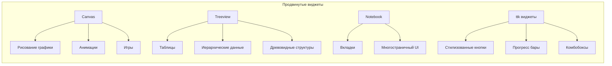
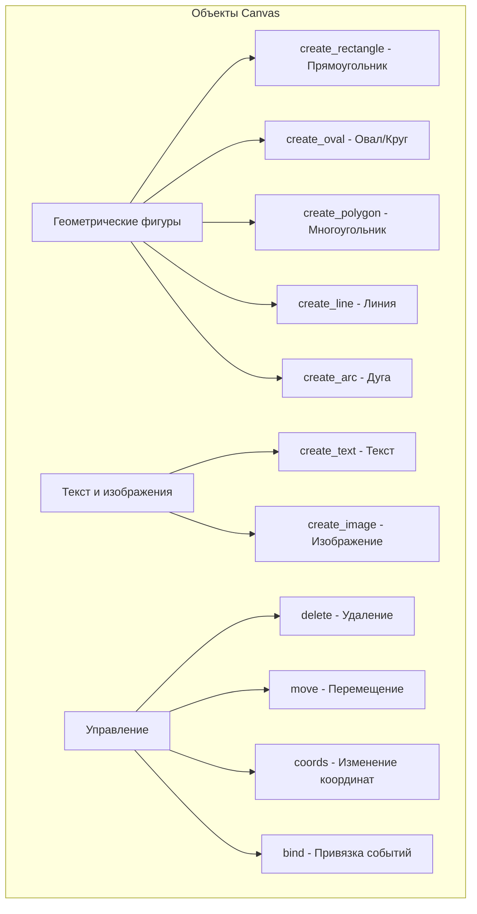
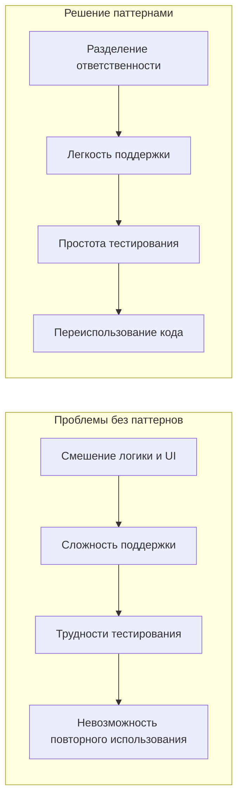
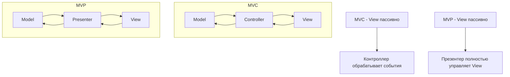
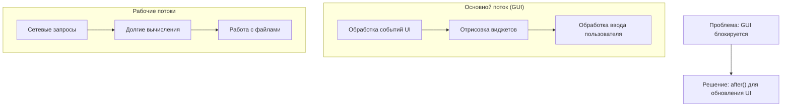

# Лекция 13: Tkinter - продвинутый уровень

## Продвинутые виджеты, MVC/MVP паттерны, многопоточность

### Цель лекции:
- Изучить продвинутые виджеты Tkinter (Canvas, Treeview, Notebook)
- Освоить архитектурные паттерны MVC и MVP
- Понять принципы многопоточности в GUI-приложениях
- Научиться создавать пользовательские виджеты
- Освоить работу с изображениями и стилями

### План лекции:
1. Продвинутые виджеты Tkinter
2. Архитектурные паттерны в GUI-приложениях
3. Многопоточность в Tkinter
4. Пользовательские виджеты
5. Работа с изображениями и стилями
6. Практические примеры

---

## 1. Продвинутые виджеты Tkinter

### Обзор продвинутых виджетов



### Canvas и его возможности

Canvas — это мощный виджет для рисования графики, текста и других элементов. Он позволяет создавать интерактивные графические интерфейсы.

```python
import tkinter as tk
from tkinter import ttk

class CanvasDemo:
    def __init__(self, root):
        self.root = root
        self.root.title("Canvas Demo")
        self.root.geometry("800x600")
        
        self.canvas = tk.Canvas(root, width=780, height=500, bg="white", relief="sunken", bd=2)
        self.canvas.pack(pady=10, padx=10, fill="both", expand=True)
        
        self.setup_tools()
        self.draw_initial_shapes()
    
    def setup_tools(self):
        toolbar = tk.Frame(self.root)
        toolbar.pack(fill="x", padx=10)
        
        tk.Button(toolbar, text="Очистить", command=self.clear_canvas).pack(side="left", padx=5)
        tk.Button(toolbar, text="Рисовать круг", command=self.draw_circle).pack(side="left", padx=5)
        tk.Button(toolbar, text="Рисовать прямоугольник", command=self.draw_rectangle).pack(side="left", padx=5)
        tk.Button(toolbar, text="Рисовать линию", command=self.draw_line).pack(side="left", padx=5)
        
        tk.Label(toolbar, text="Цвет:").pack(side="left", padx=(20, 5))
        self.color_var = tk.StringVar(value="black")
        color_options = ["black", "red", "blue", "green", "yellow", "purple"]
        color_menu = tk.OptionMenu(toolbar, self.color_var, *color_options)
        color_menu.pack(side="left", padx=5)
        
        tk.Label(toolbar, text="Размер:").pack(side="left", padx=(20, 5))
        self.brush_size = tk.Scale(toolbar, from_=1, to=20, orient="horizontal", length=100)
        self.brush_size.set(5)
        self.brush_size.pack(side="left", padx=5)
    
    def draw_initial_shapes(self):
        # Различные фигуры на Canvas
        self.canvas.create_rectangle(50, 50, 150, 100, fill="lightblue", outline="navy", width=2)
        self.canvas.create_oval(200, 50, 300, 150, fill="lightgreen", outline="darkgreen", width=2)
        self.canvas.create_polygon(350, 50, 400, 100, 350, 150, fill="pink", outline="magenta", width=2)
        self.canvas.create_line(50, 200, 150, 250, fill="red", width=3)
        self.canvas.create_text(400, 200, text="Текст на Canvas", font=("Arial", 16), fill="purple")
        self.canvas.create_arc(500, 50, 600, 150, start=0, extent=180, fill="yellow", outline="orange", style="pieslice")
    
    def clear_canvas(self):
        self.canvas.delete("all")
    
    def draw_circle(self):
        color = self.color_var.get()
        size = self.brush_size.get()
        import random
        x = random.randint(50, 700)
        y = random.randint(50, 400)
        self.canvas.create_oval(x, y, x+size*4, y+size*4, fill=color, outline=color, width=size)
    
    def draw_rectangle(self):
        color = self.color_var.get()
        size = self.brush_size.get()
        import random
        x = random.randint(50, 700)
        y = random.randint(50, 400)
        self.canvas.create_rectangle(x, y, x+size*6, y+size*4, fill="", outline=color, width=size)
    
    def draw_line(self):
        color = self.color_var.get()
        size = self.brush_size.get()
        import random
        x1 = random.randint(50, 700)
        y1 = random.randint(50, 400)
        x2 = random.randint(50, 700)
        y2 = random.randint(50, 400)
        self.canvas.create_line(x1, y1, x2, y2, fill=color, width=size)

root = tk.Tk()
app = CanvasDemo(root)
root.mainloop()
```

### Типы объектов на Canvas



### Treeview (таблицы и иерархические данные)

Treeview используется для отображения табличных и иерархических данных.

```python
class TreeviewDemo:
    def __init__(self, root):
        self.root = root
        self.root.title("Treeview Demo")
        self.root.geometry("800x600")
        
        columns = ("Имя", "Возраст", "Город", "Должность")
        self.tree = ttk.Treeview(root, columns=columns, show="tree headings")
        
        self.tree.heading("#0", text="ID")
        for col in columns:
            self.tree.heading(col, text=col)
            self.tree.column(col, width=100)
        
        parent1 = self.tree.insert("", tk.END, text="Отдел 1", values=("", "", "", ""))
        parent2 = self.tree.insert("", tk.END, text="Отдел 2", values=("", "", "", ""))
        
        self.tree.insert(parent1, tk.END, text="Сотрудник 1", values=("Иван Иванов", "30", "Москва", "Программист"))
        self.tree.insert(parent1, tk.END, text="Сотрудник 2", values=("Мария Петрова", "25", "СПб", "Дизайнер"))
        self.tree.insert(parent2, tk.END, text="Сотрудник 3", values=("Алексей Сидоров", "35", "Новосибирск", "Менеджер"))
        
        tree_scrollbar = ttk.Scrollbar(root, orient="vertical", command=self.tree.yview)
        self.tree.configure(yscrollcommand=tree_scrollbar.set)
        
        self.tree.pack(side=tk.LEFT, fill=tk.BOTH, expand=True, padx=5, pady=5)
        tree_scrollbar.pack(side=tk.RIGHT, fill=tk.Y, padx=(0, 5), pady=5)
```

### Notebook (многостраничный интерфейс)

Notebook предоставляет интерфейс с вкладками.

```python
class NotebookDemo:
    def __init__(self, root):
        self.root = root
        self.root.title("Notebook Demo")
        self.root.geometry("600x400")
        
        notebook = ttk.Notebook(self.root)
        notebook.pack(fill="both", expand=True, padx=10, pady=10)
        
        # Вкладка 1
        tab1 = ttk.Frame(notebook)
        notebook.add(tab1, text="Главная")
        ttk.Label(tab1, text="Добро пожаловать!").pack(pady=20)
        
        # Вкладка 2
        tab2 = ttk.Frame(notebook)
        notebook.add(tab2, text="Настройки")
        ttk.Label(tab2, text="Настройки приложения").pack(pady=20)
        
        # Вкладка 3
        tab3 = ttk.Frame(notebook)
        notebook.add(tab3, text="О программе")
        ttk.Label(tab3, text="Версия 1.0").pack(pady=20)
```

---

## 2. Архитектурные паттерны в GUI-приложениях

### Зачем нужны архитектурные паттерны?



### Паттерн MVC (Model-View-Controller)

MVC разделяет приложение на три компонента:
- **Model** — данные и бизнес-логика
- **View** — представление (интерфейс)
- **Controller** — управление взаимодействием

```python
class User:
    """Модель данных пользователя"""
    def __init__(self, name, email, age):
        self.name = name
        self.email = email
        self.age = age

class UserModel:
    """Модель для управления пользователями"""
    def __init__(self):
        self.users = []
        self._observers = []
    
    def add_user(self, user):
        self.users.append(user)
        self._notify_observers()
    
    def get_users(self):
        return self.users.copy()
    
    def attach_observer(self, observer):
        self._observers.append(observer)
    
    def _notify_observers(self):
        for observer in self._observers:
            observer.update_users_list(self.users)

class UserView:
    """Представление для отображения пользователей"""
    def __init__(self, root, controller):
        self.controller = controller
        self.frame = ttk.Frame(root)
        self.frame.pack(fill=tk.BOTH, expand=True, padx=10, pady=10)
        
        columns = ("Имя", "Email", "Возраст")
        self.tree = ttk.Treeview(self.frame, columns=columns, show="headings")
        
        for col in columns:
            self.tree.heading(col, text=col)
            self.tree.column(col, width=100)
        
        tree_scrollbar = ttk.Scrollbar(self.frame, orient="vertical", command=self.tree.yview)
        self.tree.configure(yscrollcommand=tree_scrollbar.set)
        
        self.tree.pack(side=tk.LEFT, fill=tk.BOTH, expand=True)
        tree_scrollbar.pack(side=tk.RIGHT, fill=tk.Y)
        
        self.create_input_form()
    
    def create_input_form(self):
        input_frame = ttk.LabelFrame(self.frame, text="Добавить пользователя")
        input_frame.pack(fill=tk.X, pady=10)
        
        fields = ["Имя", "Email", "Возраст"]
        self.entries = {}
        
        for i, field in enumerate(fields):
            ttk.Label(input_frame, text=field).grid(row=0, column=i*2, sticky="w", padx=(5, 5), pady=5)
            entry = ttk.Entry(input_frame, width=20)
            entry.grid(row=0, column=i*2+1, padx=(0, 15), pady=5)
            self.entries[field.lower()] = entry
        
        add_btn = ttk.Button(input_frame, text="Добавить", command=self.add_user)
        add_btn.grid(row=0, column=6, padx=5, pady=5)
    
    def add_user(self):
        try:
            name = self.entries["имя"].get()
            email = self.entries["email"].get()
            age_str = self.entries["возраст"].get()
            
            if not name or not email or not age_str:
                raise ValueError("Все поля обязательны для заполнения")
            
            age = int(age_str)
            user = User(name, email, age)
            
            self.controller.add_user(user)
            
            for entry in self.entries.values():
                entry.delete(0, tk.END)
        except ValueError as e:
            from tkinter import messagebox
            messagebox.showerror("Ошибка", str(e))
    
    def update_users_list(self, users):
        for item in self.tree.get_children():
            self.tree.delete(item)
        
        for user in users:
            self.tree.insert("", tk.END, values=(user.name, user.email, user.age))

class UserController:
    """Контроллер для управления взаимодействием"""
    def __init__(self, model, view):
        self.model = model
        self.view = view
        self.model.attach_observer(self.view)
    
    def add_user(self, user):
        self.model.add_user(user)

class MVCPatternDemo:
    def __init__(self, root):
        self.root = root
        self.root.title("MVC Pattern Demo")
        self.root.geometry("700x500")
        
        model = UserModel()
        view = UserView(self.root, None)
        controller = UserController(model, view)
        
        view.controller = controller
        view.update_users_list(model.get_users())
```

### Паттерн MVP (Model-View-Presenter)

MVP — это эволюция MVC, где Presenter содержит логику представления.

```python
from abc import ABC, abstractmethod

class IUserView(ABC):
    """Интерфейс представления для MVP"""
    
    @abstractmethod
    def display_users(self, users):
        pass
    
    @abstractmethod
    def get_user_data(self):
        pass
    
    @abstractmethod
    def show_message(self, message):
        pass

class UserPresenter:
    """Презентер для MVP паттерна"""
    
    def __init__(self, model, view):
        self.model = model
        self.view = view
    
    def load_users(self):
        users = self.model.get_users()
        self.view.display_users(users)
    
    def add_user(self):
        try:
            user_data = self.view.get_user_data()
            user = User(user_data['name'], user_data['email'], user_data['age'])
            self.model.add_user(user)
            self.load_users()
            self.view.show_message("Пользователь успешно добавлен")
        except ValueError as e:
            self.view.show_message(f"Ошибка: {str(e)}")

class MVPUserView(IUserView):
    """Реализация интерфейса IUserView"""
    
    def __init__(self, root):
        self.root = root
        self.presenter = None
        
        self.frame = ttk.Frame(root)
        self.frame.pack(fill=tk.BOTH, expand=True, padx=10, pady=10)
        
        columns = ("Имя", "Email", "Возраст")
        self.tree = ttk.Treeview(self.frame, columns=columns, show="headings")
        
        for col in columns:
            self.tree.heading(col, text=col)
            self.tree.column(col, width=100)
        
        tree_scrollbar = ttk.Scrollbar(self.frame, orient="vertical", command=self.tree.yview)
        self.tree.configure(yscrollcommand=tree_scrollbar.set)
        
        self.tree.pack(side=tk.LEFT, fill=tk.BOTH, expand=True)
        tree_scrollbar.pack(side=tk.RIGHT, fill=tk.Y)
        
        self.create_input_form()
    
    def create_input_form(self):
        input_frame = ttk.LabelFrame(self.frame, text="Добавить пользователя")
        input_frame.pack(fill=tk.X, pady=10)
        
        fields = ["Имя", "Email", "Возраст"]
        self.entries = {}
        
        for i, field in enumerate(fields):
            ttk.Label(input_frame, text=field).grid(row=0, column=i*2, sticky="w", padx=(5, 5), pady=5)
            entry = ttk.Entry(input_frame, width=20)
            entry.grid(row=0, column=i*2+1, padx=(0, 15), pady=5)
            self.entries[field.lower()] = entry
        
        add_btn = ttk.Button(input_frame, text="Добавить", command=self.add_user)
        add_btn.grid(row=0, column=6, padx=5, pady=5)
    
    def display_users(self, users):
        for item in self.tree.get_children():
            self.tree.delete(item)
        
        for user in users:
            self.tree.insert("", tk.END, values=(user.name, user.email, user.age))
    
    def get_user_data(self):
        data = {}
        for field, entry in self.entries.items():
            data[field] = entry.get()
        
        if not data['name'] or not data['email'] or not data['age']:
            raise ValueError("Все поля обязательны для заполнения")
        
        try:
            data['age'] = int(data['age'])
        except ValueError:
            raise ValueError("Возраст должен быть числом")
        
        return data
    
    def show_message(self, message):
        from tkinter import messagebox
        messagebox.showinfo("Информация", message)
    
    def add_user(self):
        if self.presenter:
            self.presenter.add_user()

class MVPPatternDemo:
    def __init__(self, root):
        self.root = root
        self.root.title("MVP Pattern Demo")
        self.root.geometry("700x500")
        
        model = UserModel()
        view = MVPUserView(self.root)
        presenter = UserPresenter(model, view)
        
        view.presenter = presenter
        presenter.load_users()
```

### Сравнение MVC и MVP



---

## 3. Многопоточность в Tkinter

### Проблемы GUI и многопоточности



При работе с GUI-приложениями важно помнить, что все изменения интерфейса должны происходить в основном потоке (GUI-потоке).

```python
import threading
import time
from tkinter import messagebox

class ThreadingDemo:
    def __init__(self, root):
        self.root = root
        self.root.title("Многопоточность в Tkinter")
        self.root.geometry("700x500")
        
        main_frame = ttk.Frame(root)
        main_frame.pack(fill=tk.BOTH, expand=True, padx=10, pady=10)
        
        self.output_text = tk.Text(main_frame, height=15, width=70)
        scrollbar = ttk.Scrollbar(main_frame, orient="vertical", command=self.output_text.yview)
        self.output_text.configure(yscrollcommand=scrollbar.set)
        
        self.output_text.pack(side=tk.LEFT, fill=tk.BOTH, expand=True)
        scrollbar.pack(side=tk.RIGHT, fill=tk.Y)
        
        button_frame = ttk.Frame(root)
        button_frame.pack(fill=tk.X, pady=10)
        
        ttk.Button(button_frame, text="Запустить задачу в потоке", 
                  command=self.start_background_task).pack(side=tk.LEFT, padx=5)
        ttk.Button(button_frame, text="Очистить вывод", 
                  command=lambda: self.output_text.delete(1.0, tk.END)).pack(side=tk.LEFT, padx=5)
        
        self.progress = ttk.Progressbar(root, mode="indeterminate")
        self.progress.pack(fill=tk.X, padx=10, pady=5)
    
    def start_background_task(self):
        thread = threading.Thread(target=self.background_task, daemon=True)
        thread.start()
    
    def background_task(self):
        self.update_output("Начало фоновой задачи...\n")
        
        for i in range(10):
            time.sleep(0.5)
            self.update_output(f"Шаг {i+1} фоновой задачи\n")
        
        self.update_output("Фоновая задача завершена!\n")
    
    def update_output(self, text):
        # Используем after для выполнения в GUI-потоке
        self.root.after(0, lambda: self.output_text.insert(tk.END, text))
        self.root.after(0, lambda: self.output_text.see(tk.END))
```

### Использование concurrent.futures

```python
from concurrent.futures import ThreadPoolExecutor
import requests

class ConcurrentDemo:
    def __init__(self, root):
        self.root = root
        self.root.title("Concurrent.futures в Tkinter")
        self.root.geometry("800x600")
        
        main_frame = ttk.Frame(root)
        main_frame.pack(fill=tk.BOTH, expand=True, padx=10, pady=10)
        
        url_frame = ttk.Frame(main_frame)
        url_frame.pack(fill=tk.X, pady=5)
        
        ttk.Label(url_frame, text="URL:").pack(side=tk.LEFT)
        self.url_entry = ttk.Entry(url_frame, width=50)
        self.url_entry.pack(side=tk.LEFT, fill=tk.X, expand=True, padx=5)
        self.url_entry.insert(0, "https://httpbin.org/delay/1")
        
        button_frame = ttk.Frame(main_frame)
        button_frame.pack(fill=tk.X, pady=10)
        
        ttk.Button(button_frame, text="Выполнить один запрос", 
                  command=self.single_request).pack(side=tk.LEFT, padx=5)
        ttk.Button(button_frame, text="Выполнить несколько запросов", 
                  command=self.multiple_requests).pack(side=tk.LEFT, padx=5)
        
        self.result_text = tk.Text(main_frame, height=20, width=80)
        scrollbar = ttk.Scrollbar(main_frame, orient="vertical", command=self.result_text.yview)
        self.result_text.configure(yscrollcommand=scrollbar.set)
        
        self.result_text.pack(side=tk.LEFT, fill=tk.BOTH, expand=True)
        scrollbar.pack(side=tk.RIGHT, fill=tk.Y)
        
        self.progress = ttk.Progressbar(root, mode="determinate")
        self.progress.pack(fill=tk.X, padx=10, pady=5)
    
    def single_request(self):
        url = self.url_entry.get()
        if not url:
            messagebox.showerror("Ошибка", "Введите URL")
            return
        
        thread = threading.Thread(target=self._perform_single_request, args=(url,))
        thread.start()
    
    def _perform_single_request(self, url):
        try:
            self.root.after(0, lambda: self.result_text.insert(tk.END, f"Запрос к {url}...\n"))
            
            response = requests.get(url, timeout=10)
            
            self.root.after(0, lambda: self.result_text.insert(
                tk.END, f"Ответ: статус {response.status_code}, длина {len(response.content)} байт\n"))
        except Exception as e:
            self.root.after(0, lambda: self.result_text.insert(tk.END, f"Ошибка: {str(e)}\n"))
    
    def multiple_requests(self):
        urls = [
            "https://httpbin.org/delay/1",
            "https://httpbin.org/delay/2", 
            "https://httpbin.org/delay/1",
            "https://httpbin.org/status/200"
        ]
        
        thread = threading.Thread(target=self._perform_multiple_requests, args=(urls,))
        thread.start()
    
    def _perform_multiple_requests(self, urls):
        self.root.after(0, lambda: self.progress.config(value=0, maximum=len(urls)))
        
        with ThreadPoolExecutor(max_workers=3) as executor:
            futures = [executor.submit(requests.get, url, {"timeout": 10}) for url in urls]
            
            for i, future in enumerate(futures):
                try:
                    response = future.result()
                    self.root.after(0, lambda r=response, u=urls[i]: 
                                   self.result_text.insert(tk.END, f"Ответ от {u}: статус {r.status_code}\n"))
                except Exception as e:
                    self.root.after(0, lambda err=str(e), u=urls[i]: 
                                   self.result_text.insert(tk.END, f"Ошибка {u}: {err}\n"))
                
                self.root.after(0, lambda val=i+1: self.progress.step())
        
        self.root.after(0, lambda: self.result_text.insert(tk.END, "Все запросы завершены\n"))
```

---

## 4. Пользовательские виджеты

### Создание составного виджета

```python
class CustomInputWidget:
    """Пользовательский виджет ввода с меткой и полем"""
    
    def __init__(self, parent, label_text="Поле:", initial_value=""):
        self.frame = ttk.Frame(parent)
        
        self.label = ttk.Label(self.frame, text=label_text)
        self.label.pack(side=tk.LEFT, padx=(0, 5))
        
        self.entry = ttk.Entry(self.frame)
        self.entry.pack(side=tk.LEFT, fill=tk.X, expand=True)
        self.entry.insert(0, initial_value)
        
        self.clear_btn = ttk.Button(self.frame, text="×", width=3, 
                                   command=self.clear, state="disabled")
        self.clear_btn.pack(side=tk.LEFT, padx=(5, 0))
        
        self.entry.bind("<KeyRelease>", self.on_entry_change)
        self.entry.bind("<FocusIn>", self.on_focus_in)
        self.entry.bind("<FocusOut>", self.on_focus_out)
    
    def on_entry_change(self, event):
        if self.entry.get():
            self.clear_btn.config(state="normal")
        else:
            self.clear_btn.config(state="disabled")
    
    def on_focus_in(self, event):
        self.label.config(foreground="blue")
    
    def on_focus_out(self, event):
        self.label.config(foreground="black")
    
    def clear(self):
        self.entry.delete(0, tk.END)
        self.clear_btn.config(state="disabled")
    
    def get(self):
        return self.entry.get()
    
    def set(self, value):
        self.entry.delete(0, tk.END)
        self.entry.insert(0, value)
    
    def pack(self, **kwargs):
        self.frame.pack(**kwargs)

class CustomButton:
    """Пользовательская кнопка с дополнительными возможностями"""
    
    def __init__(self, parent, text, command=None, default=False):
        self.frame = ttk.Frame(parent)
        
        self.button = ttk.Button(self.frame, text=text, command=self._on_click)
        self.button.pack(side=tk.LEFT)
        
        self.loading_indicator = ttk.Label(self.frame, text="⏳", visible=False)
        
        self.command = command
        self.default = default
        
        if self.default:
            self.frame.bind("<Return>", lambda e: self._on_click())
    
    def _on_click(self):
        if self.command:
            self.loading_indicator.pack(side=tk.LEFT, padx=(5, 0))
            self.button.config(state="disabled")
            
            try:
                result = self.command()
                return result
            finally:
                self.loading_indicator.pack_forget()
                self.button.config(state="normal")
    
    def pack(self, **kwargs):
        self.frame.pack(**kwargs)

class CustomWidgetDemo:
    def __init__(self, root):
        self.root = root
        self.root.title("Пользовательские виджеты")
        self.root.geometry("700x500")
        
        main_frame = ttk.Frame(root)
        main_frame.pack(fill=tk.BOTH, expand=True, padx=10, pady=10)
        
        title = ttk.Label(main_frame, text="Пользовательские виджеты", font=("Arial", 16, "bold"))
        title.pack(pady=10)
        
        name_widget = CustomInputWidget(main_frame, "Имя:", "Иван Иванов")
        name_widget.pack(fill=tk.X, pady=5)
        
        email_widget = CustomInputWidget(main_frame, "Email:", "ivan@example.com")
        email_widget.pack(fill=tk.X, pady=5)
        
        age_widget = CustomInputWidget(main_frame, "Возраст:", "30")
        age_widget.pack(fill=tk.X, pady=5)
        
        def submit_action():
            name = name_widget.get()
            email = email_widget.get()
            age = age_widget.get()
            messagebox.showinfo("Данные", f"Имя: {name}\nEmail: {email}\nВозраст: {age}")
        
        submit_btn = CustomButton(main_frame, "Отправить", submit_action, default=True)
        submit_btn.pack(pady=20)
```

---

## 5. Работа с изображениями и стилями

### Использование PhotoImage и Pillow

```python
class ImageHandlingDemo:
    def __init__(self, root):
        self.root = root
        self.root.title("Работа с изображениями")
        self.root.geometry("800x600")
        
        main_frame = ttk.Frame(root)
        main_frame.pack(fill=tk.BOTH, expand=True, padx=10, pady=10)
        
        title = ttk.Label(main_frame, text="Демонстрация работы с изображениями", 
                         font=("Arial", 14, "bold"))
        title.pack(pady=10)
        
        self.canvas = tk.Canvas(main_frame, bg="lightgray", width=600, height=400)
        self.canvas.pack(pady=10)
        
        self.load_and_display_image()
        
        button_frame = ttk.Frame(main_frame)
        button_frame.pack(fill=tk.X, pady=10)
        
        ttk.Button(button_frame, text="Загрузить изображение", 
                  command=self.select_and_load_image).pack(side=tk.LEFT, padx=5)
        ttk.Button(button_frame, text="Очистить", 
                  command=lambda: self.canvas.delete("all")).pack(side=tk.LEFT, padx=5)
    
    def load_and_display_image(self):
        try:
            self.canvas.create_text(300, 200, 
                                   text="Здесь будет отображено изображение", 
                                   font=("Arial", 16), fill="navy")
            
            self.canvas.create_rectangle(100, 100, 200, 150, fill="red", outline="black")
            self.canvas.create_oval(250, 100, 350, 150, fill="green", outline="black")
            self.canvas.create_polygon(400, 100, 450, 150, 350, 150, fill="blue", outline="black")
        except Exception as e:
            print(f"Ошибка при отображении изображения: {e}")
    
    def select_and_load_image(self):
        from tkinter import filedialog
        
        file_path = filedialog.askopenfilename(
            title="Выберите изображение",
            filetypes=[
                ("Изображения", "*.png *.jpg *.jpeg *.gif *.bmp"),
                ("PNG файлы", "*.png"),
                ("JPG файлы", "*.jpg"),
                ("Все файлы", "*.*")
            ]
        )
        
        if file_path:
            try:
                from PIL import Image, ImageTk
                
                image = Image.open(file_path)
                image.thumbnail((600, 400))
                photo = ImageTk.PhotoImage(image)
                
                self.image_reference = photo
                
                self.canvas.delete("all")
                self.canvas.create_image(300, 200, image=photo)
                
            except ImportError:
                messagebox.showerror("Ошибка", "Для работы с изображениями установите Pillow:\npip install Pillow")
            except Exception as e:
                messagebox.showerror("Ошибка", f"Не удалось загрузить изображение:\n{str(e)}")
```

### Стили и темы с ttk

```python
class StylingAndThemes:
    def __init__(self, root):
        self.root = root
        self.root.title("Стили и темы")
        self.root.geometry("600x500")
        
        self.style = ttk.Style()
        
        # Доступные темы
        available_themes = self.style.theme_names()
        
        theme_frame = ttk.LabelFrame(root, text="Выбор темы", padding=10)
        theme_frame.pack(fill="x", padx=10, pady=10)
        
        self.theme_var = tk.StringVar(value=self.style.theme_use())
        
        for theme in available_themes:
            ttk.Radiobutton(
                theme_frame, 
                text=theme, 
                variable=self.theme_var, 
                value=theme,
                command=lambda: self.change_theme(self.theme_var.get())
            ).pack(anchor="w")
        
        # Пользовательские стили
        self.style.configure("Custom.TButton", font=("Arial", 12), padding=10)
        self.style.configure("Danger.TButton", font=("Arial", 10), background="red")
        self.style.configure("Success.TButton", font=("Arial", 10), background="green")
        self.style.configure("Title.TLabel", font=("Arial", 16, "bold"), foreground="purple")
        
        styled_frame = ttk.LabelFrame(root, text="Пользовательские стили", padding=20)
        styled_frame.pack(fill="x", padx=10, pady=10)
        
        title = ttk.Label(styled_frame, text="Стилизованные виджеты", style="Title.TLabel")
        title.pack(pady=10)
        
        button_frame = ttk.Frame(styled_frame)
        button_frame.pack(pady=10)
        
        ttk.Button(button_frame, text="Обычная кнопка", style="Custom.TButton").pack(side="left", padx=5)
        ttk.Button(button_frame, text="Опасное действие", style="Danger.TButton").pack(side="left", padx=5)
        ttk.Button(button_frame, text="Успешное действие", style="Success.TButton").pack(side="left", padx=5)
    
    def change_theme(self, theme_name):
        try:
            self.style.theme_use(theme_name)
        except tk.TclError:
            print(f"Тема {theme_name} не найдена")
```

---

## 6. Практические примеры

### Пример: Продвинутый калькулятор

```python
import tkinter as tk
from tkinter import ttk, messagebox
import math

class AdvancedCalculator:
    def __init__(self):
        self.root = tk.Tk()
        self.root.title("Продвинутый калькулятор")
        self.root.geometry("400x600")
        self.root.resizable(False, False)
        
        self.current = "0"
        self.previous = ""
        self.operator = ""
        self.total = 0
        self.memory = 0
        
        self.create_widgets()
        self.setup_bindings()
    
    def create_widgets(self):
        display_frame = tk.Frame(self.root, bg="black")
        display_frame.pack(fill="x", padx=5, pady=5)
        
        self.display_var = tk.StringVar(value="0")
        display = tk.Label(
            display_frame,
            textvariable=self.display_var,
            anchor="e",
            bg="black",
            fg="white",
            font=("Arial", 24),
            padx=10,
            pady=10
        )
        display.pack(fill="x")
        
        memory_frame = tk.Frame(self.root)
        memory_frame.pack(fill="x", padx=5, pady=2)
        
        tk.Button(memory_frame, text="MC", command=self.memory_clear, width=5).pack(side="left", padx=2)
        tk.Button(memory_frame, text="MR", command=self.memory_recall, width=5).pack(side="left", padx=2)
        tk.Button(memory_frame, text="M+", command=self.memory_add, width=5).pack(side="left", padx=2)
        tk.Button(memory_frame, text="M-", command=self.memory_subtract, width=5).pack(side="left", padx=2)
        tk.Button(memory_frame, text="MS", command=self.memory_store, width=5).pack(side="left", padx=2)
        
        functions_frame = tk.Frame(self.root)
        functions_frame.pack(fill="x", padx=5, pady=2)
        
        functions = [
            ("√", self.sqrt), ("x²", self.square), ("xʸ", lambda: self.set_op("**")),
            ("1/x", self.reciprocal), ("±", self.change_sign), ("C", self.clear),
            ("CE", self.clear_entry), ("⌫", self.backspace), ("%", self.percent)
        ]
        
        for i, (text, command) in enumerate(functions):
            col = i % 3
            row = i // 3
            btn = tk.Button(functions_frame, text=text, command=command, height=2)
            btn.grid(row=row, column=col, sticky="nsew", padx=1, pady=1)
            functions_frame.grid_columnconfigure(col, weight=1)
        
        main_frame = tk.Frame(self.root)
        main_frame.pack(fill="both", expand=True, padx=5, pady=5)
        
        ops_frame = tk.Frame(main_frame)
        ops_frame.grid(row=0, column=1, sticky="nsew")
        
        operations = ["÷", "×", "-", "+"]
        for i, op in enumerate(operations):
            btn = tk.Button(ops_frame, text=op, command=lambda o=op: self.set_op(o), height=2)
            btn.pack(fill="x", pady=1)
        
        buttons_frame = tk.Frame(main_frame)
        buttons_frame.grid(row=0, column=0, sticky="nsew")
        
        buttons = [
            ("7", lambda: self.add_digit("7")), ("8", lambda: self.add_digit("8")), ("9", lambda: self.add_digit("9")),
            ("4", lambda: self.add_digit("4")), ("5", lambda: self.add_digit("5")), ("6", lambda: self.add_digit("6")),
            ("1", lambda: self.add_digit("1")), ("2", lambda: self.add_digit("2")), ("3", lambda: self.add_digit("3")),
            ("0", lambda: self.add_digit("0")), (".", self.add_decimal), ("=", self.calculate)
        ]
        
        for i, (text, command) in enumerate(buttons):
            row = i // 3
            col = i % 3
            btn = tk.Button(buttons_frame, text=text, command=command, height=2)
            btn.grid(row=row, column=col, sticky="nsew", padx=1, pady=1)
        
        for i in range(4):
            main_frame.grid_rowconfigure(i, weight=1)
            main_frame.grid_columnconfigure(i, weight=1)
        for i in range(3):
            buttons_frame.grid_rowconfigure(i, weight=1)
            buttons_frame.grid_columnconfigure(i, weight=1)
    
    def setup_bindings(self):
        self.root.bind("<Key>", self.key_press)
    
    def key_press(self, event):
        key = event.char
        
        if key.isdigit():
            self.add_digit(key)
        elif key in "+-*/.":
            if key == "*":
                self.set_op("×")
            elif key == "/":
                self.set_op("÷")
            else:
                self.set_op(key)
        elif key == "\r":
            self.calculate()
        elif key == "\x08":
            self.backspace()
        elif key.lower() == "c":
            self.clear()
    
    def add_digit(self, digit):
        if self.current == "0":
            self.current = digit
        else:
            self.current += digit
        self.display_var.set(self.current)
    
    def add_decimal(self):
        if "." not in self.current:
            self.current += "."
        self.display_var.set(self.current)
    
    def set_op(self, op):
        if self.operator and self.previous:
            self.calculate()
        
        self.previous = self.current
        self.operator = op
        self.current = "0"
    
    def calculate(self):
        try:
            if self.operator == "+":
                self.total = float(self.previous) + float(self.current)
            elif self.operator == "-":
                self.total = float(self.previous) - float(self.current)
            elif self.operator == "×":
                self.total = float(self.previous) * float(self.current)
            elif self.operator == "÷":
                if float(self.current) == 0:
                    raise ZeroDivisionError("Деление на ноль")
                self.total = float(self.previous) / float(self.current)
            elif self.operator == "**":
                self.total = float(self.previous) ** float(self.current)
            
            self.current = str(self.total)
            self.display_var.set(self.current)
            self.operator = ""
            self.previous = ""
        except ZeroDivisionError:
            messagebox.showerror("Ошибка", "Деление на ноль невозможно!")
            self.clear()
        except Exception as e:
            messagebox.showerror("Ошибка", f"Ошибка вычисления: {str(e)}")
            self.clear()
    
    def sqrt(self):
        try:
            result = math.sqrt(float(self.current))
            self.current = str(result)
            self.display_var.set(self.current)
        except ValueError:
            messagebox.showerror("Ошибка", "Невозможно вычислить корень из отрицательного числа")
    
    def square(self):
        result = float(self.current) ** 2
        self.current = str(result)
        self.display_var.set(self.current)
    
    def reciprocal(self):
        try:
            result = 1 / float(self.current)
            self.current = str(result)
            self.display_var.set(self.current)
        except ZeroDivisionError:
            messagebox.showerror("Ошибка", "Деление на ноль невозможно")
    
    def percent(self):
        result = float(self.current) / 100
        self.current = str(result)
        self.display_var.set(self.current)
    
    def change_sign(self):
        if self.current.startswith("-"):
            self.current = self.current[1:]
        else:
            self.current = "-" + self.current
        self.display_var.set(self.current)
    
    def clear(self):
        self.current = "0"
        self.previous = ""
        self.operator = ""
        self.total = 0
        self.display_var.set(self.current)
    
    def clear_entry(self):
        self.current = "0"
        self.display_var.set(self.current)
    
    def backspace(self):
        if len(self.current) > 1:
            self.current = self.current[:-1]
        else:
            self.current = "0"
        self.display_var.set(self.current)
    
    def memory_clear(self):
        self.memory = 0
    
    def memory_recall(self):
        self.current = str(self.memory)
        self.display_var.set(self.current)
    
    def memory_add(self):
        self.memory += float(self.current)
    
    def memory_subtract(self):
        self.memory -= float(self.current)
    
    def memory_store(self):
        self.memory = float(self.current)
    
    def run(self):
        self.root.mainloop()

if __name__ == "__main__":
    calc = AdvancedCalculator()
    calc.run()
```

---

## Заключение

Tkinter предоставляет мощный инструментарий для создания графических интерфейсов в Python. В этой лекции мы рассмотрели:

1. **Продвинутые виджеты** — Canvas для графики, Treeview для таблиц и иерархий, Notebook для вкладок
2. **Архитектурные паттерны** — MVC и MVP для разделения логики и представления
3. **Многопоточность** — использование threading и concurrent.futures с правильным обновлением UI
4. **Пользовательские виджеты** — создание составных компонентов
5. **Работа с изображениями** — использование Pillow для загрузки и отображения
6. **Стили и темы** — кастомизация внешнего вида с ttk

Эти знания позволяют создавать профессиональные desktop-приложения с продуманной архитектурой.

---

## Контрольные вопросы:

1. **Какие виджеты Tkinter подходят для отображения иерархических данных?**
   - Treeview используется для таблиц и иерархических структур.

2. **Как создать пользовательский виджет в Tkinter?**
   - Создать класс, который инкапсулирует несколько стандартных виджетов в Frame.

3. **Какие существуют способы размещения элементов в Tkinter?**
   - pack, grid и place — каждый для своих целей.

4. **Как обрабатывать события в Tkinter?**
   - С помощью метода bind(), который связывает событие с функцией-обработчиком.

5. **Как применять стили к виджетам Tkinter?**
   - Использовать ttk.Style для определения и применения пользовательских стилей.

6. **В чем различие между паттернами MVC и MVP?**
   - В MVC контроллер обрабатывает события, в MVP презентер полностью управляет представлением.

7. **Как безопасно обновлять GUI из фонового потока?**
   - Использовать метод after(0, callable) для выполнения в GUI-потоке.