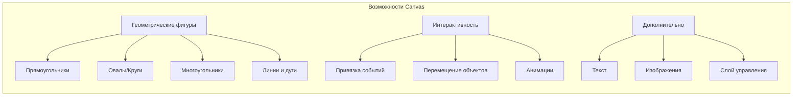
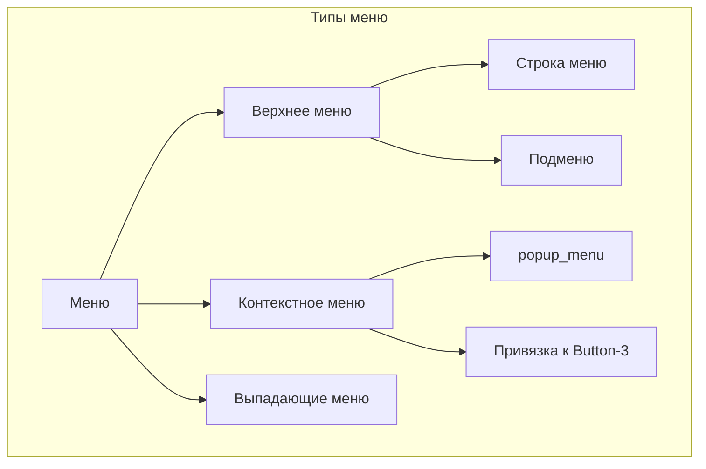

# Лекция 14: Tkinter - продвинутые элементы

## Canvas, меню, диалоговые окна, продвинутая компоновка

### Цель лекции:
- Изучить возможности виджета Canvas для рисования графики
- Освоить создание меню и контекстных меню
- Понять принципы работы с диалоговыми окнами
- Освоить продвинутые техники компоновки (grid, place)
- Научиться работать с изображениями в Tkinter

### План лекции:
1. Виджет Canvas и рисование графики
2. Меню и контекстные меню
3. Диалоговые окна
4. Продвинутая компоновка (grid, place)
5. Работа с изображениями
6. Практические примеры

---

## 1. Виджет Canvas и рисование графики

### Возможности Canvas

Canvas — это один из самых мощных виджетов в Tkinter, который позволяет рисовать графику, текст, изображения и создавать анимации.



### Основные методы Canvas

| Метод | Описание |
|-------|----------|
| `create_line()` | Рисование линии |
| `create_rectangle()` | Рисование прямоугольника |
| `create_oval()` | Рисование овала/круга |
| `create_polygon()` | Рисование многоугольника |
| `create_arc()` | Рисование дуги |
| `create_text()` | Отображение текста |
| `create_image()` | Отображение изображения |
| `delete()` | Удаление объектов |
| `coords()` | Получение/изменение координат |
| `move()` | Перемещение объекта |
| `itemconfig()` | Изменение свойств объекта |

### Пример рисования на Canvas

```python
import tkinter as tk

class CanvasDemo:
    def __init__(self, root):
        self.root = root
        self.root.title("Canvas Demo")
        self.root.geometry("800x600")
        
        self.canvas = tk.Canvas(root, width=780, height=500, bg="white", relief="sunken", bd=2)
        self.canvas.pack(pady=10, padx=10, fill="both", expand=True)
        
        self.setup_tools()
        self.draw_initial_shapes()
    
    def setup_tools(self):
        toolbar = tk.Frame(self.root)
        toolbar.pack(fill="x", padx=10)
        
        tk.Button(toolbar, text="Очистить", command=self.clear_canvas).pack(side="left", padx=5)
        tk.Button(toolbar, text="Рисовать круг", command=self.draw_circle).pack(side="left", padx=5)
        tk.Button(toolbar, text="Рисовать прямоугольник", command=self.draw_rectangle).pack(side="left", padx=5)
        tk.Button(toolbar, text="Рисовать линию", command=self.draw_line).pack(side="left", padx=5)
        
        tk.Label(toolbar, text="Цвет:").pack(side="left", padx=(20, 5))
        self.color_var = tk.StringVar(value="black")
        color_options = ["black", "red", "blue", "green", "yellow", "purple"]
        color_menu = tk.OptionMenu(toolbar, self.color_var, *color_options)
        color_menu.pack(side="left", padx=5)
        
        tk.Label(toolbar, text="Размер:").pack(side="left", padx=(20, 5))
        self.brush_size = tk.Scale(toolbar, from_=1, to=20, orient="horizontal", length=100)
        self.brush_size.set(5)
        self.brush_size.pack(side="left", padx=5)
    
    def draw_initial_shapes(self):
        # Различные фигуры на Canvas
        self.canvas.create_rectangle(50, 50, 150, 100, fill="lightblue", outline="navy", width=2)
        self.canvas.create_oval(200, 50, 300, 150, fill="lightgreen", outline="darkgreen", width=2)
        self.canvas.create_polygon(350, 50, 400, 100, 350, 150, fill="pink", outline="magenta", width=2)
        self.canvas.create_line(50, 200, 150, 250, fill="red", width=3)
        self.canvas.create_text(400, 200, text="Текст на Canvas", font=("Arial", 16), fill="purple")
        self.canvas.create_arc(500, 50, 600, 150, start=0, extent=180, fill="yellow", outline="orange", style="pieslice")
    
    def clear_canvas(self):
        self.canvas.delete("all")
    
    def draw_circle(self):
        color = self.color_var.get()
        size = self.brush_size.get()
        import random
        x = random.randint(50, 700)
        y = random.randint(50, 400)
        self.canvas.create_oval(x, y, x+size*4, y+size*4, fill=color, outline=color, width=size)
    
    def draw_rectangle(self):
        color = self.color_var.get()
        size = self.brush_size.get()
        import random
        x = random.randint(50, 700)
        y = random.randint(50, 400)
        self.canvas.create_rectangle(x, y, x+size*6, y+size*4, fill="", outline=color, width=size)
    
    def draw_line(self):
        color = self.color_var.get()
        size = self.brush_size.get()
        import random
        x1 = random.randint(50, 700)
        y1 = random.randint(50, 400)
        x2 = random.randint(50, 700)
        y2 = random.randint(50, 400)
        self.canvas.create_line(x1, y1, x2, y2, fill=color, width=size)

root = tk.Tk()
app = CanvasDemo(root)
root.mainloop()
```

### Рисование мышью на Canvas

```python
class DrawingCanvas:
    def __init__(self, root):
        self.root = root
        self.root.title("Canvas с рисованием мышью")
        self.root.geometry("800x600")
        
        self.canvas = tk.Canvas(root, bg="white", width=780, height=500)
        self.canvas.pack(pady=10, padx=10, fill="both", expand=True)
        
        self.last_x, self.last_y = None, None
        self.color = "black"
        self.brush_size = 2
        
        self.canvas.bind("<Button-1>", self.start_draw)
        self.canvas.bind("<B1-Motion>", self.draw)
        self.canvas.bind("<ButtonRelease-1>", self.stop_draw)
        
        self.setup_drawing_tools()
    
    def setup_drawing_tools(self):
        toolbar = tk.Frame(self.root)
        toolbar.pack(fill="x", padx=10, pady=5)
        
        tk.Label(toolbar, text="Цвет:").pack(side="left", padx=(0, 5))
        colors = ["black", "red", "blue", "green", "yellow", "purple", "orange", "brown"]
        for color in colors:
            btn = tk.Button(toolbar, bg=color, width=2, command=lambda c=color: setattr(self, 'color', c))
            btn.pack(side="left", padx=2)
        
        tk.Label(toolbar, text="Размер:").pack(side="left", padx=(20, 5))
        self.size_scale = tk.Scale(toolbar, from_=1, to=20, orient="horizontal", command=self.change_brush_size)
        self.size_scale.set(2)
        self.size_scale.pack(side="left", padx=5)
    
    def start_draw(self, event):
        self.last_x, self.last_y = event.x, event.y
    
    def draw(self, event):
        if self.last_x and self.last_y:
            self.canvas.create_line(
                self.last_x, self.last_y, 
                event.x, event.y,
                fill=self.color, 
                width=self.brush_size,
                capstyle=tk.ROUND,
                smooth=tk.TRUE
            )
        self.last_x, self.last_y = event.x, event.y
    
    def stop_draw(self, event):
        self.last_x, self.last_y = None, None
    
    def change_brush_size(self, val):
        self.brush_size = int(val)
```

### Анимация на Canvas

```python
import tkinter as tk

class CanvasAnimation:
    def __init__(self, root):
        self.root = root
        self.root.title("Canvas Animation")
        self.root.geometry("800x600")
        
        self.canvas = tk.Canvas(root, bg="black", width=780, height=500)
        self.canvas.pack(pady=10, padx=10, fill="both", expand=True)
        
        self.create_animated_objects()
        self.animate()
    
    def create_animated_objects(self):
        self.circles = []
        for i in range(5):
            circle = self.canvas.create_oval(
                100 + i*50, 100 + i*30, 130 + i*50, 130 + i*30,
                fill=f"#{i*3}ff{i*5}", outline="white"
            )
            self.circles.append({
                'id': circle,
                'x': 100 + i*50,
                'y': 100 + i*30,
                'dx': (i+1) * 2,
                'dy': (i+1) % 2 * 3 - 1
            })
        
        self.text_id = self.canvas.create_text(
            400, 250, 
            text="Анимация на Canvas", 
            font=("Arial", 24, "bold"),
            fill="white"
        )
        self.text_angle = 0
    
    def animate(self):
        for circle in self.circles:
            self.canvas.move(circle['id'], circle['dx'], circle['dy'])
            pos = self.canvas.coords(circle['id'])
            
            if pos[0] <= 0 or pos[2] >= 780:
                circle['dx'] *= -1
            if pos[1] <= 0 or pos[3] >= 500:
                circle['dy'] *= -1
        
        self.text_angle += 5
        if self.text_angle >= 360:
            self.text_angle = 0
        
        hue = (self.text_angle / 360) * 255
        color = f"#{int(hue):02x}{int(255-hue):02x}{int(hue/2):02x}"
        self.canvas.itemconfig(self.text_id, fill=color)
        
        self.root.after(50, self.animate)
```

---

## 2. Меню и контекстные меню

### Типы меню в Tkinter



### Создание меню

```python
import tkinter as tk
from tkinter import messagebox, filedialog

class MenuDemo:
    def __init__(self, root):
        self.root = root
        self.root.title("Демонстрация меню")
        self.root.geometry("800x600")
        
        self.create_menu()
        self.create_context_menu()
        
        self.text_area = tk.Text(root, wrap=tk.WORD)
        self.text_area.pack(fill=tk.BOTH, expand=True, padx=10, pady=10)
        
        self.text_area.bind("<Button-3>", self.show_context_menu)
    
    def create_menu(self):
        menubar = tk.Menu(self.root)
        self.root.config(menu=menubar)
        
        # Меню "Файл"
        file_menu = tk.Menu(menubar, tearoff=0)
        menubar.add_cascade(label="Файл", menu=file_menu)
        
        file_menu.add_command(label="Новый", command=self.new_file, accelerator="Ctrl+N")
        file_menu.add_command(label="Открыть", command=self.open_file, accelerator="Ctrl+O")
        file_menu.add_command(label="Сохранить", command=self.save_file, accelerator="Ctrl+S")
        file_menu.add_separator()
        file_menu.add_command(label="Выход", command=self.exit_app)
        
        # Меню "Правка"
        edit_menu = tk.Menu(menubar, tearoff=0)
        menubar.add_cascade(label="Правка", menu=edit_menu)
        
        edit_menu.add_command(label="Отменить", command=self.undo)
        edit_menu.add_command(label="Повторить", command=self.redo)
        edit_menu.add_separator()
        edit_menu.add_command(label="Вырезать", command=self.cut)
        edit_menu.add_command(label="Копировать", command=self.copy)
        edit_menu.add_command(label="Вставить", command=self.paste)
        
        # Меню "Вид"
        view_menu = tk.Menu(menubar, tearoff=0)
        menubar.add_cascade(label="Вид", menu=view_menu)
        
        self.show_toolbar = tk.BooleanVar(value=True)
        view_menu.add_checkbutton(label="Показать панель инструментов", 
                                 variable=self.show_toolbar)
        
        # Меню "Помощь"
        help_menu = tk.Menu(menubar, tearoff=0)
        menubar.add_cascade(label="Помощь", menu=help_menu)
        help_menu.add_command(label="О программе", command=self.about)
    
    def create_context_menu(self):
        self.context_menu = tk.Menu(self.root, tearoff=0)
        self.context_menu.add_command(label="Вырезать", command=self.cut)
        self.context_menu.add_command(label="Копировать", command=self.copy)
        self.context_menu.add_command(label="Вставить", command=self.paste)
        self.context_menu.add_separator()
        self.context_menu.add_command(label="Очистить", command=self.clear_text)
    
    def show_context_menu(self, event):
        try:
            self.context_menu.tk_popup(event.x_root, event.y_root)
        finally:
            self.context_menu.grab_release()
    
    def new_file(self):
        self.text_area.delete(1.0, tk.END)
        self.root.title("Безымянный")
    
    def open_file(self):
        file_path = filedialog.askopenfilename(title="Открыть файл")
        if file_path:
            with open(file_path, 'r', encoding='utf-8') as file:
                self.text_area.delete(1.0, tk.END)
                self.text_area.insert(1.0, file.read())
    
    def save_file(self):
        messagebox.showinfo("Сохранение", "Файл сохранен!")
    
    def exit_app(self):
        self.root.quit()
    
    def undo(self):
        try:
            self.text_area.edit_undo()
        except tk.TclError:
            pass
    
    def redo(self):
        try:
            self.text_area.edit_redo()
        except tk.TclError:
            pass
    
    def cut(self):
        self.text_area.event_generate("<<Cut>>")
    
    def copy(self):
        self.text_area.event_generate("<<Copy>>")
    
    def paste(self):
        self.text_area.event_generate("<<Paste>>")
    
    def clear_text(self):
        self.text_area.delete(1.0, tk.END)
    
    def about(self):
        messagebox.showinfo("О программе", "Текстовый редактор v1.0")
```

---

## 3. Диалоговые окна

### Встроенные диалоговые окна

```python
import tkinter as tk
from tkinter import messagebox, filedialog, colorchooser, simpledialog

class DialogDemo:
    def __init__(self, root):
        self.root = root
        self.root.title("Диалоговые окна")
        self.root.geometry("600x500")
        
        self.create_widgets()
    
    def create_widgets(self):
        main_frame = tk.Frame(self.root)
        main_frame.pack(fill="both", expand=True, padx=20, pady=20)
        
        # Информационные диалоги
        info_frame = tk.LabelFrame(main_frame, text="Информационные диалоги", padx=10, pady=10)
        info_frame.pack(fill="x", pady=5)
        
        tk.Button(info_frame, text="Info", command=self.show_info).pack(side="left", padx=5)
        tk.Button(info_frame, text="Warning", command=self.show_warning).pack(side="left", padx=5)
        tk.Button(info_frame, text="Error", command=self.show_error).pack(side="left", padx=5)
        
        # Вопросительные диалоги
        question_frame = tk.LabelFrame(main_frame, text="Вопросительные диалоги", padx=10, pady=10)
        question_frame.pack(fill="x", pady=5)
        
        tk.Button(question_frame, text="Yes/No", command=self.ask_yes_no).pack(side="left", padx=5)
        tk.Button(question_frame, text="OK/Cancel", command=self.ask_ok_cancel).pack(side="left", padx=5)
        tk.Button(question_frame, text="Retry/Cancel", command=self.ask_retry_cancel).pack(side="left", padx=5)
        
        # Диалоги выбора
        selection_frame = tk.LabelFrame(main_frame, text="Диалоги выбора", padx=10, pady=10)
        selection_frame.pack(fill="x", pady=5)
        
        tk.Button(selection_frame, text="Выбрать файл", command=self.select_file).pack(side="left", padx=5)
        tk.Button(selection_frame, text="Выбрать папку", command=self.select_folder).pack(side="left", padx=5)
        tk.Button(selection_frame, text="Выбрать цвет", command=self.select_color).pack(side="left", padx=5)
        tk.Button(selection_frame, text="Ввести текст", command=self.input_text).pack(side="left", padx=5)
        
        self.result_label = tk.Label(main_frame, text="Результаты появятся здесь", bg="lightgray", height=10, wraplength=500)
        self.result_label.pack(fill="x", pady=20, padx=10)
    
    def show_info(self):
        messagebox.showinfo("Информация", "Это информационное сообщение!")
        self.result_label.config(text="Показано информационное сообщение")
    
    def show_warning(self):
        messagebox.showwarning("Предупреждение", "Это предупреждающее сообщение!")
        self.result_label.config(text="Показано предупреждение")
    
    def show_error(self):
        messagebox.showerror("Ошибка", "Это сообщение об ошибке!")
        self.result_label.config(text="Показана ошибка")
    
    def ask_yes_no(self):
        result = messagebox.askyesno("Вопрос", "Вы уверены?")
        self.result_label.config(text=f"Результат Yes/No: {result}")
    
    def ask_ok_cancel(self):
        result = messagebox.askokcancel("Подтверждение", "Продолжить?")
        self.result_label.config(text=f"Результат OK/Cancel: {result}")
    
    def ask_retry_cancel(self):
        result = messagebox.askretrycancel("Повтор", "Повторить попытку?")
        self.result_label.config(text=f"Результат Retry/Cancel: {result}")
    
    def select_file(self):
        file_path = filedialog.askopenfilename(title="Выберите файл")
        if file_path:
            self.result_label.config(text=f"Выбран файл: {file_path}")
    
    def select_folder(self):
        folder_path = filedialog.askdirectory(title="Выберите папку")
        if folder_path:
            self.result_label.config(text=f"Выбрана папка: {folder_path}")
    
    def select_color(self):
        color = colorchooser.askcolor(title="Выберите цвет")
        if color[1]:
            self.result_label.config(text=f"Выбран цвет: {color[1]}", bg=color[1])
    
    def input_text(self):
        text = simpledialog.askstring("Ввод текста", "Введите ваше имя:")
        if text:
            self.result_label.config(text=f"Введен текст: {text}")
```

### Типы диалоговых окон

| Тип | Описание | Возвращаемое значение |
|-----|----------|---------------------|
| `showinfo()` | Информационное сообщение | None |
| `showwarning()` | Предупреждение | None |
| `showerror()` | Сообщение об ошибке | None |
| `askyesno()` | Да/Нет вопрос | True/False |
| `askokcancel()` | ОК/Отмена | True/False |
| `askretrycancel()` | Повтор/Отмена | True/False |
| `askyesnocancel()` | Да/Нет/Отмена | True/False/None |
| `askopenfilename()` | Выбор файла | Путь к файлу или пустая строка |
| `askdirectory()` | Выбор папки | Путь к папке или пустая строка |
| `askcolor()` | Выбор цвета | RGB кортеж и hex строка |
| `askstring()` | Ввод текста | Введенный текст или None |

---

## 4. Продвинутая компоновка

### Grid менеджер

```python
import tkinter as tk
from tkinter import ttk

class GridLayoutDemo:
    def __init__(self, root):
        self.root = root
        self.root.title("Grid Layout Demo")
        self.root.geometry("800x600")
        
        self.create_grid_layout()
    
    def create_grid_layout(self):
        main_frame = ttk.Frame(self.root, padding="10")
        main_frame.pack(fill="both", expand=True)
        
        main_frame.columnconfigure(0, weight=1)
        main_frame.columnconfigure(1, weight=2)
        main_frame.rowconfigure(0, weight=1)
        main_frame.rowconfigure(1, weight=1)
        main_frame.rowconfigure(2, weight=1)
        
        # Левая колонка (меню)
        left_frame = ttk.LabelFrame(main_frame, text="Меню", padding="10")
        left_frame.grid(row=0, column=0, rowspan=3, sticky="nsew", padx=(0, 5))
        
        menu_items = ["Главная", "Файл", "Правка", "Вид", "Помощь"]
        for i, item in enumerate(menu_items):
            ttk.Button(left_frame, text=item).pack(fill="x", pady=2)
        
        # Верхняя панель
        top_frame = ttk.LabelFrame(main_frame, text="Инструменты", padding="10")
        top_frame.grid(row=0, column=1, sticky="nsew", padx=(5, 0), pady=(0, 5))
        
        for i in range(4):
            top_frame.columnconfigure(i, weight=1)
        
        tools = ["Открыть", "Сохранить", "Копировать", "Вставить"]
        for i, tool in enumerate(tools):
            ttk.Button(top_frame, text=tool).grid(row=0, column=i, padx=2, sticky="ew")
        
        # Центральная область
        center_frame = ttk.LabelFrame(main_frame, text="Рабочая область", padding="10")
        center_frame.grid(row=1, column=1, sticky="nsew", padx=(5, 0), pady=5)
        
        center_frame.columnconfigure(0, weight=1)
        center_frame.rowconfigure(0, weight=1)
        
        text_frame = ttk.Frame(center_frame)
        text_frame.pack(fill="both", expand=True)
        
        text_area = tk.Text(text_frame)
        v_scrollbar = ttk.Scrollbar(text_frame, orient="vertical", command=text_area.yview)
        text_area.configure(yscrollcommand=v_scrollbar.set)
        
        text_area.grid(row=0, column=0, sticky="nsew")
        v_scrollbar.grid(row=0, column=1, sticky="ns")
        
        text_frame.columnconfigure(0, weight=1)
        text_frame.rowconfigure(0, weight=1)
        
        # Нижняя панель статуса
        bottom_frame = ttk.LabelFrame(main_frame, text="Статус", padding="10")
        bottom_frame.grid(row=2, column=1, sticky="nsew", padx=(5, 0), pady=(5, 0))
        
        bottom_frame.columnconfigure(1, weight=1)
        
        ttk.Label(bottom_frame, text="Готов:").grid(row=0, column=0, sticky="w")
        status_label = ttk.Label(bottom_frame, text="Готов", relief="sunken")
        status_label.grid(row=0, column=1, sticky="ew", padx=(5, 0))
```

### Place менеджер

```python
class PlaceLayoutDemo:
    def __init__(self, root):
        self.root = root
        self.root.title("Place Layout Demo")
        self.root.geometry("800x600")
        
        canvas = tk.Canvas(self.root, bg="lightblue", width=800, height=600)
        canvas.pack(fill="both", expand=True)
        
        # Абсолютная позиция
        absolute_btn = tk.Button(canvas, text="Абсолютная позиция", bg="red", fg="white")
        absolute_btn.place(x=100, y=50)
        
        # Относительная позиция по центру
        relative_btn = tk.Button(canvas, text="Относительная позиция", bg="green", fg="white")
        relative_btn.place(relx=0.5, rely=0.3, anchor="center")
        
        # Позиция в углу
        corner_btn = tk.Button(canvas, text="Угол", bg="blue", fg="white")
        corner_btn.place(relx=1.0, rely=0.0, anchor="ne")
        
        # Центр экрана
        center_btn = tk.Button(canvas, text="Центр", bg="purple", fg="white", font=("Arial", 14))
        center_btn.place(relx=0.5, rely=0.5, anchor="center")
```

### Комбинирование менеджеров

```python
class MixedLayoutDemo:
    def __init__(self, root):
        self.root = root
        self.root.title("Mixed Layout Demo")
        self.root.geometry("900x700")
        
        # Используем pack для основных разделов
        header_frame = tk.Frame(self.root, bg="navy", height=60)
        header_frame.pack(fill="x")
        
        tk.Label(header_frame, text="Заголовок приложения", fg="white", bg="navy", font=("Arial", 16)).pack(pady=15)
        
        # Центральная область с grid
        center_frame = tk.Frame(self.root)
        center_frame.pack(fill="both", expand=True)
        
        # Левая боковая панель (pack)
        sidebar_frame = tk.Frame(center_frame, bg="lightgray", width=200)
        sidebar_frame.pack(side="left", fill="y", padx=(0, 5))
        
        tk.Label(sidebar_frame, text="Навигация", bg="lightgray", font=("Arial", 12, "bold")).pack(pady=10)
        
        nav_items = ["Главная", "Профиль", "Настройки", "Помощь"]
        for item in nav_items:
            tk.Button(sidebar_frame, text=item, width=18, anchor="w").pack(pady=2, padx=5, fill="x")
        
        # Основная рабочая область (grid)
        main_area = tk.Frame(center_frame)
        main_area.pack(side="left", fill="both", expand=True, padx=5)
        
        main_area.columnconfigure(0, weight=1)
        main_area.columnconfigure(1, weight=1)
        main_area.rowconfigure(2, weight=1)
        
        tk.Label(main_area, text="Рабочая область", font=("Arial", 14, "bold")).grid(row=0, column=0, columnspan=2, pady=10)
        
        tk.Button(main_area, text="Действие 1").grid(row=1, column=0, padx=5, pady=5)
        tk.Button(main_area, text="Действие 2").grid(row=1, column=1, padx=5, pady=5)
        
        text_frame = tk.Frame(main_area)
        text_frame.grid(row=2, column=0, columnspan=2, sticky="nsew", pady=10)
        
        text_area = tk.Text(text_frame, wrap=tk.WORD)
        scrollbar = ttk.Scrollbar(text_frame, orient="vertical", command=text_area.yview)
        text_area.configure(yscrollcommand=scrollbar.set)
        
        text_area.pack(side=tk.LEFT, fill=tk.BOTH, expand=True)
        scrollbar.pack(side=tk.RIGHT, fill=tk.Y)
```

---

## 5. Работа с изображениями

### Использование Pillow

```python
from PIL import Image, ImageTk

class ImageDemo:
    def __init__(self, root):
        self.root = root
        self.root.title("Работа с изображениями")
        self.root.geometry("800x600")
        
        self.create_image_interface()
    
    def create_image_interface(self):
        main_frame = tk.Frame(self.root, padx=10, pady=10)
        main_frame.pack(fill="both", expand=True)
        
        tk.Label(main_frame, text="Демонстрация работы с изображениями", 
                 font=("Arial", 16, "bold")).pack(pady=10)
        
        self.canvas = tk.Canvas(main_frame, width=600, height=400, bg="white")
        self.canvas.pack(pady=10)
        
        self.create_sample_image()
        
        tools_frame = tk.LabelFrame(main_frame, text="Инструменты", padx=10, pady=10)
        tools_frame.pack(fill="x", pady=10)
        
        tk.Button(tools_frame, text="Загрузить изображение", command=self.load_image).pack(side="left", padx=5)
        tk.Button(tools_frame, text="Сохранить изображение", command=self.save_image).pack(side="left", padx=5)
    
    def create_sample_image(self):
        # Создаем изображение с помощью Pillow
        img = Image.new('RGB', (400, 300), color='lightblue')
        draw = ImageDraw.Draw(img)
        
        draw.rectangle([50, 50, 350, 250], outline='red', width=3)
        draw.ellipse([100, 100, 300, 200], fill='yellow', outline='orange')
        draw.text((150, 150), "Tkinter + Pillow", fill='purple')
        
        self.photo = ImageTk.PhotoImage(img)
        self.canvas.create_image(300, 200, image=self.photo)
    
    def load_image(self):
        from tkinter import filedialog
        
        file_path = filedialog.askopenfilename(
            title="Выберите изображение",
            filetypes=[
                ("Изображения", "*.png *.jpg *.jpeg *.gif *.bmp"),
                ("PNG", "*.png"),
                ("JPG", "*.jpg *.jpeg"),
                ("Все файлы", "*.*")
            ]
        )
        
        if file_path:
            try:
                img = Image.open(file_path)
                img.thumbnail((600, 400))
                self.photo = ImageTk.PhotoImage(img)
                self.canvas.delete("all")
                self.canvas.create_image(300, 200, image=self.photo)
            except Exception as e:
                from tkinter import messagebox
                messagebox.showerror("Ошибка", f"Не удалось загрузить изображение:\n{str(e)}")
    
    def save_image(self):
        from tkinter import filedialog
        file_path = filedialog.asksaveasfilename(
            title="Сохранить изображение",
            defaultextension=".png",
            filetypes=[("PNG", "*.png"), ("JPEG", "*.jpg"), ("Все файлы", "*.*")]
        )
        
        if file_path:
            print(f"Изображение сохранено: {file_path}")
```

### Просмотрщик изображений

```python
class ImageViewer:
    def __init__(self, root):
        self.root = root
        self.root.title("Просмотрщик изображений")
        self.root.geometry("800x600")
        
        self.current_image = None
        self.original_image = None
        
        self.create_viewer_interface()
    
    def create_viewer_interface(self):
        # Меню
        menubar = tk.Menu(self.root)
        self.root.config(menu=menubar)
        
        file_menu = tk.Menu(menubar, tearoff=0)
        menubar.add_cascade(label="Файл", menu=file_menu)
        file_menu.add_command(label="Открыть", command=self.load_image, accelerator="Ctrl+O")
        file_menu.add_command(label="Выход", command=self.root.quit)
        
        # Панель инструментов
        toolbar = tk.Frame(self.root, bg="lightgray", height=40)
        toolbar.pack(side="top", fill="x")
        
        tk.Button(toolbar, text="Открыть", command=self.load_image).pack(side="left", padx=2, pady=5)
        tk.Button(toolbar, text="Масштаб +", command=self.zoom_in).pack(side="left", padx=2, pady=5)
        tk.Button(toolbar, text="Масштаб -", command=self.zoom_out).pack(side="left", padx=2, pady=5)
        
        # Canvas
        self.canvas = tk.Canvas(self.root, bg="gray")
        self.canvas.pack(fill="both", expand=True, padx=5, pady=5)
        
        # Строка состояния
        self.status_bar = tk.Label(self.root, text="Готов", relief="sunken", anchor="w")
        self.status_bar.pack(side="bottom", fill="x")
        
        self.root.bind('<Control-o>', lambda e: self.load_image())
    
    def load_image(self):
        from tkinter import filedialog
        
        file_path = filedialog.askopenfilename(
            title="Выберите изображение",
            filetypes=[
                ("Изображения", "*.png *.jpg *.jpeg *.gif *.bmp *.tiff"),
                ("PNG", "*.png"),
                ("JPEG", "*.jpg *.jpeg"),
                ("Все файлы", "*.*")
            ]
        )
        
        if file_path:
            try:
                self.original_image = Image.open(file_path)
                self.current_image = self.original_image.copy()
                self.display_image()
                self.status_bar.config(text=f"Изображение: {file_path} | Размер: {self.original_image.size}")
            except ImportError:
                self.status_bar.config(text="Установите Pillow: pip install Pillow")
            except Exception as e:
                self.status_bar.config(text=f"Ошибка: {str(e)}")
    
    def display_image(self):
        if self.current_image:
            self.photo = ImageTk.PhotoImage(self.current_image)
            self.canvas.delete("all")
            canvas_width = self.canvas.winfo_width()
            canvas_height = self.canvas.winfo_height()
            
            if canvas_width > 1 and canvas_height > 1:
                self.canvas.create_image(canvas_width//2, canvas_height//2, image=self.photo)
            else:
                self.canvas.create_image(400, 300, image=self.photo)
    
    def zoom_in(self):
        if self.current_image:
            width, height = self.current_image.size
            new_size = (int(width * 1.25), int(height * 1.25))
            self.current_image = self.original_image.resize(new_size, Image.Resampling.LANCZOS)
            self.display_image()
    
    def zoom_out(self):
        if self.current_image:
            width, height = self.current_image.size
            new_size = (int(width * 0.8), int(height * 0.8))
            self.current_image = self.original_image.resize(new_size, Image.Resampling.LANCZOS)
            self.display_image()
```

---

## 6. Практические примеры

### Пример: Калькулятор с GUI

```python
import tkinter as tk
from tkinter import messagebox

class CalculatorGUI:
    def __init__(self):
        self.window = tk.Tk()
        self.window.title("Калькулятор")
        self.window.geometry("300x400")
        self.window.resizable(False, False)
        
        self.current = "0"
        self.previous = ""
        self.operator = ""
        self.should_reset = False
        
        self.create_display()
        self.create_buttons()
        
    def create_display(self):
        self.display_var = tk.StringVar(value="0")
        display = tk.Entry(
            self.window,
            textvariable=self.display_var,
            font=("Arial", 18),
            justify="right",
            state="readonly",
            readonlybackground="white",
            fg="black"
        )
        display.grid(row=0, column=0, columnspan=4, sticky="nsew", padx=5, pady=5)
    
    def create_buttons(self):
        buttons = [
            ("C", 1, 0), ("±", 1, 1), ("%", 1, 2), ("÷", 1, 3),
            ("7", 2, 0), ("8", 2, 1), ("9", 2, 2), ("×", 2, 3),
            ("4", 3, 0), ("5", 3, 1), ("6", 3, 2), ("-", 3, 3),
            ("1", 4, 0), ("2", 4, 1), ("3", 4, 2), ("+", 4, 3),
            ("0", 5, 0), (".", 5, 2), ("=", 5, 3)
        ]
        
        for (text, row, col) in buttons:
            if text == "0":
                btn = tk.Button(self.window, text=text, font=("Arial", 14),
                              command=lambda t=text: self.button_click(t))
                btn.grid(row=row, column=col, columnspan=2, sticky="nsew", padx=2, pady=2)
            elif text == "=":
                btn = tk.Button(self.window, text=text, font=("Arial", 14),
                              bg="orange", fg="white",
                              command=lambda t=text: self.button_click(t))
                btn.grid(row=row, column=col, sticky="nsew", padx=2, pady=2)
            else:
                btn = tk.Button(self.window, text=text, font=("Arial", 14),
                              command=lambda t=text: self.button_click(t))
                if text in "C±%":
                    btn.config(bg="lightgray")
                elif text in "÷×-+":
                    btn.config(bg="orange", fg="white")
                btn.grid(row=row, column=col, sticky="nsew", padx=2, pady=2)
        
        for i in range(6):
            self.window.rowconfigure(i, weight=1)
        for j in range(4):
            self.window.columnconfigure(j, weight=1)
    
    def button_click(self, value):
        if value.isdigit() or value == ".":
            self.input_number(value)
        elif value in "+-×÷":
            self.input_operator(value)
        elif value == "=":
            self.calculate()
        elif value == "C":
            self.clear()
        elif value == "±":
            self.change_sign()
        elif value == "%":
            self.percentage()
    
    def input_number(self, number):
        if self.should_reset:
            self.current = "0"
            self.should_reset = False
        
        if self.current == "0" and number != ".":
            self.current = number
        elif number == "." and "." not in self.current:
            self.current += number
        elif number != ".":
            self.current += number
        
        self.display_var.set(self.current)
    
    def input_operator(self, operator):
        if self.operator and not self.should_reset:
            self.calculate()
        
        self.previous = self.current
        self.operator = operator
        self.should_reset = True
    
    def calculate(self):
        if self.operator and self.previous:
            try:
                prev_num = float(self.previous)
                curr_num = float(self.current)
                
                if self.operator == "+":
                    result = prev_num + curr_num
                elif self.operator == "-":
                    result = prev_num - curr_num
                elif self.operator == "×":
                    result = prev_num * curr_num
                elif self.operator == "÷":
                    if curr_num == 0:
                        raise ZeroDivisionError("Деление на ноль")
                    result = prev_num / curr_num
                
                if result.is_integer():
                    result = int(result)
                
                self.current = str(result)
                self.display_var.set(self.current)
                self.operator = ""
                self.previous = ""
                self.should_reset = True
            except ZeroDivisionError:
                messagebox.showerror("Ошибка", "Деление на ноль невозможно!")
                self.clear()
    
    def clear(self):
        self.current = "0"
        self.previous = ""
        self.operator = ""
        self.should_reset = False
        self.display_var.set(self.current)
    
    def change_sign(self):
        if self.current != "0":
            if self.current.startswith("-"):
                self.current = self.current[1:]
            else:
                self.current = "-" + self.current
            self.display_var.set(self.current)
    
    def percentage(self):
        try:
            result = float(self.current) / 100
            if result.is_integer():
                result = int(result)
            self.current = str(result)
            self.display_var.set(self.current)
        except:
            pass
    
    def run(self):
        self.window.mainloop()

if __name__ == "__main__":
    calc = CalculatorGUI()
    calc.run()
```

---

## Заключение

В этой лекции мы рассмотрели продвинутые элементы Tkinter:

1. **Canvas** — мощный виджет для рисования графики, создания анимаций и интерактивных приложений
2. **Меню** — создание верхних меню, подменю и контекстных меню
3. **Диалоговые окна** — встроенные диалоги для сообщений, вопросов и выбора файлов
4. **Продвинутая компоновка** — использование grid и place для сложных интерфейсов
5. **Работа с изображениями** — использование Pillow для загрузки и отображения изображений

Эти знания позволяют создавать полноценные desktop-приложения с профессиональным интерфейсом.

---

## Контрольные вопросы:

1. **Какие методы используются для рисования на Canvas?**
   - create_line, create_rectangle, create_oval, create_polygon, create_arc, create_text.

2. **Как создать контекстное меню в Tkinter?**
   - Создать Menu с tearoff=0 и привязать к событию Button-3 с помощью tk_popup().

3. **Какие типы диалоговых окон доступны в Tkinter?**
   - messagebox (showinfo, showwarning, showerror, askyesno и др.), filedialog, colorchooser, simpledialog.

4. **В чем разница между grid и place менеджерами?**
   - Grid использует табличную сетку, place — точные координаты.

5. **Как загрузить изображение в Tkinter?**
   - Использовать Pillow (pip install Pillow) для загрузки и преобразования изображений в PhotoImage.

6. **Как создать анимацию на Canvas?**
   - Использовать метод after() для периодического обновления объектов на Canvas.

7. **Какой менеджер компоновки лучше использовать для форм?**
   - Grid идеально подходит для форм благодаря табличной структуре.