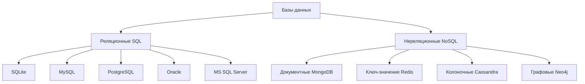
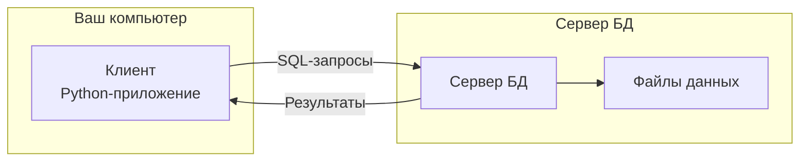
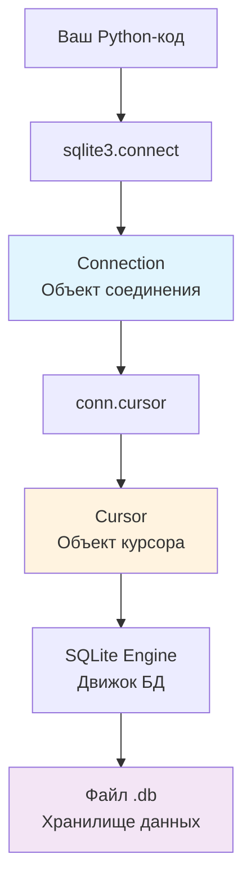
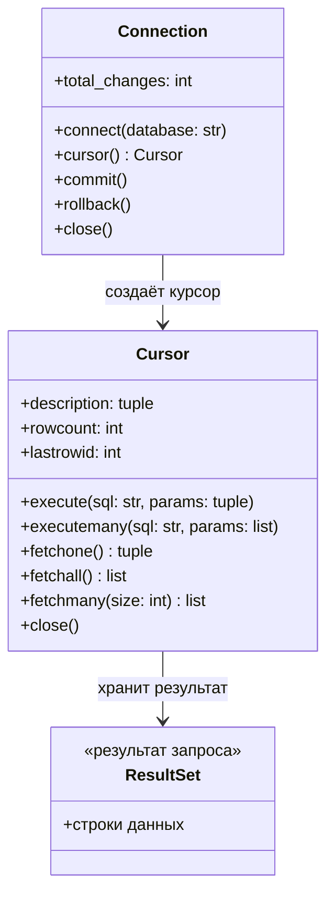
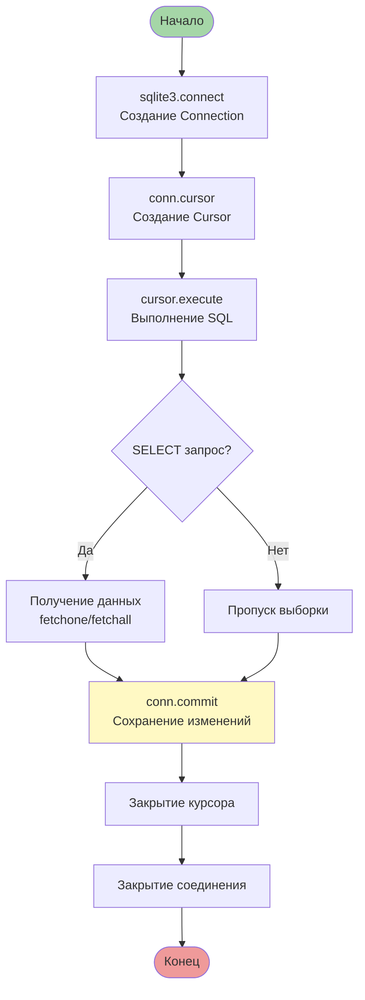
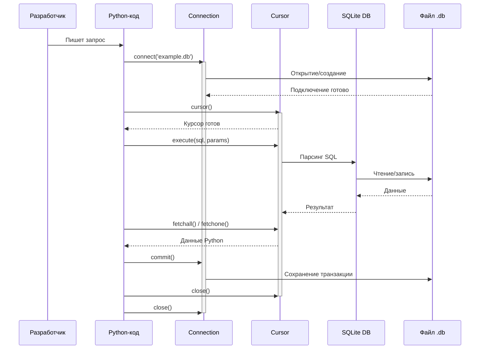
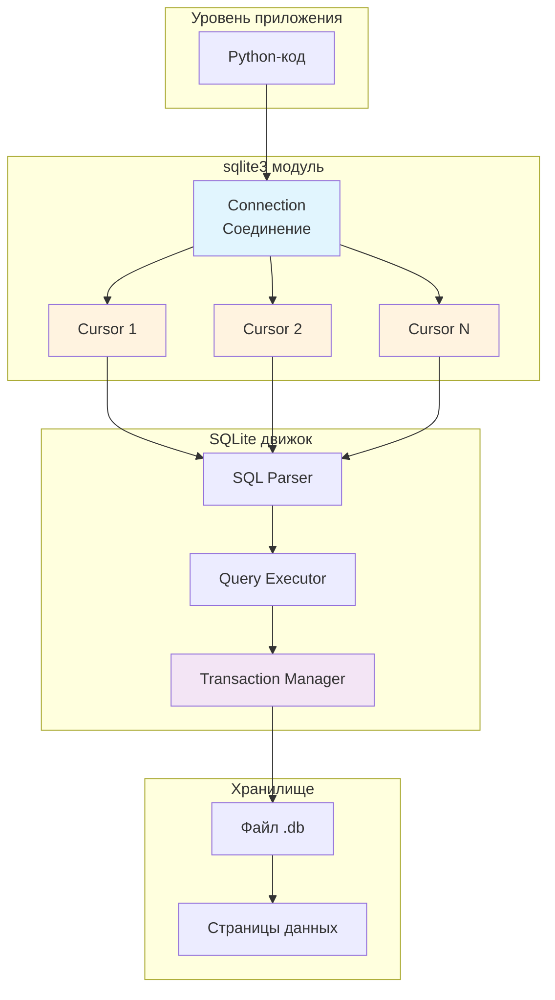
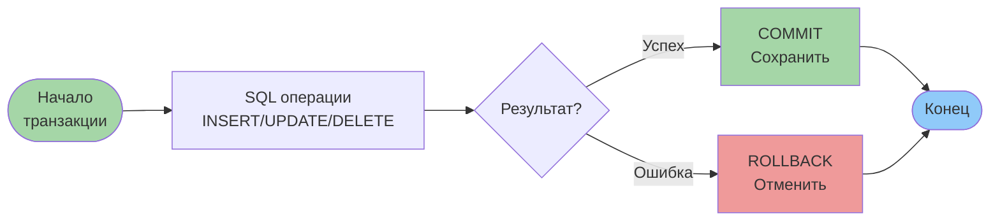
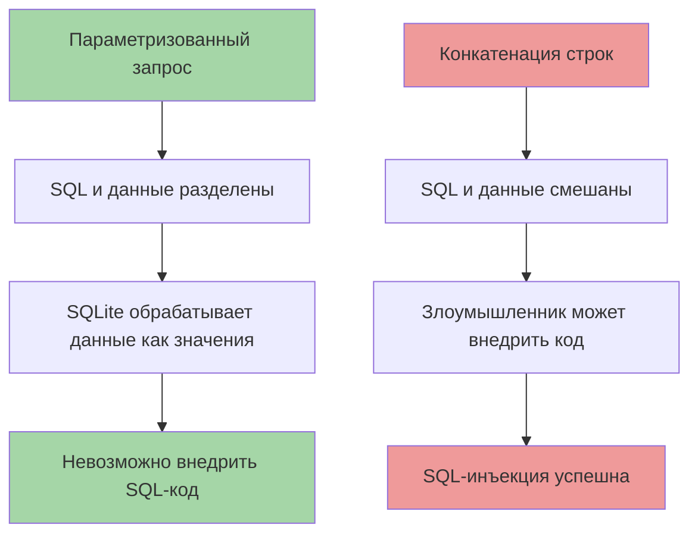
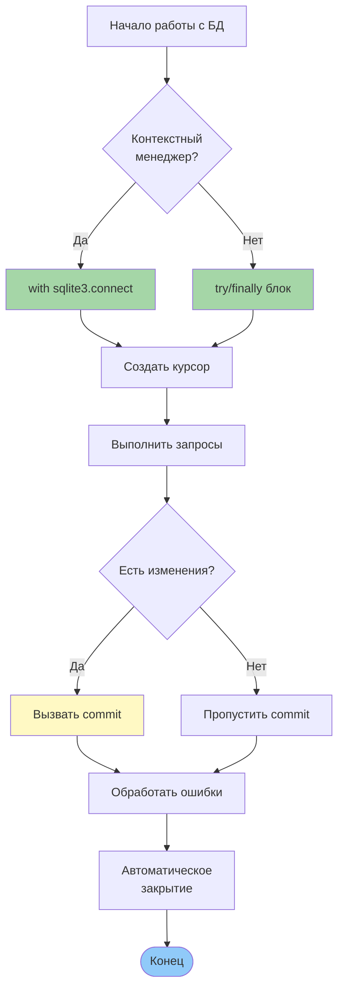

# Лекция 21: Работа с базами данных

## Введение в SQL, модуль sqlite3, основные команды SQL

### Цель лекции:
- Познакомиться с основами работы с базами данных
- Изучить модуль sqlite3 в Python
- Освоить основные команды SQL
- Понять архитектуру работы с БД в Python

### План лекции:
1. Введение в базы данных
2. Модуль sqlite3 и архитектура работы
3. Основные команды SQL
4. Работа с базой данных в Python
5. Архитектура работы с БД в Python
6. Лучшие практики

---

## 1. Введение в базы данных

База данных — организованная коллекция структурированных записей или данных, обычно хранимая в компьютерной системе.

### Типы баз данных:



### Реляционные базы данных:
- Данные организованы в **таблицы** со строками и столбцами
- Используют язык **SQL** (Structured Query Language)
- Связи между таблицами через ключи
- Гарантируют **ACID**-транзакции:
  - **A**tomicity (Атомарность)
  - **C**onsistency (Согласованность)
  - **I**solation (Изоляция)
  - **D**urability (Долговечность)

### Архитектура клиент-сервер:



> **Примечание:** SQLite работает **без сервера** — это встроенная библиотека, которая читает/пишет напрямую в файл.

### Основные понятия:
| Термин | Описание |
|--------|----------|
| **Таблица** | Коллекция связанных данных (как лист Excel) |
| **Строка (запись)** | Одна запись в таблице |
| **Столбец (поле)** | Атрибут данных (например, `name`, `age`) |
| **Первичный ключ** | Уникальный идентификатор строки (`PRIMARY KEY`) |
| **Внешний ключ** | Ссылка на первичный ключ другой таблицы (`FOREIGN KEY`) |
| **Индекс** | Структура для ускорения поиска данных |

---

## 2. Модуль sqlite3 и архитектура работы

SQLite — встроенная в Python реляционная база данных, не требующая отдельного сервера.

### Архитектура sqlite3:



### Что такое `cursor = conn.cursor()`?

**`Connection` (соединение)** — это канал связи с базой данных:
- Управляет подключением к БД
- Контролирует транзакции (`commit()`, `rollback()`)
- Может создавать несколько курсоров

**`Cursor` (курсор)** — это объект для выполнения SQL-команд:
- Выполняет SQL-запросы через `execute()`
- Хранит состояние текущего запроса
- Содержит результаты выполнения
- Позволяет итерироваться по результатам

### Почему нужны оба объекта?



### Жизненный цикл соединения:



### Подключение к базе данных:

```python
import sqlite3

# Подключение к базе данных (создаст файл, если не существует)
conn = sqlite3.connect('example.db')

# Создание курсора для выполнения запросов
cursor = conn.cursor()
```

### Создание таблицы:

```python
cursor.execute('''
    CREATE TABLE IF NOT EXISTS users (
        id INTEGER PRIMARY KEY AUTOINCREMENT,
        name TEXT NOT NULL,
        email TEXT UNIQUE,
        age INTEGER
    )
''')
```

### Закрытие соединения:

```python
conn.commit()  # Сохранение изменений (транзакция)
conn.close()   # Закрытие соединения
```

### Контекстный менеджер:

```python
with sqlite3.connect('example.db') as conn:
    cursor = conn.cursor()
    # Работа с базой данных
    # conn.commit() и conn.close() вызываются автоматически
```

---

## 3. Основные команды SQL

### CREATE TABLE - создание таблицы:

```sql
CREATE TABLE employees (
    id INTEGER PRIMARY KEY,
    name TEXT NOT NULL,
    position TEXT,
    salary REAL
);
```

### Типы данных в SQLite:

| Тип | Описание |
|-----|----------|
| `INTEGER` | Целые числа |
| `REAL` | Числа с плавающей точкой |
| `TEXT` | Строковый текст |
| `BLOB` | Бинарные данные |
| `NULL` | Отсутствие значения |

### INSERT - добавление данных:

```sql
INSERT INTO employees (name, position, salary)
VALUES ('Иван Иванов', 'Программист', 75000);
```

### SELECT - выборка данных:

```sql
-- Все записи
SELECT * FROM employees;

-- Выборка с условием
SELECT name, salary FROM employees WHERE salary > 50000;

-- Сортировка и ограничение
SELECT * FROM employees ORDER BY salary DESC LIMIT 5;
```

### UPDATE - обновление данных:

```sql
UPDATE employees SET salary = 80000 WHERE name = 'Иван Иванов';
```

### DELETE - удаление данных:

```sql
DELETE FROM employees WHERE id = 1;
```

### WHERE - условия:

```sql
-- Одиночное условие
SELECT * FROM employees WHERE position = 'Программист';

-- Несколько условий (AND)
SELECT * FROM employees WHERE position = 'Программист' AND salary > 60000;

-- Несколько условий (OR)
SELECT * FROM employees WHERE position = 'Программист' OR position = 'Тестировщик';

-- LIKE - поиск по шаблону
SELECT * FROM employees WHERE name LIKE 'Иван%';
```

---

## 4. Работа с базой данных в Python

### Схема потока данных при выполнении запроса:



### Вставка данных:

```python
import sqlite3

with sqlite3.connect('example.db') as conn:
    cursor = conn.cursor()

    # Безопасная вставка данных (предотвращение SQL-инъекций)
    cursor.execute(
        "INSERT INTO users (name, email, age) VALUES (?, ?, ?)",
        ("Иван Петров", "ivan@example.com", 30)
    )
    conn.commit()  # Обязательно сохраняем изменения!
```

### Выборка данных:

```python
with sqlite3.connect('example.db') as conn:
    cursor = conn.cursor()

    # Выборка всех записей
    cursor.execute("SELECT * FROM users")
    rows = cursor.fetchall()  # Возвращает список кортежей

    for row in rows:
        print(row)  # (id, name, email, age)

    # Выборка одной записи
    cursor.execute("SELECT * FROM users WHERE id = ?", (1,))
    row = cursor.fetchone()  # Возвращает один кортеж или None
    print(row)
    
    # Выборка нескольких записей
    cursor.execute("SELECT * FROM users")
    five_rows = cursor.fetchmany(5)  # Возвращает N записей
```

### Методы получения данных из курсора:

| Метод | Описание | Возвращает |
|-------|----------|------------|
| `fetchone()` | Получить одну строку | `tuple` или `None` |
| `fetchall()` | Получить все строки | `list[tuple]` |
| `fetchmany(n)` | Получить N строк | `list[tuple]` |
| Итерация | `for row in cursor:` | Итератор по строкам |

### Использование именованных параметров:

```python
cursor.execute("""
    SELECT * FROM users
    WHERE age > :min_age AND email LIKE :email_pattern
""", {"min_age": 25, "email_pattern": "%@gmail.com"})
```

### Работа с несколькими строками:

```python
users_data = [
    ("Анна Смирнова", "anna@example.com", 28),
    ("Петр Сидоров", "petr@example.com", 35),
    ("Мария Козлова", "maria@example.com", 22)
]

cursor.executemany(
    "INSERT INTO users (name, email, age) VALUES (?, ?, ?)",
    users_data
)
conn.commit()
```

### Обработка ошибок:

```python
import sqlite3

try:
    with sqlite3.connect('example.db') as conn:
        cursor = conn.cursor()
        cursor.execute("INSERT INTO users (name, email) VALUES (?, ?)", 
                      ("Тест", "test@example.com"))
        conn.commit()
        
except sqlite3.IntegrityError as e:
    print(f"Ошибка целостности: {e}")  # Нарушение UNIQUE, NOT NULL
except sqlite3.OperationalError as e:
    print(f"Ошибка операции: {e}")  # Таблица не существует и т.д.
except sqlite3.DatabaseError as e:
    print(f"Ошибка БД: {e}")  # Общая ошибка базы данных
```

---

## 5. Архитектура работы с БД в Python

### Полная схема взаимодействия компонентов:



### Транзакции в SQLite:



### Пример работы с транзакциями:

```python
import sqlite3

conn = sqlite3.connect('example.db')
cursor = conn.cursor()

try:
    # Начало транзакции (автоматически при первой операции)
    cursor.execute("UPDATE accounts SET balance = balance - 100 WHERE id = 1")
    cursor.execute("UPDATE accounts SET balance = balance + 100 WHERE id = 2")
    
    # Если всё успешно - сохраняем
    conn.commit()
    print("Перевод выполнен успешно")
    
except Exception as e:
    # При ошибке - откатываем все изменения
    conn.rollback()
    print(f"Ошибка перевода: {e}")
    
finally:
    conn.close()
```

---

## 6. Лучшие практики

### 1. Управление соединениями:

```python
# ✅ ХОРОШО: Использование контекстного менеджера
with sqlite3.connect('example.db') as conn:
    cursor = conn.cursor()
    cursor.execute("SELECT * FROM users")
    # conn.close() вызывается автоматически

# ❌ ПЛОХО: Ручное управление без finally
conn = sqlite3.connect('example.db')
cursor = conn.cursor()
cursor.execute("SELECT * FROM users")
conn.close()  # Может не вызваться при ошибке
```

### 2. Безопасность (защита от SQL-инъекций):

```python
# ✅ ХОРОШО: Параметризованные запросы
cursor.execute(
    "SELECT * FROM users WHERE name = ?", 
    (user_input,)
)

# ❌ ПЛОХО: Конкатенация строк (уязвимость!)
cursor.execute(
    f"SELECT * FROM users WHERE name = '{user_input}'"
)
```

### Почему параметризованные запросы безопасны:



### 3. Производительность:

```python
# ✅ Использование индексов для частых запросов
cursor.execute("CREATE INDEX IF NOT EXISTS idx_users_email ON users(email)")

# ✅ Пакетная вставка данных
users_data = [(f"user{i}", f"user{i}@example.com") for i in range(1000)]
cursor.executemany("INSERT INTO users (name, email) VALUES (?, ?)", users_data)
conn.commit()

# ❌ Индивидуальная вставка (медленно)
for i in range(1000):
    cursor.execute("INSERT INTO users (name, email) VALUES (?, ?)", 
                  (f"user{i}", f"user{i}@example.com"))
    conn.commit()  # commit после каждой записи!
```

### 4. Закрытие курсоров:

```python
# ✅ Явное закрытие при длительной работе
cursor = conn.cursor()
cursor.execute("SELECT * FROM large_table")
results = cursor.fetchall()
cursor.close()  # Освобождаем ресурсы

# Для коротких скриптов с контекстным менеджером
# курсор закроется автоматически с соединением
```

### 5. Чек-лист правильной работы с БД:



---

## Контрольные вопросы:

1. В чём разница между `Connection` и `Cursor`?
2. Зачем нужен `commit()` и когда он не требуется?
3. Почему параметризованные запросы безопаснее конкатенации строк?
4. Что произойдёт, если не вызвать `commit()` после `INSERT`?
5. Как правильно обрабатывать ошибки при работе с БД?

---
