# Лекция 32: Технологии хранения данных

## Введение в NoSQL, кэширование, выбор технологии

### Цель лекции:
- Познакомиться с NoSQL базами данных
- Изучить основные типы NoSQL решений
- Освоить принципы кэширования данных
- Понять области применения различных технологий хранения
- Научиться выбирать технологию для конкретных задач

### План лекции:
1. Введение в NoSQL
2. Типы NoSQL баз данных
3. Кэширование данных
4. Сравнение SQL и NoSQL
5. Выбор технологии хранения
6. Полиглотное хранение
7. Практические кейсы

---

## 1. Введение в NoSQL

NoSQL (Not Only SQL) — подход к хранению данных, отличный от традиционных реляционных баз данных.

### Эволюция баз данных:

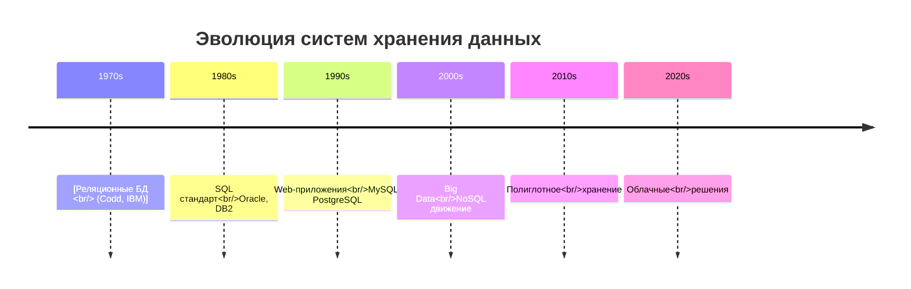

### Причины появления NoSQL:

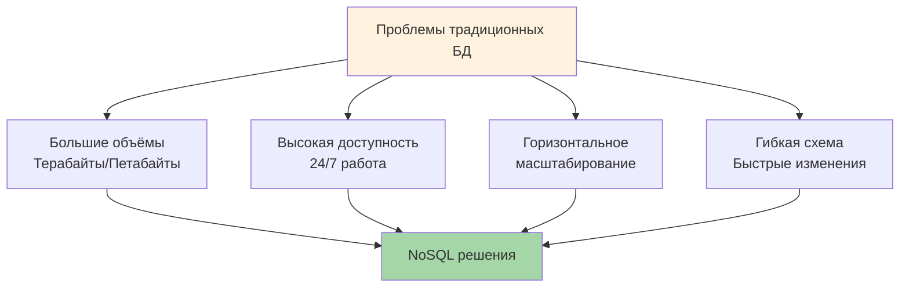

### Проблемы, решаемые NoSQL:

| Проблема | Решение NoSQL |
|----------|---------------|
| **Масштабируемость** | Горизонтальное масштабирование (sharding) |
| **Производительность** | Оптимизация для конкретных паттернов доступа |
| **Адаптивность** | Схема-less или гибкая схема |
| **Стоимость** | Использование commodity-hardware |
| **Высокая доступность** | Репликация, eventual consistency |

### CAP теорема:

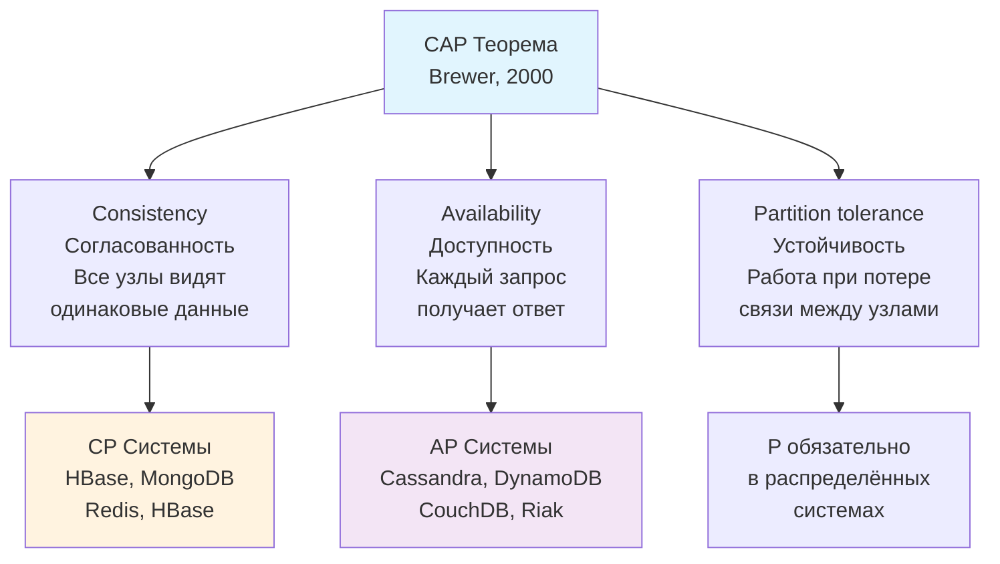

### Пояснение CAP:

| Свойство | Описание | Пример нарушения |
|----------|----------|-----------------|
| **Consistency** | Все узлы видят одинаковые данные в один момент времени | Чтение с реплики показывает старые данные |
| **Availability** | Каждый запрос получает ответ (успех или ошибка) | Система не отвечает во время сбоя |
| **Partition tolerance** | Система работает при потере связи между узлами | Сбой сети между дата-центрами |

### BASE против ACID:

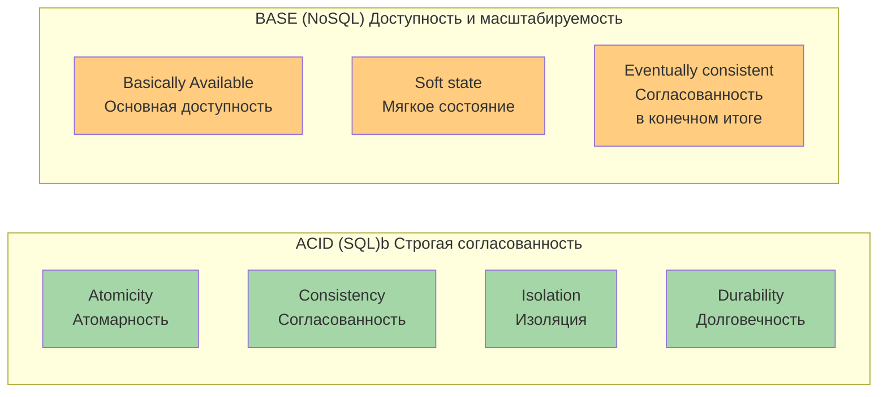

### Сравнение ACID и BASE:

| Характеристика | ACID (SQL) | BASE (NoSQL) |
|----------------|------------|--------------|
| **Согласованность** | Мгновенная, строгая | В конечном итоге, мягкая |
| **Доступность** | Может жертвовать при сбоях | Приоритет доступности |
| **Производительность** | Ниже из-за блокировок | Выше за счёт ослабления ACID |
| **Масштабирование** | Вертикальное | Горизонтальное |
| **Использование** | Финансы, заказы | Соцсети, контент, аналитика |

---

## 2. Типы NoSQL баз данных

### Классификация NoSQL:

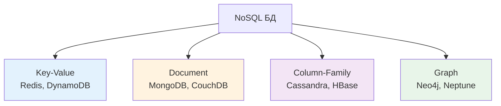

### 2.1 Ключ-значение (Key-Value)

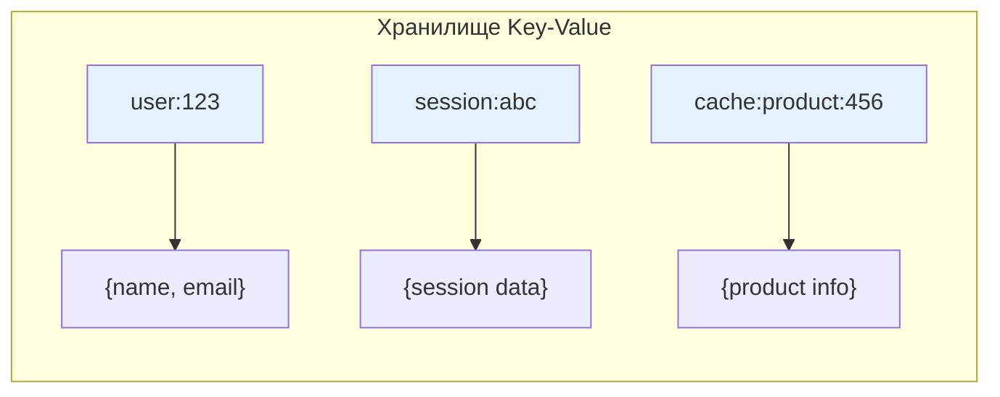

**Примеры:** Redis, Amazon DynamoDB, Riak, etcd

| Характеристика | Описание |
|----------------|----------|
| **Структура** | Простая пара ключ-значение |
| **Преимущества** | Простота, высокая производительность, масштабируемость |
| **Недостатки** | Ограниченные возможности запросов, нет связей |
| **Применение** | Кэширование, сессии, конфигурации, очереди |

```python
# Пример работы с Redis
import redis
import json

r = redis.Redis(host='localhost', port=6379, db=0, decode_responses=True)

# Сохранение данных (String)
r.set('user:123', json.dumps({
    'name': 'Иван',
    'email': 'ivan@example.com'
}))

# Получение данных
user_data = r.get('user:123')
user = json.loads(user_data)
print(user['name'])

# Хэш (более эффективно для объектов)
r.hset('user:456', mapping={
    'name': 'Петр',
    'email': 'petr@example.com',
    'age': 30
})

name = r.hget('user:456', 'name')

# Списки (очереди)
r.lpush('queue:tasks', 'task1', 'task2', 'task3')
task = r.rpop('queue:tasks')

# Сортированные множества (рейтинги)
r.zadd('leaderboard', {'player1': 100, 'player2': 250, 'player3': 150})
top_players = r.zrevrange('leaderboard', 0, 2, withscores=True)

# Истечение (TTL)
r.setex('session:abc', 3600, 'session_data')  # 1 час
```

### 2.2 Документоориентированные

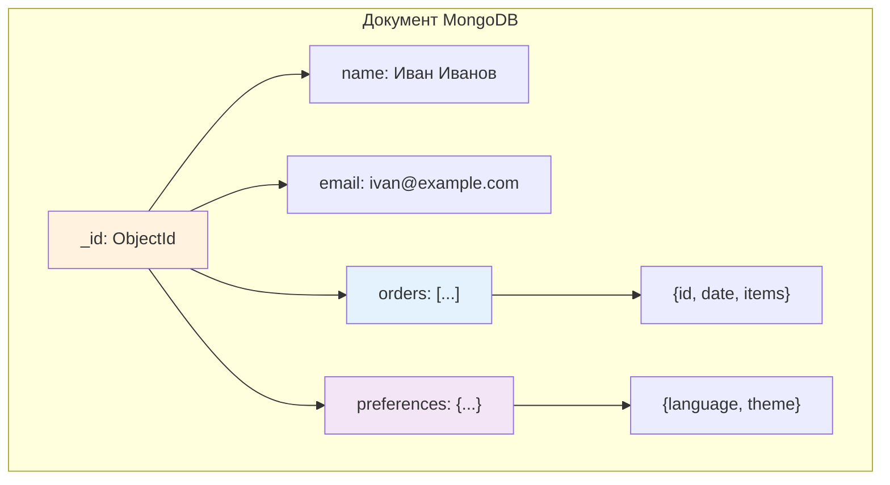

**Примеры:** MongoDB, CouchDB, Amazon DocumentDB

| Характеристика | Описание |
|----------------|----------|
| **Структура** | Документы (JSON/BSON), вложенные структуры |
| **Преимущества** | Гибкая схема, богатые запросы, индексы |
| **Недостатки** | Сложность JOIN, транзакции ограничены |
| **Применение** | CMS, каталоги, профили, контент |

```python
# Пример работы с MongoDB (PyMongo)
from pymongo import MongoClient
from datetime import datetime

client = MongoClient('mongodb://localhost:27017/')
db = client['shop']
users = db['users']

# Вставка документа
user_doc = {
    'name': 'Иван Иванов',
    'email': 'ivan@example.com',
    'age': 30,
    'orders': [
        {
            'id': 'order_123',
            'date': datetime.now(),
            'items': [
                {'product': 'iPhone', 'price': 70000, 'qty': 1},
                {'product': 'AirPods', 'price': 15000, 'qty': 2}
            ],
            'total': 100000
        }
    ],
    'preferences': {
        'language': 'ru',
        'theme': 'dark',
        'notifications': True
    },
    'created_at': datetime.now()
}

result = users.insert_one(user_doc)
print(f"Вставлен документ с ID: {result.inserted_id}")

# Запросы
# Найти по email
user = users.find_one({'email': 'ivan@example.com'})

# Найти все заказы дороже 50000
expensive_orders = users.find({'orders.total': {'$gt': 50000}})

# Агрегация
pipeline = [
    {'$unwind': '$orders'},
    {'$group': {
        '_id': None,
        'total_revenue': {'$sum': '$orders.total'}
    }}
]
result = users.aggregate(pipeline)

# Индексы
users.create_index([('email', 1)], unique=True)
users.create_index([('name', 'text')])  # Полнотекстовый поиск
```

### 2.3 Колоночные (Column-Family)

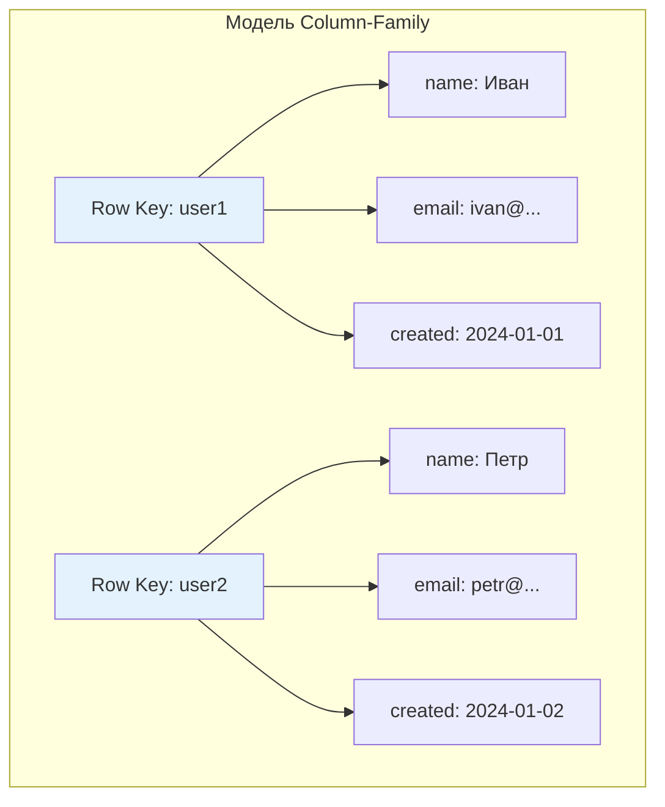

**Примеры:** Cassandra, HBase, Amazon SimpleDB, ScyllaDB

| Характеристика | Описание |
|----------------|----------|
| **Структура** | Строки с динамическими колонками, family groups |
| **Преимущества** | Высокая запись/чтение, горизонтальное масштабирование |
| **Недостатки** | Сложность, ограниченные запросы, eventual consistency |
| **Применение** | IoT, временные ряды, аналитика, логи |

```python
# Пример модели данных Cassandra (CQL)
"""
-- Создание ключевой таблицы
CREATE KEYSPACE shop 
WITH replication = {'class': 'SimpleStrategy', 'replication_factor': 3};

USE shop;

-- Таблица для временных рядов
CREATE TABLE sensor_data (
    sensor_id uuid,
    timestamp timestamp,
    temperature double,
    humidity double,
    pressure double,
    PRIMARY KEY (sensor_id, timestamp)
) WITH CLUSTERING ORDER BY (timestamp DESC);

-- Запрос последних показаний
SELECT * FROM sensor_data 
WHERE sensor_id = 123e4567-e89b-12d3-a456-426614174000 
LIMIT 100;
"""
```

### 2.4 Графовые

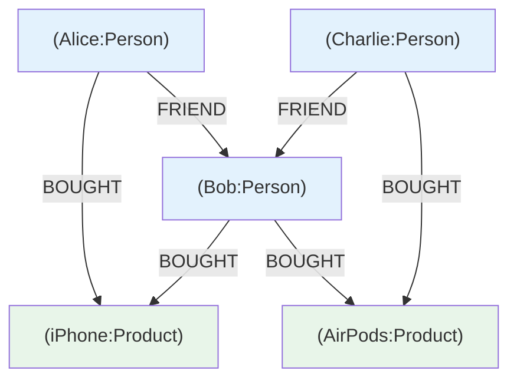

**Примеры:** Neo4j, Amazon Neptune, ArangoDB, JanusGraph

| Характеристика | Описание |
|----------------|----------|
| **Структура** | Узлы, связи, свойства |
| **Преимущества** | Эффективная обработка связей, сложные запросы |
| **Недостатки** | Не для простых CRUD, сложность масштабирования |
| **Применение** | Соцсети, рекомендации, фрод-детекшн, маршруты |

```python
# Пример запроса в Neo4j (Cypher)
from neo4j import GraphDatabase

class Neo4jConnection:
    def __init__(self, uri, user, password):
        self.driver = GraphDatabase.driver(uri, auth=(user, password))
    
    def close(self):
        self.driver.close()
    
    def query(self, cypher, parameters=None):
        with self.driver.session() as session:
            return session.run(cypher, parameters)

# Использование
conn = Neo4jConnection('bolt://localhost:7687', 'neo4j', 'password')

# Найти друзей Ивана
result = conn.query("""
    MATCH (person:Person)-[:FRIEND]->(friend:Person)
    WHERE person.name = 'Иван'
    RETURN friend.name, friend.email
""")

# Рекомендации товаров
recommendations = conn.query("""
    MATCH (user:Person {name: 'Иван'})-[:BOUGHT]->(product:Product)
    MATCH (friend:Person)-[:FRIEND]->(user)
    MATCH (friend)-[:BOUGHT]->(recommended:Product)
    WHERE NOT (user)-[:BOUGHT]->(recommended)
    RETURN recommended.name, COUNT(*) as count
    ORDER BY count DESC
    LIMIT 5
""")

# Поиск кратчайшего пути
path = conn.query("""
    MATCH path = shortestPath(
        (start:Person {name: 'Иван'})-[:FRIEND*]-(end:Person {name: 'Петр'})
    )
    RETURN path
""")
```

### Сравнение типов NoSQL:

| Тип | Запись | Чтение | Запросы | Масштабирование |
|-----|--------|--------|---------|-----------------|
| **Key-Value** | ⭐⭐⭐ | ⭐⭐⭐ | ⭐ | ⭐⭐⭐ |
| **Document** | ⭐⭐⭐ | ⭐⭐ | ⭐⭐ | ⭐⭐ |
| **Column** | ⭐⭐⭐ | ⭐⭐⭐ | ⭐ | ⭐⭐⭐ |
| **Graph** | ⭐⭐ | ⭐⭐ | ⭐⭐⭐ | ⭐ |

---

## 3. Кэширование данных

Кэширование — хранение часто используемых данных в быстрой памяти для ускорения доступа.

### Архитектура кэширования:

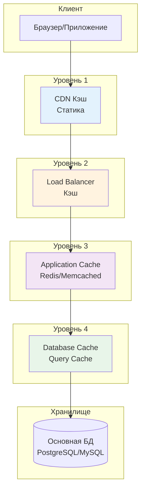

### Цели кэширования:

| Цель | Описание | Эффект |
|------|----------|--------|
| **Ускорение доступа** | Быстрая память (RAM) vs медленная (Disk) | 10-100x быстрее |
| **Снижение нагрузки** | Меньше запросов к основной БД | Выше пропускная способность |
| **Повышение доступности** | Работа при отказе основного источника | Выше uptime |

### Стратегии кэширования:

#### 1. Cache-Aside (Lazy Loading):

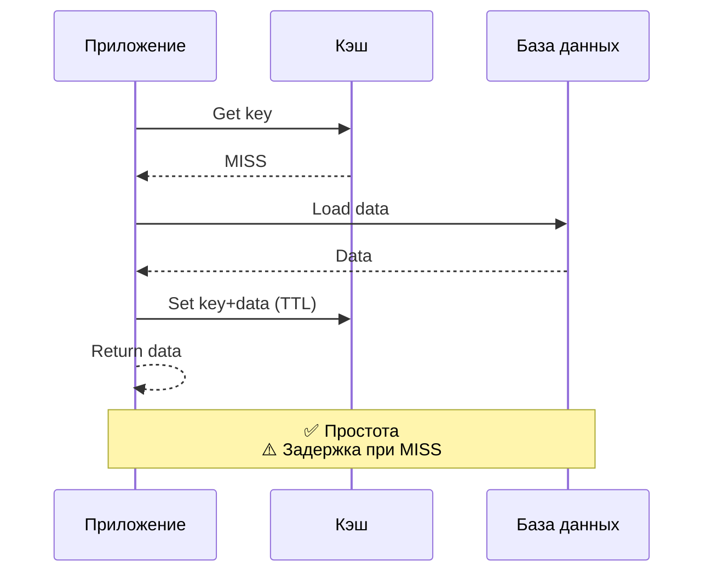

```python
import redis
import json

cache = redis.Redis(host='localhost', port=6379, db=0)

def get_user(user_id):
    # Проверяем кэш
    cached_user = cache.get(f"user:{user_id}")
    if cached_user:
        return json.loads(cached_user)
    
    # Загружаем из БД
    user = database.get_user(user_id)
    
    # Сохраняем в кэш на 1 час
    cache.setex(
        f"user:{user_id}",
        3600,
        json.dumps(user, ensure_ascii=False)
    )
    
    return user
```

#### 2. Read-Through:

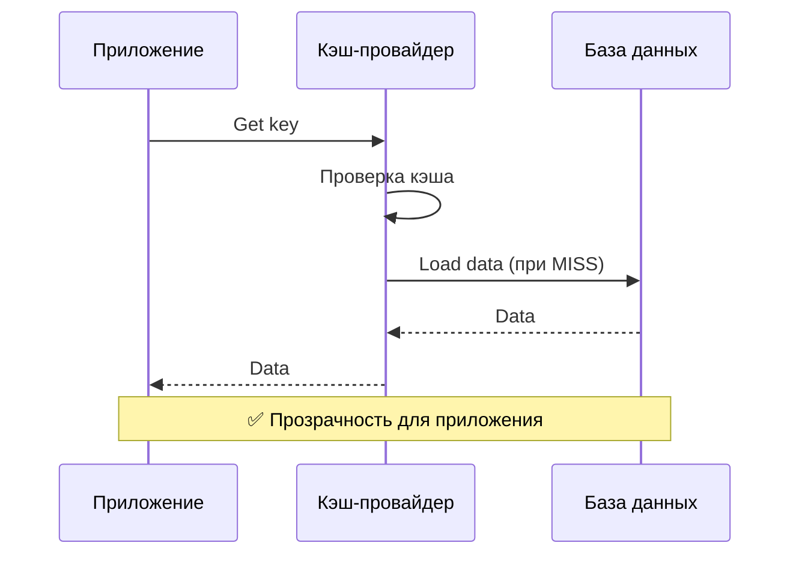

#### 3. Write-Through:

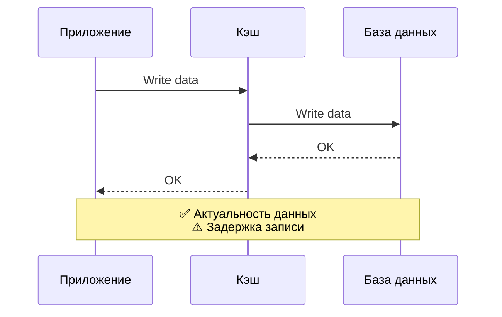

#### 4. Write-Behind (Write-Back):

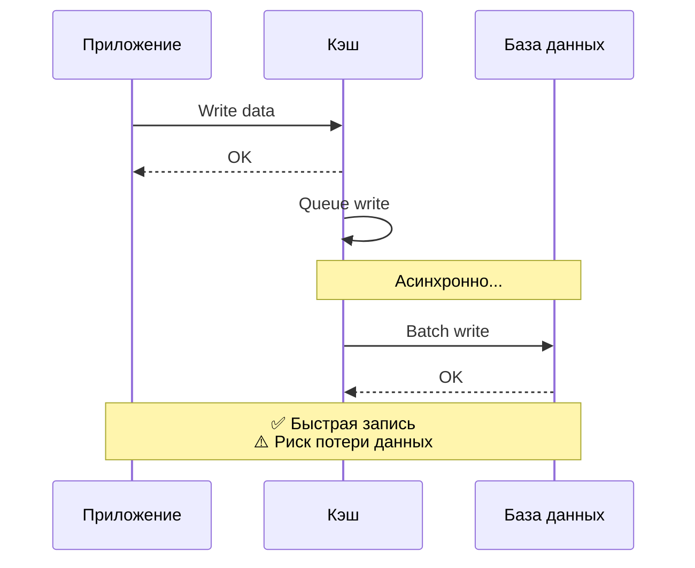

### Сравнение стратегий:

| Стратегия | Преимущества | Недостатки | Когда использовать |
|-----------|--------------|------------|-------------------|
| **Cache-Aside** | Простота, контроль | Задержка при MISS | Универсальная |
| **Read-Through** | Прозрачность | Сложнее реализация | Готовые решения |
| **Write-Through** | Актуальность | Задержка записи | Важна консистентность |
| **Write-Behind** | Быстрая запись | Риск потери | Высокая нагрузка на запись |

### Алгоритмы вытеснения:

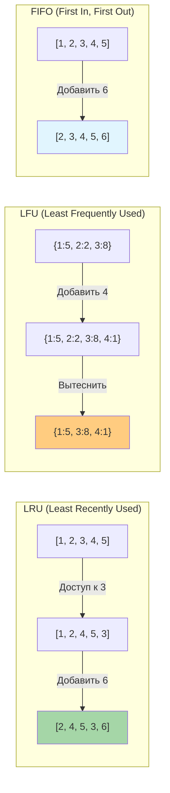

### Алгоритмы вытеснения:

| Алгоритм | Описание | Когда использовать |
|----------|----------|-------------------|
| **LRU** | Вытесняются давно неиспользуемые | Универсальный выбор |
| **LFU** | Вытесняются редко используемые | Для "горячих" данных |
| **FIFO** | Вытесняются самые старые | Простые очереди |
| **MRU** | Вытесняются недавно использованные | Специфичные сценарии |
| **TTL** | По времени жизни | Временные данные |

### Кэширование в Python:

```python
# functools.lru_cache для функций
from functools import lru_cache
import time

@lru_cache(maxsize=128)
def expensive_function(n):
    """Функция с кэшированием результатов"""
    time.sleep(1)  # Имитация долгой операции
    return n * n

# Первый вызов - медленный
result1 = expensive_function(5)  # ~1 сек

# Второй вызов - мгновенно (из кэша)
result2 = expensive_function(5)  # ~0 сек

# Статистика кэша
print(expensive_function.cache_info())
# CacheInfo(hits=1, misses=2, maxsize=128, currsize=2)

# Очистка кэша
expensive_function.cache_clear()
```

### Кэширование с Redis:

```python
import redis
import json
from functools import wraps

class RedisCache:
    def __init__(self, host='localhost', port=6379, db=0):
        self.redis = redis.Redis(host, port, db, decode_responses=True)
    
    def cached(self, key_prefix, ttl=3600):
        """Декоратор для кэширования результатов функции"""
        def decorator(func):
            @wraps(func)
            def wrapper(*args, **kwargs):
                # Формирование ключа
                key = f"{key_prefix}:{func.__name__}:{str(args)}:{str(kwargs)}"
                
                # Проверка кэша
                cached = self.redis.get(key)
                if cached:
                    return json.loads(cached)
                
                # Выполнение функции
                result = func(*args, **kwargs)
                
                # Сохранение в кэш
                self.redis.setex(key, ttl, json.dumps(result))
                
                return result
            return wrapper
        return decorator
    
    def invalidate(self, pattern):
        """Инвалидация кэша по паттерну"""
        keys = self.redis.keys(pattern)
        if keys:
            self.redis.delete(*keys)

# Использование
cache = RedisCache()

@cache.cached(key_prefix='user', ttl=1800)
def get_user_profile(user_id):
    return database.get_user(user_id)

@cache.cached(key_prefix='products', ttl=600)
def get_products(category=None):
    return database.get_products(category)

# Инвалидация при обновлении
def update_user(user_id, data):
    database.update_user(user_id, data)
    cache.invalidate(f"user:*{user_id}*")
```

### Инвалидация кэша:

```python
# Стратегии инвалидации

# 1. По TTL (автоматическая)
cache.setex('user:123', 3600, data)  # Истекает через 1 час

# 2. Явная инвалидация
def update_user(user_id, data):
    database.update_user(user_id, data)
    cache.delete(f'user:{user_id}')

# 3. Инвалидация по паттерну
def invalidate_user_cache(user_id):
    keys = cache.keys(f'user:{user_id}:*')
    if keys:
        cache.delete(*keys)

# 4. Версионирование ключей
def get_cache_key(entity, entity_id, version=1):
    return f'{entity}:v{version}:{entity_id}'

# При изменении структуры данных увеличиваем версию
```

---

## 4. Сравнение SQL и NoSQL

### Расширенное сравнение:

| Характеристика | SQL (Реляционные) | NoSQL |
|----------------|-------------------|-------|
| **Структура данных** | Таблицы с фиксированной схемой | Гибкая, схема-less |
| **Связи** | JOIN между таблицами | Вложенность, ссылки |
| **Масштабирование** | Вертикальное (мощный сервер) | Горизонтальное (шардинг) |
| **ACID** | Полная поддержка | Частичная/отсутствует |
| **Запросы** | SQL, стандартизированный | Специфичные для системы |
| **Производительность** | Высокая для сложных запросов | Высокая для простых операций |
| **Согласованность** | Строгая (strong consistency) | Мягкая (eventual consistency) |
| **Транзакции** | Межтабличные | Ограниченные (часто в документе) |
| **Индексы** | B-tree, сложные | Различные по типу БД |
| **Стоимость** | Лицензии (коммерческие) | Open source (часто) |

### Области применения:

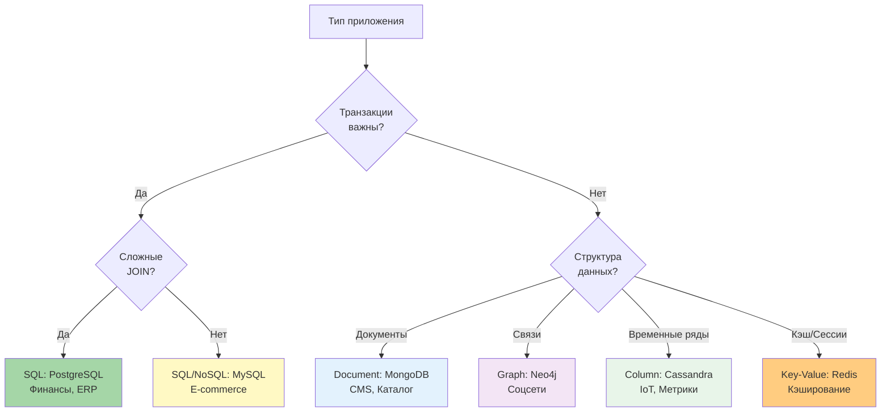

---

## 5. Выбор технологии хранения

### Блок-схема выбора:

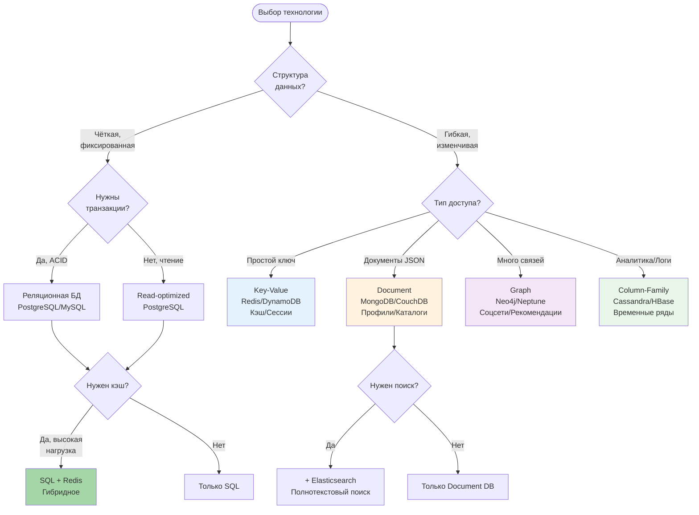

### Факторы выбора:

| Фактор | Вопросы для анализа | Влияние на выбор |
|--------|---------------------|------------------|
| **Объем данных** | Сколько ГБ/ТБ сейчас? Через год? | NoSQL для больших объемов |
| **Тип данных** | Структурированные/неструктурированные? | SQL vs Document |
| **Частота запросов** | RPS (requests per second)? | Кэш при высокой нагрузке |
| **Тип запросов** | Простые CRUD или аналитика? | SQL для аналитики |
| **Согласованность** | Нужна ли строгая консистентность? | SQL для финансов |
| **Масштабируемость** | Планируется ли рост? | NoSQL для горизонтального |
| **Бюджет** | Лицензии, инфраструктура, команда | Open source vs коммерческие |

### Матрица выбора:

| Сценарий | Основная БД | Кэш | Поиск | Аналитика |
|----------|-------------|-----|-------|-----------|
| **E-commerce** | PostgreSQL | Redis | Elasticsearch | PostgreSQL |
| **Соцсеть** | PostgreSQL | Redis | Elasticsearch | Cassandra |
| **IoT платформа** | TimescaleDB | Redis | - | Cassandra |
| **CMS** | MongoDB | Redis | MongoDB Search | - |
| **Финтех** | PostgreSQL | Redis | - | PostgreSQL |
| **Блог/Медиа** | PostgreSQL | Redis+CDN | Elasticsearch | - |

---

## 6. Полиглотное хранение

Полиглотное хранение — использование нескольких технологий хранения данных в одном приложении.

### Архитектура полиглотного хранения:

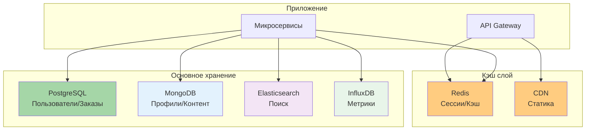

### Пример архитектуры:

```
Приложение (E-commerce платформа)
├── Redis
│   ├── Сессии пользователей
│   ├── Кэш товаров
│   └── Очереди задач
├── PostgreSQL
│   ├── Пользователи
│   ├── Заказы
│   ├── Платежи
│   └── Инвентарь
├── MongoDB
│   ├── Профили пользователей
│   ├── Отзывы
│   └── Логи действий
├── Elasticsearch
│   ├── Поиск товаров
│   ├── Поиск по отзывам
│   └── Аналитика поиска
└── InfluxDB
    ├── Метрики приложения
    ├── Логи производительности
    └── Мониторинг
```

### Синхронизация данных:

```python
# Паттерн: Transactional Outbox
from sqlalchemy import create_engine, Column, Integer, String, DateTime
from sqlalchemy.orm import declarative_base, sessionmaker
import json
from datetime import datetime

Base = declarative_base()

class OutboxEvent(Base):
    __tablename__ = 'outbox_events'
    
    id = Column(Integer, primary_key=True)
    event_type = Column(String)
    payload = Column(String)  # JSON
    created_at = Column(DateTime, default=datetime.utcnow)
    processed = Column(Integer, default=0)

# В той же транзакции, что и основное изменение
def create_order(session, user_id, items):
    # Создание заказа
    order = Order(user_id=user_id, items=items)
    session.add(order)
    session.flush()
    
    # Добавление события в outbox
    event = OutboxEvent(
        event_type='order_created',
        payload=json.dumps({
            'order_id': order.id,
            'user_id': user_id,
            'items': items
        })
    )
    session.add(event)
    
    session.commit()  # Атомарно!

# Отдельный процесс отправляет события
def process_outbox():
    session = Session()
    events = session.query(OutboxEvent).filter_by(processed=0).limit(100).all()
    
    for event in events:
        # Отправка в Kafka/RabbitMQ
        kafka_producer.send('events', {
            'type': event.event_type,
            'payload': json.loads(event.payload)
        })
        
        # Обновление в Elasticsearch
        if event.event_type == 'order_created':
            es.index(index='orders', id=event.payload['order_id'], body=event.payload)
        
        event.processed = 1
    
    session.commit()
```

---

## 7. Практические кейсы

### Кейс 1: Социальная сеть

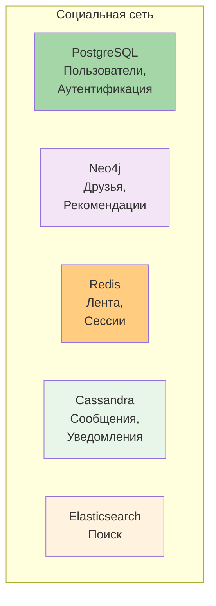

**Решение:**
- **PostgreSQL**: Пользователи, аутентификация, настройки (ACID важен)
- **Neo4j**: Граф друзей, рекомендации ("друзья друзей")
- **Redis**: Лента новостей, сессии, онлайн-статус
- **Cassandra**: Сообщения, уведомления (высокая запись)
- **Elasticsearch**: Поиск по постам, людям, хэштегам

### Кейс 2: E-commerce платформа

```python
# Архитектура интернет-магазина
class ECommerceArchitecture:
    """
    PostgreSQL:
    - Пользователи (с паролями)
    - Заказы и платежи
    - Инвентарь (остатки)
    
    MongoDB:
    - Каталог товаров (гибкие атрибуты)
    - Отзывы и рейтинги
    - История просмотров
    
    Redis:
    - Корзина покупок
    - Кэш товаров
    - Сессии
    - Очереди задач
    
    Elasticsearch:
    - Поиск товаров
    - Фильтрация
    - Рекомендации
    """
    
    def get_product(self, product_id):
        # 1. Проверка кэша
        cached = redis.get(f'product:{product_id}')
        if cached:
            return json.loads(cached)
        
        # 2. Загрузка из MongoDB
        product = mongo.products.find_one({'_id': product_id})
        
        # 3. Сохранение в кэш
        redis.setex(f'product:{product_id}', 600, json.dumps(product))
        
        return product
    
    def create_order(self, user_id, items):
        # Транзакция в PostgreSQL для заказа
        with db.transaction():
            order = db.orders.insert({
                'user_id': user_id,
                'items': items,
                'status': 'pending'
            })
            
            # Обновление остатков
            for item in items:
                db.inventory.update_one(
                    {'product_id': item['id']},
                    {'$inc': {'quantity': -item['qty']}}
                )
        
        # Асинхронно: отправка уведомления
        celery.send_task('send_order_email', [order.id])
        
        # Инвалидация кэша корзины
        redis.delete(f'cart:{user_id}')
        
        return order
```

### Кейс 3: IoT платформа

| Компонент | Технология | Обоснование |
|-----------|------------|-------------|
| **Показания датчиков** | TimescaleDB/InfluxDB | Временные ряды, сжатие |
| **Метаданные устройств** | PostgreSQL | Связи, транзакции |
| **Кэш последних показаний** | Redis | Быстрый доступ |
| **Алерты и уведомления** | Kafka + Cassandra | Высокая запись |
| **Дашборды** | Elasticsearch | Агрегации, поиск |

---

## Контрольные вопросы:

1. Что такое CAP теорема и как она влияет на выбор БД?
2. В чём разница между ACID и BASE?
3. Какие типы NoSQL баз данных вы знаете и когда их использовать?
4. Что такое eventual consistency?
5. Какие стратегии кэширования существуют?
6. Что такое полиглотное хранение и когда его использовать?
7. Как выбрать технологию хранения для конкретного проекта?
8. В чём разница между Redis и Memcached?

---

