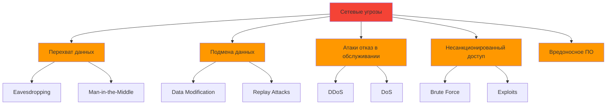

# Лекция 23: Сетевая безопасность

## Защита сетевых коммуникаций и инфраструктуры

### Цель лекции:
- Изучить основы сетевой безопасности
- Освоить методы защиты сетевых соединений
- Понять принципы работы TLS/SSL
- Научиться обнаруживать и предотвращать сетевые атаки
- Изучить лучшие практики защиты сетевых приложений

### План лекции:
1. Основы сетевой безопасности
2. Защита транспортного уровня (TLS/SSL)
3. Безопасность HTTP и HTTPS
4. Аутентификация и авторизация в сети
5. Защита от сетевых атак
6. Безопасность API и микросервисов

---

## 1. Основы сетевой безопасности

### Модель угроз:



### Ключевые понятия:

**Конфиденциальность:**
- Шифрование данных при передаче
- Защита от перехвата (eavesdropping)
- VPN и защищенные туннели

**Целостность:**
- Проверка целостности данных
- Цифровые подписи
- Контрольные суммы (hash)

**Доступность:**
- Защита от DDoS
- Избыточность
- Rate limiting

**Аутентификация:**
- Проверка идентичности сторон
- Сертификаты
- Токены доступа

---

## 2. Защита транспортного уровня (TLS/SSL)

### Что такое TLS/SSL:

```python
# ❌ Плохо: небезопасное соединение
import socket

def insecure_connection(host, port):
    sock = socket.socket(socket.AF_INET, socket.SOCK_STREAM)
    sock.connect((host, port))
    # Данные передаются в открытом виде
    sock.sendall(b"Secret data")
    sock.close()

# ✅ Хорошо: защищенное TLS соединение
import ssl

def secure_connection(host, port):
    # Создание контекста с проверкой сертификатов
    context = ssl.create_default_context()
    
    # Для повышенной безопасности
    context.check_hostname = True
    context.verify_mode = ssl.CERT_REQUIRED
    
    with socket.create_connection((host, port)) as sock:
        with context.wrap_socket(sock, server_hostname=host) as ssock:
            # Данные зашифрованы
            ssock.sendall(b"Secret data")
            response = ssock.recv(1024)
            return response
```

### Создание самоподписанного сертификата:

```bash
# Создание самоподписанного сертификата
openssl req -x509 -newkey rsa:4096 -keyout key.pem -out cert.pem \
    -days 365 -nodes -subj '/CN=localhost'

# Создание сертификата с SAN (Subject Alternative Name)
openssl req -x509 -newkey rsa:4096 -keyout key.pem -out cert.pem \
    -days 365 -nodes \
    -addext "subjectAltName=DNS:localhost,IP:127.0.0.1"
```

### Использование сертификатов в Python:

```python
import ssl
import socket
from pathlib import Path

class SecureServer:
    def __init__(self, cert_path, key_path):
        self.cert_path = Path(cert_path)
        self.key_path = Path(key_path)
    
    def create_context(self):
        """Создание SSL контекста для сервера"""
        context = ssl.SSLContext(ssl.PROTOCOL_TLS_SERVER)
        
        # Загрузка сертификата и ключа
        context.load_cert_chain(
            certfile=str(self.cert_path),
            keyfile=str(self.key_path)
        )
        
        # Настройки безопасности
        context.minimum_version = ssl.TLSVersion.TLSv1_2
        context.set_ciphers('ECDHE+AESGCM:ECDHE+CHACHA20:DHE+AESGCM:DHE+CHACHA20:!aNULL:!MD5:!DSS')
        
        return context
    
    def start_https_server(self, app, host='0.0.0.0', port=443):
        """Запуск HTTPS сервера"""
        context = self.create_context()
        
        from werkzeug.serving import run_simple
        run_simple(
            hostname=host,
            port=port,
            application=app,
            use_reloader=False,
            ssl_context=context
        )


# Пример использования с Flask
from flask import Flask

app = Flask(__name__)

@app.route('/')
def index():
    return 'Secure HTTPS Connection!'

# Запуск
# server = SecureServer('cert.pem', 'key.pem')
# server.start_https_server(app)
```

### Проверка безопасности TLS:

```python
import ssl
import socket

def check_tls_security(hostname, port=443):
    """Проверка безопасности TLS конфигурации"""
    results = {
        'hostname': hostname,
        'port': port,
        'supports_tls_1_3': False,
        'supports_tls_1_2': False,
        'cipher_suite': None,
        'certificate_valid': False
    }
    
    context = ssl.create_default_context()
    
    try:
        with socket.create_connection((hostname, port), timeout=5) as sock:
            with context.wrap_socket(sock, server_hostname=hostname) as ssock:
                # Получение информации о соединении
                cipher = ssock.cipher()
                results['cipher_suite'] = cipher[0] if cipher else None
                
                # Получение сертификата
                cert = ssock.getpeercert()
                
                # Проверка версии TLS
                version = ssock.version()
                results['supports_tls_1_2'] = version in ['TLSv1.2', 'TLSv1.3']
                results['supports_tls_1_3'] = version == 'TLSv1.3'
                
    except Exception as e:
        results['error'] = str(e)
    
    return results

# Проверка
# result = check_tls_security('google.com')
# print(result)
```

---

## 3. Безопасность HTTP и HTTPS

### Заголовки безопасности:

```python
from flask import Flask, make_response

app = Flask(__name__)

@app.after_request
def add_security_headers(response):
    """Добавление заголовков безопасности"""
    
    # Защита от XSS
    response.headers['X-XSS-Protection'] = '1; mode=block'
    
    # Защита от clickjacking
    response.headers['X-Frame-Options'] = 'DENY'
    
    # Защита от MIME-sniffing
    response.headers['X-Content-Type-Options'] = 'nosniff'
    
    # Strict Transport Security (HSTS)
    response.headers['Strict-Transport-Security'] = 'max-age=31536000; includeSubDomains'
    
    # Content Security Policy
    response.headers['Content-Security-Policy'] = "default-src 'self'; script-src 'self' 'unsafe-inline'"
    
    # Referrer Policy
    response.headers['Referrer-Policy'] = 'strict-origin-when-cross-origin'
    
    # Permissions Policy
    response.headers['Permissions-Policy'] = 'geolocation=(), microphone=(), camera=()'
    
    return response


# Альтернатива: использование Talisman
# from flask_talisman import Talisman

# Talisman(
#     app,
#     force_https=True,
#     content_security_policy=None,
#     strict_transport_security='max-age=31536000; includeSubDomains',
#     frame_deny=True
# )
```

### HSTS (HTTP Strict Transport Security):

```python
# Пример реализации HSTS
class HSTSHandler:
    def __init__(self, app):
        self.app = app
    
    def __call__(self, environ, start_response):
        # Проверка HTTPS
        if environ.get('HTTPS') == 'on' or environ.get('HTTP_X_FORWARDED_PROTO') == 'https':
            # Добавление HSTS заголовка
            def add_hsts_headers(status, headers, exc_info=None):
                # max-age в секундах (1 год)
                hsts_header = ('Strict-Transport-Security', 'max-age=31536000; includeSubDomains; preload')
                headers.append(hsts_header)
                return start_response(status, headers, exc_info)
            
            return self.app(environ, add_hsts_headers)
        else:
            # Перенаправление на HTTPS
            host = environ.get('HTTP_HOST', 'localhost')
            redirect_url = f'https://{host}{environ.get("PATH_INFO", "/")}'
            
            def redirect_to_https(status, headers, exc_info=None):
                location_header = ('Location', redirect_url)
                headers.append(location_header)
                headers.append(('Content-Type', 'text/html'))
                return start_response('301 Moved Permanently', headers, exc_info)
            
            return self.app(environ, redirect_to_https)


# Применение
# wrapped_app = HSTSHandler(app)
```

### Certificate Pinning:

```python
import ssl
import hashlib
import base64
from urllib.parse import urlparse

class CertificatePinner:
    """Проверка соответствия сертификата"""
    
    def __init__(self):
        # Отпечатки доверенных сертификатов (SHA-256)
        self.pinned_hosts = {
            'api.example.com': [
                'AAAAAAAAAAAAAAAAAAAAAAAAAAAAAAAAAAAAAAAAAAA=',  # Публичный ключ
            ]
        }
    
    def verify_certificate(self, hostname, cert):
        """Проверка сертификата"""
        if hostname not in self.pinned_hosts:
            return True  # Нет пиннинга для этого хоста
        
        # Извлечение публичного ключа
        public_key = cert.get('subject', ((),))[0]
        
        # Вычисление отпечатка
        key_bytes = str(public_key).encode()
        fingerprint = base64.b64encode(hashlib.sha256(key_bytes).digest())
        
        # Проверка
        return fingerprint.decode() in self.pinned_hosts[hostname]


# Пример использования с requests
import requests
from requests.structures import CaseInsensitiveDict

session = requests.Session()

# Добавление заголовков безопасности
session.headers.update({
    'User-Agent': 'SecureApp/1.0',
})

# Проверка сертификата
session.verify = True  # Использовать системные сертификаты

# Или использовать кастомный CA
# session.verify = '/path/to/ca-bundle.crt'

# Для certificate pinning
# def verify_certificate(cert, hostname):
#     expected_fingerprint = 'SHA256:AAAAAAAAAAAAAAAAAAAAAAAAAAAAAAAAAAAAAAAAAAA='
#     actual_fingerprint = hashlib.sha256(cert).digest()
#     return base64.b64encode(actual_fingerprint).decode() == expected_fingerprint

# response = session.get('https://api.example.com/data', verify=True)
```

---

## 4. Аутентификация и авторизация в сети

### OAuth 2.0 для API:

```python
import requests
from datetime import datetime, timedelta

class OAuthClient:
    def __init__(self, client_id, client_secret, token_url, scope=None):
        self.client_id = client_id
        self.client_secret = client_secret
        self.token_url = token_url
        self.scope = scope or []
        self.access_token = None
        self.token_expiry = None
    
    def get_access_token(self, refresh=False):
        """Получение токена доступа"""
        if self.access_token and not refresh:
            if self.token_expiry and datetime.now() < self.token_expiry:
                return self.access_token
        
        # Запрос нового токена
        data = {
            'grant_type': 'client_credentials',
            'client_id': self.client_id,
            'client_secret': self.client_secret,
        }
        
        if self.scope:
            data['scope'] = ' '.join(self.scope)
        
        response = requests.post(self.token_url, data=data)
        response.raise_for_status()
        
        token_data = response.json()
        self.access_token = token_data['access_token']
        
        # Установка времени истечения
        expires_in = token_data.get('expires_in', 3600)
        self.token_expiry = datetime.now() + timedelta(seconds=expires_in - 60)
        
        return self.access_token
    
    def make_request(self, url, method='GET', **kwargs):
        """Выполнение авторизованного запроса"""
        token = self.get_access_token()
        
        headers = kwargs.get('headers', {})
        headers['Authorization'] = f'Bearer {token}'
        kwargs['headers'] = headers
        
        return requests.request(method, url, **kwargs)


# Пример использования
# oauth = OAuthClient(
#     client_id='your_client_id',
#     client_secret='your_client_secret',
#     token_url='https://oauth.example.com/token',
#     scope=['read', 'write']
# )
# 
# response = oauth.make_request('https://api.example.com/data')
# print(response.json())
```

### API Key безопасность:

```python
import hmac
import hashlib
import time
import requests

class SecureAPIKey:
    """Безопасная работа с API ключами"""
    
    def __init__(self, api_key, api_secret):
        self.api_key = api_key
        self.api_secret = api_secret
    
    def sign_request(self, method, path, params=None, body=None):
        """Подпись запроса"""
        # Создание сообщения для подписи
        timestamp = str(int(time.time()))
        message = f"{method}{path}{timestamp}"
        
        if params:
            sorted_params = sorted(params.items())
            message += ''.join(f"{k}{v}" for k, v in sorted_params)
        
        if body:
            message += str(body)
        
        # Создание подписи HMAC-SHA256
        signature = hmac.new(
            self.api_secret.encode(),
            message.encode(),
            hashlib.sha256
        ).hexdigest()
        
        return {
            'X-API-Key': self.api_key,
            'X-Timestamp': timestamp,
            'X-Signature': signature
        }
    
    def make_request(self, url, method='GET', params=None, json=None):
        """Выполнение подписанного запроса"""
        headers = self.sign_request(method, url, params, json)
        
        if method == 'GET':
            return requests.get(url, params=params, headers=headers)
        elif method == 'POST':
            return requests.post(url, json=json, headers=headers)
        elif method == 'PUT':
            return requests.put(url, json=json, headers=headers)
        elif method == 'DELETE':
            return requests.delete(url, headers=headers)


# Пример валидации на сервере
def verify_signature(api_secret, method, path, headers, params=None, body=None):
    """Проверка подписи на сервере"""
    api_key = headers.get('X-API-Key')
    timestamp = headers.get('X-Timestamp')
    signature = headers.get('X-Signature')
    
    # Проверка времени (защита от replay attack)
    current_time = int(time.time())
    request_time = int(timestamp)
    if abs(current_time - request_time) > 300:  # 5 минут
        return False, "Request timestamp expired"
    
    # Восстановление подписи
    message = f"{method}{path}{timestamp}"
    if params:
        sorted_params = sorted(params.items())
        message += ''.join(f"{k}{v}" for k, v in sorted_params)
    if body:
        message += str(body)
    
    expected_signature = hmac.new(
        api_secret.encode(),
        message.encode(),
        hashlib.sha256
    ).hexdigest()
    
    # Постоянное время сравнения (защита от timing attack)
    if hmac.compare_digest(signature, expected_signature):
        return True, "Signature verified"
    else:
        return False, "Invalid signature"
```

### JWT токены для аутентификации:

```python
import jwt
from datetime import datetime, timedelta
from typing import Optional, Dict, Any
import secrets

class JWTAuth:
    """Управление JWT токенами"""
    
    def __init__(self, secret_key: str, algorithm: str = 'HS256'):
        self.secret_key = secret_key
        self.algorithm = algorithm
    
    def create_access_token(
        self,
        user_id: str,
        expires_delta: Optional[timedelta] = None,
        additional_claims: Optional[Dict[str, Any]] = None
    ) -> str:
        """Создание access токена"""
        if expires_delta is None:
            expires_delta = timedelta(hours=1)
        
        now = datetime.utcnow()
        payload = {
            'sub': user_id,
            'iat': now,
            'exp': now + expires_delta,
            'jti': secrets.token_urlsafe(16),  # Уникальный ID токена
            'type': 'access'
        }
        
        if additional_claims:
            payload.update(additional_claims)
        
        return jwt.encode(payload, self.secret_key, algorithm=self.algorithm)
    
    def create_refresh_token(self, user_id: str) -> str:
        """Создание refresh токена"""
        expires_delta = timedelta(days=30)
        now = datetime.utcnow()
        
        payload = {
            'sub': user_id,
            'iat': now,
            'exp': now + expires_delta,
            'jti': secrets.token_urlsafe(16),
            'type': 'refresh'
        }
        
        return jwt.encode(payload, self.secret_key, algorithm=self.algorithm)
    
    def verify_token(self, token: str, token_type: str = 'access') -> Optional[Dict[str, Any]]:
        """Проверка и декодирование токена"""
        try:
            payload = jwt.decode(
                token,
                self.secret_key,
                algorithms=[self.algorithm],
                options={'require': ['sub', 'exp', 'jti', 'type']}
            )
            
            # Проверка типа токена
            if payload.get('type') != token_type:
                return None
            
            return payload
            
        except jwt.ExpiredSignatureError:
            return None
        except jwt.InvalidTokenError:
            return None
    
    def decode_token_unsafe(self, token: str) -> Optional[Dict[str, Any]]:
        """Декодирование без проверки (для отладки)"""
        return jwt.decode(token, options={"verify_signature": False})


# Пример использования
# jwt_auth = JWTAuth(secret_key='your-secret-key')
# 
# # Создание токенов
# access_token = jwt_auth.create_access_token(user_id='123', additional_claims={'role': 'admin'})
# refresh_token = jwt_auth.create_refresh_token(user_id='123')
# 
# # Проверка токена
# payload = jwt_auth.verify_token(access_token)
# if payload:
#     user_id = payload['sub']
#     print(f"Authenticated user: {user_id}")
```

---

## 5. Защита от сетевых атак

### Rate Limiting:

```python
from datetime import datetime, timedelta
from collections import defaultdict
import threading
import time

class RateLimiter:
    """Ограничение частоты запросов"""
    
    def __init__(self, max_requests: int, window_seconds: int):
        self.max_requests = max_requests
        self.window_seconds = window_seconds
        self.requests = defaultdict(list)
        self.lock = threading.Lock()
    
    def is_allowed(self, identifier: str) -> bool:
        """Проверка возможности запроса"""
        with self.lock:
            now = datetime.now()
            cutoff = now - timedelta(seconds=self.window_seconds)
            
            # Очистка старых записей
            self.requests[identifier] = [
                req_time for req_time in self.requests[identifier]
                if req_time > cutoff
            ]
            
            # Проверка лимита
            if len(self.requests[identifier]) >= self.max_requests:
                return False
            
            # Добавление нового запроса
            self.requests[identifier].append(now)
            return True
    
    def get_remaining(self, identifier: str) -> int:
        """Получение оставшихся запросов"""
        with self.lock:
            now = datetime.now()
            cutoff = now - timedelta(seconds=self.window_seconds)
            
            self.requests[identifier] = [
                req_time for req_time in self.requests[identifier]
                if req_time > cutoff
            ]
            
            return max(0, self.max_requests - len(self.requests[identifier]))


# Применение rate limiter
# limiter = RateLimiter(max_requests=100, window_seconds=60)
# 
# def handle_request(request):
#     ip = request.remote_addr
#     if not limiter.is_allowed(ip):
#         return {'error': 'Too many requests'}, 429
#     # Обработка запроса
#     return {'success': True}, 200
```

### Защита от DDoS:

```python
import asyncio
from collections import defaultdict
from datetime import datetime, timedelta

class DDoSProtector:
    """Защита от DDoS атак"""
    
    def __init__(self, max_connections: int = 100, block_time: int = 300):
        self.max_connections = max_connections
        self.block_time = block_time
        self.connection_counts = defaultdict(int)
        self.blocked_ips = {}
        self.lock = asyncio.Lock()
    
    async def check_connection(self, ip: str) -> bool:
        """Проверка возможности нового соединения"""
        async with self.lock:
            # Проверка блокировки
            if ip in self.blocked_ips:
                if datetime.now() < self.blocked_ips[ip]:
                    return False
                else:
                    del self.blocked_ips[ip]
                    self.connection_counts[ip] = 0
            
            # Проверка лимита соединений
            if self.connection_counts[ip] >= self.max_connections:
                self.blocked_ips[ip] = datetime.now() + timedelta(seconds=self.block_time)
                return False
            
            self.connection_counts[ip] += 1
            return True
    
    async def release_connection(self, ip: str):
        """Освобождение соединения"""
        async with self.lock:
            if self.connection_counts[ip] > 0:
                self.connection_counts[ip] -= 1


# Использование с aiohttp
# from aiohttp import web
# 
# protector = DDoSProtector(max_connections=50, block_time=300)
# 
# @web.middleware
# async def ddos_protection(request, handler):
#     ip = request.remote
#     if not await protector.check_connection(ip):
#         return web.Response(status=429, text='Too many requests')
#     try:
#         response = await handler(request)
#         return response
#     finally:
#         await protector.release_connection(ip)
```

### Защита от SQL Injection на уровне сети:

```python
import re

class NetworkSecurityFilter:
    """Фильтрация потенциально опасных запросов"""
    
    def __init__(self):
        # Паттерны для обнаружения атак
        self.sql_injection_patterns = [
            r"(\b(SELECT|INSERT|UPDATE|DELETE|DROP|UNION|ALTER|CREATE|TRUNCATE)\b)",
            r"(--|#|/\*|\*/)",
            r"(\bOR\b.*=.*\bOR\b)",
            r"(\bAND\b.*=.*\bAND\b)",
            r"(';|\")",
        ]
        
        self.xss_patterns = [
            r"<script[^>]*>.*?</script>",
            r"javascript:",
            r"on\w+\s*=",
            r"<iframe[^>]*>",
        ]
        
        self.path_traversal_patterns = [
            r"\.\./",
            r"\.\.\\",
            r"%2e%2e%2f",
            r"%2e%2e/",
        ]
    
    def check_sql_injection(self, value: str) -> bool:
        """Обнаружение SQL инъекции"""
        value_lower = value.lower()
        for pattern in self.sql_injection_patterns:
            if re.search(pattern, value_lower, re.IGNORECASE):
                return True
        return False
    
    def check_xss(self, value: str) -> bool:
        """Обнаружение XSS"""
        for pattern in self.xss_patterns:
            if re.search(pattern, value, re.IGNORECASE):
                return True
        return False
    
    def check_path_traversal(self, value: str) -> bool:
        """Обнаружение path traversal"""
        for pattern in self.path_traversal_patterns:
            if re.search(pattern, value, re.IGNORECASE):
                return True
        return False
    
    def sanitize_input(self, value: str) -> str:
        """Санитизация входных данных"""
        # Удаление потенциально опасных символов
        dangerous_chars = ['<', '>', '"', "'", ';', '--', '/*', '*/']
        result = value
        for char in dangerous_chars:
            result = result.replace(char, '')
        return result


# Применение
# security = NetworkSecurityFilter()
# 
# user_input = "'; DROP TABLE users; --"
# if security.check_sql_injection(user_input):
#     print("Potential SQL injection detected!")
#     # Блокировка запроса
```

### IP Blacklist/Whitelist:

```python
import ipaddress
from datetime import datetime, timedelta
from typing import Set, List

class IPAccessControl:
    """Контроль доступа по IP адресам"""
    
    def __init__(self):
        self.whitelist: Set[str] = set()
        self.blacklist: Set[str] = set()
        self.temp_blocks: dict = {}  # Временные блокировки
    
    def add_to_whitelist(self, ip: str):
        """Добавление IP в whitelist"""
        try:
            ip_obj = ipaddress.ip_address(ip)
            self.whitelist.add(str(ip_obj))
        except ValueError:
            pass
    
    def add_to_blacklist(self, ip: str, duration_minutes: int = 0):
        """Добавление IP в blacklist"""
        try:
            ip_obj = ipaddress.ip_address(ip)
            ip_str = str(ip_obj)
            
            if duration_minutes > 0:
                # Временная блокировка
                self.temp_blocks[ip_str] = datetime.now() + timedelta(minutes=duration_minutes)
            else:
                # Постоянная блокировка
                self.blacklist.add(ip_str)
                
        except ValueError:
            pass
    
    def remove_from_blacklist(self, ip: str):
        """Удаление IP из blacklist"""
        self.blacklist.discard(ip)
        self.temp_blocks.pop(ip, None)
    
    def is_allowed(self, ip: str) -> bool:
        """Проверка доступа"""
        try:
            ip_obj = ipaddress.ip_address(ip)
            ip_str = str(ip_obj)
            
            # Проверка whitelist (самый высокий приоритет)
            if ip_str in self.whitelist:
                return True
            
            # Проверка blacklist
            if ip_str in self.blacklist:
                return False
            
            # Проверка временных блокировок
            if ip_str in self.temp_blocks:
                if datetime.now() < self.temp_blocks[ip_str]:
                    return False
                else:
                    del self.temp_blocks[ip_str]
            
            return True
            
        except ValueError:
            return False  # Блокировка невалидных IP


# Пример использования
# access_control = IPAccessControl()
# access_control.add_to_whitelist('192.168.1.1')
# access_control.add_to_blacklist('10.0.0.50', duration_minutes=30)
# 
# if access_control.is_allowed(request.remote_addr):
#     # Разрешить доступ
```

---

## 6. Безопасность API и микросервисов

### Защита API шлюза:

```python
from functools import wraps
from flask import request, jsonify
import jwt

class APIGateway:
    """Безопасный API шлюз"""
    
    def __init__(self, secret_key: str):
        self.secret_key = secret_key
        self.public_routes = ['/auth/login', '/auth/register', '/health']
    
    def validate_request(self, f):
        """Валидация запроса"""
        @wraps(f)
        def decorated(*args, **kwargs):
            # Проверка публичных маршрутов
            if request.path in self.public_routes:
                return f(*args, **kwargs)
            
            # Проверка токена
            auth_header = request.headers.get('Authorization')
            if not auth_header:
                return jsonify({'error': 'Missing authorization header'}), 401
            
            try:
                # Извлечение токена
                token = auth_header.replace('Bearer ', '')
                
                # Верификация токена
                payload = jwt.decode(
                    token,
                    self.secret_key,
                    algorithms=['HS256']
                )
                
                # Добавление данных пользователя в request
                request.user_id = payload.get('sub')
                request.user_role = payload.get('role', 'user')
                
            except jwt.ExpiredSignatureError:
                return jsonify({'error': 'Token expired'}), 401
            except jwt.InvalidTokenError:
                return jsonify({'error': 'Invalid token'}), 401
            
            return f(*args, **kwargs)
        return decorated
    
    def require_role(self, *roles):
        """Требование определенной роли"""
        def decorator(f):
            @wraps(f)
            def decorated(*args, **kwargs):
                user_role = getattr(request, 'user_role', None)
                if user_role not in roles:
                    return jsonify({'error': 'Insufficient permissions'}), 403
                return f(*args, **kwargs)
            return decorated
        return decorator


# Применение
# gateway = APIGateway(secret_key='your-secret-key')
# 
# @app.route('/api/users')
# @gateway.validate_request
# @gateway.require_role('admin')
# def get_users():
#     return jsonify({'users': [...]})
```

### Безопасность между микросервисами:

```python
import requests
from typing import Optional, Dict, Any
import jwt

class ServiceAuthentication:
    """Аутентификация между сервисами"""
    
    def __init__(self, service_name: str, private_key: str = None, public_key: str = None):
        self.service_name = service_name
        self.private_key = private_key
        self.public_key = public_key
    
    def create_service_token(self, target_service: str, expires_in: int = 3600) -> str:
        """Создание токена для межсервисной коммуникации"""
        import time
        
        payload = {
            'iss': self.service_name,
            'sub': target_service,
            'iat': int(time.time()),
            'exp': int(time.time()) + expires_in,
            'type': 'service'
        }
        
        if self.private_key:
            return jwt.encode(payload, self.private_key, algorithm='RS256')
        else:
            return jwt.encode(payload, 'shared-secret', algorithm='HS256')
    
    def verify_service_token(self, token: str) -> Optional[Dict[str, Any]]:
        """Проверка токена сервиса"""
        try:
            if self.public_key:
                return jwt.decode(token, self.public_key, algorithms=['RS256'])
            else:
                return jwt.decode(token, 'shared-secret', algorithms=['HS256'])
        except jwt.InvalidTokenError:
            return None
    
    def make_secure_request(
        self,
        url: str,
        target_service: str,
        method: str = 'GET',
        **kwargs
    ) -> requests.Response:
        """Выполнение защищенного запроса между сервисами"""
        # Создание токена
        token = self.create_service_token(target_service)
        
        # Добавление заголовков
        headers = kwargs.get('headers', {})
        headers['X-Service-Token'] = token
        headers['X-Service-Name'] = self.service_name
        kwargs['headers'] = headers
        
        return requests.request(method, url, **kwargs)


# Mutual TLS (mTLS) пример
import ssl
import requests

class MutualTLSClient:
    """Клиент с Mutual TLS"""
    
    def __init__(self, cert_file: str, key_file: str, ca_file: str = None):
        self.cert_file = cert_file
        self.key_file = key_file
        self.ca_file = ca_file
    
    def create_session(self) -> requests.Session:
        """Создание сессии с mTLS"""
        session = requests.Session()
        
        # Настройка сертификатов
        session.cert = (self.cert_file, self.key_file)
        
        if self.ca_file:
            session.verify = self.ca_file
        else:
            session.verify = True
        
        return session


# Пример использования
# mTLS_client = MutualTLSClient(
#     cert_file='client.crt',
#     key_file='client.key',
#     ca_file='ca.crt'
# )
# 
# session = mTLS_client.create_session()
# response = session.get('https://internal-api.service.local/data')
```

### Логирование безопасности:

```python
import logging
from datetime import datetime
from flask import request, g
import json

class SecurityLogger:
    """Логирование событий безопасности"""
    
    def __init__(self, logger_name: str = 'security'):
        self.logger = logging.getLogger(logger_name)
        self.logger.setLevel(logging.WARNING)
    
    def log_request(self, user_id: str = None):
        """Логирование входящего запроса"""
        log_data = {
            'timestamp': datetime.utcnow().isoformat(),
            'event': 'request',
            'method': request.method,
            'path': request.path,
            'ip': request.remote_addr,
            'user_agent': request.headers.get('User-Agent'),
            'user_id': user_id
        }
        
        self.logger.warning(json.dumps(log_data))
    
    def log_authentication(self, success: bool, user_id: str = None, reason: str = None):
        """Логирование аутентификации"""
        log_data = {
            'timestamp': datetime.utcnow().isoformat(),
            'event': 'authentication',
            'success': success,
            'user_id': user_id,
            'ip': request.remote_addr if request else None,
            'reason': reason
        }
        
        self.logger.warning(json.dumps(log_data))
    
    def log_authorization(self, success: bool, user_id: str, resource: str):
        """Логирование авторизации"""
        log_data = {
            'timestamp': datetime.utcnow().isoformat(),
            'event': 'authorization',
            'success': success,
            'user_id': user_id,
            'resource': resource,
            'ip': request.remote_addr if request else None
        }
        
        self.logger.warning(json.dumps(log_data))
    
    def log_suspicious_activity(self, description: str, details: dict = None):
        """Логирование подозрительной активности"""
        log_data = {
            'timestamp': datetime.utcnow().isoformat(),
            'event': 'suspicious_activity',
            'description': description,
            'ip': request.remote_addr if request else None,
            'details': details or {}
        }
        
        self.logger.critical(json.dumps(log_data))


# Применение
# security_logger = SecurityLogger()
# 
# @app.before_request
# def log_incoming_request():
#     security_logger.log_request(user_id=getattr(g, 'user_id', None))
# 
# @app.route('/login')
# def login():
#     # ... логика входа
#     security_logger.log_authentication(success=True, user_id=user.id)
```

---

## Резюме

### Ключевые концепции сетевой безопасности:

1. **TLS/SSL** - шифрование транспортного уровня
2. **Заголовки безопасности** - HSTS, CSP, X-Frame-Options
3. **Certificate Pinning** - проверка сертификатов
4. **OAuth 2.0 / JWT** - безопасная аутентификация
5. **Rate Limiting** - защита от перебора
6. **DDoS защита** - ограничение соединений
7. **Фильтрация ввода** - обнаружение атак
8. **Контроль доступа по IP** - blacklist/whitelist

### Лучшие практики:

- Всегда использовать HTTPS в production
- Регулярно обновлять TLS версии
- Валидировать и санитизировать все входные данные
- Реализовывать rate limiting на всех публичных API
- Логировать события безопасности
- Использовать принцип наименьших привилегий
- Регулярно проводить аудит безопасности
- Обновлять зависимости и патчи безопасности

---

## Дополнительные ресурсы

### Инструменты для проверки безопасности:

- **SSL Labs** - тестирование TLS конфигурации
- **OWASP ZAP** - сканирование уязвимостей
- **nikto** - тестирование веб-серверов

### Рекомендуемые библиотеки:

- `requests` - HTTP клиент с поддержкой TLS
- `PyJWT` - работа с JWT токенами
- `cryptography` - криптографические операции
- `flask-talisman` - заголовки безопасности для Flask
- `slowapi` - rate limiting для FastAPI

### Дополнительное чтение:

- [OWASP Top 10](https://owasp.org/www-project-top-ten/)
- [Mozilla TLS Guidelines](https://wiki.mozilla.org/Security/Server_Side_TLS)
- [RFC 7525 - TLS Recommendations](https://tools.ietf.org/html/rfc7525)
