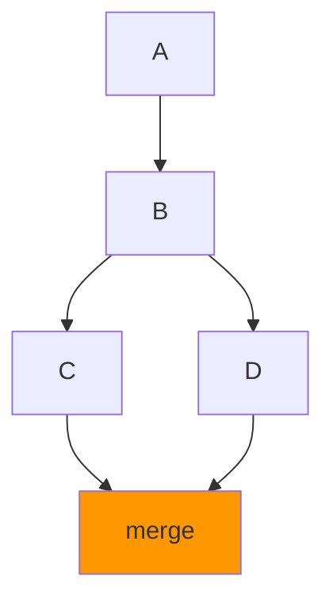

# Лекция 25: Система контроля версий Git

## Основы работы с Git для разработки приложений

### Цель лекции:
- Понять концепцию систем контроля версий
- Изучить основные команды Git
- Освоить работу с ветками и слиянием
- Познакомиться с лучшими практиками использования Git

### План лекции:
1. Что такое система контроля версий
2. Установка и настройка Git
3. Основные команды Git
4. Ветки и слияние
5. Работа с удаленными репозиториями
6. Лучшие практики

---

## 1. Что такое система контроля версий

**Система контроля версий (VCS — Version Control System)** — это инструмент, который помогает отслеживать изменения в исходном коде и других файлах проекта во времени.

### Типы систем контроля версий:

**Локальные VCS:**
- Хранят изменения на одном компьютере
- Пример: RCS (Revision Control System)
- Недостаток: нет возможности совместной работы

**Централизованные VCS:**
- Единый сервер хранит все версии файлов
- Примеры: SVN, CVS, Perforce
- Недостаток: единая точка отказа

**Распределенные VCS:**
- Каждый разработчик имеет полную копию репозитория
- Примеры: Git, Mercurial, Bazaar
- Преимущества: работа офлайн, резервирование, гибкость

### Преимущества Git:
- Распределенная архитектура
- Высокая производительность
- Поддержка нелинейной разработки
- Криптографическая целостность данных
- Гибкая система ветвления

---

## 2. Установка и настройка Git

### Установка:

```bash
# Ubuntu/Debian
sudo apt update
sudo apt install git

# macOS
brew install git

# Windows
# Скачать установщик с https://git-scm.com/
```

### Первичная настройка:

```bash
# Настройка имени пользователя
git config --global user.name "Имя Фамилия"

# Настройка email
git config --global user.email "email@example.com"

# Проверка настроек
git config --list

# Настройка редактора по умолчанию
git config --global core.editor "nano"

# Настройка цвета вывода
git config --global color.ui true
```

### Инициализация репозитория:

```bash
# Создание нового репозитория
git init

# Клонирование существующего репозитория
git clone https://github.com/username/repository.git

# Клонирование в конкретную папку
git clone https://github.com/username/repository.git my-project
```

---

## 3. Основные команды Git

### Проверка состояния:

```bash
# Показать состояние репозитория
git status

# Показать историю изменений
git log

# Краткая история
git log --oneline

# История с графом веток
git log --oneline --graph --all
```

### Добавление файлов:

```bash
# Добавить конкретный файл
git add filename.py

# Добавить все измененные файлы
git add .

# Добавить все файлы в текущей директории
git add *

# Добавить интерактивно
git add -p
```

### Фиксация изменений:

```bash
# Создать коммит с сообщением
git commit -m "Описание изменений"

# Изменить последний коммит
git commit --amend -m "Новое описание"

# Добавить файлы и создать коммит одной командой
git commit -am "Описание изменений"
```

### Отмена изменений:

```bash
# Отменить изменения в файле (до git add)
git checkout -- filename.py

# В Git 2.23+:
git restore filename.py

# Удалить файл из индекса (после git add)
git reset HEAD filename.py

# В Git 2.23+:
git restore --staged filename.py

# Отменить последний коммит, сохранив изменения
git reset --soft HEAD~1

# Отменить коммит и изменения
git reset --hard HEAD~1
```

### Просмотр различий:

```bash
# Показать изменения в рабочей директории
git diff

# Показать изменения между коммитами
git diff commit1 commit2

# Показать изменения в конкретном файле
git diff filename.py

# Показать изменения staged файлов
git diff --staged
```

---

## 4. Ветки и слияние

### Работа с ветками:

```bash
# Показать все ветки
git branch

# Создать новую ветку
git branch feature-branch

# Переключиться на ветку
git checkout feature-branch

# В Git 2.23+:
git switch feature-branch

# Создать и переключиться
git checkout -b feature-branch

# В Git 2.23+:
git switch -c feature-branch

# Удалить ветку
git branch -d feature-branch

# Удалить ветку принудительно
git branch -D feature-branch
```

### Слияние веток (Merge):

```bash
# Переключиться на основную ветку
git checkout main

# Влить изменения из feature-branch
git merge feature-branch

# Отменить слияние при конфликте
git merge --abort
```

### Типы слияния:

**Fast-forward merge:**
- Когда нет расхождений в истории
- Git просто перемещает указатель


**Three-way merge:**
- Когда есть расхождения в истории
- Создается merge commit



### Разрешение конфликтов:

```bash
# При возникновении конфликта:
# 1. Открыть файл с конфликтом
# 2. Найти маркеры конфликта:
<<<<<<< HEAD
изменения в текущей ветке
=======
изменения в вливаемой ветке
>>>>>>> feature-branch

# 3. Вручную разрешить конфликт
# 4. Добавить разрешенный файл
git add filename.py

# 5. Завершить слияние
git commit
```

### Cherry-pick:

```bash
# Взять конкретный коммит из другой ветки
git cherry-pick commit-hash
```

---

## 5. Работа с удаленными репозиториями

### Добавление удаленного репозитория:

```bash
# Добавить удаленный репозиторий
git remote add origin https://github.com/username/repo.git

# Показать удаленные репозитории
git remote -v

# Переименовать удаленный репозиторий
git remote rename origin upstream

# Удалить удаленный репозиторий
git remote remove origin
```

### Отправка и получение изменений:

```bash
# Отправить изменения на сервер
git push origin main

# Отправить и установить отслеживание
git push -u origin main

# Получить изменения с сервера
git fetch origin

# Получить и слить изменения
git pull origin main

# Получить и переместить свои изменения
git pull --rebase origin main
```

### Отслеживание веток:

```bash
# Показать все ветки, включая удаленные
git branch -a

# Отслеживать удаленную ветку
git checkout -b local-branch origin/remote-branch

# В Git 2.23+:
git switch -c local-branch origin/remote-branch

# Установить отслеживание для существующей ветки
git branch -u origin/remote-branch
```

---

## 6. Лучшие практики

### Коммиты:

**Хорошие сообщения коммитов:**
```
feat: добавить аутентификацию пользователей
fix: исправить утечку памяти в обработчике
docs: обновить README.md
refactor: упростить логику валидации
test: добавить тесты для API endpoints
chore: обновить зависимости
```

**Правила:**
- Одно изменение — один коммит
- Сообщение в настоящем времени
- Первая строка ≤ 50 символов
- Подробное описание при необходимости

### Ветвление:

**Git Flow:**
```
main (production)
  └── develop (integration)
        ├── feature/* (новые функции)
        ├── release/* (подготовка релиза)
        └── hotfix/* (срочные исправления)
```

**GitHub Flow (упрощенный):**
```
main
  └── feature-branch → PR → merge
```

### .gitignore:

```gitignore
# Файлы Python
__pycache__/
*.py[cod]
*$py.class
*.so
.Python
venv/
env/
.env
*.egg-info/
dist/
build/

# IDE
.idea/
.vscode/
*.swp
*.swo

# Тесты
.pytest_cache/
.coverage
htmlcov/

# OS
.DS_Store
Thumbs.db
```

### Безопасность:

```bash
# Никогда не коммитьте:
# - Пароли и секреты
# - Файлы .env
# - Ключи API
# - Личные данные

# Используйте .gitignore
# Проверяйте коммиты перед отправкой
# Используйте pre-commit хуки
```

### Полезные команды:

```bash
# Отменить push
git push origin :branch-name

# Очистить удаленные ветки
git remote prune origin

# Найти коммит по содержимому
git log -S "function_name"

# Показать статистику
git shortlog -sn

# Найти, кто изменил строку
git blame filename.py
```

---

## Заключение

Git — мощный инструмент, который является стандартом индустрии. Правильное использование Git улучшает совместную работу, позволяет легко откатывать изменения и поддерживает порядок в проекте.

## Контрольные вопросы:

1. В чем разница между `git fetch` и `git pull`?
2. Какие типы слияния существуют в Git?
3. Как разрешить конфликт слияния?
4. Что такое Git Flow и какие ветки он использует?
5. Как отменить последний коммит, сохранив изменения?

## Практическое задание:

1. Создать репозиторий на GitHub
2. Клонировать его локально
3. Создать ветку feature
4. Внести изменения и закоммитить
5. Создать Pull Request
6. Влить изменения в main
