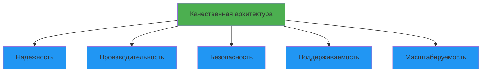
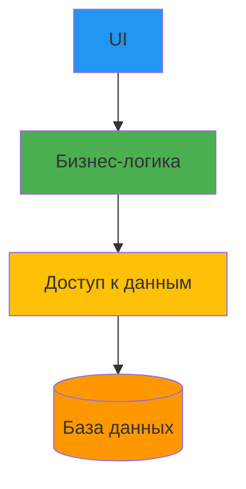
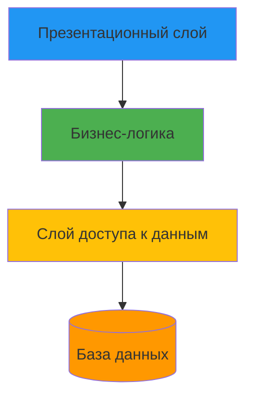
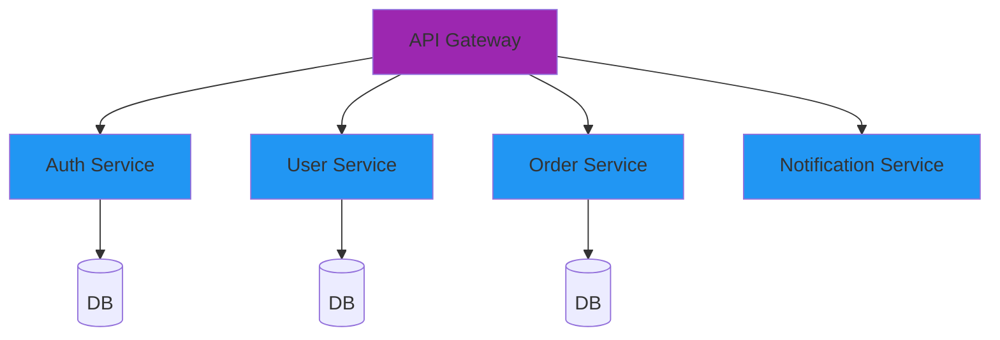
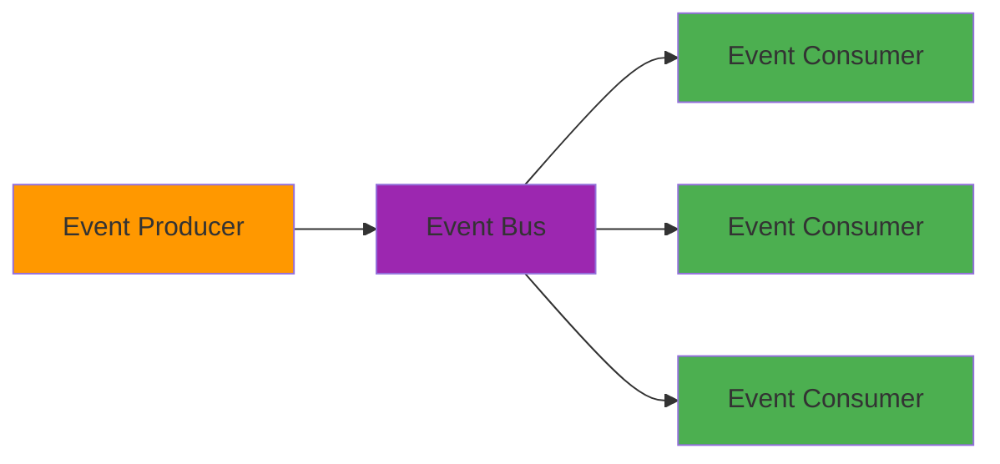

# Лекция 26: Архитектура приложений

## Принципы и паттерны проектирования программных систем

### Цель лекции:
- Изучить основные принципы архитектурного проектирования
- Познакомиться с архитектурными паттернами
- Понять критерии выбора архитектуры
- Освоить принципы чистого кода и SOLID

### План лекции:
1. Что такое архитектура приложений
2. Принципы проектирования (SOLID, DRY, KISS, YAGNI)
3. Архитектурные паттерны
4. Слои приложения
5. Выбор архитектуры для проекта

---

## 1. Что такое архитектура приложений

**Архитектура приложения** — это фундаментальная организация системы, включающая:
- Компоненты и их взаимосвязи
- Отношения с окружением
- Принципы проектирования и эволюции

### Цели хорошей архитектуры:

**Поддерживаемость:**
- Легко понимать код
- Просто вносить изменения
- Минимальный риск регрессии

**Тестируемость:**
- Компоненты можно тестировать изолированно
- Автоматизированное тестирование

**Масштабируемость:**
- Возможность роста нагрузки
- Горизонтальное и вертикальное масштабирование

**Расширяемость:**
- Добавление новых функций без изменения существующего кода
- Минимальные модификации

### Характеристики качественной архитектуры:



---

## 2. Принципы проектирования

### SOLID принципы:

**S — Single Responsibility Principle (Принцип единственной ответственности)**

Класс должен иметь только одну причину для изменения.

```python
# ❌ Плохо: класс делает слишком много
class User:
    def __init__(self, name, email):
        self.name = name
        self.email = email
    
    def save_to_database(self):
        # Сохранение в БД
        pass
    
    def send_email(self, message):
        # Отправка email
        pass
    
    def validate(self):
        # Валидация данных
        pass

# ✅ Хорошо: разделение ответственности
class User:
    def __init__(self, name, email):
        self.name = name
        self.email = email

class UserRepository:
    def save(self, user):
        # Сохранение в БД
        pass

class EmailService:
    def send(self, user, message):
        # Отправка email
        pass

class UserValidator:
    def validate(self, user):
        # Валидация данных
        pass
```

**O — Open/Closed Principle (Принцип открытости/закрытости)**

Сущности должны быть открыты для расширения, но закрыты для модификации.

```python
# ❌ Плохо: модификация при добавлении
class DiscountCalculator:
    def calculate(self, customer_type, amount):
        if customer_type == 'regular':
            return amount * 0.9
        elif customer_type == 'vip':
            return amount * 0.8
        elif customer_type == 'premium':
            return amount * 0.7

# ✅ Хорошо: расширение без модификации
from abc import ABC, abstractmethod

class DiscountStrategy(ABC):
    @abstractmethod
    def calculate(self, amount):
        pass

class RegularDiscount(DiscountStrategy):
    def calculate(self, amount):
        return amount * 0.9

class VIPDiscount(DiscountStrategy):
    def calculate(self, amount):
        return amount * 0.8

class PremiumDiscount(DiscountStrategy):
    def calculate(self, amount):
        return amount * 0.7

class DiscountCalculator:
    def __init__(self, strategy: DiscountStrategy):
        self.strategy = strategy
    
    def calculate(self, amount):
        return self.strategy.calculate(amount)
```

**L — Liskov Substitution Principle (Принцип подстановки Барбары Лисков)**

Подклассы должны заменять свои базовые классы без нарушения работы программы.

```python
# ❌ Плохо: нарушение LSP
class Rectangle:
    def __init__(self, width, height):
        self._width = width
        self._height = height
    
    def set_width(self, width):
        self._width = width
    
    def set_height(self, height):
        self._height = height
    
    def area(self):
        return self._width * self._height

class Square(Rectangle):
    def set_width(self, width):
        self._width = width
        self._height = width  # Нарушение!
    
    def set_height(self, height):
        self._width = height
        self._height = height  # Нарушение!

# ✅ Хорошо: правильная иерархия
class Shape(ABC):
    @abstractmethod
    def area(self):
        pass

class Rectangle(Shape):
    def __init__(self, width, height):
        self._width = width
        self._height = height
    
    def area(self):
        return self._width * self._height

class Square(Shape):
    def __init__(self, side):
        self._side = side
    
    def area(self):
        return self._side ** 2
```

**I — Interface Segregation Principle (Принцип разделения интерфейса)**

Клиенты не должны зависеть от интерфейсов, которые они не используют.

```python
# ❌ Плохо: "жирный" интерфейс
class Worker(ABC):
    @abstractmethod
    def work(self):
        pass
    
    @abstractmethod
    def eat(self):
        pass

class HumanWorker(Worker):
    def work(self):
        print("Working")
    
    def eat(self):
        print("Eating")

class RobotWorker(Worker):
    def work(self):
        print("Working")
    
    def eat(self):
        raise NotImplementedError("Robots don't eat!")

# ✅ Хорошо: разделение интерфейсов
class Workable(ABC):
    @abstractmethod
    def work(self):
        pass

class Eatable(ABC):
    @abstractmethod
    def eat(self):
        pass

class HumanWorker(Workable, Eatable):
    def work(self):
        print("Working")
    
    def eat(self):
        print("Eating")

class RobotWorker(Workable):
    def work(self):
        print("Working")
```

**D — Dependency Inversion Principle (Принцип инверсии зависимостей)**

Модули верхнего уровня не должны зависеть от модулей нижнего уровня. Оба должны зависеть от абстракций.

```python
# ❌ Плохо: прямая зависимость
class MySQLDatabase:
    def connect(self):
        print("Connecting to MySQL")
    
    def query(self, sql):
        print(f"Executing: {sql}")

class UserService:
    def __init__(self):
        self.db = MySQLDatabase()  # Прямая зависимость
    
    def get_user(self, user_id):
        self.db.connect()
        return self.db.query(f"SELECT * FROM users WHERE id={user_id}")

# ✅ Хорошо: зависимость от абстракции
class Database(ABC):
    @abstractmethod
    def connect(self):
        pass
    
    @abstractmethod
    def query(self, sql):
        pass

class MySQLDatabase(Database):
    def connect(self):
        print("Connecting to MySQL")
    
    def query(self, sql):
        print(f"Executing: {sql}")

class UserService:
    def __init__(self, db: Database):
        self.db = db  # Зависимость от абстракции
    
    def get_user(self, user_id):
        self.db.connect()
        return self.db.query(f"SELECT * FROM users WHERE id={user_id}")
```

### Дополнительные принципы:

**DRY (Don't Repeat Yourself):**
- Избегать дублирования кода
- Выносить общее в отдельные функции/классы

**KISS (Keep It Simple, Stupid):**
- Простота предпочтительнее сложности
- Избегать излишней сложности

**YAGNI (You Aren't Gonna Need It):**
- Не добавлять функциональность "на будущее"
- Реализовывать только то, что нужно сейчас

---

## 3. Архитектурные паттерны

### Монолитная архитектура:



**Преимущества:**
- Простота разработки и тестирования
- Легкость развертывания
- Простота отладки

**Недостатки:**
- Сложность масштабирования
- Единая точка отказа
- Сложность внесения изменений

### Многоуровневая архитектура (N-tier):



**Слои:**
- Презентационный (UI)
- Бизнес-логики (Service)
- Доступа к данным (Repository/DAL)
- Базы данных

### Микросервисная архитектура:



**Преимущества:**
- Независимое масштабирование
- Разные технологии для разных сервисов
- Изоляция отказов

**Недостатки:**
- Сложность управления
- Сложность тестирования
- Накладные расходы на сеть

### Event-driven архитектура:



---

## 4. Слои приложения

### Типичная структура:

```
project/
├── presentation/      # UI, API, Controllers
├── services/          # Бизнес-логика
├── repositories/      # Доступ к данным
├── models/            # Модели данных
├── dto/               # Data Transfer Objects
└── config/            # Конфигурация
```

### Пример реализации:

```python
# models/user.py
class User:
    def __init__(self, id, name, email):
        self.id = id
        self.name = name
        self.email = email

# repositories/user_repository.py
class UserRepository:
    def __init__(self, db_connection):
        self.db = db_connection
    
    def get_by_id(self, user_id):
        # SQL запрос
        pass
    
    def save(self, user):
        # SQL запрос
        pass

# services/user_service.py
class UserService:
    def __init__(self, user_repo, email_service):
        self.user_repo = user_repo
        self.email_service = email_service
    
    def register_user(self, name, email, password):
        # Бизнес-логика регистрации
        pass

# presentation/controllers/user_controller.py
class UserController:
    def __init__(self, user_service):
        self.user_service = user_service
    
    def register(self, request):
        # Обработка HTTP запроса
        pass
```

---

## 5. Выбор архитектуры для проекта

### Критерии выбора:

| Фактор | Монолит | Микросервисы |
|--------|---------|--------------|
| Размер команды | Малая | Большая |
| Сложность | Низкая | Высокая |
| Время выхода | Быстро | Медленно |
| Масштабирование | Ограничено | Гибкое |
| Отказоустойчивость | Низкая | Высокая |

### Рекомендации:

**Начинайте с монолита, если:**
- Маленькая команда (< 10 человек)
- Неясные требования
- Ограниченное время
- Нет опыта с распределенными системами

**Рассматривайте микросервисы, если:**
- Большая распределенная команда
- Четко разделенные домены
- Высокие требования к масштабированию
- Опыт с DevOps и контейнеризацией

---

## Заключение

Правильный выбор архитектуры и соблюдение принципов проектирования — ключ к созданию поддерживаемых и масштабируемых приложений. Архитектура должна соответствовать требованиям проекта и возможностям команды.

## Контрольные вопросы:

1. Объясните каждый принцип SOLID
2. В чем разница между монолитом и микросервисами?
3. Когда стоит выбирать многоуровневую архитектуру?
4. Что такое Dependency Injection и зачем он нужен?
5. Какие критерии влияют на выбор архитектуры?

## Практическое задание:

1. Спроектировать архитектуру для интернет-магазина
2. Выделить слои и компоненты
3. Определить интерфейсы между компонентами
4. Реализовать простой пример с использованием DI
