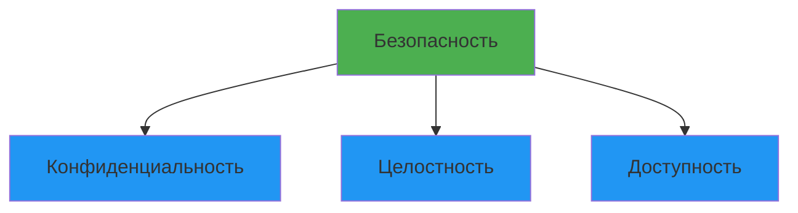

# Лекция 27: Безопасность приложений

## Защита приложений от уязвимостей и атак

### Цель лекции:
- Понять основные угрозы безопасности приложений
- Изучить распространенные уязвимости (OWASP Top 10)
- Освоить методы защиты от атак
- Научиться применять лучшие практики безопасности

### План лекции:
1. Основы безопасности приложений
2. OWASP Top 10 уязвимости
3. Аутентификация и авторизация
4. Защита данных
5. Безопасность веб-приложений
6. Лучшие практики безопасности

---

## 1. Основы безопасности приложений

### Триада CIA (Confidentiality, Integrity, Availability):



**Конфиденциальность:**
- Данные доступны только авторизованным пользователям
- Шифрование данных
- Контроль доступа

**Целостность:**
- Данные не изменены несанкционированно
- Проверка целостности
- Валидация входных данных

**Доступность:**
- Данные доступны когда нужны
- Отказоустойчивость
- Защита от DDoS

### Принципы безопасности:

**Принцип наименьших привилегий:**
- Пользователи и процессы имеют минимально необходимые права
- Разделение обязанностей

**Защита в глубину (Defense in Depth):**
- Многослойная защита
- Не полагаться на один механизм защиты

**Непрерывная проверка:**
- Валидация всех входных данных
- Проверка прав доступа

---

## 2. OWASP Top 10 уязвимости

### A01: Broken Access Control (Нарушение контроля доступа)

```python
# ❌ Плохо: нет проверки прав доступа
@app.route('/user/<int:user_id>/profile')
def get_profile(user_id):
    user = db.get_user(user_id)
    return jsonify(user.to_dict())

# ✅ Хорошо: проверка прав доступа
@app.route('/user/<int:user_id>/profile')
@login_required
def get_profile(user_id):
    current_user = get_current_user()
    if current_user.id != user_id and not current_user.is_admin:
        return jsonify({'error': 'Access denied'}), 403
    user = db.get_user(user_id)
    return jsonify(user.to_dict())
```

**Защита:**
- Проверка прав на каждом запросе
- Использование ролевой модели
- Логирование попыток доступа

### A02: Cryptographic Failures (Криптографические ошибки)

```python
# ❌ Плохо: слабое хеширование
import hashlib
password_hash = hashlib.md5(password.encode()).hexdigest()

# ✅ Хорошо: безопасное хеширование
from passlib.context import CryptContext
pwd_context = CryptContext(schemes=['bcrypt'], deprecated='auto')
password_hash = pwd_context.hash(password)

# Проверка пароля
pwd_context.verify(plain_password, password_hash)
```

**Защита:**
- Использовать bcrypt, argon2, scrypt
- Никогда не хранить пароли в открытом виде
- Шифровать чувствительные данные
- Использовать HTTPS/TLS

### A03: Injection (Инъекции)

**SQL Injection:**

```python
# ❌ Плохо: уязвимость к SQL-инъекции
query = f"SELECT * FROM users WHERE username = '{username}'"
cursor.execute(query)

# ✅ Хорошо: параметризованные запросы
query = "SELECT * FROM users WHERE username = %s"
cursor.execute(query, (username,))

# С SQLAlchemy ORM
user = session.query(User).filter(User.username == username).first()
```

**Command Injection:**

```python
# ❌ Плохо: уязвимость к инъекции команд
import os
os.system(f"ping {user_input}")

# ✅ Хорошо: безопасное выполнение
import subprocess
subprocess.run(['ping', '-c', '1', user_input], check=True)
```

**Защита:**
- Параметризованные запросы
- ORM вместо сырых запросов
- Валидация и санитизация входных данных
- Экранирование специальных символов

### A04: Insecure Design (Небезопасный дизайн)

```python
# ❌ Плохо: нет ограничения попыток входа
def login(username, password):
    user = authenticate(username, password)
    if user:
        return create_token(user)
    return None

# ✅ Хорошо: защита от перебора
from datetime import datetime, timedelta

class LoginAttempt:
    def __init__(self):
        self.attempts = {}
    
    def is_blocked(self, ip):
        if ip in self.attempts:
            attempts, first_attempt = self.attempts[ip]
            if attempts >= 5 and datetime.now() - first_attempt < timedelta(minutes=15):
                return True
        return False
    
    def record_attempt(self, ip):
        if ip not in self.attempts:
            self.attempts[ip] = (0, datetime.now())
        attempts, first_attempt = self.attempts[ip]
        self.attempts[ip] = (attempts + 1, first_attempt)

login_attempts = LoginAttempt()

def login(username, password, ip):
    if login_attempts.is_blocked(ip):
        return None
    user = authenticate(username, password)
    if user:
        login_attempts.attempts.pop(ip, None)
        return create_token(user)
    login_attempts.record_attempt(ip)
    return None
```

**Защита:**
- Threat modeling на этапе проектирования
- Ограничение попыток (rate limiting)
- Капча при подозрительной активности
- Мониторинг аномалий

### A05: Security Misconfiguration (Ошибки конфигурации)

```python
# ❌ Плохо: debug включен в production
app.run(debug=True, host='0.0.0.0')

# ✅ Хорошо: безопасная конфигурация
import os

DEBUG = os.environ.get('FLASK_ENV') != 'production'
SECRET_KEY = os.environ.get('SECRET_KEY')

if not DEBUG:
    app.config.update(
        SESSION_COOKIE_SECURE=True,
        SESSION_COOKIE_HTTPONLY=True,
        SESSION_COOKIE_SAMESITE='Lax'
    )
```

**Защита:**
- Отключать debug в production
- Использовать переменные окружения для секретов
- Регулярно обновлять зависимости
- Удалять неиспользуемый код и функции

### A06: Vulnerable Components (Уязвимые компоненты)

```bash
# Проверка уязвимостей в зависимостях
pip install safety
safety check

# Использование pip-audit
pip install pip-audit
pip-audit

# Обновление зависимостей
pip list --outdated
pip install --upgrade package
```

**Защита:**
- Регулярно обновлять зависимости
- Использовать tools для проверки уязвимостей
- Фиксировать версии зависимостей
- Мониторить security advisories

### A07: Authentication Failures (Ошибки аутентификации)

```python
# ❌ Плохо: слабая реализация сессий
session['user_id'] = user.id  # Нет защиты от фиксации сессии

# ✅ Хорошо: безопасная аутентификация
from flask_session import Session
from flask_limiter import Limiter

app.config['SESSION_TYPE'] = 'redis'
app.config['SESSION_PERMANENT'] = False
app.config['SESSION_USE_SIGNER'] = True

@app.route('/login', methods=['POST'])
def login():
    # Rate limiting
    # Валидация пароля
    # Регенерация ID сессии
    session.regenerate()
    session['user_id'] = user.id
    return redirect('/dashboard')
```

**Защита:**
- Многофакторная аутентификация
- Надежные пароли (минимум 12 символов)
- Защита от фиксации сессии
- Таймаут сессии

### A08: Software and Data Integrity Failures

**Защита:**
- Проверка целостности данных
- Цифровые подписи
- Hash verification
- CI/CD security

### A09: Security Logging Failures (Ошибки логирования)

```python
# ❌ Плохо: нет логирования безопасности
def login(username, password):
    user = authenticate(username, password)
    return user is not None

# ✅ Хорошо: полное логирование
import logging
from datetime import datetime

logger = logging.getLogger('security')

def login(username, password, ip):
    user = authenticate(username, password)
    if user:
        logger.info(f"Successful login: {username} from {ip}")
        return True
    else:
        logger.warning(f"Failed login attempt: {username} from {ip}")
        return False
```

**Защита:**
- Логировать все события безопасности
- Не логировать чувствительные данные
- Мониторинг логов в реальном времени
- Алёртинг при подозрительной активности

### A10: SSRF (Server-Side Request Forgery)

```python
# ❌ Плохо: нет валидации URL
import requests

def fetch_image(url):
    response = requests.get(url)
    return response.content

# ✅ Хорошо: валидация URL
from urllib.parse import urlparse
import socket

def is_safe_url(url):
    parsed = urlparse(url)
    if parsed.scheme not in ['http', 'https']:
        return False
    
    hostname = parsed.hostname
    ip = socket.gethostbyname(hostname)
    
    # Проверка на внутренние IP
    if ip.startswith(('10.', '192.168.', '127.', '172.')):
        return False
    return True

def fetch_image(url):
    if not is_safe_url(url):
        raise ValueError("Unsafe URL")
    response = requests.get(url, timeout=5)
    return response.content
```

---

## 3. Аутентификация и авторизация

### JWT (JSON Web Tokens):

```python
from functools import wraps
from flask import request, jsonify
import jwt
from datetime import datetime, timedelta

SECRET_KEY = 'your-secret-key'

def generate_token(user_id):
    payload = {
        'user_id': user_id,
        'exp': datetime.utcnow() + timedelta(hours=24),
        'iat': datetime.utcnow()
    }
    return jwt.encode(payload, SECRET_KEY, algorithm='HS256')

def verify_token(token):
    try:
        payload = jwt.decode(token, SECRET_KEY, algorithms=['HS256'])
        return payload['user_id']
    except jwt.ExpiredSignatureError:
        return None
    except jwt.InvalidTokenError:
        return None

def token_required(f):
    @wraps(f)
    def decorated(*args, **kwargs):
        token = request.headers.get('Authorization')
        if not token:
            return jsonify({'error': 'Token is missing'}), 401
        
        if token.startswith('Bearer '):
            token = token[7:]
        
        user_id = verify_token(token)
        if not user_id:
            return jsonify({'error': 'Token is invalid'}), 401
        
        return f(user_id, *args, **kwargs)
    return decorated

@app.route('/protected')
@token_required
def protected_route(user_id):
    return jsonify({'message': f'Hello user {user_id}'})
```

### OAuth 2.0:

```python
from authlib.integrations.flask_client import OAuth

oauth = OAuth(app)

google = oauth.register(
    name='google',
    client_id=app.config['GOOGLE_CLIENT_ID'],
    client_secret=app.config['GOOGLE_CLIENT_SECRET'],
    server_metadata_url='https://accounts.google.com/.well-known/openid-configuration',
    client_kwargs={'scope': 'openid email profile'}
)

@app.route('/login/google')
def login_google():
    return google.authorize_redirect(redirect_uri='/callback/google')

@app.route('/callback/google')
def authorize_google():
    token = google.authorize_access_token()
    user_info = token.get('userinfo')
    # Обработка пользователя
    return redirect('/dashboard')
```

---

## 4. Защита данных

### Хеширование паролей:

```python
from passlib.context import CryptContext

pwd_context = CryptContext(
    schemes=['argon2'],
    argon2__time_cost=3,
    argon2__memory_cost=65536,
    argon2__parallelism=4,
    deprecated='auto'
)

def hash_password(password):
    return pwd_context.hash(password)

def verify_password(plain_password, hashed_password):
    return pwd_context.verify(plain_password, hashed_password)
```

### Шифрование данных:

```python
from cryptography.fernet import Fernet

# Генерация ключа
key = Fernet.generate_key()
cipher = Fernet(key)

# Шифрование
data = b"Sensitive information"
encrypted = cipher.encrypt(data)

# Дешифрование
decrypted = cipher.decrypt(encrypted)
```

### Защита от XSS:

```python
# Flask автоматически экранирует Jinja2 шаблоны
# ❌ Плохо: отключение экранирования
@app.route('/search')
def search():
    query = request.args.get('q', '')
    return f"<h1>Результат: {query}</h1>"  # Уязвимость XSS

# ✅ Хорошо: безопасный вывод
from markupsafe import escape

@app.route('/search')
def search():
    query = request.args.get('q', '')
    return f"<h1>Результат: {escape(query)}</h1>"

# В шаблонах Jinja2:
# {{ user_input }} - автоматически экранируется
# {{ user_input|safe }} - НЕ экранируется (опасно!)
```

### CSRF защита:

```python
from flask_wtf.csrf import CSRFProtect

csrf = CSRFProtect(app)

# В формах:
# <form method="POST">
#     <input type="hidden" name="csrf_token" value="{{ csrf_token() }}"/>
# </form>

# Для API:
@app.before_request
def check_csrf():
    if request.method in ['POST', 'PUT', 'DELETE']:
        token = request.headers.get('X-CSRF-Token')
        if not csrf.validate():
            abort(403)
```

---

## 5. Безопасность веб-приложений

### Security Headers:

```python
@app.after_request
def add_security_headers(response):
    response.headers['X-Content-Type-Options'] = 'nosniff'
    response.headers['X-Frame-Options'] = 'DENY'
    response.headers['X-XSS-Protection'] = '1; mode=block'
    response.headers['Strict-Transport-Security'] = 'max-age=31536000; includeSubDomains'
    response.headers['Content-Security-Policy'] = "default-src 'self'"
    response.headers['Referrer-Policy'] = 'strict-origin-when-cross-origin'
    return response
```

### Rate Limiting:

```python
from flask_limiter import Limiter
from flask_limiter.util import get_remote_address

limiter = Limiter(
    app=app,
    key_func=get_remote_address,
    default_limits=["200 per day", "50 per hour"]
)

@app.route('/api/login', methods=['POST'])
@limiter.limit("5 per minute")
def login():
    pass

@app.route('/api/register', methods=['POST'])
@limiter.limit("3 per hour")
def register():
    pass
```

---

## 6. Лучшие практики безопасности

### Чеклист безопасности:

**Разработка:**
- [ ] Валидация всех входных данных
- [ ] Параметризованные SQL запросы
- [ ] Безопасное хеширование паролей
- [ ] HTTPS в production
- [ ] Security headers
- [ ] CSRF защита
- [ ] Rate limiting
- [ ] Логирование событий безопасности

**Конфигурация:**
- [ ] Debug отключен
- [ ] Секреты в переменных окружения
- [ ] Актуальные зависимости
- [ ] Минимальные привилегии
- [ ] Firewall настроен

**Мониторинг:**
- [ ] Логирование включено
- [ ] Алёртинг настроен
- [ ] Регулярные аудиты безопасности
- [ ] План реагирования на инциденты

### Инструменты безопасности:

```bash
# Проверка зависимостей
pip install safety pip-audit bandit
safety check
pip-audit
bandit -r .

# Статический анализ
pip install pylint flake8
pylint --errors-only .

# Динамический анализ
# OWASP ZAP
# Burp Suite
```

---

## Заключение

Безопасность приложений — непрерывный процесс, а не разовое мероприятие. Важно внедрять безопасность на всех этапах разработки и постоянно обновлять знания о новых угрозах.

## Контрольные вопросы:

1. Назовите топ-5 уязвимостей OWASP
2. Как защититься от SQL-инъекций?
3. В чем разница между аутентификацией и авторизацией?
4. Как правильно хранить пароли?
5. Какие security headers вы знаете?

## Практическое задание:

1. Провести аудит безопасности существующего проекта
2. Реализовать безопасную аутентификацию с JWT
3. Добавить rate limiting к API endpoints
4. Настроить security headers
5. Проверить зависимости на уязвимости
