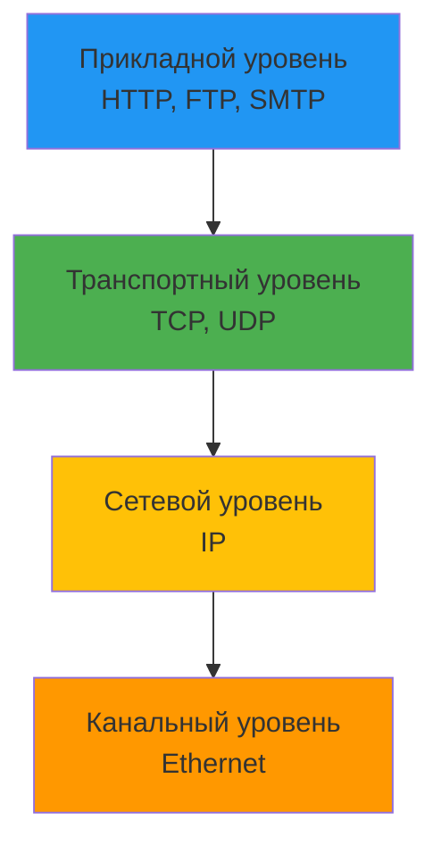

# Лекция 28: Работа с сетью

## Сетевое программирование и взаимодействие с сетевыми сервисами

### Цель лекции:
- Изучить основы сетевого программирования в Python
- Освоить работу с HTTP/HTTPS запросами
- Познакомиться с сокетами и низкоуровневым сетевым взаимодействием
- Научиться создавать сетевые приложения

### План лекции:
1. Основы сетевых технологий
2. Работа с HTTP/HTTPS (requests, aiohttp)
3. Сокеты и низкоуровневое взаимодействие
4. Создание TCP/UDP серверов
5. WebSockets для real-time связи
6. Асинхронная работа с сетью

---

## 1. Основы сетевых технологий

### Модель OSI и TCP/IP:



### Основные понятия:

**IP-адрес:**
- IPv4: 192.168.1.1 (32 бита)
- IPv6: 2001:0db8:85a3::8a2e:0370:7334 (128 бит)

**Порты:**
- 0-1023: Системные/зарезервированные
- 80: HTTP
- 443: HTTPS
- 22: SSH
- 21: FTP
- 25: SMTP

**Протоколы:**
- TCP: надежная доставка с установлением соединения
- UDP: быстрая доставка без гарантии

### Проверка сетевой доступности:

```python
import socket
import subprocess

# Проверка доступности хоста
def ping_host(hostname):
    try:
        subprocess.check_output(['ping', '-c', '1', hostname])
        return True
    except subprocess.CalledProcessError:
        return False

# Получение IP адреса
def get_ip_address(hostname):
    return socket.gethostbyname(hostname)

# Проверка порта
def check_port(hostname, port):
    sock = socket.socket(socket.AF_INET, socket.SOCK_STREAM)
    sock.settimeout(2)
    result = sock.connect_ex((hostname, port))
    sock.close()
    return result == 0

# Пример использования
print(get_ip_address('google.com'))
print(check_port('google.com', 443))
```

---

## 2. Работа с HTTP/HTTPS

### Библиотека requests:

```python
import requests
from requests.auth import HTTPBasicAuth

# GET запрос
response = requests.get('https://api.example.com/users')
print(response.status_code)
print(response.json())

# GET с параметрами
params = {'page': 1, 'limit': 10}
response = requests.get('https://api.example.com/users', params=params)

# POST запрос
data = {'name': 'John', 'email': 'john@example.com'}
response = requests.post('https://api.example.com/users', json=data)

# POST с заголовками
headers = {'Authorization': 'Bearer token123'}
response = requests.post('https://api.example.com/users', json=data, headers=headers)

# Загрузка файла
with open('file.txt', 'rb') as f:
    files = {'file': f}
    response = requests.post('https://api.example.com/upload', files=files)

# Скачивание файла
response = requests.get('https://example.com/largefile.zip', stream=True)
with open('largefile.zip', 'wb') as f:
    for chunk in response.iter_content(chunk_size=8192):
        f.write(chunk)

# Session для постоянных соединений
session = requests.Session()
session.auth = ('user', 'password')
session.headers.update({'User-Agent': 'MyApp/1.0'})

response1 = session.get('https://api.example.com/users')
response2 = session.get('https://api.example.com/posts')

# Обработка ошибок
try:
    response = requests.get('https://api.example.com/data', timeout=5)
    response.raise_for_status()  # Выбросит исключение при ошибке
    data = response.json()
except requests.exceptions.Timeout:
    print("Request timed out")
except requests.exceptions.HTTPError as e:
    print(f"HTTP error: {e}")
except requests.exceptions.RequestException as e:
    print(f"Request failed: {e}")
```

### Работа с REST API:

```python
class APIClient:
    def __init__(self, base_url, api_key=None):
        self.base_url = base_url
        self.session = requests.Session()
        if api_key:
            self.session.headers.update({'Authorization': f'Bearer {api_key}'})
    
    def get(self, endpoint, **kwargs):
        url = f"{self.base_url}/{endpoint}"
        response = self.session.get(url, **kwargs)
        response.raise_for_status()
        return response.json()
    
    def post(self, endpoint, data=None, **kwargs):
        url = f"{self.base_url}/{endpoint}"
        response = self.session.post(url, json=data, **kwargs)
        response.raise_for_status()
        return response.json()
    
    def put(self, endpoint, data=None, **kwargs):
        url = f"{self.base_url}/{endpoint}"
        response = self.session.put(url, json=data, **kwargs)
        response.raise_for_status()
        return response.json()
    
    def delete(self, endpoint, **kwargs):
        url = f"{self.base_url}/{endpoint}"
        response = self.session.delete(url, **kwargs)
        response.raise_for_status()
        return response.status_code == 204

# Использование
client = APIClient('https://api.github.com', api_key='your_token')
repos = client.get('user/repos')
new_repo = client.post('user/repos', data={'name': 'my-repo'})
```

### Асинхронные HTTP запросы (aiohttp):

```python
import aiohttp
import asyncio

async def fetch_url(session, url):
    async with session.get(url) as response:
        return await response.text()

async def fetch_all(urls):
    async with aiohttp.ClientSession() as session:
        tasks = [fetch_url(session, url) for url in urls]
        return await asyncio.gather(*tasks)

# Пример использования
urls = [
    'https://api.example.com/users',
    'https://api.example.com/posts',
    'https://api.example.com/comments'
]

results = asyncio.run(fetch_all(urls))
```

---

## 3. Сокеты и низкоуровневое взаимодействие

### TCP сокеты:

```python
import socket

# Создание TCP клиента
def tcp_client(host, port, message):
    sock = socket.socket(socket.AF_INET, socket.SOCK_STREAM)
    try:
        sock.connect((host, port))
        sock.sendall(message.encode())
        data = sock.recv(1024)
        return data.decode()
    finally:
        sock.close()

# Создание TCP сервера
def tcp_server(host, port):
    sock = socket.socket(socket.AF_INET, socket.SOCK_STREAM)
    sock.setsockopt(socket.SOL_SOCKET, socket.SO_REUSEADDR, 1)
    sock.bind((host, port))
    sock.listen(5)
    print(f"Server listening on {host}:{port}")
    
    while True:
        client_sock, addr = sock.accept()
        print(f"Connection from {addr}")
        
        try:
            data = client_sock.recv(1024)
            if data:
                response = f"Received: {data.decode()}"
                client_sock.sendall(response.encode())
        finally:
            client_sock.close()

# Запуск сервера в отдельном потоке
import threading
server_thread = threading.Thread(target=tcp_server, args=('127.0.0.1', 9999))
server_thread.daemon = True
server_thread.start()
```

### UDP сокеты:

```python
# UDP клиент
def udp_client(host, port, message):
    sock = socket.socket(socket.AF_INET, socket.SOCK_DGRAM)
    sock.sendto(message.encode(), (host, port))
    data, _ = sock.recvfrom(1024)
    sock.close()
    return data.decode()

# UDP сервер
def udp_server(host, port):
    sock = socket.socket(socket.AF_INET, socket.SOCK_DGRAM)
    sock.bind((host, port))
    print(f"UDP Server listening on {host}:{port}")
    
    while True:
        data, addr = sock.recvfrom(1024)
        print(f"Received from {addr}: {data.decode()}")
        response = f"Echo: {data.decode()}"
        sock.sendto(response.encode(), addr)
```

---

## 4. Создание TCP/UDP серверов

### Многопоточный TCP сервер:

```python
import socket
import threading
from queue import Queue

class ThreadedTCPServer:
    def __init__(self, host, port):
        self.host = host
        self.port = port
        self.clients = []
        self.message_queue = Queue()
    
    def handle_client(self, client_sock, addr):
        print(f"New connection: {addr}")
        self.clients.append(client_sock)
        
        try:
            while True:
                data = client_sock.recv(1024)
                if not data:
                    break
                
                message = data.decode()
                print(f"From {addr}: {message}")
                
                # Рассылка всем клиентам
                self.broadcast(message, client_sock)
        finally:
            self.clients.remove(client_sock)
            client_sock.close()
            print(f"Connection closed: {addr}")
    
    def broadcast(self, message, sender_sock):
        for client in self.clients:
            if client != sender_sock:
                try:
                    client.sendall(message.encode())
                except:
                    pass
    
    def start(self):
        sock = socket.socket(socket.AF_INET, socket.SOCK_STREAM)
        sock.setsockopt(socket.SOL_SOCKET, socket.SO_REUSEADDR, 1)
        sock.bind((self.host, self.port))
        sock.listen(5)
        print(f"Server started on {self.host}:{self.port}")
        
        try:
            while True:
                client_sock, addr = sock.accept()
                thread = threading.Thread(
                    target=self.handle_client,
                    args=(client_sock, addr)
                )
                thread.daemon = True
                thread.start()
        except KeyboardInterrupt:
            print("Server shutting down")
        finally:
            sock.close()

# Запуск
server = ThreadedTCPServer('127.0.0.1', 9999)
server.start()
```

---

## 5. WebSockets для real-time связи

### Сервер на websockets:

```python
import asyncio
import websockets

connected_clients = set()

async def handler(websocket, path):
    connected_clients.add(websocket)
    print(f"Client connected: {websocket.remote_address}")
    
    try:
        async for message in websocket:
            print(f"Received: {message}")
            
            # Рассылка всем подключенным клиентам
            await asyncio.gather(
                *[client.send(message) for client in connected_clients],
                return_exceptions=True
            )
    except websockets.exceptions.ConnectionClosed:
        pass
    finally:
        connected_clients.remove(websocket)
        print(f"Client disconnected: {websocket.remote_address}")

async def main():
    server = await websockets.serve(handler, "localhost", 8765)
    print("WebSocket server started on ws://localhost:8765")
    await server.wait_closed()

# Запуск
# asyncio.run(main())
```

### Клиент websockets:

```python
import asyncio
import websockets

async def websocket_client():
    async with websockets.connect("ws://localhost:8765") as websocket:
        # Отправка сообщения
        await websocket.send("Hello Server!")
        
        # Получение ответов
        async for message in websocket:
            print(f"Received: {message}")

# Запуск
# asyncio.run(websocket_client())
```

### Flask-SocketIO:

```python
from flask import Flask, render_template
from flask_socketio import SocketIO, emit

app = Flask(__name__)
app.config['SECRET_KEY'] = 'secret!'
socketio = SocketIO(app, cors_allowed_origins="*")

@app.route('/')
def index():
    return render_template('index.html')

@socketio.on('connect')
def handle_connect():
    print('Client connected')
    emit('message', {'data': 'Connected!'})

@socketio.on('disconnect')
def handle_disconnect():
    print('Client disconnected')

@socketio.on('message')
def handle_message(data):
    print(f"Received: {data}")
    emit('message', {'data': data}, broadcast=True)

@socketio.on('join')
def handle_join(data):
    room = data['room']
    from flask_socketio import join_room
    join_room(room)
    emit('message', {'data': f'Joined room: {room}'}, room=room)

# Запуск
# socketio.run(app, debug=True)
```

---

## 6. Асинхронная работа с сетью

### asyncio основы:

```python
import asyncio

async def tcp_echo_client(message, host, port):
    reader, writer = await asyncio.open_connection(host, port)
    
    print(f"Sending: {message}")
    writer.write(message.encode())
    await writer.drain()
    
    data = await reader.read(1024)
    print(f"Received: {data.decode()}")
    
    writer.close()
    await writer.wait_closed()

async def main():
    task = asyncio.create_task(tcp_echo_client("Hello", "127.0.0.1", 8888))
    await task

# asyncio.run(main())
```

### Асинхронный TCP сервер:

```python
async def handle_client(reader, writer):
    addr = writer.get_extra_info('peername')
    print(f"Connection from {addr}")
    
    while True:
        data = await reader.read(1024)
        if not data:
            break
        
        message = data.decode()
        print(f"Received: {message}")
        
        response = f"Echo: {message}"
        writer.write(response.encode())
        await writer.drain()
    
    print(f"Connection closed: {addr}")
    writer.close()
    await writer.wait_closed()

async def main():
    server = await asyncio.start_server(
        handle_client, '127.0.0.1', 8888
    )
    
    addr = server.sockets[0].getsockname()
    print(f'Server running on {addr}')
    
    async with server:
        await server.serve_forever()

# asyncio.run(main())
```

---

## Заключение

Сетевое программирование в Python предоставляет мощные инструменты для создания клиент-серверных приложений. Выбор между синхронным и асинхронным подходом зависит от требований к производительности и масштабируемости.

## Контрольные вопросы:

1. В чем разница между TCP и UDP?
2. Как работать с REST API используя requests?
3. Что такое WebSockets и когда их использовать?
4. Как создать многопоточный сервер?
5. Какие преимущества у асинхронного подхода?

## Практическое задание:

1. Создать HTTP клиент для работы с публичным API
2. Реализовать чат-сервер на сокетах
3. Создать WebSocket сервер для real-time уведомлений
4. Реализовать асинхронный загрузчик файлов
