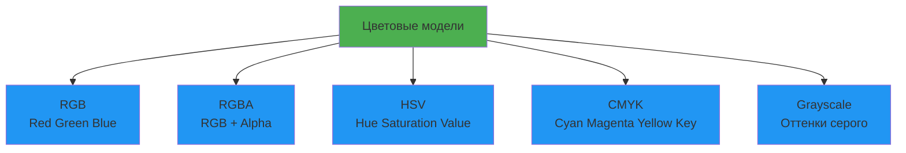

# Лекция 30: Работа с графикой

## Обработка изображений и графических данных в Python

### Цель лекции:
- Изучить основы работы с графикой в Python
- Освоить библиотеку Pillow для обработки изображений
- Познакомиться с OpenCV для компьютерного зрения
- Научиться создавать графики и визуализации

### План лекции:
1. Форматы графических файлов
2. Pillow — базовая обработка изображений
3. OpenCV — компьютерное зрение
4. Создание графиков (matplotlib, seaborn)
5. Генерация графики (Pillow, cairosvg)

---

## 1. Форматы графических файлов

### Растровые форматы:

| Формат | Описание | Использование |
|--------|----------|---------------|
| JPEG/JPG | Сжатие с потерями | Фотографии, веб |
| PNG | Сжатие без потерь, прозрачность | Логотипы, скриншоты |
| GIF | Анимация, 256 цветов | Мемы, простая анимация |
| BMP | Без сжатия | Системные файлы Windows |
| TIFF | Высокое качество | Полиграфия, сканирование |
| WebP | Современный формат Google | Веб-изображения |

### Векторные форматы:

| Формат | Описание | Использование |
|--------|----------|---------------|
| SVG | Масштабируемая векторная графика | Веб, иконки |
| PDF | Универсальный формат | Документы |
| EPS | PostScript | Полиграфия |

### Цветовые модели:



---

## 2. Pillow — базовая обработка изображений

### Установка и основы:

```bash
pip install Pillow
```

### Базовые операции:

```python
from PIL import Image, ImageFilter, ImageEnhance, ImageDraw, ImageFont

# Открытие изображения
img = Image.open('image.jpg')

# Получение информации
print(f"Size: {img.size}")
print(f"Format: {img.format}")
print(f"Mode: {img.mode}")

# Просмотр изображения
img.show()

# Сохранение
img.save('output.png')
img.save('output.jpg', quality=95, optimize=True)
```

### Изменение размера и кадрирование:

```python
# Изменение размера
resized = img.resize((800, 600))

# Пропорциональное изменение
img.thumbnail((800, 600))

# Кадрирование
cropped = img.crop((100, 100, 400, 400))  # (left, upper, right, lower)

# Поворот
rotated = img.rotate(45)
rotated = img.rotate(45, expand=True)  # С изменением размера

# Отражение
flipped = img.transpose(Image.FLIP_LEFT_RIGHT)
flipped = img.transpose(Image.FLIP_TOP_BOTTOM)

# Сохранение пропорций при изменении размера
def resize_with_aspect_ratio(image_path, new_width):
    img = Image.open(image_path)
    aspect_ratio = img.height / img.width
    new_height = int(new_width * aspect_ratio)
    return img.resize((new_width, new_height), Image.Resampling.LANCZOS)
```

### Фильтры и эффекты:

```python
# Применение фильтров
blurred = img.filter(ImageFilter.BLUR)
sharpened = img.filter(ImageFilter.SHARPEN)
edges = img.filter(ImageFilter.FIND_EDGES)
contour = img.filter(ImageFilter.CONTOUR)
emboss = img.filter(ImageFilter.EMBOSS)

# Размытие по Гауссу
gaussian = img.filter(ImageFilter.GaussianBlur(radius=2))

# Улучшение изображения
enhancer = ImageEnhance.Brightness(img)
bright = enhancer.enhance(1.5)  # 0.0 = чёрный, 1.0 = оригинал, >1.0 = ярче

enhancer = ImageEnhance.Contrast(img)
contrast = enhancer.enhance(1.5)

enhancer = ImageEnhance.Color(img)
colorful = enhancer.enhance(2.0)

enhancer = ImageEnhance.Sharpness(img)
sharp = enhancer.enhance(2.0)
```

### Работа с цветом:

```python
# Конвертация режимов
grayscale = img.convert('L')
rgba = img.convert('RGBA')
hsv = img.convert('HSV')

# Изменение прозрачности
def add_transparency(image_path, alpha=128):
    img = Image.open(image_path).convert('RGBA')
    img.putalpha(alpha)
    return img

# Наложение изображений
def overlay_images(background_path, overlay_path, position=(0, 0)):
    bg = Image.open(background_path).convert('RGBA')
    overlay = Image.open(overlay_path).convert('RGBA')
    bg.paste(overlay, position, overlay)
    return bg

# Создание миниатюры с водяным знаком
def add_watermark(image_path, watermark_text):
    img = Image.open(image_path).convert('RGBA')
    txt = Image.new('RGBA', img.size, (255, 255, 255, 0))
    d = ImageDraw.Draw(txt)
    
    # Загрузка шрифта
    try:
        font = ImageFont.truetype("arial.ttf", 36)
    except:
        font = ImageFont.load_default()
    
    # Добавление текста
    d.text((10, img.height - 50), watermark_text, fill=(255, 255, 255, 128), font=font)
    
    # Наложение
    watermarked = Image.alpha_composite(img, txt)
    return watermarked.convert('RGB')
```

### Рисование на изображении:

```python
# Создание нового изображения
img = Image.new('RGB', (400, 300), color='white')
draw = ImageDraw.Draw(img)

# Рисование фигур
draw.rectangle([50, 50, 200, 150], outline='blue', fill='lightblue', width=2)
draw.ellipse([100, 100, 200, 200], outline='red', fill='pink', width=3)
draw.line([0, 0, 400, 300], fill='green', width=2)
draw.polygon([(200, 50), (300, 250), (100, 250)], fill='yellow', outline='orange')

# Рисование текста
draw.text((50, 250), "Hello World!", fill='black', font=font)

img.save('drawing.png')
```

### Пакетная обработка:

```python
from pathlib import Path

def batch_resize(input_folder, output_folder, size=(800, 600)):
    Path(output_folder).mkdir(parents=True, exist_ok=True)
    
    for file_path in Path(input_folder).glob('*.jpg'):
        img = Image.open(file_path)
        img.thumbnail(size, Image.Resampling.LANCZOS)
        
        output_path = Path(output_folder) / file_path.name
        img.save(output_path, quality=90)
        print(f"Processed: {file_path.name}")

def batch_convert_to_grayscale(input_folder, output_folder):
    Path(output_folder).mkdir(parents=True, exist_ok=True)
    
    for file_path in Path(input_folder).glob('*.png'):
        img = Image.open(file_path).convert('L')
        
        output_path = Path(output_folder) / file_path.name
        img.save(output_path)
        print(f"Processed: {file_path.name}")
```

---

## 3. OpenCV — компьютерное зрение

### Установка:

```bash
pip install opencv-python opencv-python-headless
```

### Базовые операции:

```python
import cv2
import numpy as np

# Чтение изображения
img = cv2.imread('image.jpg')

# Чтение в оттенках серого
img_gray = cv2.imread('image.jpg', cv2.IMREAD_GRAYSCALE)

# Получение размеров
height, width = img.shape[:2]
print(f"Size: {width}x{height}")

# Изменение размера
resized = cv2.resize(img, (800, 600))

# Кадрирование
cropped = img[100:400, 100:400]

# Поворот
center = (width // 2, height // 2)
matrix = cv2.getRotationMatrix2D(center, 45, 1.0)
rotated = cv2.warpAffine(img, matrix, (width, height))

# Сохранение
cv2.imwrite('output.jpg', img)
```

### Обнаружение лиц:

```python
# Загрузка каскада
face_cascade = cv2.CascadeClassifier(cv2.data.haarcascades + 'haarcascade_frontalface_default.xml')

# Обнаружение лиц
gray = cv2.cvtColor(img, cv2.COLOR_BGR2GRAY)
faces = face_cascade.detectMultiScale(gray, scaleFactor=1.1, minNeighbors=5)

# Рисование прямоугольников
for (x, y, w, h) in faces:
    cv2.rectangle(img, (x, y), (x+w, y+h), (255, 0, 0), 2)

cv2.imwrite('faces_detected.jpg', img)
```

### Обработка изображений:

```python
# Размытие
blurred = cv2.GaussianBlur(img, (5, 5), 0)

# Обнаружение краев (Canny)
edges = cv2.Canny(img, 100, 200)

# Пороговая обработка
_, threshold = cv2.threshold(img_gray, 127, 255, cv2.THRESH_BINARY)

# Морфологические операции
kernel = np.ones((5, 5), np.uint8)
dilated = cv2.dilate(img, kernel, iterations=2)
eroded = cv2.erode(img, kernel, iterations=1)

# Гистограмма
hist = cv2.calcHist([img], [0], None, [256], [0, 256])
```

### Распознавание цветов:

```python
# Конвертация в HSV
hsv = cv2.cvtColor(img, cv2.COLOR_BGR2HSV)

# Определение диапазона синего цвета
lower_blue = np.array([100, 50, 50])
upper_blue = np.array([130, 255, 255])

# Создание маски
mask = cv2.inRange(hsv, lower_blue, upper_blue)

# Применение маски
result = cv2.bitwise_and(img, img, mask=mask)

cv2.imwrite('blue_mask.jpg', result)
```

---

## 4. Создание графиков (matplotlib, seaborn)

### Matplotlib основы:

```python
import matplotlib.pyplot as plt
import numpy as np

# Простой линейный график
x = np.linspace(0, 10, 100)
y = np.sin(x)

plt.figure(figsize=(10, 6))
plt.plot(x, y, label='sin(x)', linewidth=2)
plt.xlabel('X')
plt.ylabel('Y')
plt.title('Sine Wave')
plt.legend()
plt.grid(True)
plt.savefig('sine_wave.png', dpi=300)
plt.show()

# Несколько графиков
fig, (ax1, ax2) = plt.subplots(1, 2, figsize=(12, 5))

ax1.plot(x, np.sin(x), 'r-', label='sin(x)')
ax1.set_title('Sine')
ax1.legend()

ax2.plot(x, np.cos(x), 'b-', label='cos(x)')
ax2.set_title('Cosine')
ax2.legend()

plt.tight_layout()
plt.savefig('trig_functions.png')
```

### Типы графиков:

```python
# Столбчатая диаграмма
categories = ['A', 'B', 'C', 'D']
values = [23, 45, 56, 78]

plt.bar(categories, values, color='skyblue')
plt.title('Bar Chart')
plt.savefig('bar_chart.png')
plt.close()

# Круговая диаграмма
sizes = [30, 45, 15, 10]
labels = ['Category A', 'Category B', 'Category C', 'Category D']

plt.pie(sizes, labels=labels, autopct='%1.1f%%')
plt.title('Pie Chart')
plt.savefig('pie_chart.png')
plt.close()

# Точечная диаграмма (scatter)
x = np.random.rand(50)
y = np.random.rand(50)
colors = np.random.rand(50)

plt.scatter(x, y, c=colors, alpha=0.5)
plt.title('Scatter Plot')
plt.savefig('scatter.png')
plt.close()

# Гистограмма
data = np.random.randn(1000)

plt.hist(data, bins=30, edgecolor='black', alpha=0.7)
plt.title('Histogram')
plt.savefig('histogram.png')
plt.close()
```

### Seaborn для статистических графиков:

```python
import seaborn as sns
import pandas as pd

# Настройка стиля
sns.set_style("whitegrid")
sns.set_palette("husl")

# Загрузка примера данных
tips = sns.load_dataset('tips')

# График распределения
plt.figure(figsize=(10, 6))
sns.histplot(data=tips, x='total_bill', kde=True)
plt.title('Distribution of Total Bill')
plt.savefig('distribution.png')
plt.close()

# Box plot
plt.figure(figsize=(10, 6))
sns.boxplot(data=tips, x='day', y='total_bill')
plt.title('Total Bill by Day')
plt.savefig('boxplot.png')
plt.close()

# Heatmap корреляции
plt.figure(figsize=(10, 8))
correlation = tips.corr(numeric_only=True)
sns.heatmap(correlation, annot=True, cmap='coolwarm', center=0)
plt.title('Correlation Heatmap')
plt.savefig('heatmap.png')
plt.close()

# Pair plot
sns.pairplot(tips, hue='sex')
plt.savefig('pairplot.png')
plt.close()
```

---

## 5. Генерация графики

### Создание изображений программно:

```python
from PIL import Image, ImageDraw

def create_gradient(width, height, color1, color2, direction='horizontal'):
    """Создание градиента"""
    img = Image.new('RGB', (width, height))
    draw = ImageDraw.Draw(img)
    
    r1, g1, b1 = color1
    r2, g2, b2 = color2
    
    for i in range(width if direction == 'horizontal' else height):
        ratio = i / (width if direction == 'horizontal' else height)
        r = int(r1 + (r2 - r1) * ratio)
        g = int(g1 + (g2 - g1) * ratio)
        b = int(b1 + (b2 - b1) * ratio)
        
        if direction == 'horizontal':
            draw.line((i, 0, i, height), fill=(r, g, b))
        else:
            draw.line((0, i, width, i), fill=(r, g, b))
    
    return img

# Создание QR-кода
# pip install qrcode[pil]
import qrcode

def generate_qr_code(data, filename='qrcode.png'):
    qr = qrcode.QRCode(
        version=1,
        error_correction=qrcode.constants.ERROR_CORRECT_L,
        box_size=10,
        border=4,
    )
    qr.add_data(data)
    qr.make(fit=True)
    
    img = qr.make_image(fill_color="black", back_color="white")
    img.save(filename)
    return img

# Создание коллажа
def create_collage(images, output_path, cols=2, rows=2, size=(300, 300)):
    from PIL import Image
    
    # Загрузка и изменение размера изображений
    imgs = []
    for img_path in images[:cols*rows]:
        img = Image.open(img_path)
        img.thumbnail(size, Image.Resampling.LANCZOS)
        imgs.append(img)
    
    # Создание коллажа
    collage_width = size[0] * cols
    collage_height = size[1] * rows
    collage = Image.new('RGB', (collage_width, collage_height), 'white')
    
    for idx, img in enumerate(imgs):
        col = idx % cols
        row = idx // cols
        collage.paste(img, (col * size[0], row * size[1]))
    
    collage.save(output_path)
    return collage
```

### Генерация SVG:

```python
def create_simple_svg(filename='output.svg'):
    svg_content = '''<?xml version="1.0" encoding="UTF-8"?>
<svg width="400" height="300" xmlns="http://www.w3.org/2000/svg">
    <rect x="50" y="50" width="300" height="200" fill="lightblue" stroke="blue" stroke-width="2"/>
    <circle cx="200" cy="150" r="50" fill="red" opacity="0.7"/>
    <text x="200" y="100" text-anchor="middle" font-family="Arial" font-size="20" fill="black">
        Hello SVG!
    </text>
</svg>'''
    
    with open(filename, 'w') as f:
        f.write(svg_content)
    
    return filename
```

---

## Заключение

Python предоставляет богатый набор инструментов для работы с графикой: от простой обработки изображений до сложного компьютерного зрения и создания визуализаций данных.

## Контрольные вопросы:

1. Какие форматы изображений вы знаете и когда их использовать?
2. Как изменить размер изображения с сохранением пропорций?
3. В чем разница между Pillow и OpenCV?
4. Как создать гистограмму распределения?
5. Какие фильтры для изображений вы знаете?

## Практическое задание:

1. Создать скрипт для пакетной обработки фотографий (изменение размера, водяной знак)
2. Реализовать детектор лиц на изображении
3. Создать набор графиков для визуализации данных
4. Сгенерировать коллаж из нескольких изображений
