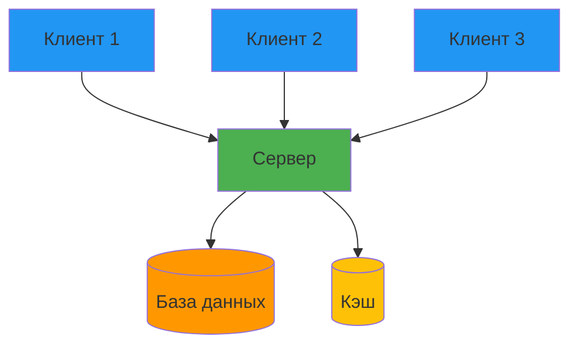

# Лекция 33: Архитектура клиент-серверных приложений

## Проектирование и реализация распределенных систем

### Цель лекции:
- Понять принципы клиент-серверной архитектуры
- Изучить протоколы взаимодействия клиента и сервера
- Освоить паттерны проектирования распределенных систем
- Научиться реализовывать надежное взаимодействие компонентов

### План лекции:
1. Основы клиент-серверной архитектуры
2. Протоколы взаимодействия (HTTP, WebSocket, gRPC)
3. REST API проектирование
4. Аутентификация в распределенных системах
5. Обработка ошибок и retry-логика
6. Кэширование и оптимизация

---

## 1. Основы клиент-серверной архитектуры

### Модель клиент-сервер:



### Компоненты архитектуры:

**Клиент:**
- Пользовательский интерфейс
- Бизнес-логика представления
- Локальное состояние
- Сетевой клиент

**Сервер:**
- API слой (контроллеры)
- Бизнес-логика (сервисы)
- Слой данных (репозитории)
- База данных

### Типы клиентов:

| Тип | Примеры | Особенности |
|-----|---------|-------------|
| Web | Браузерные приложения | HTML/CSS/JS, кроссплатформенность |
| Desktop | PyQt, Tkinter, Electron | Доступ к ОС, высокая производительность |
| Mobile | iOS, Android | Ограниченные ресурсы, офлайн-режим |
| API Client | Другие сервисы | Machine-to-machine взаимодействие |

### Преимущества клиент-серверной архитектуры:

- Централизованное управление данными
- Масштабируемость серверной части
- Разделение ответственности
- Возможность независимого обновления

### Недостатки:

- Единая точка отказа (сервер)
- Сетевая задержка
- Сложность синхронизации
- Требования к безопасности

---

## 2. Протоколы взаимодействия

### HTTP/HTTPS:

```python
# Серверная часть (Flask)
from flask import Flask, request, jsonify
from functools import wraps

app = Flask(__name__)

# Декоратор для проверки Content-Type
def require_json(f):
    @wraps(f)
    def decorated(*args, **kwargs):
        if not request.is_json:
            return jsonify({'error': 'Content-Type must be application/json'}), 400
        return f(*args, **kwargs)
    return decorated

@app.route('/api/users', methods=['GET'])
def get_users():
    users = [{'id': 1, 'name': 'John'}, {'id': 2, 'name': 'Jane'}]
    return jsonify(users)

@app.route('/api/users', methods=['POST'])
@require_json
def create_user():
    data = request.get_json()
    # Валидация и сохранение
    return jsonify({'id': 3, **data}), 201

# Клиентская часть
import requests

class APIClient:
    def __init__(self, base_url):
        self.base_url = base_url
        self.session = requests.Session()
    
    def get_users(self):
        response = self.session.get(f'{self.base_url}/api/users')
        response.raise_for_status()
        return response.json()
    
    def create_user(self, name, email):
        response = self.session.post(
            f'{self.base_url}/api/users',
            json={'name': name, 'email': email}
        )
        response.raise_for_status()
        return response.json()
```

### WebSocket для real-time:

```python
# Сервер (Flask-SocketIO)
from flask import Flask
from flask_socketio import SocketIO, emit
from datetime import datetime

app = Flask(__name__)
socketio = SocketIO(app, cors_allowed_origins="*", async_mode='threading')

clients = {}

@socketio.on('connect')
def handle_connect():
    from flask import request
    print(f'Client connected: {request.sid}')
    clients[request.sid] = {'connected_at': datetime.now()}
    emit('server_message', {'data': 'Connected!'})

@socketio.on('disconnect')
def handle_disconnect():
    from flask import request
    print(f'Client disconnected: {request.sid}')
    clients.pop(request.sid, None)

@socketio.on('chat_message')
def handle_message(data):
    from flask import request
    emit('chat_message', {
        'sid': request.sid,
        'message': data['message'],
        'timestamp': datetime.now().isoformat()
    }, broadcast=True)

# Клиент
import socketio

sio = socketio.Client()

@sio.event
def connect():
    print('Connected to server')

@sio.event
def chat_message(data):
    print(f"Message from {data['sid']}: {data['message']}")

@sio.event
def disconnect():
    print('Disconnected from server')

# Подключение и отправка
# sio.connect('http://localhost:5000')
# sio.emit('chat_message', {'message': 'Hello!'})
# sio.wait()
```

### gRPC для высокопроизводительного взаимодействия:

```protobuf
// user_service.proto
syntax = "proto3";

package userservice;

service UserService {
    rpc GetUser (UserRequest) returns (UserResponse);
    rpc ListUsers (ListRequest) returns (stream UserResponse);
    rpc CreateUser (CreateUserRequest) returns (UserResponse);
}

message UserRequest {
    int32 id = 1;
}

message UserResponse {
    int32 id = 1;
    string name = 2;
    string email = 3;
}

message ListRequest {
    int32 limit = 1;
}

message CreateUserRequest {
    string name = 1;
    string email = 2;
}
```

```python
# Сервер gRPC
import grpc
from concurrent import futures
import user_service_pb2
import user_service_pb2_grpc

class UserServiceServicer(user_service_pb2_grpc.UserServiceServicer):
    def GetUser(self, request, context):
        return user_service_pb2.UserResponse(
            id=request.id,
            name='John Doe',
            email='john@example.com'
        )
    
    def ListUsers(self, request, context):
        for i in range(request.limit):
            yield user_service_pb2.UserResponse(
                id=i,
                name=f'User {i}',
                email=f'user{i}@example.com'
            )

def serve():
    server = grpc.server(futures.ThreadPoolExecutor(max_workers=10))
    user_service_pb2_grpc.add_UserServiceServicer_to_server(
        UserServiceServicer(), server
    )
    server.add_insecure_port('[::]:50051')
    server.start()
    server.wait_for_termination()

# Клиент gRPC
import grpc
import user_service_pb2
import user_service_pb2_grpc

def run():
    channel = grpc.insecure_channel('localhost:50051')
    stub = user_service_pb2_grpc.UserServiceStub(channel)
    
    response = stub.GetUser(user_service_pb2.UserRequest(id=1))
    print(f"User: {response.name}, {response.email}")
    
    for user in stub.ListUsers(user_service_pb2.ListRequest(limit=3)):
        print(f"User: {user.name}")
```

---

## 3. REST API проектирование

### Принципы REST:

```python
# Правильное проектирование endpoints

# ❌ Плохо: глаголы в URL
GET /api/getUsers
POST /api/createUser
PUT /api/updateUser/1

# ✅ Хорошо: ресурсы в URL
GET /api/users
POST /api/users
PUT /api/users/1
DELETE /api/users/1

# ✅ Хорошо: вложенные ресурсы
GET /api/users/1/orders
POST /api/users/1/orders
GET /api/users/1/orders/5

# ✅ Хорошо: фильтрация и пагинация
GET /api/users?role=admin&limit=10&offset=20
GET /api/users?page=2&per_page=10
GET /api/users?sort=-created_at&fields=id,name,email
```

### Версионирование API:

```python
# Версионирование через URL
@app.route('/api/v1/users')
@app.route('/api/v2/users')

# Версионирование через заголовок
@app.route('/api/users')
def get_users():
    version = request.headers.get('API-Version', '1')
    if version == '2':
        return get_users_v2()
    return get_users_v1()
```

### HATEOAS (Hypermedia as the Engine of Application State):

```python
from flask import url_for

@app.route('/api/users/<int:user_id>')
def get_user(user_id):
    user = {'id': user_id, 'name': 'John'}
    
    response = {
        'data': user,
        'links': {
            'self': url_for('get_user', user_id=user_id, _external=True),
            'orders': url_for('get_user_orders', user_id=user_id, _external=True),
            'update': url_for('update_user', user_id=user_id, _external=True)
        }
    }
    return jsonify(response)
```

### Документирование API (OpenAPI/Swagger):

```python
from flask import Flask
from flasgger import Swagger

app = Flask(__name__)
app.config['SWAGGER'] = {
    'title': 'My API',
    'uiversion': 3
}
swagger = Swagger(app)

@app.route('/api/users', methods=['POST'])
def create_user():
    """
    Создать нового пользователя
    ---
    tags:
      - users
    parameters:
      - in: body
        name: user
        schema:
          type: object
          required:
            - name
            - email
          properties:
            name:
              type: string
            email:
              type: string
    responses:
      201:
        description: Пользователь создан
        schema:
          type: object
          properties:
            id:
              type: integer
            name:
              type: string
    """
    from flask import request
    data = request.get_json()
    return jsonify({'id': 1, **data}), 201
```

---

## 4. Аутентификация в распределенных системах

### JWT токены:

```python
from flask import Flask, request, jsonify
from flask_jwt_extended import JWTManager, create_access_token, jwt_required, get_jwt_identity
from datetime import timedelta

app = Flask(__name__)
app.config['JWT_SECRET_KEY'] = 'your-secret-key'
app.config['JWT_ACCESS_TOKEN_EXPIRES'] = timedelta(hours=1)
app.config['JWT_REFRESH_TOKEN_EXPIRES'] = timedelta(days=30)

jwt = JWTManager(app)

# База данных пользователей (в реальности используйте БД)
users = {
    'john': {'id': 1, 'password': 'hashed_password', 'role': 'user'},
    'admin': {'id': 2, 'password': 'hashed_password', 'role': 'admin'}
}

@app.route('/api/auth/login', methods=['POST'])
def login():
    data = request.get_json()
    username = data.get('username')
    password = data.get('password')
    
    user = users.get(username)
    if not user or user['password'] != password:  # В реальности используйте hash check
        return jsonify({'error': 'Invalid credentials'}), 401
    
    access_token = create_access_token(
        identity=username,
        additional_claims={'role': user['role']}
    )
    refresh_token = create_access_token(
        identity=username,
        expires_delta=timedelta(days=30)
    )
    
    return jsonify({
        'access_token': access_token,
        'refresh_token': refresh_token
    })

@app.route('/api/protected', methods=['GET'])
@jwt_required()
def protected():
    current_user = get_jwt_identity()
    return jsonify({'message': f'Hello {current_user}'})

@app.route('/api/admin', methods=['GET'])
@jwt_required()
def admin_only():
    from flask_jwt_extended import get_jwt
    claims = get_jwt()
    if claims.get('role') != 'admin':
        return jsonify({'error': 'Admin access required'}), 403
    return jsonify({'message': 'Admin area'})

@app.route('/api/auth/refresh', methods=['POST'])
@jwt_required(refresh=True)
def refresh():
    current_user = get_jwt_identity()
    new_token = create_access_token(identity=current_user)
    return jsonify({'access_token': new_token})
```

### OAuth 2.0 Flow:

```python
from authlib.integrations.flask_client import OAuth

app = Flask(__name__)
app.config['SECRET_KEY'] = 'secret!'
oauth = OAuth(app)

# Конфигурация OAuth провайдера
google = oauth.register(
    name='google',
    client_id=app.config['GOOGLE_CLIENT_ID'],
    client_secret=app.config['GOOGLE_CLIENT_SECRET'],
    server_metadata_url='https://accounts.google.com/.well-known/openid-configuration',
    client_kwargs={
        'scope': 'openid email profile',
        'prompt': 'consent'
    }
)

@app.route('/api/auth/google')
def google_login():
    redirect_uri = url_for('google_callback', _external=True)
    return google.authorize_redirect(redirect_uri)

@app.route('/api/auth/google/callback')
def google_callback():
    token = google.authorize_access_token()
    user_info = token.get('userinfo')
    
    # Создание сессии или JWT токена
    access_token = create_access_token(identity=user_info['email'])
    
    return jsonify({
        'access_token': access_token,
        'user': user_info
    })
```

---

## 5. Обработка ошибок и retry-логика

### Централизованная обработка ошибок:

```python
from flask import jsonify
from functools import wraps
import logging

logger = logging.getLogger(__name__)

class APIError(Exception):
    def __init__(self, message, status_code=400, payload=None):
        super().__init__()
        self.message = message
        self.status_code = status_code
        self.payload = payload
    
    def to_dict(self):
        rv = dict(self.payload or ())
        rv['error'] = self.message
        return rv

@app.errorhandler(APIError)
def handle_api_error(error):
    response = jsonify(error.to_dict())
    response.status_code = error.status_code
    return response

@app.errorhandler(404)
def not_found(error):
    return jsonify({'error': 'Not found'}), 404

@app.errorhandler(500)
def internal_error(error):
    logger.exception('Internal server error')
    return jsonify({'error': 'Internal server error'}), 500

# Декоратор для обработки исключений
def handle_exceptions(f):
    @wraps(f)
    def wrapper(*args, **kwargs):
        try:
            return f(*args, **kwargs)
        except ValueError as e:
            raise APIError(str(e), 400)
        except KeyError as e:
            raise APIError(f'Missing field: {e}', 400)
        except Exception as e:
            logger.exception('Unexpected error')
            raise APIError('Internal error', 500)
    return wrapper
```

### Retry-логика на клиенте:

```python
import requests
from requests.adapters import HTTPAdapter
from urllib3.util.retry import Retry
import time
from functools import wraps

def create_retry_session():
    session = requests.Session()
    retry = Retry(
        total=3,
        backoff_factor=0.5,
        status_forcelist=[429, 500, 502, 503, 504],
        allowed_methods=['GET', 'POST', 'PUT', 'DELETE']
    )
    adapter = HTTPAdapter(max_retries=retry)
    session.mount('http://', adapter)
    session.mount('https://', adapter)
    return session

# Декоратор для retry
def retry_on_failure(max_attempts=3, delay=1, backoff=2, exceptions=(requests.RequestException,)):
    def decorator(func):
        @wraps(func)
        def wrapper(*args, **kwargs):
            current_delay = delay
            for attempt in range(max_attempts):
                try:
                    return func(*args, **kwargs)
                except exceptions as e:
                    if attempt == max_attempts - 1:
                        raise
                    print(f"Attempt {attempt + 1} failed: {e}. Retrying in {current_delay}s...")
                    time.sleep(current_delay)
                    current_delay *= backoff
        return wrapper
    return decorator

@retry_on_failure(max_attempts=3, delay=1)
def make_api_request(url):
    response = requests.get(url, timeout=5)
    response.raise_for_status()
    return response.json()

# Circuit Breaker паттерн
class CircuitBreaker:
    def __init__(self, failure_threshold=5, recovery_timeout=30):
        self.failure_threshold = failure_threshold
        self.recovery_timeout = recovery_timeout
        self.failure_count = 0
        self.last_failure_time = None
        self.state = 'CLOSED'  # CLOSED, OPEN, HALF_OPEN
    
    def call(self, func, *args, **kwargs):
        if self.state == 'OPEN':
            if time.time() - self.last_failure_time > self.recovery_timeout:
                self.state = 'HALF_OPEN'
            else:
                raise Exception('Circuit breaker is OPEN')
        
        try:
            result = func(*args, **kwargs)
            if self.state == 'HALF_OPEN':
                self.state = 'CLOSED'
                self.failure_count = 0
            return result
        except Exception as e:
            self.failure_count += 1
            self.last_failure_time = time.time()
            if self.failure_count >= self.failure_threshold:
                self.state = 'OPEN'
            raise

# Использование Circuit Breaker
breaker = CircuitBreaker(failure_threshold=5, recovery_timeout=30)

def safe_api_call(url):
    return breaker.call(make_api_request, url)
```

---

## 6. Кэширование и оптимизация

### Кэширование на сервере:

```python
from flask import Flask
from flask_caching import Cache
import redis

app = Flask(__name__)

# Настройка кэширования с Redis
app.config['CACHE_TYPE'] = 'RedisCache'
app.config['CACHE_REDIS_HOST'] = 'localhost'
app.config['CACHE_REDIS_PORT'] = 6379
app.config['CACHE_REDIS_DB'] = 0
app.config['CACHE_DEFAULT_TIMEOUT'] = 300

cache = Cache(app)

@app.route('/api/users/<int:user_id>')
@cache.cached(timeout=60)
def get_user(user_id):
    # Долгий запрос к БД
    user = db.get_user(user_id)
    return jsonify(user)

# Кэширование с ключом
@cache.memoize(timeout=300)
def get_user_data(user_id):
    return db.get_user(user_id)

# Инвалидация кэша
def update_user(user_id, data):
    db.update_user(user_id, data)
    get_user_data.cache.delete(user_id)
```

### Кэширование на клиенте:

```python
import requests
from functools import lru_cache
import hashlib
import json
import pickle
from pathlib import Path

class CachedAPIClient:
    def __init__(self, base_url, cache_dir='.cache'):
        self.base_url = base_url
        self.cache_dir = Path(cache_dir)
        self.cache_dir.mkdir(parents=True, exist_ok=True)
        self.session = requests.Session()
    
    def _get_cache_key(self, url, params=None):
        key_data = f"{url}:{json.dumps(params or {})}"
        return hashlib.md5(key_data.encode()).hexdigest()
    
    def _get_from_cache(self, key):
        cache_file = self.cache_dir / key
        if cache_file.exists():
            with open(cache_file, 'rb') as f:
                return pickle.load(f)
        return None
    
    def _save_to_cache(self, key, data):
        cache_file = self.cache_dir / key
        with open(cache_file, 'wb') as f:
            pickle.dump(data, f)
    
    def get(self, endpoint, params=None, use_cache=True):
        url = f"{self.base_url}/{endpoint}"
        cache_key = self._get_cache_key(url, params)
        
        if use_cache:
            cached = self._get_from_cache(cache_key)
            if cached:
                return cached
        
        response = self.session.get(url, params=params)
        response.raise_for_status()
        data = response.json()
        
        if use_cache:
            self._save_to_cache(cache_key, data)
        
        return data
    
    def clear_cache(self):
        for file in self.cache_dir.glob('*'):
            file.unlink()

# LRU кэширование для функций
@lru_cache(maxsize=128)
def get_expensive_data(key):
    # Долгая операция
    return {'data': key}
```

### Оптимизация запросов:

```python
# Пагинация
@app.route('/api/users')
def get_users():
    page = request.args.get('page', 1, type=int)
    per_page = request.args.get('per_page', 20, type=int)
    
    users = User.query.paginate(page=page, per_page=per_page)
    
    return jsonify({
        'items': [user.to_dict() for user in users.items],
        'total': users.total,
        'pages': users.pages,
        'current_page': page,
        'next': url_for('get_users', page=page + 1) if users.has_next else None,
        'prev': url_for('get_users', page=page - 1) if users.has_prev else None
    })

# Partial response (fields filtering)
@app.route('/api/users/<int:user_id>')
def get_user_partial(user_id):
    fields = request.args.get('fields', '').split(',')
    user = db.get_user(user_id)
    
    if fields and fields[0]:
        user = {k: v for k, v in user.items() if k in fields}
    
    return jsonify(user)

# Conditional requests (ETag)
from flask import request, make_response
import hashlib

@app.route('/api/data')
def get_data_with_etag():
    data = get_expensive_data()
    data_str = json.dumps(data, sort_keys=True)
    etag = hashlib.md5(data_str.encode()).hexdigest()
    
    if request.headers.get('If-None-Match') == etag:
        return '', 304
    
    response = make_response(jsonify(data))
    response.headers['ETag'] = etag
    return response
```

---

## Заключение

Клиент-серверная архитектура требует тщательного проектирования интерфейсов взаимодействия, надежной обработки ошибок и эффективного кэширования. Правильная реализация обеспечивает масштабируемость и отказоустойчивость системы.

## Контрольные вопросы:

1. Какие преимущества и недостатки клиент-серверной архитектуры?
2. В чем разница между REST и WebSocket?
3. Как реализовать аутентификацию с JWT?
4. Что такое Circuit Breaker паттерн?
5. Какие стратегии кэширования вы знаете?

## Практическое задание:

1. Создать REST API с Flask
2. Реализовать JWT аутентификацию
3. Добавить кэширование с Redis
4. Реализовать retry-логику на клиенте
5. Создать WebSocket сервер для real-time обновлений
