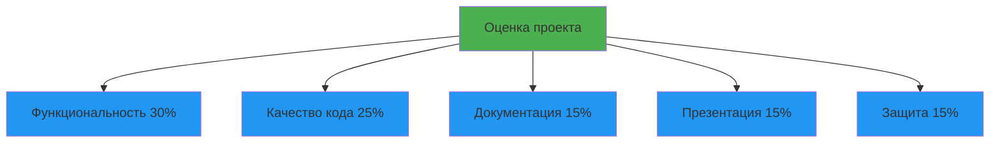
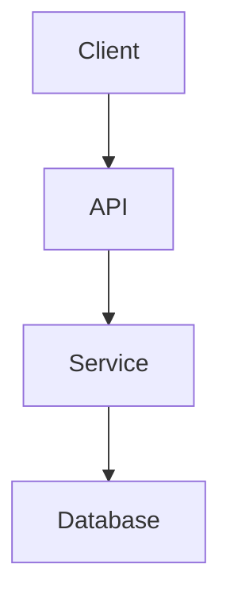

# Лекция 35: Подготовка к защите курсового проекта

## Рекомендации по оформлению, презентации и защите проекта

### Цель лекции:
- Изучить требования к оформлению курсового проекта
- Освоить навыки создания презентации
- Подготовиться к демонстрации проекта
- Научиться отвечать на вопросы комиссии

### План лекции:
1. Требования к курсовому проекту
2. Структура проектной документации
3. Оформление кода и репозитория
4. Создание презентации
5. Демонстрация проекта
6. Ответы на вопросы и защита

---

## 1. Требования к курсовому проекту

### Критерии оценки:



### Функциональность (30%):

| Критерий | Описание | Баллы |
|----------|----------|-------|
| Полнота реализации | Все заявленные функции работают | 0-10 |
| Сложность | Уровень технической сложности | 0-10 |
| Практическая ценность | Реальная полезность приложения | 0-10 |

### Качество кода (25%):

| Критерий | Описание | Баллы |
|----------|----------|-------|
| Архитектура | Правильное разделение на слои | 0-8 |
| Чистота кода | PEP 8, читаемость, имена | 0-8 |
| Тесты | Покрытие тестами, качество тестов | 0-9 |

### Документация (15%):

- README с описанием проекта
- Инструкция по установке и запуску
- Документация API (если есть)
- Комментарии в сложных местах

---

## 2. Структура проектной документации

### README.md — главный файл проекта:

```markdown
# Название проекта

Краткое описание проекта (1-2 абзаца). Какую проблему решает?

## Функциональность

- Основная функция 1
- Основная функция 2
- Основная функция 3

## Скриншоты


## Технологии

- Python 3.9+
- Flask / Django / PyQt
- PostgreSQL / SQLite
- Другие технологии...

## Установка

### Требования

- Python 3.9 или выше
- pip

### Шаги установки

1. Клонировать репозиторий:
   ```bash
   git clone https://github.com/username/project.git
   cd project
   ```

2. Создать виртуальное окружение:
   ```bash
   python -m venv venv
   source venv/bin/activate  # Linux/Mac
   venv\Scripts\activate     # Windows
   ```

3. Установить зависимости:
   ```bash
   pip install -r requirements.txt
   ```

4. Настроить окружение:
   ```bash
   cp .env.example .env
   # Отредактировать .env
   ```

5. Запустить приложение:
   ```bash
   python app.py
   # или
   flask run
   ```

## Использование

Примеры использования приложения:

```python
from myapp import Client

client = Client(api_key='your-key')
result = client.do_something()
print(result)
```

## Структура проекта

```
project/
├── app/              # Основной код приложения
├── tests/            # Тесты
├── docs/             # Документация
├── requirements.txt  # Зависимости
└── README.md         # Этот файл
```

## Тестирование

```bash
# Запуск тестов
pytest

# С покрытием
pytest --cov=app
```

## Авторы

- Имя Фамилия - email

## Лицензия

MIT License
```

### Пояснительная записка:

```markdown
# Пояснительная записка

## Введение

### Актуальность темы
Описание проблемы, которую решает проект.

### Цель проекта
Четкая формулировка цели.

### Задачи
1. Задача 1
2. Задача 2
3. Задача 3

## Основная часть

### Анализ предметной области
- Описание предметной области
- Существующие решения
- Обоснование выбора технологий

### Проектирование
- Архитектура приложения
- Диаграммы классов
- Диаграммы последовательностей

### Реализация
- Описание основных модулей
- Ключевые алгоритмы
- Технические решения

### Тестирование
- Стратегия тестирования
- Результаты тестов
- Покрытие кода

## Заключение

### Выводы
- Что было сделано
- Какие результаты получены

### Перспективы развития
- Что можно улучшить
- Планы на будущее

## Список литературы

1. Книга 1
2. Документация технологии
3. Онлайн-ресурсы

## Приложения

- Листинг кода
- Скриншоты
- Дополнительные материалы
```

---

## 3. Оформление кода и репозитория

### Структура репозитория:

```
project-name/
├── .gitignore
├── .env.example
├── README.md
├── LICENSE
├── requirements.txt
├── requirements-dev.txt
├── setup.py (опционально)
├── pytest.ini
├── .flake8
├── docs/
│   ├── api.md
│   └── user-guide.md
├── src/
│   └── myapp/
│       ├── __init__.py
│       ├── main.py
│       ├── models/
│       ├── services/
│       ├── api/
│       └── utils/
├── tests/
│   ├── __init__.py
│   ├── test_models.py
│   ├── test_services.py
│   └── test_api.py
└── scripts/
    ├── setup.sh
    └── deploy.sh
```

### .gitignore для Python:

```gitignore
# Byte-compiled / optimized / DLL files
__pycache__/
*.py[cod]
*$py.class

# C extensions
*.so

# Дистрибуция / упаковка
dist/
build/
*.egg-info/
*.egg

# Виртуальные окружения
venv/
env/
.env
.venv/

# IDE
.idea/
.vscode/
*.swp
*.swo
*~

# Тесты и покрытие
.pytest_cache/
.coverage
htmlcov/
.tox/

# Лог файлы
*.log
logs/

# OS
.DS_Store
Thumbs.db
```

### Требования к коду:

```python
# ✅ Хорошо: чистый код с документацией
"""
Модуль для обработки пользовательских данных.
"""
from typing import List, Optional
from dataclasses import dataclass


@dataclass
class User:
    """Класс представляющий пользователя."""
    id: int
    name: str
    email: str
    
    def validate_email(self) -> bool:
        """Проверяет корректность email."""
        return '@' in self.email and '.' in self.email


class UserService:
    """Сервис для управления пользователями."""
    
    def __init__(self, database):
        """Инициализирует сервис."""
        self.db = database
    
    def get_user_by_id(self, user_id: int) -> Optional[User]:
        """
        Получает пользователя по ID.
        
        Args:
            user_id: ID пользователя
            
        Returns:
            User или None если не найден
        """
        return self.db.query(User).filter_by(id=user_id).first()
    
    def create_user(self, name: str, email: str) -> User:
        """
        Создает нового пользователя.
        
        Args:
            name: Имя пользователя
            email: Email пользователя
            
        Returns:
            Созданный User
        """
        user = User(id=None, name=name, email=email)
        self.db.add(user)
        self.db.commit()
        return user
```

### Тесты — обязательный элемент:

```python
# tests/test_user_service.py
import pytest
from unittest.mock import Mock, MagicMock
from src.myapp.services import UserService
from src.myapp.models import User


class TestUserService:
    """Тесты для UserService."""
    
    @pytest.fixture
    def mock_db(self):
        """Фикстура с mock базой данных."""
        db = Mock()
        db.query = MagicMock()
        return db
    
    @pytest.fixture
    def user_service(self, mock_db):
        """Фикстура с сервисом пользователей."""
        return UserService(mock_db)
    
    def test_get_user_by_id_exists(self, user_service, mock_db):
        """Тест получения существующего пользователя."""
        # Arrange
        expected_user = User(id=1, name='John', email='john@example.com')
        mock_db.query().filter_by().first.return_value = expected_user
        
        # Act
        result = user_service.get_user_by_id(1)
        
        # Assert
        assert result == expected_user
        assert result.name == 'John'
    
    def test_get_user_by_id_not_found(self, user_service, mock_db):
        """Тест получения несуществующего пользователя."""
        # Arrange
        mock_db.query().filter_by().first.return_value = None
        
        # Act
        result = user_service.get_user_by_id(999)
        
        # Assert
        assert result is None
    
    def test_create_user(self, user_service, mock_db):
        """Тест создания пользователя."""
        # Act
        result = user_service.create_user('Jane', 'jane@example.com')
        
        # Assert
        assert result.name == 'Jane'
        assert result.email == 'jane@example.com'
        mock_db.add.assert_called_once()
        mock_db.commit.assert_called_once()
```

---

## 4. Создание презентации

### Структура презентации (10-15 слайдов):

```
Слайд 1: Титульный
├── Название проекта
├── Автор (ФИО, группа)
├── Руководитель
└── Год

Слайд 2: Введение
├── Проблема
├── Актуальность
└── Цель проекта

Слайд 3: Задачи проекта
├── Задача 1
├── Задача 2
└── Задача 3

Слайд 4: Анализ существующих решений
├── Конкуренты/аналоги
├── Их недостатки
└── Преимущества вашего решения

Слайд 5: Технологии
├── Язык программирования
├── Фреймворки
├── Базы данных
└── Другие технологии

Слайд 6: Архитектура приложения
└── Схема/диаграмма архитектуры

Слайд 7: Основной функционал
├── Функция 1
├── Функция 2
└── Функция 3

Слайд 8: Демонстрация (скриншоты)
├── Главный экран
├── Ключевые функции
└── Результаты работы

Слайд 9: Технические особенности
├── Интересные решения
├── Сложности и их преодоление
└── Оптимизации

Слайд 10: Тестирование
├── Покрытие тестами
├── Результаты тестов
└── Качество кода

Слайд 11: Результаты
├── Что реализовано
├── Метрики/статистика
└── Достижения

Слайд 12: Перспективы развития
├── Что можно улучшить
├── Планы на будущее
└── Возможности масштабирования

Слайд 13: Выводы
├── Итоги работы
└── Полученные навыки

Слайд 14: Спасибо за внимание!
└── Вопросы?
```

### Советы по оформлению:

```
✅ Делайте:
- Минимум текста на слайде
- Крупный шрифт (≥24pt для текста)
- Контрастные цвета
- Скриншоты и диаграммы
- Нумерацию слайдов

❌ Не делайте:
- Стены текста
- Мелкий шрифт
- Яркие раздражающие цвета
- Сложные таблицы
- Код большими кусками
```

### Пример слайда в Markdown (Marp):

```markdown
---
marp: true
theme: gaia
class: lead
---

# Название проекта

## Разработка прикладного приложения

**Автор:** Иванов Иван, группа 1731

**Руководитель:** Петров П.П.

2024

---

# Проблема

- Существующие решения сложные и дорогие
- Нет локализации на русский язык
- Отсутствие технической поддержки

---

# Цель проекта

Создать простое и доступное приложение для [цель]

---

# Архитектура


```

---

## 5. Демонстрация проекта

### Подготовка к демонстрации:

**Чеклист перед защитой:**

```
□ Приложение запускается без ошибок
□ Все функции работают корректно
□ Тесты проходят успешно
□ База данных наполнена тестовыми данными
□ Скриншоты актуальны
□ Резервная копия на случай сбоев
□ Офлайн-версия (видео/скриншоты)
```

### Сценарий демонстрации:

```
1. Запуск приложения (30 сек)
   - Показать команду запуска
   - Дождаться загрузки

2. Основной сценарий использования (2-3 мин)
   - Вход в систему
   - Создание объекта
   - Редактирование
   - Удаление

3. Ключевые функции (2-3 мин)
   - Функция 1 с примером
   - Функция 2 с примером
   - Функция 3 с примером

4. Дополнительные возможности (1 мин)
   - Настройки
   - Экспорт/импорт
   - Отчетность

5. Итоги (30 сек)
   - Показать результат работы
```

### Типичные ошибки при демонстрации:

```
❌ Долгая загрузка/установка
❌ Работа с production данными
❌ Демонстрация неработающих функций
❌ Чтение кода с экрана
❌ Молчаливая демонстрация

✅ Быстрый старт (готовое приложение)
✅ Тестовые данные
✅ Только рабочие функции
✅ Комментарии действий
✅ Рассказ о возможностях
```

---

## 6. Ответы на вопросы и защита

### Типичные вопросы комиссии:

**Технические:**
- Почему выбрали эту технологию?
- Какие были сложности при реализации?
- Как масштабируется ваше решение?
- Как обеспечена безопасность?
- Какое покрытие тестами?

**Проектные:**
- В чем новизна вашего решения?
- Где можно применить проект?
- Что планировалось и что не успели?
- Сколько времени заняла разработка?

**Архитектурные:**
- Почему такая архитектура?
- Какие паттерны использовали?
- Как разделяется бизнес-логика?

### Советы для защиты:

```
✅ Делайте:
- Говорите уверенно и четко
- Смотрите на комиссию, не на экран
- Отвечайте кратко и по делу
- Признавайте недостатки проекта
- Показывайте энтузиазм

❌ Не делайте:
- Не спорьте с комиссией
- Не говорите "не знаю" без альтернативы
- Не читайте с листа/экрана
- Не затягивайте ответы
- Не извиняйтесь чрезмерно
```

### Шаблон ответа на сложный вопрос:

```
1. Признать важность вопроса
   "Это действительно важный вопрос..."

2. Дать имеющийся ответ
   "В текущей реализации я использовал..."

3. Предложить развитие
   "В будущем планирую улучшить это через..."
```

### Тайминг защиты (7-10 минут):

```
0:00 - 0:30  Приветствие и представление
0:30 - 1:30  Проблема и цель проекта
1:30 - 3:00  Технологии и архитектура
3:00 - 6:00  Демонстрация функционала
6:00 - 7:00  Результаты и выводы
7:00 - 10:00 Вопросы комиссии
```

---

## Заключение

Успешная защита курсового проекта требует не только качественной реализации, но и правильной подготовки документации, презентации и речи. Следуйте рекомендациям и тщательно готовьтесь к демонстрации.

## Контрольный список перед защитой:

```
□ Код работает без ошибок
□ Все тесты проходят
□ README заполнен
□ Презентация готова
□ Демонстрация отрепетирована
□ Резервная копия есть
□ Ответы на вопросы подготовлены
```

## Практическое задание:

1. Подготовить README для своего проекта
2. Создать презентацию (10-15 слайдов)
3. Написать сценарий демонстрации
4. Подготовить ответы на типичные вопросы
5. Провести пробную защиту
